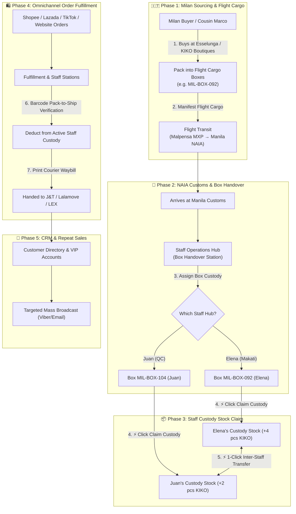

# 🏛️ K2 Jimzon Business Operating System (BOS)
## Comprehensive Administrative Workflow Blueprint

> [!NOTE]
> This operational blueprint is your internal master guide for managing the entire K2 Jimzon import-to-retail lifecycle — from supermarket purchasing in Milan to NAIA flight cargo handovers, staff custody stock allocations, omnichannel order fulfillment, custom Pasabuy quotes, and VIP marketing broadcasts.

---

## 📐 1. End-to-End Operational Lifecycle



---

## 🔄 2. Detailed Subsystem Workflows

### 🛬 Workflow 1: Italy Flight Cargo Arrivals & Staff Box Handover
**Location in Admin:** `Fulfillment & Staff Stations` $\rightarrow$ `🛬 Italy Cargo Box Handover`

1. **Flight Manifesting**: When flight cargo leaves Malpensa (MXP), Cousin Marco registers the box manifest (`MIL-BOX-092`) with its contents (e.g. 4x KIKO Lipgloss, 6x Mulino Biscuits, Expiry: `15-Aug-2026`).
2. **Staff Assignment**: Admin or Marco assigns `MIL-BOX-092` to **Elena Guerrero (Makati Hub)**.
3. **Custody Claiming**: Upon arrival in Manila, Elena opens the **Staff Box Handover Station** and clicks **`⚡ Claim Custody Stock`**.
4. **Stock Crediting**: The system automatically adds those exact items into **Elena's personal custody stock ledger**, making them available for her to pick and ship local orders.

> [!IMPORTANT]
> If Elena is unavailable, Admin can re-assign `MIL-BOX-092` to **Juan Dela Cruz** with 1 click in the dropdown before custody is claimed.

---

### 👤 Workflow 2: Multi-Location & Staff Custody Allocations
**Location in Admin:** `Product Catalog & Stock` $\rightarrow$ Click **`👤 Staff Custody`** on any product card

```
Total Master SKU Stock: 9 Units (KIKO Milano Shade 05)
 ├── Elena Guerrero (Makati Hub): 3 Units (Bin A-02)
 ├── Juan Dela Cruz (Quezon City Hub): 4 Units (Bin B-14)
 └── Marco Rossi (Milan Cargo Transit (Italy)): 2 Units (Box MXP-09)
```

- **Stock Allocation Rules**: A single master SKU can be split across multiple staff custodians without duplicating product master entries.
- **1-Click Inter-Staff Transfers**: If Elena runs out of stock for a Shopee order, she can request a 1-click custody transfer from Juan. In 1 click:
  - Juan's custody stock: `4 → 2 units`.
  - Elena's custody stock: `0 → 2 units`.
  - An immutable audit trail entry is logged automatically.

---

### 📦 Workflow 3: Pack-to-Ship Barcode Verification Station
**Location in Admin:** `Fulfillment & Staff Stations` $\rightarrow$ `📦 Order Pack & Ship Queue`

1. **Select Active Station**: Staff member selects their name (e.g. **Elena Guerrero**).
2. **Review Assigned Orders**: Only orders assigned to Elena's hub and covered by her custody stock appear in her queue.
3. **Scan-to-Ship Verification**:
   - Elena points barcode scanner at product barcode or types SKU (e.g. `KIKO-3D-05`).
   - System checks if `KIKO-3D-05` is in the order AND in Elena's custody stock.
   - If verified: Order status updates to **`Packed & Verified ✓`**, Elena's custody stock is deducted, and shift count increments (`+1`).
   - If invalid: System alerts **`⚠️ Item not in queue or exceeds custody stock!`**
4. **Print Courier Waybill**: Click **`🖨️ Print Waybill`** to generate shipping label for J&T, Lalamove, or LEX.

---

### 🏷️ Workflow 4: Product Master, FEFO Expirations & Sheet Mode
**Location in Admin:** `Product Catalog & Stock`

```
FEFO Color Health Badges:
 🟢 Green Badge  : Safe (> 90 Days to Expiration)
 🟡 Amber Badge  : Nearing Expiration (30 - 90 Days)
 🔴 Red Badge    : Critical Expiration (< 30 Days)
 📌 Pinned Badge : Locked Priority Batch for First Dispatch
```

- **Batch Expiration Manager**: Click **`📦 Batches`** on any card to view individual shipment boxes, edit expiration dates per batch, or **`📌 Pin Batch`** to force priority dispatch.
- **Excel Sheet Mode**: Toggle **`Sheet Mode`** switch at top right for a sticky spreadsheet view with frozen SKU columns and 1-tap horizontal scroll jump buttons (`◀ Left`, `💰 Pricing`, `📦 Inventory & FEFO`, `▶ Right`).

---

### 🛍️ Workflow 5: Custom Pasabuy Landed Cost & Viber Quotes
**Location in Admin:** `Custom Pasabuy Quotes`

```
Italy Landed Cost Formula:
 Landed Cost (₱) = [ Store Price (€) × EUR/PHP FX (62.50) ]
                   + [ Weight (kg) × Air Freight Rate (€14/kg) × FX ]
                   + [ 12% Duty & Customs Clearance Tax ]
```

1. **Shopper Request**: Customer submits Pasabuy request via Viber or Website (e.g. *Prada Leather Bag or Lavazza Coffee Beans*).
2. **Landed Cost Calculation**: Admin enters EUR price and weight. The calculator computes exact landed cost in PHP.
3. **Margin Slider**: Adjust Target Profit Margin (e.g. 25% margin $\rightarrow$ Retail Price ₱14,250).
4. **1-Click Dispatch**: Click **`💬 Send Viber Quote`** to dispatch instant branded quote directly to the customer's phone!

---

### 👥 Workflow 6: Customer CRM & Targeted Mass Broadcast
**Location in Admin:** `Customer Directory & VIPs`

1. **Customer Directory**: View lifetime spending (₱), total orders, and assigned roles (Retail vs B2B Wholesale VIP).
2. **Audience Segmentation**: Filter customers by **`B2B Wholesale`**, **`Pasabuy Shoppers`**, or **`VIP Spend > ₱10,000`**.
3. **Mass Campaign Dispatcher**:
   - Select campaign template (e.g. *New Italy Flight Arrivals* or *Exclusive VIP Discount*).
   - Click **`🚀 Launch Mass Broadcast`** to dispatch SMS/Email updates to all selected customers at once.

---

## 👥 3. Staff Role & Responsibility Matrix

| Admin Workspace | Operational Purpose | Primary Staff Role |
| :--- | :--- | :--- |
| 🏡 **Home & Overview** | Executive summary of sales, flight boxes, and stock alerts | Business Owner / Admin |
| 📦 **Fulfillment Stations** | Barcode packing, order verification, and courier shipping | Manila Warehouse Staff |
| 🛬 **Italy Cargo Handovers** | Flight box arrivals from NAIA and staff custody claims | Warehouse Supervisor & Hub Lead |
| ⚡ **Inter-Staff Transfers** | 1-Click stock re-allocations between staff members | Hub Supervisors / Admins |
| 🏷️ **Product Catalog** | Product creation, FEFO expiry management, and Excel sheet | Catalog Manager / Inventory Officer |
| 🛍️ **Custom Pasabuy** | Italy landed cost calculations and Viber customer quotes | Pasabuy Sourcing Agent |
| 👥 **Customer Directory** | Lifetime spend tracking, VIP approvals, and marketing | CRM & Marketing Manager |
| 💬 **Customer Messages** | Unified WhatsApp, Facebook, and Viber customer support | Customer Service Staff |

---

## 🛡️ 4. System Logic File Reference

All operational logic is powered by clean, modular source files in your codebase:

- **Admin Master Shell**: [`src/views/admin/Admin.jsx`](file:///c:/Users/jerze/K2%20JImzon/src/views/admin/Admin.jsx)
- **Staff Operations & Handovers**: [`src/views/admin/OmniOperationsHub.jsx`](file:///c:/Users/jerze/K2%20JImzon/src/views/admin/OmniOperationsHub.jsx)
- **Staff Custody & 1-Click Transfers**: [`src/views/admin/StaffAllocationModal.jsx`](file:///c:/Users/jerze/K2%20JImzon/src/views/admin/StaffAllocationModal.jsx)
- **Product Master & Grid**: [`src/views/admin/InventoryGrid.jsx`](file:///c:/Users/jerze/K2%20JImzon/src/views/admin/InventoryGrid.jsx)
- **FEFO Batch Expiration Manager**: [`src/views/admin/BatchExpiryManagerModal.jsx`](file:///c:/Users/jerze/K2%20JImzon/src/views/admin/BatchExpiryManagerModal.jsx)
- **Excel Spreadsheet View**: [`src/views/admin/Sheet.jsx`](file:///c:/Users/jerze/K2%20JImzon/src/views/admin/Sheet.jsx)
- **Custom Pasabuy Landed Cost Engine**: [`src/views/admin/PasabuyManager.jsx`](file:///c:/Users/jerze/K2%20JImzon/src/views/admin/PasabuyManager.jsx)
- **Customer Directory & Broadcast**: [`src/views/admin/CustomerCrmBroadcast.jsx`](file:///c:/Users/jerze/K2%20JImzon/src/views/admin/CustomerCrmBroadcast.jsx)
