# K2 Jimzon Operations Logic and Workflow Rulebook

**Version:** 1.0
**Approved working baseline:** 9 August 2026
**Purpose:** The authoritative rulebook for designing, implementing, reviewing, and testing K2 Jimzon operations.

This file defines how K2 must work. It does not claim every rule is already implemented. `SYSTEM_BRAIN_CURRENT.md` records what is live; `ADMIN_OPERATIONS_AUDIT.md` records verified gaps.

## 1. Document authority

Use project documents in this order:

1. **Master Business Blueprint** — K2's vision, customers, and direction.
2. **This rulebook** — required operational behavior and safeguards.
3. **System Brain Current** — what is implemented and live now.
4. **Admin Operations Audit** — what is backed, partial, broken, deferred, or unsafe.
5. **Future Ideas** — proposals that are not yet live.
6. **Owner Questions** — only unresolved business-policy decisions.

If documents conflict, use this rulebook for target behavior and the System Brain for current status. Never describe a target as live until schema, code, permissions, and tests verify it. Older workflow, system-logic, and connector blueprints are historical when they conflict with this file.

## 2. Standing principles

- K2 is a direct Italian import operation serving curated retail, Pasabuy, wholesale, marketplaces, and direct website customers.
- Marketplaces remain active income/acquisition channels, but K2 aims to move repeat customers toward its website.
- The admin is the operational source of truth. The storefront and connectors consume controlled admin data.
- Admin and storefront production deployments remain separate.
- Technology reduces staff work without hiding uncertainty or inventing facts.
- Never claim fake stock, payment, connector success, message delivery, sourcing evidence, or live metrics.
- Secrets stay in secure backend storage, never browser code or browser storage.
- Every inventory-changing, financial, destructive, or customer-facing decision is attributable and auditable.
- Flexible business practices become controlled case workflows, not false fixed formulas.

## 3. Record boundaries

Keep these records separate even when one screen presents them together:

| Record | Owns this truth |
| --- | --- |
| Product master | Stable SKU, barcode, variant, content, sales configuration |
| Customer identity | Customer and verified channel identities |
| Customer request | Desired item, quantity, constraints, deadline, substitutions |
| Quote | Offered price, validity, cost snapshot, delivery estimate, decision |
| Purchase | Source, purchaser, actual quantity and acquisition cost |
| Flight/consignment | Route, boxes, international movement, milestones |
| Manifest line | Expected SKU/variant/batch quantity in one box |
| Scan event | Immutable Milan/Manila scan, actor, code, result, time |
| Receipt | Accepted, short, over, damaged, unexpected, quarantined counts |
| Inventory lot | SKU, batch, expiry, location, owner, custodian, condition, unit cost |
| Reservation | Quantity promised to an order, customer, wholesale account, or channel |
| Custody transfer | Exact quantity handed between custodians/locations |
| Canonical order | Normalized demand from website or any marketplace |
| Fulfillment | Allocation, picking, scans, package, handover, delivery |
| Delivery quote | Courier/source, estimated/final amount, customer confirmation |
| Payment evidence | Proof, method, amount, reference, review state |
| Settlement | Verified amounts, refunds, actual costs, variance |
| Conversation | Customer communication and internal notes |
| Exception case | Cancellation, return, exchange, failed delivery, dispute |
| Connector event | Durable payload, idempotency key, processing/retry state |
| Audit event | Actor, time, prior/new value, reason, linked record |

Do not overload one `status` to represent several records.

## 4. End-to-end map

```mermaid
flowchart LR
    A["Curated demand"] --> P["Purchase in Italy"]
    B["Pasabuy request"] --> Q["Manual owner quote"]
    Q --> C["Customer confirmation"]
    C --> P
    P --> M["Flight and box manifest"]
    M --> S1["Milan unit scans"]
    S1 --> T["Sealed and in transit"]
    T --> S2["Manila unit scans"]
    S2 --> R["Receipt reconciliation"]
    R --> L["Lots by expiry, hub, owner, custodian"]
    L --> O["Canonical channel or website order"]
    O --> V["Reservation and eligible FEFO"]
    V --> K["Order-first unit packing"]
    K --> W["Marketplace/courier waybill"]
    W --> H["Handover and delivery"]
    H --> Z["Settlement or exception case"]
```



## 5. Non-negotiable invariants

### Inventory

```text
available = on_hand
          - reserved
          - in_transfer
          - damaged
          - expired
          - quarantined
          - unaccounted
```

- Available is derived and cannot be typed directly or become negative.
- One unit cannot be reserved, transferred, fulfilled, and written off simultaneously.
- Every expiry-tracked unit belongs to a stable lot with a usable date.
- Every received lot has a location and custodian.
- Owner and custodian are separate concepts.
- Normal curated stock is physically pooled by location/lot. Customer or channel commitments are reservations.
- Every quantity change writes an immutable event with actor, reason, delta, linked record, and before/after balance.

### Shelf life and FEFO

- FEFO selects the earliest **eligible** lot.
- Pins may attract attention but never override eligibility or FEFO.
- Ordinary sale requires at least 90 calendar days remaining by default.
- 31–89 days requires an approved, clearly disclosed clearance path.
- 0–30 days is not sellable.
- Expired lots are not sellable.
- Expiry-tracked stock with an unknown date is not sellable until corrected.
- Categories may raise the 90-day minimum.
- Expired, damaged, quarantined, unavailable, wrong-location, and wrong-custody lots cannot be reserved or fulfilled.

### Transaction truth

- A UI reports success only after the server transaction succeeds.
- Failure preserves prior balances and states.
- Empty, loading, stale, partial, permission, and error states are different.
- Bulk actions show impact, count, validation, and reason before commit.
- Estimates, quotes, FX, quantities, and costs are never silently overwritten.
- Corrections append events instead of erasing history.

## 6. Product master

- One SKU represents one sellable variant.
- Different concentration, size, flavor, shade, formulation, or pack count requires a distinct SKU.
- Use a unique manufacturer barcode; if shared/unreliable, add a K2 internal scannable code.
- One SKU may appear in many boxes/lots without duplicating the master.

```text
draft -> under_review -> live
                    -> unlisted
live -> unlisted -> live
live | unlisted -> discontinued
```

- Manual, CSV, AI-assisted, and connector-imported records start as draft.
- AI may draft content but cannot publish without human review.
- Use one canonical publication status.
- Publishing validates identity, name, price, primary image, variant, and required channel fields.
- Product import never creates stock; receiving/controlled adjustment does.
- Claims about origin, ingredients, allergens, usage, and authenticity retain sources/evidence.

## 7. Curated imports

1. Staff selects demand using sales, trends, shelf life, customer interest, and judgment.
2. A purchase records source, planned items/quantity/cost, and purchaser.
3. Actual purchased quantity/cost stays separate from estimates.
4. Units are assigned to a flight and boxes.
5. Milan scanning verifies packed units.
6. Sealing freezes expected contents; corrections require reasons/events.
7. Shipment records departure, delays, holds, and arrival.
8. Manila scanning independently verifies physical arrival.
9. Reconciliation classifies differences.
10. Accepted units become lots with batch, expiry, hub, owner, custodian, condition, and cost evidence.

## 8. Pasabuy

Pasabuy is request-and-sourcing, not ordinary cart checkout.

```text
received
-> needs_information | researching | declined
-> quote_ready
-> quote_sent
-> accepted | declined | expired
-> approved_for_purchase
-> purchasing
-> purchased | partially_purchased | unavailable | substitution_proposed
-> assigned_to_flight
-> in_transit
-> arrived_for_receiving
-> received | short_received | damaged_received
-> allocated
-> ready_for_delivery
-> delivered
-> closed
```

Payment/refund states remain separate.

- There is no standard markup, margin, or automatic final-price formula.
- The owner decides each final price.
- Factors may include season, scarcity, sourcing difficulty, item cost, freight, courier cost, FX, and documented circumstances.
- The system may calculate cost components/suggest a range but cannot auto-approve the quote.
- Record owner-selected price, actor, time, and rationale.
- Quote versions are immutable; one version must be explicitly accepted.
- Estimates and actual landed costs remain separate with variance.
- Substitutions require customer confirmation before purchase.

## 9. Flights, boxes, and scanning

```text
flight/consignment
  -> box
    -> manifest line (SKU + variant + batch/expiry + expected quantity)
      -> scan events
      -> receipt result
```

The same SKU may appear across several boxes, batches, and expiry dates on one flight.

```text
draft -> packing_italy -> sealed -> in_transit
      -> arrived_manila -> receiving -> reconciled -> completed
```

Side states: `on_hold`, `delayed`, `cancelled`.

### Milan

- Select/scan flight and box first.
- Each product scan increments one matching line by one.
- Show expected, scanned, remaining, wrong item, and overage attempts.
- Support rapid scans, debounce, sound/vibration, camera, and typed scanner input.
- Similar variants rely on barcode/internal code, not eyesight.
- Unexpected codes create exceptions; they never silently attach elsewhere.
- Sealing requires acknowledgement of shortages, overages, and replacements.

### Manila

- Select/scan arriving flight and box first.
- Manila count is an independent observation; never copy Milan totals as received.
- Compare expected, packed, and received.
- Classify shortage, overage, wrong SKU, unexpected, damaged, unknown expiry, and insufficient shelf life.
- Questionable units stay quarantined.
- Finalization creates accepted inventory exactly once and is idempotent.
- Failed finalization leaves reconciliation open with the error.
- Completed manifests stay searchable and the next flight can be created.

## 10. Custody and locations

```text
draft -> offered -> accepted -> completed
                 -> rejected
draft | offered -> cancelled
```

- Specify exact SKU, lot, source location/custodian, quantity, destination, and reason.
- Never move all stock merely because a SKU was selected.
- Offered units become `in_transfer` and cannot be sold/transferred again.
- Custody changes after receiver confirmation.
- Rejection/cancellation restores prior availability/custody.
- Partial quantities are supported.
- Events reconcile total units before and after.

## 11. Channel and order intake

Website, Shopee, TikTok Shop, Lazada, direct, wholesale, and future channels normalize into one canonical order before reservation/fulfillment.

Every order retains channel, external reference, customer identity, exact lines, price/discount/delivery/total snapshots, raw source link, and separate fulfillment/payment states.

### Connector ingestion

1. Verify external authentication/signature.
2. Persist the raw event with unique channel + external key.
3. Acknowledge only after durable capture.
4. Fetch authoritative details when the push is incomplete.
5. Normalize idempotently into the canonical order.
6. Reserve eligible stock atomically.
7. Record success or retry/dead-letter error.
8. Update only the capability that actually succeeded.

Replaying an event never duplicates the order or reservation.

Track credentials, order capture, listings, stock sync, messages, waybill, and health separately. One webhook does not make a channel globally “Live.”

## 12. Website checkout

Until payments/courier APIs are connected, checkout is an order request:

```text
submitted -> reviewed -> confirmed -> reserved -> fulfillment
          -> needs_information | cancelled
```

- Submission does not reserve stock or count as paid revenue.
- Confirmation atomically revalidates prices, discounts, quantity, customer details, and eligible stock.
- Coupon validation/redemption is database-backed, not browser-only.
- Coupon terms are snapshotted; redemption and reservation share the confirmation transaction.
- Website orders receive a K2 order/packing QR before a courier waybill exists.
- Delivery is visibly estimated, awaiting confirmation, or final.

## 13. Delivery and waybills

### Marketplace

- Use delivery charges/documents supplied by the marketplace.
- Preserve source, amount, currency, and reference.
- Print the marketplace waybill only when the API/Seller Center provides it.
- Never replace it silently with a K2 formula.

### Direct website and Pasabuy

```text
rate_needed -> estimated -> communicated -> customer_confirmed
            -> courier_booked -> final
```

- Staff obtains the applicable courier rate.
- Estimated and final charges are separate.
- Record communication and customer confirmation.
- Courier booking creates the real tracking/waybill.
- Before booking, use the K2 packing QR—not a fake courier label.

## 14. Packing and fulfillment

```text
confirmed -> allocated -> picking -> packing -> packed_verified
          -> ready_for_handover -> handed_over -> delivered
```

Side states link to exception cases: `on_hold`, `cancelled`, `partially_fulfilled`, `failed_delivery`, `returned`, `refunded`.

### Order-first unit scanning

1. Scan/select the order, marketplace waybill, or K2 packing QR first.
2. Load only that order's expected lines/allocation.
3. Each product scan increments exactly one unit.
4. Show expected, scanned, remaining, excess, and wrong-item states.
5. Quantity five requires five scans unless an authorized audited bulk count is used.
6. Validate lot, shelf life, location, custodian, reservation, and operator access.
7. Complete only when all required lines reconcile.
8. Handover records courier/channel, tracking, actor, time, and evidence.

A product scan alone never chooses an order globally.

## 15. Customer exceptions

K2 has no universal automatic cancellation, return, exchange, refund, or failed-delivery result. Staff communicates and resolves each case.

```text
requested -> gathering_information -> under_review -> proposed_resolution
          -> customer_confirmed | owner_review
          -> approved | declined | needs_more_information
          -> action_in_progress -> resolved
```

Record type, request, linked order/fulfillment/payment/conversation, evidence, proposed resolution, financial/stock impact, authorized decision/reason, customer confirmation, stock disposition, refund action, and final outcome.

Stock disposition is `restock`, `quarantine`, `supplier_return`, `write_off`, or `no_return`. Never publish or promise a standard result K2 has not adopted.

## 16. Payment and settlement

Online payment remains deferred until a proper provider exists.

```text
unpaid -> evidence_submitted -> under_review
       -> verified | rejected | needs_more_information
verified -> partially_refunded -> refunded
```

- Evidence is separate from status.
- Record method, amount, currency, payer, reference, proof, submitter, and time.
- Verification records verifier, time, amount, and notes.
- A screenshot/submission does not mean paid.
- Marketplace payment and payout settlement are different facts.
- Report submitted value, verified payments, fulfilled value, and settled payouts separately.

## 17. Landed cost

```text
landed_cost = purchase_cost
            + international_freight
            + insurance
            + customs_and_duties
            + non_recoverable_taxes
            + local_handling
            + packaging
            + payment_or_fx_fees
            + documented_adjustments
```

- Store original currency, amount, FX rate/source/time.
- Store allocation method and inputs for shared cost.
- Never overwrite estimate with actual.
- Show estimate/actual variance.
- Owner-selected Pasabuy price remains separate from landed cost.

## 18. Coupons

- Coupons are database-backed with validity, type/value, minimum spend, limits, and status.
- Storefront/admin use the same records and server validation.
- Snapshot code/discount on the order.
- Redemption is atomic, idempotent, and tied to the confirmed order/customer.
- Browser storage is never the source of coupon truth.
- Individual campaigns are configurable without one permanent universal policy.

## 19. Inbox and communication

- Preserve channel, external message ID, identity, direction, time, delivery state, and source.
- Internal notes are visibly internal and never presented as sent.
- A copied reply is not delivered.
- Mark delivery only after connector confirmation.
- Retain copy/open-Seller-Center fallback when APIs are unavailable.
- Identity merges require staff confirmation and preserve original history.
- Delivery, Pasabuy, and exception decisions link to their conversation.

## 20. Admin organization

1. Action center
2. Pasabuy requests and quotes
3. Purchasing and suppliers
4. Flights, boxes, and receiving
5. Inventory, lots, expiry, locations, and custody
6. Orders, packing, waybills, and fulfillment
7. Payments, refunds, and reconciliation
8. Inbox and customer exceptions
9. Customers and wholesale
10. Channels, listings, health, roles, audit, and settings

Each record page shows identity/state, next action/blocker, owner, linked records, quantities, estimate/actual financials, evidence, immutable timeline, errors, and recovery.

## 21. Dashboards and KPIs

Every KPI defines business question, source/formula, included/excluded states, Asia/Manila window, currency/FX, freshness, owner, all data states, and exact record drilldown.

Prioritize:

1. overselling or inconsistent stock;
2. wrong-item packing and receipt discrepancies;
3. expired/quarantined inventory;
4. payment/refund exceptions;
5. overdue communication;
6. failed connector jobs/stale syncs.

Do not fabricate fallbacks or turn query failure into zero.

## 22. Roles and security

- Use real Supabase sessions and server-enforced roles.
- Keep admin/storefront access separate.
- Require MFA for privileged roles when enrollment/recovery is ready.
- Separate Admin, Operations, Warehouse, Support, Finance, and Read-only capabilities.
- General Staff does not automatically receive every financial, security, publishing, write-off, or refund power.
- Sensitive operations require confirmation, reason, and audit event.

## 23. Audit event contract

Each event stores stable ID, type/source, actor, server time, entity/ID, previous/new value, quantity/amount/currency, reason/note, related IDs, and idempotency/device context when relevant.

History is append-only. Corrections create compensating events.

## 24. Failure, retry, and concurrency

- Timeout is neither success nor failure; check server truth before retry.
- Idempotency protects confirmation, coupon redemption, receiving, connector ingestion, transfers, payment evidence, and fulfillment.
- Two channels cannot reserve the last unit concurrently.
- Repeated scans cannot exceed expected quantity without an explicit exception.
- Bulk partial success returns row-level results.
- Connector failures retain raw events for retry/dead-letter review.
- Mobile scanning supports camera denial and typed scanner input without weakening validation.

## 25. Current limitations

Until external dependencies exist:

- no production online gateway is claimed;
- no automatic direct-site courier rate/waybill is claimed;
- marketplace APIs are capability-by-capability, not globally live;
- messages are not delivered without confirmation;
- Seller Center/manual courier fallbacks remain valid;
- paid plans, domains, and API approvals do not block local logic hardening.

## 26. Change procedure

Before work:

1. Identify the record that owns truth.
2. Map current and target states.
3. Define invariants, permissions, evidence, audit, failures.
4. Check this rulebook and System Brain.
5. Add an owner question only for a real unresolved business policy.

Implementation order:

1. Schema/constraints
2. Server transitions/authorization
3. Audit/idempotency
4. Services/mapping
5. Admin workflow/recovery
6. Storefront/channel presentation
7. Desktop/mobile tests
8. Production preflight/documentation

After work, test valid, invalid, duplicate, concurrent, partial, and recovery paths. Update the System Brain only after verification.

## 27. Definition of done

A workflow is done only when state/ownership are unambiguous; transitions are server-enforced; quantities/money reconcile; actor/evidence/reason/history exist; retries are safe; exceptions recover; permissions hold; desktop/mobile work; KPIs drill into canonical records; tests cover risks; and the System Brain reports the truth.
