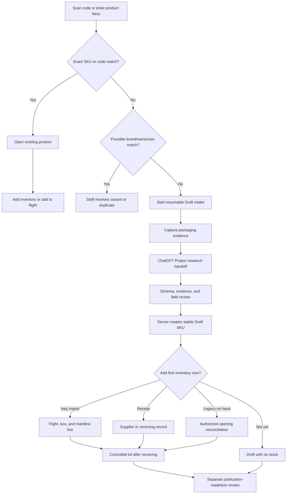

# K2 Jimzon Operations Logic and Workflow Rulebook

**Guided staff tasks and widget help (IDEA-20260907-03/04):** Staff guidance is advisory. Learn mode explains required evidence, expected saved result and recovery. Guided mode follows the canonical intake form's current step. A focus shortcut must reject hidden, disabled, inert, ARIA-disabled or unfocusable controls and report the blocker; it never clicks, submits or marks completion. Draft creation, first inventory and publication remain separate decisions. Dashboard Help is offered only for calculations or source rules that need explanation; failed, stale and unavailable data must stay visible without opening Help. Neither aid changes records or metric truth.

**Public Gemini draft rule (24 September, IDEA-20260924-09):** Staff may request a Gemini free-tier SEO suggestion only after an exact package-barcode match from a fresh public Open Food Facts lookup. The server sends only the public barcode, product name, brand and quantity. It never sends staff package photos, internal stock, costs, customer data or notes to Gemini free tier. The response is an unsaved suggestion for staff comparison with the physical label; it cannot create a Draft, set stock, approve media or publish a product. The paid photo-grounded intake remains a separate inactive path under OWNER-007.

The returned public catalog identity must still match the barcode, name, brand and quantity staff confirmed. A changed identity requires another package check and scan. If staff withdraws or rejects confirmation while a suggestion is loading, the response must be discarded.

**Agile documentation flow (24 September, IDEA-20260924-05):** `MASTER_ACTION_PLAN.md` is the only active queue. Each MAP item names a useful outcome, its next small slice, evidence needed to accept it, and any blocker. Work in dependency order and update the item as facts change. The Brain history file is a superseded snapshot for audit traceability, not a second list of work. Put lasting operating rules here and verified current state in the System Brain. Close a slice only after its evidence is recorded; remove a full MAP item only after its entire outcome is verified. Keep locally prepared, provider-applied, deployed and real-host states distinct.

**Customer account, notifications and payment receipt rule (24 September, IDEA-20260924-04; prepared):** Verified passwordless sign-in creates the optional customer Auth identity on first use; browsing and checkout remain available without one. A signed-in customer may save a display name, delivery address and in-app update preference, and saved values fill only empty checkout fields. Verified account notifications are private, content-free references to staff replies, canonical order/Pasabuy changes and staff-verified payment; the order or payment record remains the source of truth. A QR receipt displays only the payment method selected for that order and never confirms receipt of funds. Product pages remain noindexed until the approved publication gate is lifted. These account/notification rules require the MAP-019/020 database and BFF cutover before they operate live.

**Admin phone workspace hierarchy (24 September, IDEA-20260924-03):** Staff phone navigation groups the existing authorized destinations by work area. The current group opens first; other groups and staff tools are explicit disclosures with readable labels and 44px controls. The phone top bar uses the short section name, and the workspace keeps its task heading. Overview widget choices remain available through the page selector and the navigation group. Inventory keeps one visible primary Add inventory action in its workspace; CSV import and spreadsheet mode are available from Staff tools. Desktop route IDs, role gates, signed commands, record truth and audit behavior do not change. Long labels, status text, numbers and button copy must wrap inside their containers instead of clipping or forcing a page-wide horizontal scroll. Every route still needs real staff and device acceptance before calling the navigation ready for operations.

**24 September manual GCash/MariBank receiving choice (IDEA-20260924-01):** The customer may choose one of the owner-supplied receiving QR methods for a website order. Order request submission remains unpaid; staff first confirms eligible stock, final total and payment instructions. A QR view or buyer-supplied receipt never marks the order paid. Staff records structured manual evidence (GCash as `gcash`, MariBank as `bank_transfer`), and a different authorized reviewer confirms the exact amount arrived in the receiving account before setting `verified` or releasing the payment-gated packing/dispatch path. A synthetic test is not evidence of a real transfer.

**Anonymous website-chat moderation and mobile access (22 September, IDEA-20260922-03 through -06):** On phone viewports the Store Shopkeeper must collapse to one 56px control and must remain collapsed behind every store sheet, including chat; camera controls remain three 44px horizontal targets. Anonymous chat moderation is chat-only and separates deletion from blocking. Only Admin and SuperAdmin may delete an anonymous website/virtual-store conversation, block its keyed 32-byte IP hash, or manually unblock it. A conversation linked to an active `customer_accounts` row must never be deleted by the anonymous command. Deletion removes the thread for staff and the guest but leaves a content-free receipt (conversation identifier, source, message count, actor, reason, time); it must not retain message/contact/IP content. Raw IP addresses must never be stored or shown. The Admin install experience is a separate Admin-target PWA using network-only authenticated requests and makes no offline-operation promise. Footer marketplace links are destinations only and must not imply connected inventory, order, or message adapters.

**Admin quick tools (22 September, IDEA-20260922-01):** Shortcuts open the existing authorized workspace; they do not perform inventory, order or payment commands. Calculators are estimates, not saved financial records, live FX rates, invoices or courier quotes. The expiry helper may compare dates to the 90-day arrival rule but must not declare goods fresh or release quarantine. Scratchpad notes are stored only in the current browser and are not a shared shift record.

**Whole-Storefront human-test wording (IDEA-20260921-09):** Checkout must describe payment as following staff confirmation and must not advertise unapproved receiving methods. Public product/design briefs must distinguish the intended connected-channel future from current K2 inventory and manual staff review. Readability applies to every customer route, including forms, policy, messages, basket and service inquiries. Engineering readiness is not physical-stock approval, payment authorization, marketplace connection or representative human acceptance.

**Storefront readability and navigation (21 September, IDEA-20260921-08):** Preserve the wood store and editorial headings, with plain customer wording and readable sans-serif controls, product names and forms. Normal text must reach 4.5:1 contrast in both themes; camera controls must offer at least 44px touch targets. Mobile browsing explains swipe and pinch and retains direct category choices. Browser zoom must remain available. Chat wording must distinguish automatic refresh from a staff reply and must not promise instant support. These presentation changes do not change inventory, basket, payment, contact permissions or staff review rules.

**Staff help and continuity rules (21 September, IDEA-20260921-04 through -07):** Admin help must use one readable tooltip and one plain screen name. The built-in guide may explain approved procedures and screen purpose, but it must not invent live data or perform work. Purchase orders record supplier commitments; consignments record movement from Italy through Manila receipt. An unrecognized Milan code may use the owner-approved one-tap Draft-and-Pack action only when the result immediately names the created SKU and item so staff can correct a wrong scan. Guest chat may retain its scoped conversation ID in same-browser storage for resume after tab close; it does not establish identity or cross-device ownership.

**Admin workflow guide truth (21 September, IDEA-20260921-03):** Staff-facing
guide steps must use the same plain name as the target Admin screen and may quote
only controls that exist on that screen. When no Admin control exists, the guide
must say `No Admin control yet.` and name the approved manual boundary without
claiming a saved result. Guide review never completes real work. Staff must use
the named screen and confirm the saved record before moving on. Plain wording
must preserve record identity, permissions, quantities, reasons, approvals,
warnings, and separate save boundaries.

**Admin help wording (21 September, IDEA-20260921-01):** Help names the staff action and required checks in plain words. A workflow-map checkmark records only temporary guide review; real work requires the named Admin screen and saved-result verification. Setup warnings must explain the unavailable action without exposing implementation jargon. This wording refinement changes no operational approval, hold, count, payment or delivery rule.

**20 September staff wording (IDEA-20260920-14):** use short task names in Admin
labels. Optional product description and usage/ingredients may open separately;
closing a group or switching editor tabs must preserve the entered draft. Keep
record identity, exact quantities, required reasons, approval steps, warnings,
uncertain results and separate save boundaries visible where staff act. A stock
split review is a proposal; only the existing save action records it. Plain
labels never merge product publication, warehouse stock and shop allocation.


**16 September Universal Guided Walkthrough System across all 8 operational lifecycles (IDEA-20260916-08, MAP-021):**
Staff onboarding, standard operating procedures, and operational rehearsal across all 8 business lifecycles (New Product Intake, Existing Stock Intake, Cross-Border Supply Chain, Inventory Handover & Dispatch, Monthly Physical Count & Close, Customer Order Fulfillment, Pasabuy Concierge, and Multi-Channel Integrations) use the non-blocking dual-advance Spotlight Tour Overlay (`src/components/admin/tour/SpotlightTourOverlay.jsx`). Overlays must use 4-panel shaded surround geometry (`top`, `bottom`, `left`, `right`) around active targets rather than click-intercepting full-screen masks, ensuring staff can perform real warehouse/store operations in the live interface or press `[Next Step →]` / `[N]` to rehearse. Walkthrough text must follow warehouse plain English (zero em dashes, zero AI buzzwords, active voice, copulas) and enforce strict accessibility standards ($\ge 12$px typography floor, $\ge 44\times 44$px touch targets (`min-h-11`), zero raw emojis). Cross-section transitions must display an explicit workspace indicator banner with a direct navigation action button, and all styling must use isolated inline tokens (`THEME_PALETTES`) to prevent CSS bloat in shared storefront bundles.

**16 September automated delivery quotation and checkout parity (IDEA-20260916-01, MAP-023 / MAP-018):**
Automated Shopee/Lazada-style delivery pricing at checkout (`src/lib/cartShippingCalculator.js`) eliminates manual pre-order quoting friction while keeping carrier fulfillment commitment with K2 Jimzon. Real-time rates calculate from cart items' packed weight and customer-selected Philippine delivery region (NCR: Standard ₱95 / Express ₱150; Greater Luzon: ₱85; Visayas: ₱100; Mindanao: ₱105; Pickup: ₱0 free; overweight scaling: +₱35/kg over 3kg). Storefront BFF (`prepared-api/storefront/order.js`) revalidates `shippingAmount` via `strictNumeric` (0-100,000) and `shippingQuoteStatus = 'customer_confirmed'`. Database RPC `submit_order_request_v2` (live in production on Supabase) and companion `submit_guest_order_v1` (`supabase/migrations/20260916_automated_delivery_quotation.sql`) persist `shipping_amount`, set `shipping_quote_status = 'customer_confirmed'`, set initial `delivery_status = 'ready_to_pack'`, calculate `total_amount = subtotal - discount + shipping_amount`, and record the delivery breakdown in events and conversation thread. The customer chooses their service tier; staff fulfill dispatch with courier of choice, with Admin BOS (`OmniOperationsHub.jsx`) rendering the customer-confirmed delivery fee and pre-filling courier dispatch recommendations in `DeliveryDetailsModal`.

**20 September delivery rates as J&T VIP ceiling (owner policy):**
No carrier API exists, so the matrix above is deliberately set at average-to-maximum J&T VIP rates, not at cost. Every fee rounds up (`ceilingToStep` to the nearest 5 or 10 pesos, overweight brackets round up, unweighed items default to 500 grams with container tare), so the quoted fee never lands below what the courier charges. Rates move in one direction only: a future staff override may lower a quote with a reason, never raise one above the matrix. That override does not exist yet and arrives as its own audited slice; until then the matrix is the ceiling and staff fulfill at or below it out of margin, never above it at the customer.

**16 September structured manual payment evidence record and distinct verification (AUD-OPS-001, MAP-023 §16, MAP-019):**
Manual payment transitions to `evidence_submitted` require structured evidence fields: payment method (`gcash`, `bank_transfer`, `maya`, `cash`, `other`), positive numeric amount strictly in PHP, nonblank payer name ($\le 140$ chars), nonblank payment reference number ($\le 100$ chars), optional proof asset reference ($\le 500$ chars), and optional remarks. The database migration `supabase/migrations/20260916_structured_payment_evidence.sql` attaches `payment_evidence jsonb` to `order_requests`, records submission timestamp and submitter identity, and enforces separation of duties in `set_order_request_payment_status`: the staff member verifying that funds arrived in the merchant account must be distinct from the staff member who recorded evidence submission (`auth.uid() <> v_submitter`). Staff Admin UI (`PaymentStatusModal` in `OmniOperationsHub.jsx`) provides structured input fields on evidence submission and renders an independent evidence review card plus an explicit merchant account check confirmation checkbox on verification.

**20 September Cash on Delivery availability switch (IDEA-20260920-12, MAP-023):**
Checkout offers only the payment methods an Admin has switched on. Cash on Delivery ships switched off: customers see prepaid only, prepaid is the default, and submitting Cash on Delivery while off stops with a plain message instead of an order. The switch lives in the fulfillment hub next to payment review and records who flipped it and when. A forged order note claiming Cash on Delivery is refused by the storefront BFF (`COD_UNAVAILABLE`) and by the database guard, which fires only on newly claimed COD notes and never blocks existing rows or unrelated updates. An unreadable or missing switch row also means off. The J&T bulk column for COD follows the recorded method (exact grand total for Cash on Delivery, 0.00 for prepaid). Packing and dispatch still wait for verified payment or approved Cash on Delivery, and approved Cash on Delivery exists only while the switch is on.

**15 September delivery estimate parent state clearing and quote lifecycle (MAP-019/023 I-003):**
Delivery estimate calculation (`src/components/DeliveryEstimate.jsx`) must never allow parent state to hold a stale fee while a new quote is checking. Whenever destination, weight, or merchandise subtotal changes (`localityId`, `weightG`, `subtotalMinor`), `setQuote(null)` and `onQuote?.(null)` must be dispatched immediately alongside `setChecking(true)` before asynchronous rate resolution. If `quotable` becomes false (e.g. cart items become unweighed or empty) or `localityId` is cleared, parent quote state must immediately clear to null. Checkout retains the approved manual quoting model ("Courier delivery is quoted for approval after review; nothing is charged here") until remote immutable quote persistence is active under MAP-017/G-001.

**15 September checkout error recovery and idempotency lifecycle (MAP-019/023 I-004):**
An unconfirmed/uncertain checkout attempt holds the pending order lines and contact payload, locking the form fieldsets against accidental modification while preserving all entered form values (`name`, `email`, `phone`, `address`, `fulfillmentMethod`, `note`). If the customer explicitly chooses "Edit order or contact details" or modifies cart quantities, items, or coupons, the held pending checkout state is cleared (`resetPendingCheckout`) and a fresh idempotency key (`crypto.randomUUID()`) is assigned on the next submission so modified order contents are never submitted under a stale key. Definite server rejections (`result.code?.endsWith('_INVALID')`, `INSUFFICIENT_STOCK`, `CONTACT_REQUIRED`, `BOT_CHALLENGE_REQUIRED`, `INVALID_REQUEST`, `RATE_LIMITED`, `INVALID_OR_INELIGIBLE`) immediately unlock the checkout fieldsets and cart controls on both initial attempts and retries (`resetPendingCheckout`), allowing customers to immediately correct issues without refreshing or losing entered data. All interactive recovery actions must meet the $\ge 44\times 44$px touch target requirement (`min-h-11`) with accessible focus rings.

**15 September staff workspace completeness, recoverable dialogs, and navigable admin work context (MAP-019/021/023 I-012, H-007, H-024, H-025):**
Staff fulfillment queue reads must enforce explicit bounding limits across queries (`submitted`: 200, `confirmed`: 200, `lots`: 1000, `staff`: 50) and return structured completeness metadata (`returned`, `limit`, `truncated`). When query limits are hit, staff workspaces must display an accessible alert banner (`role="alert"`) warning of truncation rather than silently presenting a partial read as the entire operational backlog. All Admin modal and dialog workflows must standardize on the shared `AdminDialog` primitive with focus trapping, `aria-modal="true"`, and explicit write locking (`closeDisabled`, disabled dismiss/cancel controls while mutations are in-flight (`busy`, `working`, `finalizing`)) so operations cannot be abandoned or double-committed mid-reconciliation, role change, or consignment advance. Admin work contexts must maintain exact two-way URL synchronization (`?section=...`) via HTML5 History `pushState`, map aliases (`consignments`, `fulfillment`, `staff`, `channels`, `messages`, `customers`), sanitize against the authoritative `SECTIONS` registry with role permission gates (`adminOnly` fallback to `overview`), support browser Back/Forward navigation with `popstate` restoration, and shift accessible focus to the section heading landmark on section transitions.

**15 September storefront media failure, touch targets, discovery ordering, mobile buying hierarchy, and launch truth (MAP-028 I-008, I-005, I-006, I-007):**
External or local media failures across all storefront visual surfaces (story journeys, interactive reveals, product cards) must fail-safe to the canonical neutral placeholder (`/images/placeholder.svg`) with stable layout geometry rather than leaving broken layout artifacts or silently failing. Interactive targets across storefront discovery, product detail breadcrumbs, tabs, and action icons must satisfy the 44px minimum touch target invariant (`min-h-11`, `min-w-11`). Catalog discovery requires explicit recency sorting ('latest' ordering by descending database `created_at` timestamp with deterministic SKU/ID tie-breaking), preserves null/undated rows deterministically, supports full URL parameter synchronization (`q`, `category`, `sort`) with history popstate restoration on Back/Forward navigation, and queries remote databases newest-first without inventing ungrounded 'recently landed' claims from arbitrary array indices. The product detail surface (`MasterProduct.jsx`) prioritizes primary purchase decisions over optional details: on mobile and desktop viewports, product identity, price, allergen safety notices (`role="alert"`), and purchasing controls (stepper, stock status, cart/Pasabuy submission) precede product descriptions, provenance passports, specifications, and pairings in DOM and visual hierarchy, ensuring customers are not required to scroll past secondary content or miss critical allergen warnings before purchasing. Public promises must reconcile strictly with manual launch operating facts: customer-facing FAQs, Hero, Checkout, Confirmation, and Contact surfaces describe only available manual steps (manual GCash/QR planned for launch upon staff stock/quote confirmation; delivery quoted and confirmed per order; no false 1-2 day delivery or 2-3 week Pasabuy transit SLAs; no unapproved Maya/bank/COD payment methods; no self-service returns or instant confirmations).

**15 September inventory commitment and owned-stock projection (MAP-028 I-001):**
Owned stock is strictly a derived read projection, never a second writable balance.
Physical on-hand custody remains distinct from owned stock: committed units remain
physically on-hand until handover dispatch, while available sellable stock excludes
both uncommitted purchase holds and committed allocations. Complete allocation visibility
is required; missing or unattributed confirmed/verified allocations flag explicit
reconciliation required rather than silently masquerading as healthy inventory totals.
Committed reservations exit the due-for-expiry queue and refuse deadline extensions
(`RESERVATION_ALREADY_COMMITTED`). All 8 concurrent writers (payment verification, order
confirmation, hold cancellation, expiry sweep, balance recount, handover dispatch, custody
transfer, and channel allocation) serialize deterministically on balance/lot locks without
deadlocks or balance corruption.

**15 September intake retry contract (IDEA-20260914-02):** secure session
creation retains its distinct inner request ID and outer command key. Packaging
evidence retains exact file bytes, filename, slot, session and outer key until its
receipt is reconciled. Upload success requires a matching registered path/slot;
a failed read, incomplete receipt or older image is not confirmation. Preserve
private-file cleanup tracking and never delete evidence based on response loss.
These requirements do not imply durable browser-reload recovery or activation.

**14 September review/discovery truth (IDEA-20260914-02):** remote customer
feedback must come from the published review register. An empty or failed read
must never substitute demo testimonials; distinguish no published reviews from
an unavailable source. Account, private messages, checkout and confirmation are
scoped journeys and must use noindex/nofollow in page metadata and host headers.
Crawler policy is separate from authentication and does not grant or deny access.

**14 September recovery and fact authority (IDEA-20260914-02):** an uncertain
checkout must retain its original order details and request identity, freeze cart
and coupon edits, and obtain a fresh bot token on retry. A later retry failure
does not prove that the original write failed. Canonical products must not inherit
demo ingredients, origin, preparation or provenance from a matching demo SKU.
Missing availability remains unknown. Customer metrics are unavailable unless
every supporting history query is demonstrably complete; a loaded register count
must describe loaded records. These are required behaviors; local evidence and
remaining activation/reload limitations are recorded in the System Brain.

**13 September audit corrections (IDEA-20260913-02):** intake quantity and cost
must be explicit numbers or supported nonblank numeric strings, never booleans,
arrays or objects converted into facts. Omitted optional cost retains its existing
zero default. Staff expiry displays use the Manila business date. Clearance
approval dates and quantities must come from canonical lot reads/receipts; a
browser clock is not approval evidence. A failed post-write read preserves the
last displayed data and receipt identity until the recorded result can be loaded.
These local corrections do not change SQL expiry eligibility or activate providers.

**Mobile store navigation and overlay collision boundaries (IDEA-20260909-02 / I-015 verified 15 September 2026):**
Compact category controls, keeper dialogue, zoom controls, and basket dock must never
collide or occlude each other on mobile viewports (portrait 375×812 and landscape 844×390).
On mobile screens (`max-width: 900px`):
1. **Empty basket:** Hidden (`data-filled='false' { display: none }`) to eliminate canvas obstruction.
2. **Filled basket dock:** Anchored at bottom-right above the product rail (`bottom: calc(44px + 1.15rem); right: 0.75rem; z-index: 9`) as a compact pill (`min-height: 48px; border-radius: 999px; padding: 0.3rem 0.55rem 0.3rem 0.65rem`) with scaled parcel icon, keeping the Counter title, shelf signage, and keeper clear. The review basket button maintains a $\ge 44\times 44$px touch target.
3. **Shopkeeper card overlay:** Top-anchored (`top: 0.6rem; left: 0.6rem; z-index: 25`), bounded to `max-height: calc(100% - 9rem)` with a scrollable dialogue panel (`max-height: min(10.5rem, calc(100% - 3.5rem))`), guaranteeing a vertical gap $\ge 16$px above the bottom basket dock.
4. **Input auto-zoom protection:** Mobile question input (`#keeper-question`) is styled at `font-size: 1rem` (16px) to prevent iOS Safari viewport auto-zoom from distorting the 3D canvas.
5. **No horizontal overflow:** `document.documentElement.scrollWidth <= innerWidth` across portrait and landscape.
6. Scene camera zoom and browser text zoom remain separate controls. Evidence: `docs/evidence/20260915-store-overlay-collisions/README.md`.

**Product-led merchandising and related provisions (MAP-023/027 I-009 verified 15 September 2026):**
1. **Product Detail Scope:** Product pages (`MasterProduct.jsx`) must never repeat the entire catalog or secondary filter/search controls beneath the product specifications. Instead, they must render a small, curated set of up to 4 related provisions (`RelatedProducts`) matching the current product's category or subcategory, accompanied by an explicit, accessible call-to-action button linking directly to the full catalog (`/catalog`) with $\ge 44$px touch targets (`min-h-11`).
2. **Mobile Catalog Scanning Density:** The catalog grid (`CatalogGrid.jsx`) must support responsive 2-column scanning on mobile devices $\ge 370$px (`min-[370px]:grid-cols-2`), enabling customers to quickly compare products without excessive scroll depth, while retaining 1-column fallback on screens $< 370$px to prevent layout cramping. All product action buttons and touch links must satisfy the $\ge 44\times 44$px invariant. Evidence: `docs/evidence/20260915-product-led-catalog/README.md`.

**IDEA-20260907-01 current implementation boundary (7 September 2026; updated 16 September 2026):**
the rulebook requirements below remain the target contract. On 16 September 2026,
the structured payment evidence record and distinct staff verification were
implemented and verified locally (AUD-OPS-001, MAP-023 §16, MAP-019), with
migration `supabase/migrations/20260916_structured_payment_evidence.sql` prepared
for the MAP-017 maintenance window. The prepared manual product-intake/flight-receiving
path keeps supplier receipts disabled and automatically quarantines short-dated
receipts, but does not yet provide the richer wrong-item/damaged/unexpected-goods
disposition workflow required in §9. Exact-shop snapshot/order staging remains
observation-only and provider inactive. These facts are local preparation evidence,
not production claims; the MAP and payment runbook hold the activation dependencies.

The focused contract, browser, PostgreSQL and separate-build evidence is
recorded in `docs/evidence/20260907-operational-readiness/README.md`.

**Dashboard widgets (IDEA-20260906-07; locally prepared):** staff chooses one
dashboard widget from the left navigation or the phone selector. Shop/channel
metrics, sales review, revenue, priority work, inbox, Pasabuy and stock retain
their separate meanings and existing canonical destinations. Reporting widgets
are read-only. Verified payments are not settled payouts or actual profit;
internal channel records and recorded connection status do not prove a working
external feed. Missing or known capped result sets are unavailable, never healthy
zeros. Zero means no matching retrieved internal records. An interrupted refresh
labels the retained snapshot's original period, including exports. New metrics
sources require verified integration evidence and remain in the active MAP.

Dashboard truth refinement (IDEA-20260907-02): malformed source shapes and invalid
stock, amount or backlog values must be unavailable, not coerced to healthy zero.
API/UI reporting days use Asia/Manila. Payment-verified request value is grouped
by request creation, not receipt/settlement date. Count-sorted queues are not the
risk priority ordering required in §21; SKU/batch flags can overlap. Blank and
unrecognized channel sources must not be attributed to Website or a marketplace.
Refresh uses the existing authorized read boundary, including visible-tab polling
and return-to-tab refresh; mock records belong only in isolated tests.

**Automatic intake boundary (IDEA-20260906-05; prepared, not activated):**
For IDEA-20260924-08, a package EAN/UPC/GTIN may receive a public grocery-catalog identity suggestion after K2's duplicate check. The public suggestion is untrusted: staff compare the exact variant and size with the physical package and record accept/reject provenance. Private package photos may support paid AI listing text, SEO and optional image candidates after the provider gate. Staff can instead upload their own primary, after-use and supporting storefront photos through the product's Photos action. Intake evidence is never published automatically. Missing catalog data, a mismatch or outage preserves manual intake. No catalog image is copied. K2 internal SKUs cannot be used as global barcodes; no suggestion changes stock, price, batch, expiry or publication. This lookup and review are locally prepared, not activated on the live Admin host.
Manual ChatGPT Projects remains a separate usable path. Automatic requests use
only registered package evidence, require staff+AAL2 and exact session ownership,
and reserve owner-approved budget before a single provider dispatch. Signed jobs
and results survive browser loss. Uncertain calls retain their reservation and
must never be dispatched again by recovery. Staff reviews each content field and
each PRIMARY/AFTER candidate before existing canonical save/attachment commands.
Evidence cleanup may remove a private object only from an exact pending claim;
an unrecognized claim state must not reach Storage deletion, and cleanup remains
pending until the database returns the matching cleanup ID with an explicit
completed receipt.
AI never assigns stock, quantity, SKU, price, cost, expiry, custody, approval or
publication. Missing configuration explains readiness and preserves manual work.
Activation/recovery procedure: `docs/runbooks/PRODUCT_INTAKE_RUNBOOK.md`.
**Checkout delivery commitment (I-003):** automated delivery fees are enabled via the owner-approved weight and regional pricing matrix (`src/lib/cartShippingCalculator.js`). The Storefront BFF revalidates `shippingAmount` and `shippingQuoteStatus = 'customer_confirmed'`, persisting them to the canonical order via `submit_guest_order_v1`. Grand total is calculated as `subtotal - discount + shipping_amount` across checkout, confirmation, order seeds, and Admin BOS. For unweighed or out-of-zone cargo, fallback to manual quoting ("Quoted after review") remains supported. Carrier selection and dispatch commitment are fulfilled by K2 Jimzon staff based on the customer-selected service tier.

**Fulfillment response loss (I-002):** a missing delivery/handover response does
not prove that the write failed. Preserve the submitted reference/details and
logical command identity, prevent edits while its outcome is unknown, and allow
an exact receipt retry through the protected command boundary. A definitive
rejection may reopen correction. A staff-session change invalidates the old
dialog runtime; a late response must not close or confirm the new staff's form.
Local UI acceptance and provider activation are separate evidence gates.

Product-intake checklist steps, reviewed Draft creation and first inventory use
the same rule: retain the exact reviewed payload and outer receipt key while
pending or unconfirmed, separately from the durable inner intake request ID.
A missing/malformed receipt or failed post-write session refresh does not permit
a new command identity or revised details. Retry resolves the original receipt
before refreshing server truth. Freeze all review fields and dismissal, keep
one explicit retry action beside the uncertainty warning, and allow correction
only after a definitive rejection. Disposed UI continuations cannot advance a
replacement staff workspace. This rule also remains the target for the other
intake callers awaiting adoption in I-002.

The same rule applies to supplier identity creation: uncertainty must preserve
the original name/contact/lead time/reason and receipt identity. A legacy write
without protected receipts requires directory reconciliation before another
creation attempt. Creating a supplier never implies approved pricing, a purchase
order or receiving completion.

Coupon creation and activation/pause/archive decisions follow the same response-
loss rule. Preserve the exact code, discount, spend/redemption limits, dates,
campaign flags, clue and reason (or decision target/action/reason) until receipt
resolution. Freeze edits and accidental dismissal during protected uncertainty;
definitive rejection permits correction. Legacy uncertainty requires register
reconciliation. Returning from a dialog restores its invoking control, including
when opening the dialog temporarily disables that control.

Catalog CSV commits follow the same response-loss rule per atomic chunk. Preserve
the exact reviewed file hash, selected rows, reason, operation ID, chunk index and
chunk idempotency key until a matching durable receipt resolves the outcome.
While unresolved, staff cannot dismiss the review, replace the file or produce a
different preview. The uncertainty warning and exact retry/status recovery remain
visible together. A staff-session change disposes the old UI continuation; its
late response must not refresh or confirm the replacement actor's workspace.

Wholesale triage preserves its exact inquiry reference, target status and reason
through uncertainty. Only a matching server receipt with a canonical timestamp
may update the register; a missing or malformed receipt is unresolved, not a
client-time success. Triage never grants commercial authority.

Product media assignment must wait for active uploads. Freeze reviewed images
and reason during an unresolved assignment; receipt retry preserves that exact
payload. A successful assignment with pending cleanup is already saved and must
reuse its original assignment receipt to finish cleanup. A late upload or save
from a disposed staff workspace cannot change the replacement workspace. Legacy
assignment uncertainty requires product-register reconciliation.

**Admin usability contract (IDEA-20260906-06; target):** calmer presentation
must preserve separately labelled product, stock, payment, fulfillment and API
states. Show exact record context, blockers, action impact and server-confirmed
results where staff act. Guide review is not execution; missing data is not zero;
uncertain writes require receipt reconciliation. Routine help may be collapsed,
but current blockers and consequences cannot be hidden. Color must supplement
text/shape, never carry operational meaning alone. MAP-028 I-012/I-016 own the
implementation and MAP-025 owns staff acceptance.


**Workflow API access:** diagram controls may invoke only registered K2 service
operations under the existing staff session and server permission checks. A
record read is evidence of the returned batch at the displayed request time,
not proof that a workflow step completed or that a queue is exhaustive. Clear
old results when changing steps and distinguish service failure from empty data.
Guide checkmarks and fictional rehearsal responses never write business records.
Any future mutation requires exact record/payload review, canonical validation,
idempotent receipt handling and explicit uncertainty recovery before acceptance.

**Hero merchandising:** previews reuse the canonical listed catalog, active
retail/wholesale pricing mode and product-detail path. Loading must not present
development seed products as loaded listings. Do not imply recency, popularity,
availability or payment confirmation from selection order. Missing imagery uses
a neutral placeholder. The owner's 6 September additive-design instruction keeps
the existing hero content/actions; its visual rollback must preserve unrelated
operational work.

**Client-load recovery:** a failed code download must not automatically reload
away customer drafts or unresolved staff-operation identities. Leave the failure
available to the error boundary and make reload an explicit user action. Blocked
browser storage must not turn recovery into a second exception.

**Packing contract (MAP-023 H-016):** a shared product barcode proves only SKU
identity. Staff must select the exact active allocation and confirm the physical
batch, expiry and location before each unit is credited. Missing lot identity,
an exhausted allocation or ineligible stock blocks the scan. Retrying an
unconfirmed response must preserve the original payload and operation key until
its receipt is reconciled. Reassignment remains a canonical reservation action.
This is required behavior; deployment evidence belongs in System Brain.

**Handover coverage (MAP-023 H-023):** every requested line must have its full
quantity assigned and physically packed. Missing allocations cannot satisfy
this check vacuously. Released historical allocations never enter current
deduction totals. Counter discrepancies must abort the entire handover for
reconciliation, preserving order state and events. This does not alter the
OWNER-002 requirement to deduct at payment verification or confirmation.

**Version:** 1.0
**Approved working baseline:** 9 August 2026
**Purpose:** The authoritative rulebook for designing, implementing, reviewing, and testing K2 Jimzon operations.

This file defines how K2 must work. It does not claim every rule is already implemented. `SYSTEM_BRAIN_CURRENT.md` records what is live; `ADMIN_OPERATIONS_AUDIT.md` records verified gaps.

## 1. Document authority

Use project documents in this order:

1. **Master Business Blueprint**  -  K2's vision, customers, and direction.
2. **This rulebook**  -  required operational behavior and safeguards.
3. **System Brain Current**  -  what is implemented and live now.
4. **Admin Operations Audit**  -  what is backed, partial, broken, deferred, or unsafe.
5. **Future Ideas**  -  proposals that are not yet live.
6. **Owner Questions**  -  only unresolved business-policy decisions.

If documents conflict, use this rulebook for target behavior and the System Brain for current status. Never describe a target as live until schema, code, permissions, and tests verify it. Older workflow, system-logic, and connector blueprints are historical when they conflict with this file.

## 2. Standing principles

- K2 is a direct Italian import operation serving curated retail, Pasabuy, wholesale, marketplaces, and direct website customers.
- Marketplaces remain active income/acquisition channels, but K2 aims to move repeat customers toward its website.
- The admin is the operational source of truth. The storefront and connectors consume controlled admin data.
- Admin and storefront production deployments remain separate.
- Technology reduces staff work without hiding uncertainty or inventing facts.
- Never claim fake stock, payment, connector success, message delivery, sourcing evidence, or live metrics.
- Secrets stay in secure backend storage, never browser code or browser storage.
- Malformed browser cookies must not crash authorization. Invalid session/CSRF
  values fail closed; diagnostic records must never expose raw credentials.
- API request deadlines cover response-body download as well as headers.
  A timed-out write has an uncertain outcome and must be reconciled before retry.
- An unchanged unresolved staff message retry retains its operation identity.
  New messages receive new identities after success; retry state must not cross
  staff actors. Losing local state never proves a prior write failed.
- Every inventory-changing, financial, destructive, or customer-facing decision is attributable and auditable.
- Flexible business practices become controlled case workflows, not false fixed formulas.

## 3. Record boundaries

Keep these records separate even when one screen presents them together:

| Record | Owns this truth |
| --- | --- |
| Product master | Stable SKU, barcode, variant, content, sales configuration |
| Customer identity | Customer and verified channel identities |
| Customer request | Desired item, quantity, constraints, deadline, substitutions |
| Quote | Offered price, validity, cost snapshot, delivery estimate, decision |
| Purchase | Source, purchaser, actual quantity and acquisition cost |
| Flight/consignment | Route, boxes, international movement, milestones |
| Manifest line | Expected SKU/variant/batch quantity in one box |
| Scan event | Immutable Milan/Manila scan, actor, code, result, time |
| Receipt | Accepted, short, over, damaged, unexpected, quarantined counts |
| Inventory lot | SKU, batch, expiry, location, owner, custodian, condition, unit cost |
| Reservation | Quantity promised to an order, customer, wholesale account, or channel |
| Custody transfer | Exact quantity handed between custodians/locations |
| Canonical order | Normalized demand from website or any marketplace |
| Fulfillment | Allocation, picking, scans, package, handover, delivery |
| Delivery quote | Courier/source, estimated/final amount, customer confirmation |
| Payment evidence | Proof, method, amount, reference, review state |
| Settlement | Verified amounts, refunds, actual costs, variance |
| Conversation | Customer communication and internal notes |
| Exception case | Cancellation, return, exchange, failed delivery, dispute |
| Connector event | Durable payload, idempotency key, processing/retry state |
| Audit event | Actor, time, prior/new value, reason, linked record |

Do not overload one `status` to represent several records.

## 4. End-to-end map

```mermaid
flowchart LR
    A["Curated demand"] --> P["Purchase in Italy"]
    B["Pasabuy request"] --> Q["Manual owner quote"]
    Q --> C["Customer confirmation"]
    C --> P
    P --> M["Flight and box manifest"]
    M --> S1["Milan unit scans"]
    S1 --> T["Sealed and in transit"]
    T --> S2["Manila unit scans"]
    S2 --> R["Receipt reconciliation"]
    R --> L["Lots by expiry, hub, owner, custodian"]
    L --> O["Canonical channel or website order"]
    O --> V["Reservation and eligible FEFO"]
    V --> K["Order-first unit packing"]
    K --> W["Marketplace/courier waybill"]
    W --> H["Handover and delivery"]
    H --> Z["Settlement or exception case"]
```



## 5. Non-negotiable invariants

### Inventory

- Basket item order must not determine inventory lock order. Purchase holds
  initialize and lock every involved balance in SKU order before locking lots.
  Preserve FEFO eligibility, reservation coverage, exact counters and audit
  events. This rule does not change the required confirmation/payment deduction
  timing; all inventory writers must still compose without lock inversion.
- Payment evidence acceptance and verification require consistent locked
  balances as well as complete eligible lot coverage. Missing, under-reserved
  or overdrawn balances require reconciliation; do not invent a repair during
  payment review. Financial refund recording remains possible during stock
  discrepancies and does not itself restore inventory.
- Physical recounts acquire the SKU balance before existing batch and product
  locks. Creating a missing balance must preserve lot-backed reserved units;
  neither a recount nor lock-order repair may erase holds or historical lots.

```text
available = on_hand
          - reserved
          - in_transfer
          - damaged
          - expired
          - quarantined
          - unaccounted
```

- Available is derived and cannot be typed directly or become negative.
- One unit cannot be reserved, transferred, fulfilled, and written off simultaneously.
- Confirmation must prove complete eligible coverage for every order line;
  one surviving active reservation never proves the entire order is covered.
  Partial or expired allocations require explicit reconciliation before confirmation.
- Every expiry-tracked unit belongs to a stable lot with a usable date.
- Every received lot has a location and custodian.
- Owner and custodian are separate concepts.
- Normal curated stock is physically pooled by location/lot. Customer or channel commitments are reservations.
- A marketplace/shop quantity is an attributable external observation or an
  approved availability allocation; it is not a physical count and cannot be
  summed into Master Inventory. Only controlled receiving, recount, disposition,
  reservation, fulfillment, and custody events change canonical stock.
- Every quantity change writes an immutable event with actor, reason, delta, linked record, and before/after balance.
- Expiring an unpaid purchase hold is order-atomic: a bounded batch never releases
  only part of an order's allocation. Confirmed, payment-verified, evidence-pending
  or packed commitments are excluded from the temporary-hold sweep. Unknown
  deadlines require reconciliation, and counter mismatches must roll back rather
  than be clamped. Released stock becomes sellable only if its lot remains eligible.
- `quantity` is the verified physical count. `reserved_quantity` is committed
  demand. A stored or projected sellable/available value is derived from those
  facts plus disposition and shelf-life eligibility; a compatibility field or
  trigger must never copy physical quantity over that derivation.

### Shelf life and FEFO

- FEFO selects the earliest **eligible** lot.
- Pins may attract attention but never override eligibility or FEFO.
- Ordinary sale requires at least 90 calendar days remaining by default.
- 31-89 days requires an approved, clearly disclosed clearance path.
- 0-30 days is not sellable.
- Expired lots are not sellable.
- Expiry-tracked stock with an unknown date is not sellable until corrected.
- Categories may raise the 90-day minimum.
- Expired, damaged, quarantined, unavailable, wrong-location, and wrong-custody lots cannot be reserved or fulfilled.
- A 31-89 day clearance decision records actor, time, and a specific reason and
  is reversible with a second reason. Changing expiry or moving the lot into a
  non-available disposition invalidates the prior clearance approval.
- A physical recount cannot reduce a lot below its active reservations. Resolve
  or move the reservations through their own workflow first.
- Lot reconciliation preserves existing IDs, rejects omitted existing lots, and
  writes immutable before/after evidence. To remove physical stock, record zero
  and the real reason rather than deleting the lot.

### Transaction truth

- A UI reports success only after the server transaction succeeds.
- Failure preserves prior balances and states.
- Empty, loading, stale, partial, permission, and error states are different.
- Bulk actions show impact, count, validation, and reason before commit.
- Estimates, quotes, FX, quantities, and costs are never silently overwritten.
- Corrections append events instead of erasing history.

## 6. Product master

- One SKU represents one sellable variant.
- Different concentration, size, flavor, shade, formulation, or pack count requires a distinct SKU.
- Use a unique manufacturer barcode; if shared/unreliable, add a K2 internal scannable code.
- One SKU may appear in many boxes/lots without duplicating the master.
- The server assigns the stable internal SKU. A person, browser, import file, or AI
  may propose a display name or slug but cannot invent the operational SKU.
- Every active scannable code resolves to one sellable variant. A shared or
  unreliable manufacturer code is recorded as non-authoritative evidence and the
  variant receives a unique K2 scannable code.
- A marketplace SKU is scoped to one exact shop listing and is an alias, not a
  K2 product identity. SKU/name/barcode similarity may suggest a product link but
  never merges automatically. An Admin must approve Link existing, Create new
  Draft, or Leave unresolved; new products receive a server-generated K2 SKU.
- Imported product fields remain suggestions. K2 Product Master wins until an
  authorized field-level review accepts a change. Different size,
  concentration, flavor, shade, formulation, or pack count remains a distinct
  variant even when a provider reused a SKU, name, or barcode.

```text
draft -> under_review -> live
                    -> unlisted
live -> unlisted -> live
live | unlisted -> discontinued
```

- Manual, CSV, AI-assisted, and connector-imported records start as draft.
- AI may draft content but cannot publish without human review.
- Use one canonical publication status.
- Relisting from Unlisted to Live rechecks the required name, brand, category,
  positive price, primary image and human review. Draft cannot jump directly
  to Live and Discontinued cannot be relisted.
- An unchanged publication status returns after authorization, ownership and
  row locking without rewriting completion timestamps or inserting another
  transition audit. The signed command boundary still owns request receipts
  and the staff's review-reason audit; a new command differs from retrying an
  existing receipt.
- Publishing validates identity, name, price, primary image, variant, and required channel fields.
- Product import never creates stock; receiving/controlled adjustment does.
- Claims about origin, ingredients, allergens, usage, and authenticity retain sources/evidence.

### Public discovery and crawler truth

- The Storefront has one canonical public origin. Canonical, Open Graph, Twitter,
  sitemap, and product structured-data URLs must resolve to that origin; preview
  and apex hosts may redirect or normalize to it, while local verification may
  preserve its local origin.
- Only customer-visible `Live`/`Active` products with a stable SKU may enter a
  generated sitemap after the product noindex gate is deliberately lifted. A
  supplied primary image must be valid HTTPS; an absent image omits the sitemap
  image element. The sitemap is derived from
  a reviewed production catalog projection, never fixtures, fallback products,
  private fields, or an unverified database snapshot.
- Price, stock, availability, batch, and best-before remain live canonical
  projections used by product JSON-LD and the storefront. They are not duplicated
  into a static sitemap or used to create a second catalog truth.
- Home, Catalog, Pasabuy and Trade have distinct truthful search metadata and
  canonical URLs in both initial HTML and client navigation. Their sitemap entries
  do not imply that product pages are ready to index. Product descriptions and
  genuine media require staff review before the product indexing gate opens.
- Admin routes remain excluded from indexing and share previews. A crawler file,
  canonical tag, or ownership record is not considered live until the exact
  production host returns the intended content type and an end-to-end check is
  recorded.
- A registered public route must resolve to its intended view on direct load,
  refresh, Back, and Forward. Unknown routes render an explicit noindex recovery
  surface; an unknown product renders a bounded `Product unavailable` state.
  Neither may silently render Home or remain on a permanent loading indicator.
- Static-host routing may rewrite only the shared registered Storefront paths
  and, after generated product HTML receives filesystem priority, use the
  canonical product path as a client fallback. It must not use a global
  application catch-all. An unmatched host path must retain a real
  not-found response and use the target-specific, script-free, noindex recovery
  document; the public artifact must never disclose the protected Admin route.
  Repository configuration and isolated builds are prepared evidence only until
  the exact preview and live hosts prove their response status, body, and target
  identity.
- Internal navigation uses the shared history/focus boundary. Full-page reloads
  are reserved for actual document navigation; client-view changes move focus
  to the destination heading so visual and assistive-technology users receive
  the same route change.

### Phone-first new SKU and first-inventory workflow

The default new-product workflow must work on a phone and remain resumable when
staff switch to ChatGPT, the camera, or another app.
Every Inventory or Sheet new-product launch starts at identity scan or typed-code
fallback. Staff choose manual ChatGPT handoff or an owner-enabled automatic API
only after identity and package evidence are checked; that content choice is
never a choice between stock creation and product creation. An exact existing
SKU opens its product for separate lot/custody review. A scan alone does not
create stock, a Draft, or a published listing.



The checklist is:

1. **Identify and prevent duplicates.** Scan the manufacturer/K2 code first or
   type the known identity. Search exact code and SKU, then normalized brand,
   product name, size, concentration, flavor, shade, formulation, and pack count.
   An exact hit opens that product. An uncertain match blocks creation until a
   staff member chooses the correct variant or documents why it is new.
2. **Capture primary evidence.** Record the package front, back/label, barcode,
   exact variant and net quantity. Require category-specific views: food and
   beverage labels include ingredients, allergens, storage, nutrition when
   present, batch and best-before/expiry; beauty/personal care includes INCI,
   concentration/shade, warnings and use; household products include composition,
   warnings and directions. Optional media is clearly separate from evidence.
   The secure upload boundary verifies file signature through a real image
   decoder, declared MIME, byte size, dimensions, pixel count, and single-image
   decode. It re-encodes JPEG/PNG/WebP without embedded metadata before private
   storage and records the content hash; browser file names and MIME values are
   never accepted as proof that a file is a safe image.
   Public product media is a separate data class and bucket from private intake
   evidence. Its prepared Admin boundary applies the same byte-level image
   verification and metadata stripping, then stores only an actor-scoped,
   idempotency- and content-hash-derived public object. Upload does not itself
   assign the image to a product or confer publication authority.
   Assignment is a separate reasoned command: new media must match the acting
   staff member's completed upload receipt, existing legacy media may only be
   retained unchanged, and removing a primary image is denied while a product
   is published or Live. Unassignment does not assert that the public Storage
   object has been deleted. The separate cleanup command may remove only a
   completed-receipt object that is absent from every canonical product-media
   field after a fresh database check. Assignment-triggered cleanup remains
   pending across ambiguous Storage failures and retries with the original
   operation key. Abandoned-upload review is Admin/AAL2-only, waits at least one
   hour, is bounded to 100 review rows and 25 reasoned removals, and rechecks
   references immediately before deletion.
3. **Research without surrendering control.** The app saves the intake session
   and prepares the versioned request. Staff manually use two private ChatGPT
   Projects while no API exists. **K2 Product Content** accepts `PRODUCT_JSON`
   and returns one strict product/copy/SEO/usage/evidence object. **K2 Product
   Image Studio** accepts `PRIMARY` to compose the real front-package photograph
   and `AFTER` to create the truthful prepared, applied, or in-use image. Neither
   Project can assign SKU, slug, stock, approved prices, expiry, review status,
   or publication status.
   A future paid API path is a separate deliberate staff choice, never the
   default consequence of opening intake or uploading evidence. It may draft
   the same descriptions, SEO, usage/instructions, media briefs, and image
   candidates only through a server-held credential and approved spend controls.
   It must show the priced scope and obtain the owner-approved confirmation at
   the required boundary before a paid call. Until that confirmation sequence,
   budget ceiling, provider/model, retention policy, server boundary, and
   production activation are verified, the path remains visibly unavailable
   and staff use the two private Projects above.
4. **Secure cutover uses named product-master commands.** Barcode helpers use
   the protected duplicate search, and new products enter through phone-first
   intake. Smart Paste may not fall back to direct browser inserts when the
   Admin BFF is enabled. Existing-product detail updates use the fixed
   Admin/AAL2 product-master projection, an optimistic record version, a
   specific reason, CSRF, signature, and durable idempotency. Publication state
   uses a separate five-state transition command and rechecks Live readiness;
   it never rides inside a generic detail patch. Permanent deletion uses the
   dedicated signed command while preserving the existing PIN, lockout,
   stock/listing/history, reason, and retry rules. Direct browser product writes
   and legacy deletion execution are revoked only in the coordinated cutover.
5. **Validate and review the response.** `PRODUCT_JSON` contains the product
   draft, customer copy, SEO/meta/headings, structured use cases and
   instructions, two image briefs, per-field evidence/source references,
   unknown fields, and review notes. It contains no surrounding prose or
   operational fields. Re-run duplicate checks. Show
   proposed-versus-current values and let staff accept or reject each suggestion.
   Unknown or unsupported facts stay visibly unresolved as JSON `null` values.
6. **Create one Draft product.** A server command assigns the stable SKU and
   writes the reviewed product fields, code mappings, evidence/provenance,
   checklist state, actor, and audit event atomically. App switching, timeout,
   retry, and duplicate submission cannot create a second product.
7. **Create inventory separately.** After the Draft exists, choose the truthful
   source: an Italy flight/box manifest line, a supplier/receipt workflow, or an
   authorized opening-balance reconciliation for verified legacy stock. The lot
   owns batch, expiry/non-expiry evidence, quantity, hub, owner, custodian,
   condition, unit cost, reason, and receiving state. Product rows never own
   these values.
8. **Review readiness separately.** Product review, inventory eligibility, and
   channel/publication readiness are distinct. A Draft may exist with no stock;
   received stock may exist while content remains Draft; neither fact makes the
   other complete.

Every publication change records a specific review reason. `Live` means the
canonical storefront publication state only; Shopee, TikTok Shop, Lazada, and
future channels require their own listing/readiness confirmation and cannot be
implied by the Product Master status.

### Public review-claim lifecycle

Customer review copy is a public claim, not free-form CMS content. A new claim
starts as `draft` and records the attributable source reference, source kind,
rights basis, rights-confirmation time, actor, and reason before it can be
considered for publication.

```text
draft -> published -> withdrawn
  ^         |
  +---------+  correction returns the claim to draft
withdrawn -> published  only after evidence and copy are reviewed again
```

- Only an AAL2 Admin may create, correct, publish, or withdraw a claim.
- Creation and correction never publish implicitly. Publication requires a
  separate reasoned action and complete provenance/rights evidence.
- Source references and rights evidence remain private. The storefront receives
  only the reviewed public fields for records whose status is `published`.
- Withdrawal preserves the record and immutable before/after audit history; it
  is not deletion. A corrected published claim records withdrawal and returns to
  draft until separately republished.
- Seed strings, fixtures, screenshots, marketplace labels, or a successful file
  check do not prove consent, attribution, publication, or live-host visibility.
- Globe-product visibility is a separate reasoned, version-checked Admin command;
  enabling a product on the Globe does not publish a review or prove any claim.
- An authenticated AAL2 Admin may perform these Globe commands through the
  database RPC while the Admin BFF is inactive. Role checks remain server-side;
  Staff cannot create, correct, publish, withdraw or change Globe visibility.
  The direct transport never grants browser table mutation and retains the same
  reason, version, evidence, receipt and audit requirements.

The mobile interface uses one focused step at a time, visible progress and
blockers, persistent save/resume, a sticky primary action, 44px or larger touch
targets, suitable mobile keyboards, camera/file/scanner/manual fallbacks, and a
predictable Back action. Frequent scanning and keyboard actions use immediate
state feedback, not decorative motion.

### Product copy, usage, and ChatGPT media contract

- ChatGPT provides only the copy/evidence JSON and the two requested Draft image
  deliverables. It never provides the operational SKU, internal ID, price, cost,
  stock, quantity, product-level expiry, batch/lot, delivery, publication state,
  human-review state, or claimed marketplace availability.
- Usage separates purpose from procedure: a factual summary; zero to three
  specific use cases; best-for context; supported amount/ratio; zero to six
  ordered steps; expected visible/practical result; and applicable warnings.
  Ready-to-consume products do not receive invented recipes merely to fill fields.
- Food/beverage instructions distinguish serving suggestions from preparation;
  beauty/personal-care instructions keep application and cosmetic results within
  label/official evidence; household instructions keep surfaces, dilution,
  contact time, ventilation, rinsing, and protection within evidence.
- The uploaded packaging photographs remain primary evidence. `PRIMARY` may
  remove the background and compose the real front photograph at 4:5, but must
  not redraw or change any logo, label text, barcode, color, quantity, shape,
  seal, or claim. If fidelity cannot be preserved, staff use the original photo.
- `AFTER` is a separate 4:5 prepared/applied/in-use image tied to one approved
  use case. It cannot exaggerate texture, amount, color, performance, or a
  medical/cosmetic outcome. PRIMARY and AFTER are separate files, never a collage.
- Every edited/generated image remains Draft until a person compares PRIMARY
  with the physical package, compares AFTER with the approved use case, confirms
  image rights, and uploads each file to its correct slot.

### Optional Interactive Shop truth and fallback contract

- The Interactive Shop is an optional presentation of the same published
  catalog, approved product knowledge, stock projection, basket, order-request,
  staff-handoff, and Pasabuy boundaries. It never owns a second copy of product,
  inventory, customer, conversation, or cart truth.
- WebGL is decorative. Every shelf and product action remains reachable through
  semantic controls; reduced motion or missing/failed WebGL uses a calm flat
  shelf guide and must not download or require the scene bundle.
- Product photographs may decorate packages only when they load successfully.
  A blocked, missing, or failed photo settles to a generated label from canonical
  product name/price data; it must not remain a black or blank package, retry
  forever, or borrow another product's image.
- The Storefront light-mode wood canvas continues through the full-frame room.
  White-luxury surfaces may veil it but cannot replace it with an opaque white
  page. At phone widths, shelf navigation owns a full horizontal row, direct
  Previous/Next controls remain visible, and the document does not overflow.
- The fixed light room owns its light semantic tokens and wood fallback rather
  than inheriting a dark site preference or relying on Storefront chrome behind
  it. Ordinary header, cart, footer, spacer, and mobile navigation layers do not
  remain mounted beneath the full-frame room. Normal text and placeholders must
  retain at least 4.5:1 contrast.
- Keyboard entry moves focus to the room heading. Leave and Escape return to
  Catalog and restore focus to the control that opened the room.
- Adding a product produces immediate action-point feedback derived from the
  canonical basket quantity. The room must not maintain a parallel cart counter
  or claim success before the canonical basket changes.
- Refused basket additions show a recoverable explanation at the product action
  and never trigger success animation. Adding to a basket does not send an
  order request: Review basket opens the existing checkout review; submission
  remains an explicit action in that flow.
- Clerk gestures mirror shopper activity: question focus listens, approved FAQ
  reading uses a reading pose, selected goods can be presented, and basket
  success/refusal have distinct reactions. Animation cannot imply a staff member
  is online or that any message, order, stock hold, or payment was completed.
- A question draft keeps the item/shelf where typing began when the shopper
  browses elsewhere. Closing a conversation sheet preserves its unsent text and
  existing thread in route memory; hidden sheets stop polling. New shelf context
  cannot silently replace an existing draft, and opening chat never sends it.
- The pop-out guide, aisle clerk, ambient accent, and physical basket view derive
  from one current store moment. The 3D clerk may move only among authored
  inter-bay dwelling zones: each zone must be wider than her complete rig, sit
  in front of rather than through the shelf plane, and keep the camera and clerk
  on one travel rate. She keeps one human-scale rig, so changing shelves cannot
  shrink her into a fixture, carry her out of view, or place her through a board.
  Each product bay exposes at least five physical shelf levels and may pack up to
  seven levels without creating a second assortment or stock source. A greeting
  wave uses her anatomical right arm and must not sweep across her torso.
  The basket view reads canonical lines/count/subtotal and never stores or edits
  quantities. Tucking the guide away cannot remove access to product, cart,
  checkout, or staff-handoff actions.
- The guide's contextual question form is the single staff-handoff entry in the
  room. The desktop rail may link to ordering FAQs but must not expose a second
  direct-chat action that bypasses the guide's shelf/product context.
- The desktop shelf rail is an orientation and action surface, not decorative
  dead space. Before selection it identifies the current shelf and exposes only
  canonical shelf destinations or product highlights; after selection it shows
  the existing canonical product detail. Help remains available without
  inventing staff presence or response time.
- A shelf guide or shopkeeper may repeat the current shelf model and approved
  knowledge. It never invents product use, staff presence, response time,
  availability, order completion, or payment state.

## 7. Curated imports

1. Staff selects demand using sales, trends, shelf life, customer interest, and judgment.
2. A purchase records source, planned items/quantity/cost, and purchaser.
3. Actual purchased quantity/cost stays separate from estimates.
4. Units are assigned to a flight and boxes.
5. Milan scanning verifies packed units.
6. Sealing freezes expected contents; corrections require reasons/events.
7. Shipment records departure, delays, holds, and arrival.
8. Manila scanning independently verifies physical arrival.
9. Reconciliation classifies differences.
10. Accepted units become lots with batch, expiry, hub, owner, custodian, condition, and cost evidence.

## 8. Pasabuy

Pasabuy is request-and-sourcing, not ordinary cart checkout.

```text
received
-> needs_information | researching | declined
-> quote_ready
-> quote_sent
-> accepted | declined | expired
-> approved_for_purchase
-> purchasing
-> purchased | partially_purchased | unavailable | substitution_proposed
-> assigned_to_flight
-> in_transit
-> arrived_for_receiving
-> received | short_received | damaged_received
-> allocated
-> ready_for_delivery
-> delivered
-> closed
```

Payment/refund states remain separate.

- There is no standard markup, margin, or automatic final-price formula.
- The owner decides each final price.
- Factors may include season, scarcity, sourcing difficulty, item cost, freight, courier cost, FX, and documented circumstances.
- The system may calculate cost components/suggest a range but cannot auto-approve the quote.
- Record owner-selected price, actor, time, and rationale.
- Quote versions are immutable; one version must be explicitly accepted.
- Estimates and actual landed costs remain separate with variance.
- Substitutions require customer confirmation before purchase.
- A state transition requires a specific operational/customer reason; a generic
  “updated by admin” note is insufficient in the secure workflow.
- A saved quote is not a sent quote, customer acceptance, payment request, or
  verified payment. Those facts need their own evidence and state transitions.
- Until the richer target lifecycle above is migrated and acceptance-tested,
  the live narrower transition matrix remains authoritative. A server wrapper
  may harden that matrix but must not silently invent unsupported states.

## 9. Flights, boxes, and scanning

```text
flight/consignment
  -> box
    -> manifest line (SKU + variant + batch/expiry + expected quantity)
      -> scan events
      -> receipt result
```

The same SKU may appear across several boxes, batches, and expiry dates on one flight.

```text
draft -> packing_italy -> sealed -> in_transit
      -> arrived_manila -> receiving -> reconciled -> completed
```

Side states: `on_hold`, `delayed`, `cancelled`.

### Milan

- Select/scan flight and box first.
- Each product scan increments one matching line by one.
- Show expected, scanned, remaining, wrong item, and overage attempts.
- Support rapid scans, debounce, sound/vibration, camera, and typed scanner input.
- Similar variants rely on barcode/internal code, not eyesight.
- Unexpected codes create exceptions; they never silently attach elsewhere.
- The owner-approved one-tap Draft-and-Pack path may turn an unexpected code
  into one Draft item and one Milan packed unit. The same action must show an
  immediate receipt naming the generated SKU and item; it does not publish the
  product or make stock sellable, and staff must correct a wrong scan at once.
- Sealing requires acknowledgement of shortages, overages, and replacements.
- A protected scan command carries both the actual scanned code and the selected
  manifest line. The server proves that the code is that line's SKU or active
  product barcode before incrementing exactly one unit.
- One physical scan attempt keeps the same durable operation key if a response
  is lost or retried. The next physical unit always receives a new key.
- Closing Milan packing or recording Manila arrival requires a specific custody
  or state-change reason. Record the actor, prior state, resulting state, and
  reason in the audit trail.

### Manila

- Select/scan arriving flight and box first.
- Manila count is an independent observation; never copy Milan totals as received.
- Compare expected, packed, and received.
- Classify shortage, overage, wrong SKU, unexpected, damaged, unknown expiry, and insufficient shelf life.
- Questionable units stay quarantined.
- Finalization creates accepted inventory exactly once and is idempotent.
- Failed finalization leaves reconciliation open with the error.
- Completed manifests stay searchable and the next flight can be created.
- A variance requires an arrival/discrepancy note before finalization. A fully
  matched independent recount may derive a statement that Manila matches the
  Milan count, but the system must never copy Milan quantities into Manila.
- Manual intake produces reviewed Draft products (`draft`) with internal K2 SKUs; draft items have 0 sellable and 0 physical balance.
- Stock establishment is permitted only through two verified paths: (1) an approved Consignment Manifest lifecycle (`Packing_Italy` -> Milan packing scans -> transit -> Manila arrival scans -> idempotent finalization) or (2) an authorized AAL2 Admin opening balance reconciliation (`reconcile_product_batches`).
- Automatic 90-day shelf-life quarantine: arriving batches with expiry dates < 90 days from arrival are automatically marked `quarantine` in `product_batches`, counted in physical `inventory_balances.on_hand` but strictly excluded from sellable `products.stock_available`.
- Arriving batches with expiry dates >= 90 days become `available` and increment `products.stock_available`.
- Shortages on arrival log `missing_on_arrival` events in `inventory_events` with detailed discrepancy notes.
- Undeclared arrival goods cannot be scanned or received into inventory; supplier receipts remain unsupported and fail closed (`K2_SUPPLIER_RECEIPT_WORKFLOW_UNAVAILABLE`). Direct table writes to inventory balances and batches remain blocked by RLS.

## 10. Custody and locations

```text
draft -> offered -> accepted -> completed
                 -> rejected
draft | offered -> cancelled
```

- Specify exact SKU, lot, source location/custodian, quantity, destination, and reason.
- Never move all stock merely because a SKU was selected.
- Offered units become `in_transfer` and cannot be sold/transferred again.
- Custody changes after receiver confirmation.
- Rejection/cancellation restores prior availability/custody.
- Partial quantities are supported.
- Events reconcile total units before and after.

## 11. Channel and order intake

Website, Shopee, TikTok Shop, Lazada, direct, wholesale, and future channels normalize into one canonical order before reservation/fulfillment.

Every order retains channel, external reference, customer identity, exact lines, price/discount/delivery/total snapshots, raw source link, and separate fulfillment/payment states.

Website customers use a hybrid identity model. A customer may submit and buy as
a guest without creating an account, or use an optional account for saved
history, cross-device continuity, and universal messaging. An account is never a
condition for submitting an order request, Pasabuy request, or website message.
Guest access is scoped to the exact order,
request, or conversation through an expiring, revocable, high-entropy grant;
email, phone number, sequential ID, or a changed URL ID is never ownership proof.
An account may claim a guest record only after contact verification and conflict
checks. Channel identities and guest/account records are not silently merged.
After a verified claim revokes the guest grant, continuity derives only from the
active account-to-customer link. Account history returns bounded customer-visible
order, Pasabuy, and Website-conversation facts; it excludes contact/delivery PII,
raw provider data, and internal notes. An account reply is accepted only when the
same linked customer owns the exact conversation and the command is rate-limited
and payload-idempotent. Browser-supplied customer/user IDs never establish scope.

A wholesale inquiry is not a wholesale organization, authorized buyer, price
list, quote, credit decision, order, or commercial approval. Before the secure
inquiry boundary is active, the Storefront may only prepare an explicitly unsent
email draft and must not create a local receipt. Initial intake minimizes data:
business need, attributable contact, expected volume, target items, and delivery
city/area. Registration/tax evidence is requested later only by staff through a
confirmed channel. OWNER-003 governs eligibility, minimums, pricing, credit, and
any response-time promise; browser text or state can never grant them.

Admin review of a captured inquiry is triage, not commercial authorization.
Only an AAL2 staff session with the Admin role may read the fixed inquiry
projection or record a status change. Status is limited to `submitted`,
`under_review`, or `closed`; every change requires an attributable bounded
reason and immutable actor/from/to evidence, and a closed inquiry may be reopened
for recovery. No triage action may create an organization, authorize a buyer,
attach pricing, grant credit or terms, allocate stock, or promise delivery.

Contact us is a permanent storefront destination and is not hidden merely
because secure Website messaging is inactive. Its directory publishes only
owner-confirmed public channels. A mailto draft is labeled as unsent until the
customer sends it. `Online` staff availability may be shown only from an
authorized server-side heartbeat with a short expiry; absent, stale, signed-out,
or unverifiable presence is unavailable. Page visits, open Admin tabs, pending
messages, and configured channel names are never presence evidence.

The Admin customer directory presents canonical customer, contact, optional
account, guest, and channel identity as separate attributable facts. It never
infers a link from a matching name, email, or phone. Before the canonical
identity schema is active, registered Auth profiles are labeled as a limited
legacy view rather than being presented as all customers. Order, Pasabuy,
conversation, value, and unread metrics are shown only when every supporting
canonical query succeeds; partial failure is reported as unavailable, not zero.

Public submission returns only a minimal receipt. It never returns an entire
internal order/request row, customer PII, raw connector payload, staff identity,
private notes, or internal coupon configuration. Idempotency keys prevent
duplicate execution but are not access grants. Later guest retrieval or messaging
uses an expiring, revocable, record-scoped server grant; a public reference is
never authorization.

Guest forms use a same-origin Storefront BFF. The browser sends no database
secret and receives no raw grant token in JavaScript. The BFF validates an exact
bounded schema, verifies the bot challenge, signs a short-lived request using a
narrow server secret, and uses only the limited Supabase key. The database
rejects stale or replayed signatures, applies durable per-IP and per-contact
limits, binds idempotency to the canonical payload, creates canonical identity
and conversation scopes atomically, and returns a minimal receipt. The raw guest
grant exists only long enough for the BFF to place it in a scoped `HttpOnly`,
`Secure`, `SameSite` cookie. This signing secret grants only the named guest
commands; it is not a service-role or database master key.

### Connector ingestion

1. Verify external authentication/signature.
2. Persist the raw event with unique channel + external key.
3. Acknowledge only after durable capture.
4. Fetch authoritative details when the push is incomplete.
5. Normalize idempotently into the canonical order.
6. Reserve eligible stock atomically.
7. Record success or retry/dead-letter error.
8. Update only the capability that actually succeeded.

Replaying an event never duplicates the order or reservation.

Marketplace inventory/catalog intake is inbound-first and uses a staged
snapshot before any canonical write. Every source batch names the exact provider
and shop, source/export identity and hash, schema version, observation period and
time, actor, row outcome, and idempotency/recovery identity. CSV is the initial
transport; an approved API must normalize into the same contract. A snapshot may
record per-shop SKU, external IDs, title, price, listing state, reported
quantity, and freshness/error evidence. It cannot silently create a product,
publish a listing, change a lot, custody, reservation, or physical quantity.

The current provider-neutral CSV contract is versioned as
`k2.marketplace-snapshot.v1` and has one exact header order:
`schema_version`, `source_row_id`, `external_item_id`,
`external_variant_id`, `marketplace_sku`, `barcode`, `title`, `size`,
`concentration`, `flavor`, `shade`, `formulation`, `pack_count`, `unit_price`,
`currency`, `listing_status`, `reported_quantity`, and `observed_at`. The parser
accepts at most 512 KiB, 1,000 data rows, and 4,000 characters per cell; it
rejects formula-leading cells and out-of-bound quantity, money, and time values.
An exact repeated row remains explicit duplicate evidence; reuse of the same
source identity or item/variant identity with changed evidence is a conflict.
Provider-specific column dictionaries may map into this contract only after a
redacted real export or approved current provider documentation is reviewed.

Only an Admin with AAL2 may turn a pending accepted row into a product decision.
The decision is signed, reasoned, idempotent, and limited to an eligible stored
suggestion, a reviewed unpublished Draft with a server-generated K2 SKU, or an
unresolved outcome. Staff may stage a bounded snapshot and recover its status,
but may not approve a link or new product. Quantity is copied only into immutable
listing-observation evidence; it never writes `product_batches` or another
physical-stock record.

Sales/order intake for Owner Count & Close uses the separate fixed
`k2.marketplace-orders.v1` customer-free CSV contract. Its exact header order is
`schema_version`, `external_order_id`, `external_line_id`, `marketplace_sku`,
`quantity`, `gross_amount`, `currency`, `ordered_at`, `order_status`, and
`payment_status`. One import belongs to one close session and one exact shop. A
header-only file is valid reviewed evidence of zero sales. At most 512 KiB and
5,000 facts are accepted; cells are formula-neutralized/bounded and dates must
fall inside the close period. Exact shop/order/line replays are duplicates;
changed payloads for the same identity are conflicts. Cross-import identity is
checked again inside the database so a second source file cannot double-count a
sale. Customer identity/contact/address fields are outside this contract.

Marketplace fee estimates use only accepted, product-linked, deduplicated facts
from the latest reviewed immutable import for one exact selected shop. Older
imports remain evidence; a later clean export may supersede them for the close
without deleting duplicate/conflict history. Every saved estimate names a 3-120 character
policy version, PHP currency, commission/payment/withholding basis points, fixed
minor-unit fee per distinct accepted order, reason, actor, and monotonic
shop/session estimate version. K2 recomputes aggregate gross and each rounded
minor-unit component server-side. Any changed fact or unresolved product link
blocks saving. A reviewed zero-sales import produces a zero estimate. Every
result remains `estimateOnly`; settlement reconciled, official books, and actual
profit remain false until their separate authoritative evidence exists.

Owner physical-count review compares each linked product's canonical exact-lot
total, reserved/sellable derivation, accepted period sales, and latest per-shop
reported quantity without merging those facts. A matching count records a
durable review. A discrepancy can be recorded complete only after the existing
reservation-safe full exact-lot reconciliation command makes the canonical lot
sum equal the physical count; the close boundary never writes
`product_batches` itself. A linked Draft with no lots still requires an explicit
zero/zero review rather than treating missing inventory as reviewed.

Pasabuy boxing review reads only open requests created by the close-period end
and exposes public reference, item title, quantity, canonical status, and dates.
It never returns customer contact/identity fields. The owner records Ready, Not
ready, or Not applicable with a reason; this readiness evidence cannot change
the canonical Pasabuy request status, quote, payment, or fulfillment state.

The default coverage target is two eligible units per **individual shop
account**, not per marketplace. It is flexible: a product/shop is Covered
(two or more), Thin (one), Skipped (deliberately not offered), Out (previously
active allocation consumed), or Needs review (facts stale/inconsistent).
Verified recent sales may rank a proposed scarce-stock allocation; the owner may
override or skip shops. Skipped shops do not create false alerts. Automatic
rebalancing may change approved availability allocation only over already
eligible canonical stock under row/version locks; it cannot exceed Master
sellable stock, double-count a unit, create a negative balance, or move physical
custody. Physical movement continues through exact-lot transfer and receiver
acceptance.

Before signature verification or durable capture, a marketplace webhook boundary
also enforces its reviewed content type, byte ceiling, and one bounded body-read
deadline. The deadline is an explicit server setting; missing or invalid
configuration fails closed, and a stalled stream is cancelled without capture.
A signed event must
carry the provider account/shop identity, event time, and a deterministic
provider event identity; a server clock, arrival time, or random value may never
be substituted for a missing idempotency key. Timestamp freshness and permitted
retry age come from the approved provider contract and are configured explicitly.
Missing, malformed, future-skewed, stale, or identity-less events fail closed.
Every validated signed attempt then crosses one atomic, distributed database
capture command that consumes both provider-account and connector-global
budgets before inserting the inbox row. Missing reviewed limits fail closed;
limits are never guessed in code. A denied attempt remains counted, an exact
replay preserves the existing inbox processing state, and reuse of an event key
with changed type or payload is a conflict that cannot overwrite stored evidence.

Track credentials, order capture, listings, stock sync, messages, waybill, and health separately. One webhook does not make a channel globally “Live.”

### Internal-channel verification

Website and Pasabuy may be marked operational only from a matching canonical
`order_requests` or `pasabuy_requests` public reference that staff actually
reconciled. The command is Admin/AAL2-only, signed, reasoned, idempotent,
rate-limited, and records immutable private before/after evidence. A manual test
toggle, catalog row, or configured channel name is not operational proof.
Marketplace channels never inherit this internal shortcut: Shopee, TikTok Shop,
Lazada, and future providers remain not connected until their own signed event,
durable capture, normalization, stock, retry, and reconciliation evidence passes.

### Staff access changes

Only a current Admin or SuperAdmin with AAL2 may read the bounded staff
register, change a role, or set/rotate their own delete PIN. SuperAdmin is an
owner-controlled role and is never granted by the ordinary staff-role
selector. Every role/PIN change requires a
specific reason, signed request, durable idempotency key, rate limit, final-Admin
protection, and immutable before/after evidence. Audit events record only whether
a PIN was configured; PIN values and hashes never appear in browser responses or
event history. Invitations remain unavailable through the secure Admin boundary
until the reason column and v2 claim are applied, the matching Edge version is
deployed, one Admin-or-SuperAdmin/AAL2 invitation and replay pass end to end, and the separate
server activation switch is enabled. A disabled form or prepared endpoint is not
invitation capability or delivery evidence.

Replacing an active Admin authenticator is a credential change, not a recovery
bypass. It requires a current Admin/AAL2 session, a 3-500 character reason, a
signed private requested receipt, and one exact replacement operation. The old
verified factor remains active while the new QR/manual-key setup is pending and
is retired only after the exact new factor verifies. Requested and completed
events retain reason and hashed - not raw - factor identifiers. Multiple existing
verified factors fail closed. Lost-factor recovery must use a separately
approved owner/provider identity process and may never be simulated by disabling
MFA, trusting email alone, or exposing provider tokens to browser code.

Paid AI intake spending controls are a separate SuperAdmin-only capability.
The prepared control stores a versioned provider/model snapshot, per-product,
per-session, and monthly hard caps, the fixed content/image confirmation
requirements, and the manual-fallback requirement in the private schema. A
missing cap, model, confirmation, provider boundary, or activation switch
fails closed to the two private ChatGPT Projects. Saving a control requires
AAL2, an attributable reason, an optimistic version, a signed idempotent
command, and `ENABLE_PAID_AI` when enabling. The control never writes product
or inventory fields and is not proof that a provider call is live.

Before a staff email/password attempt reaches the Auth provider, the Admin
server must consume its process-local IP brake and a signed durable database
budget. The database stores only domain-separated server-HMAC IP and normalized
email identifiers, never raw credentials, address, or IP. Login permits at most
20 requests per IP per 15 minutes, ten per normalized address per hour, and 300
total requests per minute. Every attempt, including a denial, increments all
applicable buckets. A denial returns safe `RATE_LIMITED` plus integer
`Retry-After` before password authentication; an unavailable, invalid, expired,
or replayed durable boundary fails closed without calling Auth.

Before any pending-session MFA attempt restores a provider session, the Admin
server must consume its process-local IP brake and the same signed durable
database boundary under a separate MFA action. The durable subject is a
domain-separated server-HMAC of the encrypted pending-session ID; the database
must never receive or store the raw pending ID, cookie, provider token, code, or
IP. MFA permits at most ten requests per IP per 15 minutes, five per pending
session per 15 minutes, and 300 total requests per minute. Every attempt,
including a denial, increments all applicable buckets. A denial returns safe
`RATE_LIMITED` plus integer `Retry-After` before provider restoration, challenge,
verification, or enrollment. A missing, invalid, replayed, or unavailable
durable boundary fails closed without calling Auth.

Staff password recovery is available only to an invited Admin or Staff identity
whose email is already verified. The request response is identical whether or
not the address belongs to staff. In the current production cutover, the exact
Admin OAuth and recovery origin is `https://admin.k2jimzon.com`; Vercel preview
hosts are not callback destinations, and Auth redirect allowlists must name only
the approved K2 hosts plus localhost for local testing. The recovery email must use one exact
allowlisted Admin callback and a custom provider template that sends the
single-use token hash to the server boundary; provider sessions and refresh
tokens never enter the URL or browser JavaScript. After server verification, a
ten-minute encrypted recovery cookie plus separately bound CSRF token may change
one password that is 12-128 characters. Completion rechecks the current staff
role, closes all provider sessions, clears the recovery cookies, and requires a
fresh password-plus-authenticator sign-in. A used, expired, altered, non-staff,
unverified-email, wrong-origin, or replayed recovery fails closed. Password
recovery does not remove, replace, or bypass a lost authenticator; lost-factor
identity recovery remains a separately approved owner/provider process.

Before requesting provider mail, the Admin server must consume both its
process-local brake and a signed durable database budget. The database may store
only server-HMAC identifiers: never the raw address or IP. Recovery permits at
most five requests per IP per 15 minutes, three per normalized address per hour,
and 120 total requests per minute. Every attempt, including a denial, increments
all applicable buckets. A denial returns the same safe `RATE_LIMITED` response
with an integer `Retry-After` and must not call the mail provider. A missing,
invalid, replayed, or unavailable durable boundary fails closed without sending
mail.

Staff email/password login and recovery-email issuance also require one bounded
Turnstile token for the `admin_auth` action. The Admin server consumes the
applicable durable budget before remote challenge verification. A missing,
expired, replayed, wrong-action, or failed challenge returns safe
`BOT_CHALLENGE_REQUIRED` and must not call password Auth or request provider
mail. Pending-session MFA, recovery-token verification, and password completion
do not require a second challenge; each retains its stricter session/token budget.

Before the recovery callback sends a token hash to the Auth provider, the Admin
server must consume a separate signed durable verification budget. Its subject
is a domain-separated server-HMAC of the one-use token hash; the database must
never receive or store the raw token hash, address, provider token, cookie, or
IP. Verification permits at most ten requests per IP per 15 minutes, three per
token per 15 minutes, and 120 total requests per minute. Every attempt,
including a denial, increments all applicable buckets. A denial returns safe
`RATE_LIMITED` with an integer `Retry-After`; a missing, malformed, expired,
replayed, or unavailable durable boundary fails closed before token verification.

Before a verified recovery session can restore a provider session, change a
password, or globally sign out sessions, the Admin server must consume a
separate signed durable completion budget. Its subject is a domain-separated
server-HMAC of the recovery-session ID; the database must never receive or store
the raw recovery ID, cookie, provider token, password, or IP. Completion permits
at most ten requests per IP per 15 minutes, five per recovery session per 15
minutes, and 120 total requests per minute. Every attempt, including a denial,
increments all applicable buckets. A denial returns safe `RATE_LIMITED` with an
integer `Retry-After`; an unavailable, invalid, expired, or replayed durable
boundary fails closed before every provider call.

## 12. Website checkout

Until payments/courier APIs are connected, checkout is an order request:

```text
submitted -> reviewed -> confirmed -> reserved -> fulfillment
          -> needs_information | cancelled
```

- A purchase submission creates the timed hold below. It does not establish
  verified payment or completed-sale revenue.

**Reservation lifecycle (`OWNER-002`, decided 2 September 2026).** Four states,
kept distinct so that "reserved" and "sold" are never confused:

| Event | Effect on stock |
| --- | --- |
| An item sits in a cart, for any length of time | **Nothing.** The cart is a saved list. |
| The customer clicks purchase | **Reserved for 30 minutes.** |
| Payment verified or staff confirms | **Owned stock deducted once.** Physical custody remains until handover. |
| 30 minutes pass with no completion | **Released.** Exact lots return, idempotently. |

- The cart is **permanent and holds no stock**, in the same way Shopee's does. A
  customer may leave items in it indefinitely. Availability is therefore checked
  at the moment of purchase and never inferred from when the item entered the
  cart. A cart that reserved stock would let abandoned carts lock inventory
  forever and show `Sold out` for goods still on the shelf.
- Staff may extend an active hold by **no less than 30 minutes and no more than
  7 days**. Every extension records the staff member and a reason; an
  unattributed extension is indistinguishable from stock going missing.
- An **expired** hold may not be extended back to life. The units have already
  returned to the sellable pool and may belong to another customer; staff create
  a new reservation instead.
- A release must always record its cause. A released reservation with no cause
  makes a stock discrepancy impossible to investigate later.
- Pre-policy released rows without a recorded cause remain explicitly unknown.
  Migration must not invent a reason or timestamp. The cause check enforces new
  and updated rows even while historical validation is pending. Staff reconcile
  historical attribution only from evidence; absence of evidence is retained.
- Cancelling an eligible Submitted or Confirmed order releases its active exact
  allocations once, records cancellation cause/time, and restores aggregate and
  catalog availability. Historical released allocations are never subtracted
  again. A lot/balance mismatch aborts the entire cancellation for reconciliation;
  it must not be hidden by clamping counters or partially changing order state.
- First confirmation and verified payment share the exact-allocation commitment
  evidence. Later confirmation/payment preserves the original actor, timestamp
  and cause. A committed allocation no longer expires under its old temporary
  purchase deadline; complete coverage, balances and shelf-life eligibility still
  apply. Partial or unattributed commitment evidence requires reconciliation.
- Handover requires attributable commitment on every active packed allocation.
  It moves physical stock and releases encumbrance without recording a second
  ownership deduction. Financial refund alone changes no stock, before or after
  dispatch; cancellation and a physical return remain separate operations.
- An error partway through confirmation or signed payment rolls back the whole
  command, including coupon/order/commitment events and receipt state. Recovery
  retries the original logical operation after its outcome is established.
- A **missing deadline means unknown, never overdue.** Automatic release acts
  only on holds with a real expiry, because releasing on unknown would cancel a
  live customer's hold.
- **Pasabuy and wholesale take no hold at all.** Those flows are conversation-led
  through live chat, so each commitment becomes a durable history record on the
  customer  -  a Pasabuy history and a wholesale history  -  rather than an expiring
  claim on inventory. The purpose is continuity of contact inside live chat and
  never losing track of a request.
- Cart commands accept only a canonical product with known positive sellable
  stock. Missing/null stock remains `unknown`, never fabricated zero; unknown
  and zero both block add/quantity/submit while producing different customer
  explanations. Repeated adds are capped at the known quantity.
- Multi-product/bundle adds are atomic: validate every line against the same
  current catalog snapshot before changing the cart. If any line is missing,
  unknown, sold out, or insufficient, add none. Checkout revalidates the whole
  stale cart immediately before creating the order request.
- Confirmation atomically revalidates prices, discounts, quantity, customer details, and eligible stock.
- Coupon validation/redemption is database-backed, not browser-only.
- Coupon terms are snapshotted; redemption and reservation share the confirmation transaction.
- Website orders receive a K2 order/packing QR before a courier waybill exists.
- Delivery is visibly estimated, awaiting confirmation, or final.
- Guest checkout returns only the scoped continuation needed for that order and
  conversation. It never exposes another customer's history or requires an
  account merely to submit a legitimate order request.
- Successful checkout synchronizes the customer route to `/confirmation`.
  Reload/back/forward continuity reads only the order scopes authorized by the
  existing HttpOnly guest grant through the signed Storefront BFF. The response
  is limited to public reference, operational/payment/delivery status, amount,
  item count, and creation time; contact, address, notes, internal IDs, grant
  material, and unrelated orders never enter the browser response. An expired,
  missing, revoked, rate-limited, or unavailable grant produces explicit
  recovery guidance, not a fabricated receipt or silent Home fallback.
- Account checkout links to the authenticated customer only after server-side
  ownership checks. Claiming an earlier guest order requires verified contact
  and preserves the original guest provenance.
- A guest order or Pasabuy submission creates or links one website conversation
  so the same scoped guest can continue messaging without registering. Creating
  an account later is an optional verified claim, not a prerequisite.
- Customer email-link request, SMS-code request, and SMS-code verification must
  cross fixed same-origin Storefront server routes; browser code must not invoke
  the Auth provider's OTP send or verification methods directly. Before any
  provider call, the server consumes a signed, replay-protected durable budget
  across the applicable IP, normalized-contact or verification-subject, and
  global scopes. Only domain-separated server-HMAC subjects reach the database;
  raw email, phone, code, and IP values do not. A denial or unavailable durable
  boundary fails closed with generic recovery guidance and `Retry-After`.
- Email-link and SMS-code issuance also require a bounded Storefront Turnstile
  token for the `customer_auth` action. The server consumes the durable budget
  before remote challenge verification so rejected traffic cannot use bot checks
  or provider delivery as an unmetered resource. A missing, expired, wrong-action,
  or failed challenge returns safe `BOT_CHALLENGE_REQUIRED` and must not request
  provider email or SMS. SMS-code verification uses its stricter durable attempt
  budget and does not require a second challenge for the same sign-in journey.
- A successful SMS verification may return only the bounded access/refresh pair
  required to establish the ordinary customer browser session. It grants no
  staff, VIP, wholesale, pricing, or guest-record ownership authority; verified
  claim remains a separate server command.
- A guest may also start a Website conversation directly from `Message us`
  without first creating an order or Pasabuy request. The same signed BFF,
  bot-defense, contact, rate-limit, idempotency, scoped-grant, and safe-receipt
  rules apply; the first customer message becomes the canonical inbound record.
- After a successful Pasabuy submission, the storefront offers an immediate
  path to that scoped conversation only when the secure guest BFF is active.
  The open inbox may refresh while visible, but the UI never describes a browser
  refresh, accepted write, copied response, or pending staff reply as real-time
  delivery evidence.
- Customer accounts remain optional and default-off. When enabled, the account
  surface may initialize its deferred public Auth client asynchronously, but it
  must keep a bounded loading state until that client resolves, clean up its Auth
  subscription on navigation, and show recoverable account UI instead of
  dereferencing an unresolved loader or crashing the Storefront. Guest checkout,
  scoped messaging, and the five-item mobile navigation remain available without
  an account.

## 13. Delivery and waybills

### Marketplace

- Use delivery charges/documents supplied by the marketplace.
- Preserve source, amount, currency, and reference.
- Print the marketplace waybill only when the API/Seller Center provides it.
- Never replace it silently with a K2 formula.

### Direct website and Pasabuy

```text
eligible exact-locality pilot -> K2 final fee -> communicated -> customer_confirmed
                              -> courier_booked separately -> reconciled

all other orders -> manual_courier_quote -> communicated -> customer_confirmed
                 -> courier_booked -> reconciled
```

- The owner-approved workbook is a controlled staff quoting aid. It does not change
  storefront checkout, write to the database, contact J&T, book a courier, create a
  waybill, or activate production behavior.
- Warehouse A's owner-confirmed J&T sender is **Blk 48 Lot 2, Phase 1, San Jose
  Heights, Barangay Muzon East, San Jose del Monte City, Bulacan**, with Guerra
  Pharmacy as the landmark/business reference. The J&T hierarchy is
  `BULACAN / SAN-JOSE-DEL-MONTE-CITY / MUZON EAST`.
- A pilot `STANDARD_FEE` is allowed only for a direct website or Pasabuy order
  shipping from Warehouse A by ordinary J&T EZ as exactly one parcel at or below
  3 kg, with oversize, remote/ODZ, and special-protection flags explicitly false,
  merchandise subtotal at or below PHP 2,000, and one unambiguous active exact-
  locality rule. Unknown, missing, conflicting, expired, or ineligible input routes
  to manual courier quotation and never falls back to a regional floor.
- Initial exact-locality charges are: San Jose del Monte City / Muzon East,
  Angeles City / Agapito del Rosario, Calamba City / Bagong Kalsada, Dagupan City /
  Bacayao Norte, and Baguio City / A. Bonifacio-Caguioa-Rimando (ABCR) at PHP 85;
  Caloocan / Barangay 1 at PHP 95; Cebu City / Apas at PHP 100; and Davao City /
  Agdao at PHP 105. Luzon PHP 85, NCR PHP 95, Visayas PHP 100, and Mindanao PHP 105
  are planning floors only and are never customer-quotable regional rates.
- Before acceptance, a changed input requires a new fee and confirmation. After the
  customer accepts a pilot `STANDARD_FEE`, that customer charge is frozen and K2
  absorbs later ordinary carrier variance. Staff must not add a surprise delivery
  charge; an exceptional discovery is escalated for owner handling.
- K2 pickup is the only delivery outcome for which numeric zero is valid. Unknown
  fees remain blank or `N/A`; they are never coerced to PHP 0.
- The private authenticated J&T VIP calculator remains a staff evidence/reference
  surface and is never a live customer-checkout dependency. Staff reconcile the
  official carrier bill against the frozen customer charge; repeated losses may
  create a future owner-approved rate version but never change an accepted order.
- Record communication and customer confirmation.
- Courier booking creates the real tracking/waybill.
- A staff handover form may record a courier/channel and an actual tracking or
  audit reference only after the external/manual handover exists. Opening or
  submitting the form never claims to book a courier. Validation, failure, retry,
  cancel, and focus return remain inline in the shared Admin dialog; blocking
  browser `alert`, `prompt`, and `confirm` are not operational controls.
- Before booking, use the K2 packing QR - not a fake courier label.

## 14. Packing and fulfillment

```text
confirmed -> allocated -> picking -> packing -> packed_verified
          -> ready_for_handover -> handed_over -> delivered
```

Side states link to exception cases: `on_hold`, `cancelled`, `partially_fulfilled`, `failed_delivery`, `returned`, `refunded`.

### Order-first unit scanning

1. Scan/select the order, marketplace waybill, or K2 packing QR first.
2. Load only that order's expected lines/allocation.
3. Each product scan increments exactly one unit.
4. Show expected, scanned, remaining, excess, and wrong-item states.
5. Quantity five requires five scans unless an authorized audited bulk count is used.
6. Validate lot, shelf life, location, custodian, reservation, and operator access.
7. Complete only when all required lines reconcile.
8. Handover records courier/channel, tracking, actor, time, and evidence.

A product scan alone never chooses an order globally.

## 15. Customer exceptions

K2 has no universal automatic cancellation, return, exchange, refund, or failed-delivery result. Staff communicates and resolves each case.

```text
requested -> gathering_information -> under_review -> proposed_resolution
          -> customer_confirmed | owner_review
          -> approved | declined | needs_more_information
          -> action_in_progress -> resolved
```

Record type, request, linked order/fulfillment/payment/conversation, evidence, proposed resolution, financial/stock impact, authorized decision/reason, customer confirmation, stock disposition, refund action, and final outcome.

Stock disposition is `restock`, `quarantine`, `supplier_return`, `write_off`, or `no_return`. Never publish or promise a standard result K2 has not adopted.

## 16. Payment and settlement

Online payment remains deferred until a proper provider exists.

The owner's 6 September 2026 first-launch preference is manual GCash or QR
payment with staff evidence verification. Receiving instructions and any QR
must come from the approved receiving account; never invent a payment address
or imply automatic confirmation. This preference does not activate a gateway.
Rejected evidence remains immutable history. A corrected attempt may proceed
only on an eligible order with valid stock coverage; a separate staff verifier
must review it. Payment commands bind to the reviewed state/version and retain
their operation identity across uncertain retries.

```text
unpaid -> evidence_submitted -> under_review
       -> verified | rejected | needs_more_information
verified -> partially_refunded -> refunded
```

- Evidence is separate from status.
- Record method, amount, currency, payer, reference, proof, submitter, and time.
- Verification records verifier, time, amount, and notes.
- A screenshot/submission does not mean paid.
- Marketplace payment and payout settlement are different facts.
- Report submitted value, verified payments, fulfilled value, and settled payouts separately.

## 17. Landed cost

```text
landed_cost = purchase_cost
            + international_freight
            + insurance
            + customs_and_duties
            + non_recoverable_taxes
            + local_handling
            + packaging
            + payment_or_fx_fees
            + documented_adjustments
```

- Store original currency, amount, FX rate/source/time.
- Store allocation method and inputs for shared cost.
- Never overwrite estimate with actual.
- Show estimate/actual variance.
- Owner-selected Pasabuy price remains separate from landed cost.
- Admin sales summaries keep submitted-request value, payment-verified value,
  fulfilled value, settled payout, and actual profit as separately labelled
  facts. Missing settlement or exact-lot cost-allocation records render
  `Unavailable`, never zero.
- Each displayed submitted, payment-verified, or fulfilled subtotal must be
  traceable to the exact bounded order-request rows behind it. Record review is
  read-only, exposes no customer contact details, sorts newest first, and states
  when its visible row limit is smaller than the matching set. Payment-verified
  and fulfilled filters are exact independent facts; a row may belong to both.
- Daily sales reconciliation partitions the same selected-period requests into
  four mutually exclusive payment-by-fulfillment buckets: verified+fulfilled,
  verified+not fulfilled, fulfilled+not verified, and neither. Bucket counts and
  values must sum exactly to the selected-period request count/value. “Payment
  not verified” describes only the absence of the exact verified state; it does
  not assert unpaid, missing, failed, or lost funds. Exception drilldown/export
  remains read-only and customer-free.
- A staff sales export is a selected-period operational extract of the exact
  active record filter, including matches beyond the on-screen row limit. Its
  fixed customer-free projection is created time, internal order reference,
  normalized channel, order state, payment state, and request value PHP. CSV
  cells are quoted and formula-neutralized. The export is never described as a
  full-history backup, settlement, accounting book, payout, or profit report.
- A staff sales calculator is a non-posting planning aid. It may calculate gross
  and net sales, costs, fees, planned gross profit, margin, markup, and break-even
  price from reviewed inputs, but it never creates or updates an order, payment,
  payout, tax, inventory, landed-cost, or accounting record. Its result is not
  actual profit.
- Forward price checking collects fixed peso fees separately from the
  percentage payment/channel fee. The percentage fee is applied to gross sales
  before discount and displayed separately from goods and other/fixed costs.
  Break-even unit price must solve the changing percentage fee rather than
  freezing the fee calculated at the proposed price: `(discount + goods cost +
  other costs + fixed fees) ÷ (quantity × (1 − fee rate))`. The minimum rounds
  upward to the nearest cent.
- Reverse target-price planning defines gross margin as planned gross profit
  divided by net sales after total discount and applies a percentage payment or
  channel fee to gross sales before discount. The minimum unit price is solved
  algebraically, rounded upward to the nearest cent, and fully recomputed from
  that rounded price. Margin and fee rates each stay within 0-99.99% and their
  sum must remain below 100%. The recommendation never changes canonical price
  or represents price approval, landed cost, tax, payout, or actual profit.
- Maximum-discount planning uses the same gross-margin and fee definitions but
  starts from a chosen unit selling price. It solves the maximum total discount
  that preserves the target margin, rounds that allowance downward to the
  nearest cent, and fully recomputes the achieved scenario. If the chosen price
  misses the target even at zero discount, the tool must refuse a discount
  result. The total allowance - not a rounded per-unit display - is the ceiling.
  The result never creates or approves a promotion, changes canonical price,
  writes an order, or represents landed cost, tax, payout, settlement,
  accounting, or actual profit.
- Whole-unit target planning starts from a positive planned gross-profit target
  and defines unit contribution as `unit price × (1 − channel fee rate) − unit
  cost`. It solves `(target profit + total discount + other costs + fixed fees)
  ÷ unit contribution`, rounds upward to a whole unit, recomputes the cent-
  rounded scenario, and confirms the immediately previous quantity misses the
  target. Non-positive contribution and results above 100,000 units fail closed.
  The result is not a quota, order, inventory reservation, guaranteed outcome,
  or actual-profit/accounting record.
- A valid planning result may be copied only as a customer-free plain-text
  handoff that keeps its ISO timestamp, mode, reviewed assumptions, complete
  relevant result, and opening planning-only warning together. Invalid
  calculations expose no copy action. Clipboard success/failure is announced
  with an inline retry path. Copying changes clipboard text only and never
  approves or writes a price, promotion, quota, inventory, order, payment, cost,
  payout, tax, settlement, accounting, or actual-profit record.

## 18. Coupons

- Coupons are database-backed with validity, type/value, minimum spend, limits, and status.
- Storefront/admin use the same records and server validation.
- Snapshot code/discount on the order.
- Redemption is atomic, idempotent, and tied to the confirmed order/customer.
- Browser storage is never the source of coupon truth.
- Individual campaigns are configurable without one permanent universal policy.
- Creating, activating, pausing, or archiving a coupon is an attributable
  financial configuration decision. It requires an administrator, a specific
  reason, bounded value/window/limit fields, idempotency, and immutable
  before/after evidence.
- Coupon codes are normalized and unique. Archived, expired, exhausted, or
  otherwise ineligible campaigns cannot be activated. Archive is retained for
  history and replaces destructive deletion.
- Staff browsers do not directly mutate coupon rows after the secure Admin BFF
  cutover. Public validation returns only a minimal preview and confirmation
  revalidates and redeems against server truth.

## 19. Inbox and communication

- A staff draft is scoped to its customer conversation and acting staff member.
  Switching threads never transfers draft text. A late command completion clears
  only the submitted draft version and cannot display another thread's feedback
  or replace its event history. Leaving the staff workspace discards unsent
  route-memory drafts; saving an internal note remains an explicit command.
- Preserve channel, external message ID, identity, direction, time, delivery state, and source.
- Internal notes are visibly internal and never presented as sent.
- A copied reply is not delivered.
- Mark delivery only after connector confirmation.
- Retain copy/open-Seller-Center fallback when APIs are unavailable.
- Identity merges require staff confirmation and preserve original history.
- Guest, account, and channel messages normalize into one conversation model,
  but every original identity/source remains attributable. A universal inbox is
  not permission to reveal one customer's messages to another.
- Delivery, Pasabuy, and exception decisions link to their conversation.
- A guest reply is accepted only through the scoped BFF grant for that exact
  conversation. A public reference, contact value, URL ID, or local-storage flag
  never grants read or reply permission.
- Unresolved workflow and mark-read retries retain their payload-bound operation
  identity within the acting staff session, just as message retries do. A
  replayed read receipt does not prove that later inbound messages were read;
  the current canonical unread state must be reconciled separately.

## 20. Admin organization

Supplier identity is separate from commercial approval. Creating a supplier
records only a verified name/contact, expected lead time, actor, source/reason,
and immutable event. It does not approve a price, create or send a purchase
order, receive stock, create a lot, recognize a payable, settle money, or assign
landed cost. Those actions require their own canonical records and reasoned,
idempotent commands. Until they exist, the Admin must label them unavailable and
Product Intake must keep supplier-receipt intake unavailable.

1. Action center
2. Pasabuy requests and quotes
3. Purchasing and suppliers
4. Flights, boxes, and receiving
5. Inventory, lots, expiry, locations, and custody
6. Orders, packing, waybills, and fulfillment
7. Payments, refunds, and reconciliation
8. Inbox and customer exceptions
9. Customers and wholesale
10. Channels, listings, health, roles, audit, and settings

Each record page shows identity/state, next action/blocker, owner, linked records, quantities, estimate/actual financials, evidence, immutable timeline, errors, and recovery.

### Staff workflow guide authority

- The workflow guide is advisory navigation and training content. Checking an
  item, tracing a route, or revealing a training example never executes a
  command and never proves that an operational result occurred.
- Every guide release carries a version, approval state, effective date after
  approval, and this rulebook as its authority. A draft is visibly not locked.
- An enabled step names the authorized role, prerequisite evidence, real Admin
  entry point, ordered actions, server or provider result to read back,
  forbidden shortcuts, and retry/recovery path. An unavailable step names the
  blocker and valid manual boundary instead of inventing an integration.
- Guide acceptance compares the promised result with the canonical database,
  event, file, or provider result on phone and laptop. Browser-local rehearsal
  state is never acceptance evidence.
- Ordinary staff may read an approved guide but cannot approve or replace its
  locked version. A replacement remains Draft until owner/authorized-admin
  approval and representative acceptance are recorded.
- Staff enter the guide by naming the outcome they need, not by knowing K2's
  internal module names. Search results may use plain-language aliases, but each
  result resolves to one versioned procedure contract and one authoritative
  source.
- Each procedure step must identify: the exact Admin screen; exact visible
  control label and stable guide target; the input, evidence, or approved prompt
  required; the action staff performs; the expected intermediate result; the
  canonical record, event, file, provider receipt, or bounded read model that
  proves completion; and the recovery action when the result is absent,
  ambiguous, invalid, stale, timed out, denied, or unavailable.
- `Open this workspace` may navigate to and focus the named control. It never
  presses a mutation, submits a form, approves a merge, publishes a product,
  changes stock, contacts a customer, spends money, or marks the operational
  step complete. Missing or renamed targets fail guide acceptance rather than
  falling back to a vague or invented destination.
- Guide-owned view state, expanded steps, recent searches, and rehearsal marks
  may be browser-local convenience only. Operational progress and completion
  are derived only from the owning workflow's canonical evidence. The guide
  must label manual evidence review separately and must never convert a click,
  copied prompt, pasted answer, or opened screen into a completed operation.
- An external-tool step is visibly `MANUAL  -  EXTERNAL STEP` and names the
  approved private tool or Project, allowed evidence, exact prompt/payload,
  expected return format, prohibited data, return destination, validation, and
  fallback. K2 may offer a customer-free `Copy approved prompt` action, but it
  cannot claim to open, operate, monitor, or verify ChatGPT or another provider.
  Returned content remains untrusted until the owning K2 workflow validates it
  and a human reviews the fields or media required by that procedure.
- The manual Product Intake guide preserves the sequence K2 Product Content →
  Smart Paste review → separate PRIMARY and AFTER requests in K2 Product Image
  Studio. Calculation guidance opens the exact Sales Planner mode, explains all
  inputs and assumptions, and preserves the planning-only warning; it cannot
  approve a price, promotion, quota, tax result, settlement, accounting entry,
  or actual profit.
- On phone, the current step is primary and previous/upcoming steps remain
  compact. Staff can still inspect the full procedure, blockers, and source.
  Every action remains keyboard reachable and at least 44px, uses visible text
  rather than hover-only help, preserves focus after navigation, and avoids
  decorative motion that slows repeated work.

## 21. Dashboards and KPIs

Every KPI defines business question, source/formula, included/excluded states, Asia/Manila window, currency/FX, freshness, owner, all data states, and exact record drilldown.

Prioritize:

1. overselling or inconsistent stock;
2. wrong-item packing and receipt discrepancies;
3. expired/quarantined inventory;
4. payment/refund exceptions;
5. overdue communication;
6. failed connector jobs/stale syncs.

Do not fabricate fallbacks or turn query failure into zero.

The phone-first Owner Count & Close workflow is one resumable composition of
canonical/staged facts, not a new financial or inventory truth. It guides source
and period selection, product-match approval, sales/order deduplication,
versioned commission/fee estimation, expected-versus-physical count and reasoned
reconciliation, Pasabuy boxing readiness, flexible per-shop coverage, low/zero
Master Inventory review, and a customer-minimized bookkeeping handoff. Every
step preserves progress and distinguishes loading, empty, offline, stale,
partial, conflict, ambiguous-timeout, denied, failed, and confirmed states.
Commission and tax remain estimates until provider settlement and approved
accounting rules reconcile them; the close output is not an official tax filing,
books of account, payout, settlement, or actual-profit record.

Every close session is scoped to an explicit set of `channel_shops`, an
inclusive period, and `Asia/Manila`. Each confirmed save carries an expected
version; a stale save conflicts rather than overwriting another session. The
session record is progress only: its steps may call the existing canonical
Sales, Product, lot-reconciliation, Pasabuy, and bookkeeping-handoff boundaries,
but never duplicate their writes or infer that a staged import completed them.

The final bookkeeping handoff is server-derived from the latest clean order
import and latest fee estimate for every selected shop, a physical-count review
for every linked product, and a readiness review for every open Pasabuy request.
Conflicts, unresolved lines, missing imports/estimates/counts/readiness, or any
Not-ready Pasabuy request block completion. The sealed private artifact contains
only fixed customer-minimized aggregate/shop facts; its downloadable CSV uses a
fixed schema and formula-injection protection. Completion is a signed,
idempotent Admin/AAL2 transaction that records an immutable event and changes
only the close session to Completed. The artifact remains estimate-only and is
never official books, a tax filing, payout settlement, or actual profit.

## 22. Roles and security

- Use real Supabase sessions and server-enforced roles.
- Keep admin/storefront access separate.
- Shared Admin navigation, badges, and search reuse authorized fixed
  projections. They do not make parallel browser table reads, infer customer
  identity from staff profiles, fabricate unavailable counts, or maintain
  direct Realtime subscriptions after the secure BFF cutover.
- When the secure Admin BFF is selected, shared Storefront/Admin providers must
  not mount legacy browser Auth listeners, table reads, RPCs, or mutation
  transports that the secure Admin surface does not use. Flag-off compatibility
  may remain explicit, but it cannot execute in parallel with the cookie-bound
  Admin path. Secure transport availability must be evaluated before any browser-
  client availability check; a missing browser Supabase client cannot suppress a
  valid same-origin Admin BFF projection.
- Protect Admin BOS sessions behind a same-origin server/BFF boundary using
  `HttpOnly`, `Secure`, appropriately scoped `SameSite` cookies. Browser code
  never receives an elevated key or refresh token. Cookie-authenticated state
  changes require Origin/Referer validation and CSRF protection.
- Bind every K2 Admin cookie session to the provider JWT `session_id` and the
  same actor's live provider-session row. A password change, global sign-out, or
  provider security action that removes that row invalidates the K2 session on
  its next request even if the old access JWT has not expired. Missing or
  mismatched provider-session evidence fails closed and is audited without
  storing tokens.
- Permit only one active K2 Admin login per staff account. Concurrent AAL2
  logins must serialize so the later login is the sole survivor; browser tabs
  sharing that login are not separate sessions. Every protected request still
  checks the provider session, AAL2, role, K2 registry row, and current private
  security generation.
- Treat every browser as unremembered by default. A staff member may request to
  remember only a personal browser profile after AAL2, and owner/Admin approval
  must activate it. Never use browser fingerprinting or describe a remembered
  browser as proof of a physical device. The opaque host-only credential is a
  revocable risk-policy signal, never authentication or authorization; store
  only its hash and bounded metadata, and invalidate it on account/MFA/role or
  owner security reset. Public or shared browsers must never be remembered.
- On an unremembered browser, browser-history, back-forward-cache, or restored-
  document entry must show a blank locked shell and require full login plus MFA
  before protected data is fetched or rendered. A remembered browser may resume
  a still-valid login only after server revalidation. Ordinary phone app/tab
  switching alone must not expire or revoke the session; while hidden or being
  checked, protected UI is privacy-masked and failures remain locked.
- Admin HTML and API responses remain non-cacheable, sensitive Admin data must
  not enter persistent browser stores or service-worker caches, and logout must
  revoke server state and clear browser state. Browser/OS history thumbnails and
  an already-visible unattended screen remain staff/public-computer risks, so
  the SOP still requires explicit K2 and provider logout.
- Apply both action-specific limits and cross-action actor/global budgets to
  signed Admin requests. A budget denial returns a safe `429` and retry window;
  it never becomes a generic availability error or permission to retry a
  mutation with a different operation key.
- Require MFA/AAL2 for privileged roles and sensitive actions when enrollment,
  challenge, and recovery flows are verified end to end.
- An invited Admin or Staff account with a correct password but no verified TOTP
  factor receives only a ten-minute encrypted pending session. It may remove only
  that actor's stale unverified TOTP setup and start one new enrollment. The QR
  and manual key are shown only for that setup attempt; no active Admin cookie is
  issued until the exact factor verifies, live staff access is rechecked, and the
  provider reports AAL2. Reload, expiry, invalid factor, or failed verification
  returns to sign-in without silently granting or preserving Admin access.
- An active Admin may replace one verified TOTP factor only from a live AAL2
  session through the separately gated, reasoned replacement boundary. The old
  factor stays usable until the new factor verifies; an ambiguous retirement or
  audit result remains retryable under the same operation ID. The browser sees
  only bounded setup material and opaque factor IDs, never provider session
  tokens. Lost-factor recovery remains unavailable until its identity and
  escalation policy is approved and proven end to end.
- Separate Admin, Operations, Warehouse, Support, Finance, and Read-only capabilities.
- General Staff does not automatically receive every financial, security, publishing, write-off, or refund power.
- Sensitive operations require confirmation, reason, and audit event.
- Enable RLS and least-privilege grants on every exposed database/Storage object.
  Customer records are owner-scoped; shared operational records are restricted
  by role, hub, assignment, state, and action. UI route guards never substitute
  for database/API authorization.
- Publishable browser keys are public identifiers, not secrets. Secret/service
  keys stay only in secured server environments and are rotated after exposure.
- Vite may expose only the explicit browser-safe environment-name allowlist.
  Configuration must never use an empty environment prefix or a broad prefix
  that imports server secrets into the resolved build config or debug output;
  secret-shaped `VITE_` names are prohibited even in local-only files.
- Validate and bound every input on the server; treat customer text as plain
  text; parameterize queries; verify upload bytes/type/size; rate-limit public
  and costly actions; redact secrets and internals from errors/logs; and verify
  external webhook signatures over the exact raw body before durable capture.
- Browser code never inserts directly into `error_reports` or another diagnostic
  table. Admin failures may emit only fixed, redacted classifications through the
  protected Admin BFF security-event boundary. Storefront failures remain local
  unless a separately approved, challenged, rate-bounded, monitored server
  intake is justified; raw messages, stacks, URLs, user agents, tokens, and
  arbitrary context never cross that boundary.
- Before retiring legacy `products_old` access or Realtime publication, preserve
  all 14 audited rows in the named encrypted pre-change database backup. Capture
  only a redacted deterministic row count/SHA-256 fingerprint before and after
  the dump, cryptographically bind it to the envelope, and require exact equality
  after isolated restore. Any count, fingerprint, or envelope mismatch stops the
  change; no row values belong in manifests, logs, or evidence receipts.
- Off-site recovery artifacts are encrypted before upload and may be stored only
  in the owner-controlled, unshared `K2 Production Backups` Drive folder owned by
  `k2jimzonwebsite@gmail.com`; never upload the repository or plaintext database,
  Storage paths, passphrases, or provider tokens. A provider upload is not a
  recovery claim until exact byte lengths, independent download/checksums, MFA,
  and recovery access are evidenced. If a provider input limit requires transport
  chunking, split only the already-encrypted bytes, retain an authenticated parts
  manifest, and verify exact reassembly before restore.

## 23. Audit event contract

Each event stores stable ID, type/source, actor, server time, entity/ID, previous/new value, quantity/amount/currency, reason/note, related IDs, and idempotency/device context when relevant.

History is append-only. Corrections create compensating events.

## 24. Failure, retry, and concurrency

- Timeout is neither success nor failure; check server truth before retry.
- Idempotency protects confirmation, coupon redemption, receiving, connector ingestion, transfers, payment evidence, and fulfillment.
- Two channels cannot reserve the last unit concurrently.
- Repeated scans cannot exceed expected quantity without an explicit exception.
- Bulk partial success returns row-level results.
- Connector failures retain raw events for retry/dead-letter review.
- Mobile scanning supports camera denial and typed scanner input without weakening validation.

## 25. Current limitations

Until external dependencies exist:

- no production online gateway is claimed;
- no automatic direct-site courier rate/waybill is claimed;
- marketplace APIs are capability-by-capability, not globally live;
- messages are not delivered without confirmation;
- Seller Center/manual courier fallbacks remain valid;
- paid plans, domains, and API approvals do not block local logic hardening.

## 26. Change procedure

Before work:

1. Capture a new proposal in `FUTURE_IDEAS.md` and audit it through
   `../MASTER_ACTION_PLAN.md`; never create a separate backlog.
2. Confirm the accepted work exists in the Master Action Plan.
3. Identify the record that owns truth.
4. Map current and target states.
5. Define invariants, permissions, evidence, audit, failures, and recovery.
6. Check this rulebook and System Brain.
7. Add an owner question only for a real unresolved business policy.

Implementation order:

1. Schema/constraints
2. Server transitions/authorization
3. Audit/idempotency
4. Services/mapping
5. Admin workflow/recovery
6. Storefront/channel presentation
7. Desktop/mobile tests
8. Production preflight/documentation

After work, test valid, invalid, duplicate, concurrent, partial, and recovery
paths. Update the appropriate rulebook, System Brain, design, migration, test,
and runbook records only after verification, then delete the completed MAP item.
The Master Action Plan never keeps a completed-work section.

## 27. Definition of done

A workflow is done only when state/ownership are unambiguous; transitions are server-enforced; quantities/money reconcile; actor/evidence/reason/history exist; retries are safe; exceptions recover; permissions hold; desktop/mobile work; KPIs drill into canonical records; tests cover risks; and the System Brain reports the truth.


### Store orientation - IDEA-20260908-02
The 3D shopping room at `/store` must adapt to portrait and landscape without a forced orientation lock. Rotation retains the canonical basket, selected goods and unsent shopkeeper question. Phone controls must reserve separate space for zoom and basket; an empty decorative basket may be hidden. Catalog/shop remains a separate surface. Reduced-motion fallback acceptance does not establish 3D rendering acceptance.

### Bounded chunk recovery and target-neutral error boundary  -  IDEA-20260908-01 / I-010
Preload and chunk recovery errors are explicit, user-initiated actions and must never trigger an automatic unconstrained reload loop. Error boundary copy on shared surfaces (`ErrorBoundary.jsx`) must be target-neutral, referencing the general shop or section rather than "Reload Admin" or leaking administrative surfaces. Touch targets for retry and reload buttons must meet the `>= 44px` minimum (`min-h-11`).

### Customer-facing policy and recovery entry points  -  IDEA-20260908-01 / I-011
Customer data collection on checkout, contact, pasabuy, and wholesale forms must offer reachable, clear disclosures of data collection and usage policies. The storefront must publish dedicated SPA routes (`/privacy`, `/terms`, `/returns`, `/policies`) and footer entry points for Privacy & Data, Terms of Service, and Returns & Replacements. The returns policy must accurately communicate the manual, case-by-case 48-hour inspection workflow without creating automated refund entitlements or false response SLAs. Touch targets on policy links and tab selectors must satisfy the `>= 44px` minimum.
