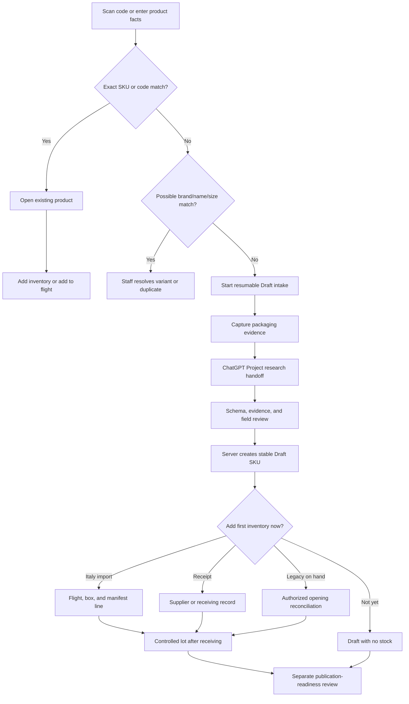

# K2 Jimzon Operations Logic and Workflow Rulebook

**Taxonomy authority evidence:** Match the complete captured permission model before using a local taxonomy refusal to justify a product grant change. RLS rules, table/column grants and inherited role authority are separate evidence. Synthetic native claims do not prove hosted JWT/PostgREST/BFF behavior. The owner-only PG17.11 fixture differs from retained K2 17.6 taxonomy grants; its 17-check refusal diagnostic is not a live failure or readiness receipt. Preserve captured authority and qualify genuine composition under MAP-018; no automatic grants or relaxed admission guards. Evidence: docs/acceptance/DUMMY_PRODUCTION_ACCEPTANCE_20261009.md.

**Policy/stock evidence scope:** Record physical custody separately from current sellable eligibility. A later stricter shelf-life policy may make units ineligible while leaving their physical quantity intact; a stored intake-time stock projection must not substitute for current public eligibility. Qualifying policy entry requires actual advisory holder/waiter modes and genuine signer-minute separation, not a rate-row wait. Local185/0 imported-policy witness is scoped to four added schedules and preserved rows/receipts; broader writer/provider/hosted guarantees remain MAP-018. Receipt: docs/acceptance/DUMMY_PRODUCTION_ACCEPTANCE_20261009.md.

**Combined installer evidence scope:** Qualify imported continuation inside one exact fresh/replay envelope before any activation. Rollback/recovery/replay must compare every original row and both sequence states; successful-install conservation may allow only an absent-before, explicitly checked evidence-bucket addition. Keep full metadata/function authority comparisons and original timeout limits. Passing owned PG17.11 proof does not qualify actual provider authority, transport, through-commit protection or hosted behavior.102/0 local receipt: docs/acceptance/DUMMY_PRODUCTION_ACCEPTANCE_20261009.md; remaining work MAP-018.

**Imported review and supplied-photo authority (IDEA-20261007-01/-12):** Use the same package evidence/checklist/detail approval before stock. Imported identity/version and original facts are server-owned; selection is not approval. Merge only present, explicitly accepted facts, keep absent/rejected details and original SKU/photo/import history. Accepted origin must stay coherent in both intake and spreadsheet origin fields. First null brand/category assignment resolves existing taxonomy; non-null reassignment is refused. Optional content advice must visibly show possible mismatches/unknowns while staff decides each field. Imported AI image claims and attachments must refuse at the locked authoritative command and before paid/storage effects; supplied photo URLs are never fetched by this advice path. On version conflict, reload the same current UUID/SKU and start a fresh review with no prior photos/decisions. Pending or uncertain commands retain their exact reviewed payload and receipt key. These are required rules; local evidence never substitutes for provider/hosted acceptance.

**Protected metadata lock scope:** Explicit Access Share through commit can block the observed RLS alteration within captured SELECT authority, as locally demonstrated by diagnostic04. This does not establish ACL, role or managed-setting stability. Require separate independent mutation qualification and complete recovery before accepting broader concurrency guarantees.

**Postcondition/commit concurrency:** A passing final metadata check does not prevent a privileged mutation before commit when the relation is unprotected. Instrumented postcheck03 reproduces owner RLS drift commit followed by installer success/commit. Require protection through commit and genuine concurrent qualification within captured authority; do not relabel this as immunity or silently substitute a maintenance-only target. Preserve exact fixture recovery and original production package separately.

**Connector receipt semantics:** Native SQL notices and a connector success flag are not durable atomic receipt evidence. Inspect the actual tool/API transaction boundary and independently reconcile complete postconditions and exact migration-history identity after ambiguous outcomes. Preserve no-auto-retry and do not assume an inner COMMIT is atomic with provider-added bookkeeping.

**Project execution binding:** A package project-ref declaration and a successful read-only query prove different scopes. Actual installation must bind the exact reviewed payload to the intended connector project at execution, retain owner approval and unknown-outcome recovery, and verify atomic receipt/postconditions before any retry. An executor for an older migration cannot qualify a different prepared package.

**Post-cold authority:** After historical restore and normal managed restart, use a separate actual non-superuser connection to compare complete captured roles, memberships, event bindings and managed settings before accepting recovered authority. Full schema/row/locale equality and successful restart alone cannot substitute for that witness. Preserve original timeout and owned-runtime identity guards.

**RAM fixture capacity:** Verify and fully extract every official image layer before retiring only its no-longer-needed guest copy; preserve original host layers/source/overlays. Measure actual statfs capacity and distinguish an unavailable df root listing from database ENOSPC. Diagnostic unavailability must not stop an otherwise valid test. Keep SQL, permissions, timeouts and memory unchanged when qualifying this correction. Cold schema equality does not substitute for a separate post-cold global/managed authority witness.

**Historical extension bootstrap:** Current managed delegation may assign a different owner from captured historical creation. An owned fixture may restore historical objects during its initial bootstrap before loading managed settings, then remove temporary actors and restart with complete captured configuration before admission/actual installer. Require exact resulting owner/full contract/locale and unchanged non-superuser installer authority. Qualify full guarded replay/committed rows/cold recovery independently; individual content calibration is insufficient.

**Expression and ownership reconstruction evidence:** Displayed constraint SQL may expose implicit casts that become explicit when reparsed. Inspect the actual captured expression tree and reproduce ordinary source syntax, then require exact resulting metadata. Canonical presentation may follow immutable captured identity order only while retaining every actual value and unknown entry. Verify extension owners immediately after creation/transfer; a temporary actor or successful REASSIGN command does not prove that actor owned the delegated objects. Keep actual installer flags/memberships unchanged and refuse remaining historical owner differences.

**Historical baseline reconstruction:** A logical dump may omit dropped-column ordinal gaps and preserve an expression that reparses differently, while current managed extension creation may produce a different owner from historical state. Use ordinary fixture DDL with explicit source provenance; do not edit system catalogs or normalize differing fields out of admission. Captured live ordinal equality does not establish historical dropped names/types outside that contract. Record partial layout/locale/row evidence separately from a refused complete baseline. Keep the actual installer non-superuser and captured authority unchanged.

**Concurrent barrier evidence:** Observe actual installer backend/lock mode rather than assuming a requested SQL lock is already reached. A protected-platform metadata change committed during an observed relation wait must refuse before payload and preserve original rows; fixture recovery must match the complete original catalog. Record the refusal boundary and actual lock JSON. A passing after-barrier comparison does not establish protection against arbitrary privileged DDL after the final check; keep that qualification open until separately proven.

**Committed original-row conservation:** For a successful installer/replay, compare every original column of all88 restored tables and both original sequence states before installation and after commit/replay. New columns may have their declared defaults; they must not conceal changed original values. The existing accepted projection excludes only the explicitly created storage.buckets row id product-intake-evidence; do not broaden exclusions to make comparisons pass. Keep observer credentials separate from the actual non-superuser installer connection and print hashes rather than private row data. Cold catalog equality alone does not establish this committed-row invariant.

**Authority-compatible barrier candidate IDEA-20261009-07:** The optional qualifiedPlatformBarrier path accepts only the pinned bounded payload (SHA256 7c7e96cc81aa6535976ddf447355fd707fbe3392e7e5b2f79866abe814afd1fb), locks the other81 captured tables, and preserves complete before/after checks for seven unchanged platform tables lacking the required lock privilege. Any changed protected metadata, missing record or different payload must refuse. Do not broaden grants or use superuser. Source checks alone do not qualify concurrent drift behavior or a live provider. Runtime acceleration may change without changing the SQL timeout; distinguish sandbox accelerator denial from actual-host availability.

**Authority capture ordering:** Exact admission must compare every role flag, complete membership tuple and event binding. Query presentation order may follow immutable captured identity order, but must retain unknown/extra rows and all actual values so changes still refuse. Do not rewrite capture values, drop comparison fields, fabricate memberships/hooks or normalize physical metadata to make admission pass. An owned RAM fixture may rebind only its explicitly checked local database target while preserving all version/role/directory/socket guards; production target/project guards remain unchanged.


**Reference-seed candidate IDEA-20261009-05:** Bounded installation must retain the pinned source/version/all43768 geography rows, original order and parent/region dependency availability; keep table/FK/RLS/ACL/function/transaction and statement timeout unchanged. Admit only the exact known original insert, refuse changed/repeated source. Candidate acceptance requires actual complete reference values/count, unchanged original rows, exact resulting metadata and raw rollback; focused string checks alone cannot establish native/provider/production behavior. No accepted historic evidence is overwritten.


**Catalog witness context:** Before/after/rollback schema fingerprints must use the same session search_path and serialization context. SET LOCAL disappears on rollback and may change regtype/definition qualification without proving schema drift. Repair the witness context and rerun the exact comparison; do not normalize away differing metadata or claim recovery from a failed comparator. A longer diagnostic timeout does not qualify the original production timing contract.


**Optional runtime components IDEA-20261009-03:** Unused extracted GUI bundles may be retired only after every file matches a retained archive by length/SHA256, no active process or caller depends on them, and required command-line components remain byte-identical and executable. Preserve all database data/backups, archive and CLI bin/lib/share. Recovery extracts only the recorded GUI prefixes into a separate destination; do not overwrite an existing database runtime. Storage maintenance never establishes database/provider acceptance.


Local provider preparation must use the genuine package configuration needed to retain captured settings, including legacy aliases where the shipped module requires them. Prove actual loaded values and non-superuser hook behavior; keep exact admission/refusal guards. A local alias correction does not establish that the alias was captured in production or qualify every managed setting, extension, event, locale or recovery behavior.

**Prototype seeder retirement IDEA-20261009-02:** Do not recreate invented stock/paid/shipped orders or broad order deletion through an environment-selected bootstrap. The obsolete root seed-database.js is retired. Synthetic facts belong only in explicitly owned local rehearsals using the canonical inventory/order contracts; real counts/custody/approval remain required for actual stocking and selling. Git recovery preserves inspection history, not permission to run the retired helper against provider data.

**Storage maintenance IDEA-20261009-01:** Keep source, operational records, accepted proof/source pins, recovery baselines, required media/workbooks and active runtimes. Remove disposable generated output only with recorded scope/reconstruction. Redundant upstream tool-source checkouts may be removed only after confirming no authored changes or linked worktrees, no installed-skill/configuration dependency, and recording recoverable upstream/commit pins. Large immutable evidence may use transparent compression when every original filename/length/hash remains readable and verified. Do not remove a referenced capture merely because it repeats bytes; do not create another archive per minor edit. Reuse accepted proof and consolidate batch receipts. Record incomplete cleanup and exact next action in its owning MAP item; storage preparation never proves provider, deployment or real inventory acceptance.

Provider qualification must retain actual managed DDL capabilities as well as
roles and object grants. Supabase's supautils policy/drop-trigger grants, reserved
roles/memberships and session preload determine operations available to the
non-superuser migration account. Capture and bind these authorities; never make a
local failure pass by granting broader staff access, replacing genuine hooks or
claiming role/catalog equality proves full provider equivalence. A missing local
managed module is a rehearsal dependency, not proof of a production defect.
The provider installation generator must require a complete reviewed managed
settings capture and compare its exact values before replay, after the table barrier
and after DDL. Read-only settings acceptance cannot replace actual hook execution,
full installation, recovery or hosted operational proof.

Moving a preserved baseline into another owned runtime must verify all table rows
across the transfer and retain the original. Atomic restore/data equality does not
prove captured ownership/grants or complete production recovery when those were
omitted. Record locale/provider/version differences explicitly and qualify them
before treating the new baseline as a provider-equivalent installation target.

Provider qualification must use the actual major/minor server version and complete
role capability/membership profile, including a non-superuser migration account.
A fresh role fixture with matching flags does not establish matching database
locale, managed objects/extensions/events, grants or recovery. Preserve each scope
explicitly; never substitute a fake extension/version or weaken production guards
to make a local fixture pass. Real stock facts are unnecessary for this preparation.

Provider preparation must carry an exact captured legacy permission contract
through every later consumer of that same function. Admit only named captured or
explicitly staged tuples; retain full body/owner/configuration/signing/actor and
metadata-preservation checks. Existing intentional migration restrictions still
apply, including removing browser access and closing the legacy finalizer.
Do not reinterpret a public-permission fixture installation as managed/private
authority, deployment-user capability, data recovery or hosted workflow evidence.

Financial verdicts must retain current database Admin/SuperAdmin authority through
transaction completion. Acquire the shared maintenance lock, then hold the actor's
profile row before financial receipts or order locks. If a role downgrade obtains
that row first, wait and recheck the committed role before proceeding. A signed
request or a permission check made before an order wait is insufficient. Keep
non-financial Staff workflows and existing payment/stock/history rules intact.

Provider compatibility admission may recognize an exact captured legacy ACL tuple
when the restored baseline omitted it. Preserve current grants; do not grant new
access or broadly ignore privilege differences. Keep identity/body/owner/security
checks and metadata-preserving postflight intact. An observed later migration
refusal proves progress through preceding boundaries, not whole installation,
real operational authorization or every-row preservation. Record its exact cause
and keep the owning launch item active until complete proof.

Reusing accepted migration contents under provider admission must preserve exact
function-default authority. A reviewed installation may isolate the captured
service-role default EXECUTE addition for fresh public functions within its one
transaction, allowing only intended explicit function grants; restore the exact
original default before postflight/COMMIT. Do not change existing object grants
or unrelated defaults, and refuse unexpected default metadata. Rollback must
restore all transient privilege changes on failure.
Reusing accepted migration contents under provider admission must preserve exact
source order, operational guards and original-fact/seed decisions. Replace only
the reviewed local installation envelopes with the complete provider guard;
unwrapped contents are never a standalone production installation artifact.
Production installation must preserve captured provider-owned roles, ownership,
grants at table, column and function scope, default privileges, extensions and
event triggers, including provider-managed type/index owners. Use distinct reviewed
before/after contracts and recheck global authority
after table admission and after DDL; never infer fresh/replay acceptance from a
wrong-target refusal. Project binding belongs to the reviewed execution connector.
An owned-local restore
with matching function definitions does not prove equivalent provider authority.
Read-only admission must bind the connector project and exact reviewed catalog;
refuse drift rather than weakening comparisons. Admission is not write approval.
Dummy facts remain sufficient for local preparation; actual inventory facts gate
live selling only. Exact provider installation/recovery requires its own rehearsal
and the owner's consolidated live authorization.

Historical Website orders without their canonical snapshot cannot obtain new
ownership commitment, packing or handover, or upload new payment proof. Preserve
safe historical tracking, cancellation, financial failure/refund and existing
request-key receipt access. A saved receipt is history, not renewed collection
permission. Native new uploads require payable open status, final charge and
awaiting-instructions/evidence-submitted/failed payment state. Initial checkout
reservation may use the existing private original-INSERT construction context;
historical metadata cannot grant that authority. Existing covered holds and saved
completed outcomes may return unchanged without creating stock/payment authority.
N joined dummy proof verifies physical/held conservation and a new canonical
quote-to-handover path locally; provider and full rendered workflow remain separate.

Payment verdicts (verified, failed, refunded) require current Admin/SuperAdmin
authority at both the staff API and the signed native command. Recheck financial
authority before returning a saved verdict receipt and before a same-status setter
return. Staff retains permitted operational payment actions. Failed/refunded orders
retain recorded money, evidence and history; a refund is not proof of a physical
return and must not automatically restock merchandise. N is locally verified with
historical dummy orders without holds; deployment and complete held-stock lifecycle
verification remain distinct.

Customer payment instructions require a fresh authorized order read and a final
charge. Historical Website orders without a canonical delivery snapshot require
staff review: show no finalized bill, QR, receipt upload or express approval.
Retain recorded amounts/payment history, original command receipts, references and
messages; never manufacture historical acceptance. Failed or superseded reads and
order-scope changes cannot restore cached payment authority. Cancelled orders offer
no payment QR. Direct conversation receipt upload additionally requires that same
conversation's current final-charge projection and payable order/payment status.
Prepared M readers retain all database facts and identity/rate/ACL controls; local
verification and provider application remain distinct.

Required legacy payment closure must also allow authorized new checkout to finish
its items, totals and canonical delivery snapshot in one transaction. A historical
metadata edit must never manufacture that construction authority. Never invent
legacy acceptance or reopen positive payment to make a new-order test pass.
New Website insertion registers private order/backend/transaction construction
authority; deferred final-snapshot validation removes it. No API caller may create
that marker. New positive payment remains prohibited before snapshot. This boundary
and ordinary checkout are locally verified in L07; provider/live acceptance remains.

Guarded category configuration deactivation is an intake/public-availability pause:
public stock and fresh purchases fail closed until restored. Preserve stored stock,
holds, accepted money/history and current-authority saved receipts. Recovery must
change only reviewed config; after restoration a fresh order holds stock once and
an exact retry adds no hold. Composed dummy HTTP proof is local only; this is not
provider activation or permission to trust unresolved historical delivery charges.

Recovery must retain physical stock, holds, accepted charges/payment/history and
saved command receipts. Compare logical owner/ACL/guard authority and sequence
counters as well as every row; raw PostgreSQL object identifiers can differ after
restore. Saved retries require original command bytes and current authority.
Dummy populated archive recovery is locally verified; provider/offsite/storage
media and activation/roll-forward acceptance remain required before live approval.

Staff cancellation requires a fresh authoritative order version, explicit reason
and review. Persist the exact actor/order command before sending and serialize
retries. A pending cancellation must remain reachable even if its order leaves the
active queue. Queue absence is not proof of success. Permission/network/malformed
outcomes retain uncertainty; only native receipt or post-receipt-lookup version/
eligibility refusal resolves it. Late responses must never affect another staff
member. The cancellation receipt does not constitute a refund or current payment
verdict. These recovery controls are locally implemented with dummy browser evidence.

Delivery quotation, buyer approval and cancellation must serialize on the order.
Approval of a superseded quote refuses; an approved amount cannot be requoted.
Cancellation releases each active stock hold once and preserves any earlier buyer
approval/history. A saved approval retry may return its historical receipt after
cancellation; it never reopens the order or creates payment permission. Native
dummy concurrency is verified. Staff cancellation API/recoverable form and native
local HTTP connection are verified; provider/host acceptance remains unfinished.
Require current Staff/Admin+
AAL2/session, explicit reason and reviewed order version; exact actor/key/payload
receipt precedes fresh checks, with current authority still required. Cancellation
preserves payment status and never constitutes a refund. Shared maintenance entry
precedes role/signing/order locks.
Local HTTP acceptance verifies lost-response exact retry, single release and retained
charges/payment/history; session validation legitimately updates last-seen/security
nonce/rate counters before a business refusal. Such activity never proves order or
inventory mutation. Combined current/cold installation is locally verified only;
activation stays closed until populated recovery/provider/host/live approval gates.

**Manual express J target/preparation, 8 October (MAP-023):** Current staff quote
must record route, package, quotation time, availability/proposed timing, source
and expiry. Buyer must accept their own exact current quote version and proposed
full total. Staff approval checkbox cannot replace buyer acceptance. This is not
booking or guaranteed dispatch. Keep original snapshot/history; no positive
payment before native acceptance. Native authority is now prepared and scoped
locally verified with dummy orders; connected UI/host acceptance remains unfinished.
Customer confirmation/account approval is now connected locally: show proposed
full total and expiry, require explicit review, persist the exact approval identity
before HTTP and retry it after an uncertain response, including after a refreshed
accepted status. Do not reuse another account's history or approval after switching
identity. Synthetic customer proof is recorded in delivery README; staff/combined
native HTTP/host acceptance remains unfinished. Staff form now connects locally:
blank observed courier/fee/facts, explicit Manila-time quote and expiry, reviewed
evidence/current version and actor/order-scoped exact retained command before HTTP.
Unknown publication survives close, reload and permission refusal; changing staff
identity cannot consume it. Confirmed native receipt or post-lookup stale/ineligible
refusal resolves the hold. Staff checkbox reviews quote facts only; buyer acceptance
remains separate. Local synthetic evidence/recovery: delivery README.
Dummy readiness needs no real counts;
real inventory facts are required before live products become sellable.
Staff quote holds current role and order; buyer acceptance holds current account/
grant and readable order scope, rechecks link expiry after any order-lock wait,
and clears the transaction-bound signed context before commit. Acceptance fixes
fee/total/time from the latest unexpired quote and original frozen basket, keeps
original pending evidence and never changes physical stock. Saved receipt requires
current ownership/scope before disclosure. Staff reads private observed facts with
AAL2; customer proposal omits staff/evidence/route details. Explicit accepted zero
fee is valid; an unpriced bill stays unpayable. Local evidence J05/readerJ01 and
recovery limits are recorded in authoritative-delivery README; no live activation.


**8 October pending-reader correction I (MAP-023, scoped locally verified):**
Shared charge-state projection hides provisional totals/shipping in guest/account
and Admin readers; pending bills stay in queues. Customer account, confirmation
and staff views distinguish pending from accepted totals. Positive payment choices
and direct receipt upload require final charge/instruction state; refunds remain.
Source review corrected unknown Delivery: Free label and found no remaining
Critical/Important issue. Existing guest/account/Admin/export API proof is retained.
Native reader rehearsal green01 passes15/0, preserves every business row on apply,
rejects other-account access/invalid signing/drift, removes its clone and preserves
all88 original tables. Local PostgreSQL runtime stopped. This proves focused
signed guest/account projection, not canonical E composition or conversation calls.
Nine distinct payment browser cases pass on final application source: run85626
had8passes and one ambiguous desktop status-selector failure; corrected selector
plus phone/desktop pending captures pass3/3 chunkab154c.375/1280 screens inspected,
no overflow. Account claim/history/reply journey passes1/1 chunk17561a with accepted
1234.50 and pending735 hidden. Existing fixture launchers avoid full workspace
watching; papaparse prebundle fixes confirmed missing-export blank-screen failure.
Previous runners50478/5604 explicitly stopped only verified local test processes;
no live handles remain. Exact reader SQL prepared/unapplied10142bytes SHA256
8f78f0374f0f7c260ce3a252529af7303f1122b6467bf01afa1bf6d1a4b2771c;
accepted E unchanged. No provider/deployment/real inventory claim. Remaining:
conversation/direct receipt and canonical E/legacy/combined install-recovery proof,
manual express quotation and explicit buyer acceptance, then authorized release.
Activation remains closed; recover by data-retaining roll-forward. No broad rollback
or inferred historic acceptance. Dummy readiness continues; real facts only at
actual launch acceptance. MAP-023 remains active for its complete outcome.


**8 October customer-rate control H (MAP-023):** Authorized Admin/Staff maintain
customer standard charges independently from the older Admin-only carrier-cost
pilot. Read current version; review four regional rates, reason and evidence;
publish signed integer-centavo/gram fields with expected version. No assumed
first rates. Unknown publication persists its actor-scoped exact command before
HTTP; reload/permission refusal/head read cannot discard it. Serialize retries,
stop queued retries resolved elsewhere, and retain unknown commands across actor
changes. Only confirmed receipt or native after-lookup stale-version refusal
resolves the hold. Refresh and deliberate renewed review follow stale refusal.
Read failure after success blocks further editing without undoing publication.
Existing accepted charges stay frozen. This is locally prepared/synthetic-screen
verified only; manual express, native HTTP/host/release remain essential.

**8 October restart continuity G (MAP-023):** Persist the exact uncertain order
identity/payload before HTTP. Reload, browser close/reopen and same-origin tabs
must reuse it. Serialize submissions and terminal consumption under one browser
lock; queued retries retain the identity captured when clicked. Invalid or
unavailable persistence refuses before submission. Never expire an unknown result
or start a new key from a stale retry. Terminal receipts remove contact payload
and exclude bot/grant/provider secrets. This closes scoped synthetic browser
restart proof only; clearing browser data, cross-device/native/host recovery and
coordinated release remain MAP-owned.

**8 October rendered delivery/retry rule (MAP-023):** Use canonical SKU quantities
and complete public PSA area paths for delivery preview. Standard/pickup require
explicit review of the current server quote; input changes immediately invalidate
acceptance. Coalesce address typing rather than spend a quote budget per key.
Express remains unpriced with no payable total or receiving QR until approval.
An uncertain submission retains its exact payload/key. Pre-receipt security/rate/
COD/validation failures and cart/coupon/contact navigation cannot discard it;
only an authoritative post-receipt no-commit outcome unlocks correction.
This has scoped synthetic rendered evidence; full reload/close recovery and
native/host/staff express acceptance remain required before launch.


**8 October accepted order delivery (MAP-023):** Fresh Website orders must
recompute canonical delivery under the existing product/inventory locks and match
the standard/pickup quote identity/version reviewed by the buyer. Never copy a
browser fee into a fresh order. Save immutable charge/request/time evidence;
generic writes cannot alter accepted address, basket or monetary facts. Permit
unchanged-fee tracking without rewriting acceptance time. Pending express has no
payable final total and cannot advance to payment instructions; an internal zero
placeholder is not free delivery. Exact historically priced retries preserve
their saved terms. Unsnapshotted history is not proof of buyer acceptance and
requires remediation/activation closure before launch. Scoped local backend
verification does not activate the rendered or manual express workflow.

**8 October canonical customer preview (MAP-023):** A Website delivery preview
accepts only service, canonical SKU quantities and a complete versioned PSA
destination path. Calculate weight and customer charges in the database; reject
browser weights/prices and unknown geography. Measured shipping grams remain
nullable; canonical quantity/packaging estimates must be labelled estimated.
Pickup is zero without shipping weight/address; NCR express is pending with a
null charge, never free or booked. Public address lists contain reference labels
only and do not assert courier coverage. A preview neither reserves stock nor
records buyer acceptance. Order submission must recompute and preserve the
reviewed charge snapshot; express acceptance/payment guards remain essential.
These are target rules with scoped local backend evidence, not deployed behavior.

**8 October customer tariff authority (IDEA-20261002-03 / MAP-023):** Customer
J&T tariffs are separate from carrier-cost pilot rows. Authorized Admin/Staff
changes require AAL2, maintained signatures, expected version, reason/evidence and
an immutable actor/time receipt. Keep a complete four-area matrix; zero courier
fees, malformed values and guessed area fallbacks refuse. Integer centavo/gram
calculation rounds started extra kilograms and the final charge upward, using
overflow-safe intermediate arithmetic. Saved retries return their original
version before checking newer rates. Future standard stays empty/inactive; no
production rate or identity is inferred from a fixture. Rate history survives
recovery. This is required target and scoped local preparation; connected order
validation, accepted-charge guards, express acceptance/payment gating and live
acceptance remain MAP-owned. Dummy facts are sufficient for software preparation.

**8 October guest installation/recovery rule:** apply the reviewed correction as
part of the coordinated exact-contract package; the standalone fragment is fresh-only.
Replay must preserve rows and secure definitions. Recovery may close fresh commands
by guarded config deactivation while retaining saved receipts and all orders/holds/
nonce proofs; roll forward exact config after review. Never erase reservations or
restore vulnerable signing. Named local waits/recovery are verified in the Brain;
complete all-writer/provider/real operation qualification remains MAP-owned.

**8 October guest category-stock contract (IDEA-20261002-05):** eligible signed
guest purchases use private transaction-bound guest authority; customers need no
staff login. Staff contexts retain staff/AAL2 checks. Only successful signing writes
nonce backend/root bindings; replay never refreshes them. Fresh checkout takes
policy entry, coupon, sorted balances, products/listings and sibling lots before
one context clock. Stock lifecycle commands cooperate with balance-before-product
locks. Saved receipts skip fresh config/stock while entry limits still apply.
NULL guest actors must clear correctly; failed commands are atomic. Dummy products
prove software readiness now; verified facts/counts are required for real selling.
Scoped local evidence is in the System Brain; activation remains MAP-owned.

**8 October guest signing/invitation rule (IDEA-20261007-04):** Reject missing timestamp, nonce, IP hash or signature before hashing/time checks; NULL action/payload also refuse. Signature comparison must fail closed. Preserve maintained signing bytes, nonce replay and delivery_quote. Invitation helpers remain service-role-only. Apply forward corrections after historical verifier replacements. Recovery deactivates callers or rolls forward; never restore vulnerable bodies/browser invitation grants. Local evidence is recorded in the System Brain; no live behavior is asserted.

**7 October guest signing defect reproduced locally (IDEA-20261007-04 / MAP-017/018/020):** Source review of34 ordinary anonymous ACL definer candidates identifies NULL-sensitive signing rejection and missing delivery_quote in the latest guest action allowlist. Native probe01 terminal71066/native88/0 and primary139/0 reproduces NULL signature/time/IP admission on both populated/cold full05 clones, with nonNULL forged denial and replayfalse controls. Full132 metadata/row maps and synthetic key/nonces rollback exactly; clones removed/original88 unchanged. This is a defect receipt, guestSigningSecure=false; no public wrapper/JWT/HTTP/provider exploit or corrected-security acceptance. Independent probe review has no Critical/Important implementation defect. Invitation helper source migration explicitly revokes public/anon/authenticated and grants service_role: broader composed ACLs require fidelity/cutover correction, not invented actor semantics. Legacy raw chat/order entries still need coordinated disposition. Owned19716 stopped0 after zero clients/clones, noPID/process/listener. IDEA04 accepted/merged into existing MAP dependencies; minimal fail-closed verifier/source/forward-recovery and composed grant/action compatibility corrections remain unimplemented. No provider/stock/listing/main/release change. Evidence: docs/evidence/20261004-category-shelf-life/foundation-qualified-schema-guest-signing-null-probe01/primary-readback.json and current-ordinary-definer-review.json; exact next and recovery in MAP.


**7 October native ACL/resource reconciliation qualified offline (IDEA-20261007-03 / MAP-017/018):** Existing --current-full05 inventory now pins the native supplement and default guarded full target, verifies identical logical before/after states, and reconciles all function/schema/table/column/sequence predicates for anon/authenticated/service_role.4564 checks pass/12 source pins verified;435→696 function-role pairs and303→459 relation-role pairs, including column grants combined with table ACLs and distinct sequence privileges. Native RLS/forced-RLS and event/index/operator/support/incident-dependency captures are retained for classification. No anonymous direct table/column/sequence write ACL candidates occur in these snapshots; this does not establish function/RLS/body/HTTP authorization. After-state38 anonymous definer writer candidates divide into34 ordinary-return and4 trigger-return functions; they are not38 callable mutation endpoints.49 C bodies remain opaque, five functions contain dynamic SQL and all semantic/native execution/all-writer/provider acceptance remains false. Initial observer comparison failed because JSON property order differed; corrected structural comparison passes without an ACL mismatch. Independent review: zero Critical/Important/Minor. This batch performed no runtime/provider/stock/listing/main/release operation. Evidence: docs/evidence/20261004-category-shelf-life/current-full05-writer-resources.json and current-full05-writer-resources-readback.json. MAP-018 retains semantic/resource/admission and missing schedules/recovery/provider/real-host/source-facts acceptance.


**7 October event binding guard integrated and locally qualified (IDEA-20261007-03 / MAP-017/018):** Normal full builder now supplies the exact global event-trigger binding guard by default; qualified native expectations are pinned, never silently rebaselined. Full-coordinated-event01 terminal2482/native121/0 and primary378/0 validate109 source pins/46 capture pairs,65 raw/server stages22 operating fragments, two fresh installations, three exact replays, eleven schema drift refusals, actual interruption/backend closure/full rollback, effective2s/10s and changed/no-op stock refresh. Guarded package bytes equal remaining01; every executed DDL fragment hash equals full05, retaining its original-row correction evidence/row03. Remaining01 terminal47987/native109/0/primary193/0 reuses prior116/0 cases and proves owner/ENABLE REPLICA/ENABLE ALWAYS refusal plus actual fresh-fragment binding drift reaching the post-DDL guard and whole rollback on both clones. Transactional synthetic owner role is absent afterward. Both runs remove clones/preserve original88; owned28036 stopped0 after zero clients/clones/fixture roles, noPID/process/listener. Independent source/archive review found no Critical/Important/Minor and verified109 source pins/46 captures; runtime shutdown is parent-verified. Historical row/writer modes still reuse their pinned unguarded packages; this is evidence reuse, not canonical installer guard omission. Current helper SHAa49694daae6e440c7eb640f183ef2e743b4128041b9194e72cf34a9326463837; derived witness SHA22ffc533c6c6f585bf33e332b2217115ac47aebc2b48fdb084aab7e299a23eaf. Privileged concurrent catalog DDL/all-writer/operator/native dispatch/populated recovery/provider/HTTP/real-host/full inventory-listing remain open. No provider/stock/listing/main/release change. Evidence: docs/evidence/20261004-category-shelf-life/foundation-qualified-schema-full-coordinated-event01/primary-readback.json, runtime-shutdown.json and foundation-qualified-schema-full-event-guard-remaining01/primary-readback.json.


**7 October optional event-binding guard locally qualified (IDEA-20261007-03 / MAP-017/018):** operatingReplayPackage now optionally checks exact global event-trigger name/event/enabled mode/tags/owner/qualified function binding at initial admission, after the fresh table barrier and after DDL. Calls without the option retain byte-identical full05 packages. Full builder --event-guard-only pins four prior native binding captures. Red01 terminal36355 exit1/native84pass1fail proves the old helper accepted disabled-trigger fresh installation; complete rollback/cleanup retained. Green01 terminal24469 exit0/native116/0 and primary225/0 proves current/cold fresh acceptance, exact replay no-op and disabled/missing/extra/tag/function-binding drift refusals with whole map/event rollback. Source review: zero Critical/Important/Minor. Both clones removed/original88 retained; owned20164 stopped0 after zero clones/clients, noPID/process/listener. This optional local guard is not yet the default full composition or a provider payload. Owner changes, ENABLE REPLICA/ALWAYS and fresh-fragment postcondition drift still need direct native evidence; source comparison alone is not acceptance of those branches. Privileged concurrent catalog DDL/all-writer/recovery/provider/HTTP/real-host/full inventory-listing remain unqualified. No provider/stock/listing/main/release change. Evidence: docs/evidence/20261004-category-shelf-life/foundation-qualified-schema-full-event-guard-01/primary-readback.json and runtime-shutdown.json; reproduction/recovery in WRITER_INVENTORY.md.


**7 October current writer/catalog supplement locally verified (IDEA-20261007-03 / MAP-017/018):** Existing writer inventory opt-in `--current-full05` retains all145/232 function and101/153 relation identities;12 focused checks pass. Completeness is limited to these identities: full captured object/semantic/all-writer acceptance remains false. Explicit owner ACL revocation is respected. New `supabase/prepared/current_writer_resource_capture.sql` and full-builder `--writer-inventory-only` capture bounded read-only Repeatable Read native privileges, six enabled event triggers, indexes/operator support and incident catalog dependencies before/after exact qualified05 installation on populated/cold owned clones. Native92/0 and primary1290/0 validate105 source pins/18 capture pairs/four supplemental captures; all435 before/696 after role-function ACL predicates agree with the candidate model. Indexes238→340, operators134→139, support65→67, dependencies2941→4569 are captured per state; these counts are not semantic closure. Every read-only capture preserves full fingerprints. Source review has zero Critical/Important/Minor. Both clones removed/original88 retained; owned17448 stopped0 after zero clones/other clients, noPID/process/listener. Six event-trigger bindings were previously outside the guarded logical/metadata contract; their function bodies are already captured. All six bindings/bodies are unchanged across four native states, with source classification in event-trigger-classification.json; their native capture does not yet add a binding drift guard. MAP-018 owns classification/guard disposition and missing execution/recovery schedules, followed by provider/HTTP/real-host/full inventory-listing acceptance. No provider, stock, listing, main or release change. Evidence: `docs/evidence/20261004-category-shelf-life/foundation-qualified-schema-full-writer-resources-01/primary-readback.json` and `runtime-shutdown.json`; reproduction/recovery in WRITER_INVENTORY.md.


**7 October fresh data correction locally qualified (IDEA-20261007-03 / MAP-017/018):** Executable full composition now omits only the two exact stage40 sample identity INSERTs and conditionally refreshes stage41 product stock totals when they actually differ. Preserve raw historical migrations; unknown or duplicate transformation layouts refuse. A changed value updates once/increments its version; repeat refresh touches no row/version. Full05 native115/0/primary555/0 qualifies corrected fresh/replay/drift/interruption and that rollback control. Row03 native96/0/primary494/0 preserves all original audited columns/counts/sequences on populated/cold88 clones and creates zero sample hubs/custodians. The intended private intake bucket is separately captured/checked; six channel rows/one AI control row remain explicit configuration additions. Real hubs/custodians still require verified owner facts; no live identity, inventory, provider or release change. Full current-writer/resource, populated operational recovery, provider/HTTP and real-host acceptance remain open. Evidence: docs/evidence/20261004-category-shelf-life/foundation-qualified-schema-full-row-effects-03/primary-readback.json.


**7 October fresh installation data-effects rule (IDEA-20261007-03 / MAP-017/018):** Schema/replay success does not prove fresh row preservation. Compare original-column row multisets, row counts, histories, signing material and sequence state; capture deliberate private-bucket changes separately. Local row-effects02 native92/0/primary517/0 finds stock/lot/balance/history/key values preserved, but blanket stage41 stock UPDATE changes30 product updated_at timestamps despite unchanged derived counts. Stage40 also installs three sample custodians and three hubs. Before provider preparation, avoid no-op product updates and remove unapproved sample operational identity seeding from the executable composition; retain raw migration/source evidence. Real custody and location records require verified owner facts. New private intake bucket is an explicit configuration addition, not an unchanged-row claim. No provider/stock/release change. Evidence: docs/evidence/20261004-category-shelf-life/foundation-qualified-schema-full-row-effects-02/primary-readback.json.


**7 October coordinated local installation boundary (IDEA-20261007-03 / MAP-017/018):** The canonical65 stages and operating22 fragments now compose into one exact-state guarded transaction from original88 current/cold states. Preserve raw pinned stages separately from executed server stages. Omit only three known first-line client directives; normalize only eleven known5s/30s migration timeout pairs to package2s/10s, rejecting changed layouts. Effective limits must be read from the installed transaction; an entry setting alone is insufficient. Fresh installation holds the complete canonical table barrier and rechecks the whole contract; exact replay retains installed state. Local archive04 native113/0 and primary549/0 qualify two fresh installs, three replays, eleven drift refusals and actual interrupted fresh rollback. This establishes owned-local installation preparation; current all-writer admission, permanent fresh data effects, populated operational recovery, same-target provider/HTTP and real-host inventory/listing remain unverified. No provider/stock/release change. Evidence: docs/evidence/20261004-category-shelf-life/foundation-qualified-schema-full-coordinated-04/primary-readback.json.


**7 October changed-helper complete guarded22 requalification passed (IDEA-20261007-03 / MAP-017/018):**
Guarded-install03 session41006 terminal0/native147/0 and primary527/0 qualify
current helper9f343f55e7cd54cdc7db377e29c1b18f70e2c411088d7086bfcb0d836fdbb0e8.
Two fresh current/cold installs preserve all128 prior row maps and add four empty
policy tables; three exact replays include populated config; eleven drift cases
refuse with full rollback. Actual fresh cold-DDL interruption reaches success body
beforeCOMMIT/PgSleep then backend closure restores full128 metadata/row maps.
108 source pins,50 capture pairs and exact whole current/cold contracts/package
checked. Original88 template unchanged, both clones removed; owned6892 stopped0
with zero clones/other clients and noPID/process/54388 listener. Frozen helper/
builder/witness bytes retained. Reuse fresh-barrier02 for two signed packing/DDL
orderings and timeout directions, and installed replay waits for their bounded
scope. Archive02 remains historical pre-barrier evidence. Parent readback only;
independent review still unavailable. All-writer,sequence-only/privileged schema
admission,coordinated65-stage installer/provider HTTP/real-host acceptance remain
open. This run uses separate65 prerequisite setup; no full installer or production
claim. No provider/inventory/release changes. Evidence: guarded-install03/primary-readback.json;
category WRITER_INVENTORY.md has exact reproduction/recovery.


**7 October fresh table cutover barrier locally verified (IDEA-20261007-03 / MAP-017/018):**
operatingReplayPackage now takes fresh-only ACCESS EXCLUSIVE locks on the exact
before-contract ordinary/partitioned tables in qualified-name order, then rechecks
the whole before contract before executing DDL. Legacy writers finish or roll back
before fresh installation proceeds. Locks release with the root transaction;
fresh maintenance intentionally delays reads/writes under2s lock/10s statement
limits. Exact installed replay returns before the barrier, preserving its prior
advisory behavior. Fresh-barrier02 session8398 terminal0/native125/0 and primary202/0
verify both genuine pre22 signed packing/fresh-DDL relation-lock orderings, both
55P03 timeout directions, whole baseline rollback and original-key recovery with
one packed unit/one scan/physical10/reserved1. Seven HMACs,110 pins and24 capture
pairs checked. Both clones removed/original88 preserved; temp signing backup
restored and disposed. Owned2744 stopped0 after zero clones/other clients;
PID file/process/54388 listener absent. Barrier01 native122/0 retained as earlier
ordering evidence. Failed fresh-waits03 remains the before-fix reproduction.
This is bounded local qualification; independent review is unavailable from the
agent usage limit. All-writer,sequence-only writers,privileged concurrent schema
changes,full coordinated65 installer/provider/real-host gates remain open.
Old archive02 package pins the historical helper; do not silently call it current.
Changed-helper full guarded22 requalification is now recorded above; broader
coordinated installation and writer gates remain open.
No provider/stock/release change. Evidence: foundation-qualified-schema-staff-fresh-barrier-02/primary-readback.json;
reproduction/recovery in category WRITER_INVENTORY.md.


**7 October fresh installation admission gap reproduced (IDEA-20261007-03 / MAP-017/018):**
Fresh-waits03 session66676 terminal1/native111pass0fail stops at
FRESH_WAIT_NOT_OBSERVED; diagnostic readback147/0 verifies110 source pins and16
capture pairs. A genuine pre22 signed packing root produced one unit while its
root transaction stayed open. Guarded22 installer reached K2_OPERATING_FRESH_APPLY
and ClientRead in an open transaction with no blocker, disproving assumed relation
lock exclusion. This failed qualification is not success or a provider incident.
Installer-first and recovery were not reached. Earlier01 failed seed23505 because
Auth already created the profile; fixture upsert/closed-session cleanup corrected.
Earlier02 connection refused before clone creation; owned2884 process/listener
absent with stale PID file; PostgreSQL recovered exact runtime with zero clones.
Final03 removed both clones and preserved original88; owned10696 stopped0 after
zero clones/other clients, no PID file/process/listener. Independent review agent
hit usage limit, so no review verdict. Fresh deployment requires coordinated
admission/cutover correction and full qualification; replay waits remain valid
only within their recorded scope. Evidence: category fresh-waits03/diagnostic-readback.json.
No provider/inventory/release change.


**7 October signed installer replay admission locally verified (IDEA-20261007-03 / MAP-017/018):**
Existing staff fixture and guarded22 builder now support --signed-install-waits.
Archive01 session93910 exited0, native266/0 and primary334/0: four actual schedules
observe signed ShareLock versus installer ExclusiveLock on the policy advisory
key. Writer-first commits one packing allocation before exact installation replay
preserves all maps; installer-first delays signed context admission then permits
one packing allocation. Installer55P03 timeout rolls back and exact retry has no
row effects. Signed writer55P03 timeout has no business/signing effects; after
installer rollback the original key/payload with fresh nonce confirms once.
Two functions, two tables/four types and one trigger are explicit test additions:
projecting only these out must equal the archive02 entire qualified contract.
The unchanged helper gates against the exact full instrumented contract. These
are synthetic installed-replay admission waits; fresh-DDL contention and all-writer
coverage remain open. Archive02 fresh/drift/interruption evidence is reused.
109 native source pins,22 capture pairs,5 HMACs and132 original table row multisets
checked; four immediate supplemental signing/validation source hashes retained.
Fixture metadata and original signing key restored, original88 template preserved,
both clones removed. Owned27128 stopped0 after zero owned clones/other clients;
PID file/process/54388 listener absent. Scoped independent review found no critical
or important issues. A report-only correction makes future mode scope strings
specific and adds four future source pins; exact inverse byte comparison adds one
primary check without native rerun. Frozen receipts retain their executed bytes.
No provider, stock or release change. Evidence/recovery: docs/evidence/20261004-category-shelf-life/foundation-qualified-schema-staff-install-waits-01/primary-readback.json
and category WRITER_INVENTORY.md.


Pre22 fresh-admission audit: archive02 beforeContract contains no policy helper or
function body referencing its advisory key. The three canonical signed fulfillment,
lot and Product Master roots lack that admission. Installed-replay waits therefore
do not qualify fresh cutover exclusion. This captured source finding requires
actual pre22 DDL/resource-lock and coordinated cutover qualification under MAP-018;
no unsafe provider incident is claimed. Exact hashes: install-waits01/fresh-admission-audit.json.

**7 October guarded22 installation locally qualified (IDEA-20261007-03 / MAP-017/018):**
After separate65-source canonical prerequisite setup, the complete22 operating,
taxonomy and staff fragments use the unchanged guarded exact-contract helper.
Archive02 session87344 exited0: native147/0; primary archive readback264/0 checks
108 source pins and50 metadata/row capture pairs. Current/cold before contracts
and after contracts match exactly. Two fresh installs preserve all128 prior table
row maps and add four empty policy tables; three exact replays include populated
config. Eleven drift cases refuse transactionally. An actual cold fresh-DDL
interruption reaches the fresh branch and PgSleep before COMMIT, then backend
closure restores all128 metadata/row maps. Original88 template unchanged and both
clones removed. Owned runtime23700 stopped0 after zero owned clones/other clients;
PID file/process/port54388 listener absent. Independent review found zero critical
or important issues; inherited IDEA-20261002-05 report label is historical, while
this disposition assigns IDEA-20261007-03. Diagnostic01's104/1 wrong CHECK-variant
expectation and the offline audit's nonexistent coldDatabase reference are retained
and explained; neither is a provider incident. No provider, inventory or release
change. Signed writer-versus-install, coordinated65-stage provider installation,
all-writer, populated operational recovery and real-host acceptance remain open.
Evidence: docs/evidence/20261004-category-shelf-life/foundation-qualified-schema-staff-guarded-install-02/primary-readback.json and WRITER_INVENTORY.md.


**7 October policy recovery maintenance admission locally verified (IDEA-20261007-03 / MAP-017/018):**
Both prepared policy-command deactivate/roll-forward scripts now take exclusive
maintenance admission before contract/config inspection, preserving existing
body/owner/ACL/depth guards and2s lock/10s statement limits. Maintenance01 native
259/0 and primary readback362/0 verify four actual writer-first/maintenance-first
advisory waits and a recovery55P03 timeout. Actual signed root retains ShareLock;
recovery waits for ExclusiveLock. Recovery held first blocks staff ShareLock before
context admission: roll-forward permits one packing unit; deactivation makes a
newly admitted confirmation refuse55000 K2_CATEGORY_POLICY_NOT_CONFIGURED with
full business/signing rollback. Writer-first recovery changes config alone after
writer commit; timeout preserves full maps and held writer rolls back. Physical10/
reserved1 and existing histories remain intact in successful packing/confirmation.
Original132 multisets/original88 template/key preserved, clone removed; owned23484
stopped0 after zero clones/other clients; noPID/process/listener. Five HMACs,115
source pins and15 capture pairs checked; this is local synthetic native evidence,
not independent/all-writer/provider/real-host acceptance. Operating13 SQL unchanged.
Archived generic deadline acceptance flag is explicitly disqualified for this mode.
A report-only builder correction separates maintenance from deadline receipts;
focused old/new byte comparison adds one check, with no native rerun. Immutable
native result and primary disposition are retained. No provider/inventory/release
change. The earlier bare22 assembly remains calibration-only. Guarded22 local qualification
is recorded above; writer-versus-install and broader activation remain MAP-018. Evidence/recovery:
category WRITER_INVENTORY.md and foundation-complete-composition-staff-maintenance-01.
**7 October joined native business errors locally verified (IDEA-20261007-02 / MAP-018/020):**
Existing --http-business-only fixture/builder mode passes terminal0/native271/0
and primary readback404/0 (113 source pins,15 capture pairs,14 valid HMACs).
Actual routed signed native receiver refuses stale payment version40001,
invalid transition23514, same-submitter Admin verification42501, wrong packing
allocation23514 and missing handover commitment23514. Ten HTTP409 denials include
an original-key/payload repeat of each with fresh nonce, exact safe code/no-store,
unchanged signed dispatch and complete business/signing rollback maps. This is
repeatable refusal without a poisoned receipt, not a successful corrected payment
or reconciled handover. Four genuine signed prerequisites remain synthetic.
Handover starts with an initial temporary allocation missing commitment evidence;
no signed historical commitment was erased. Native message is extracted separately
from full archived stderr to model PostgREST's message field for exact-code mapping.
Original132 row multisets/original88 template/signing key preserved; clone removed.
Owned22736 stopped0 after zero clones/other clients; no PID/process/listener.
Two offline audit assumptions failed (stderr whitespace, seed command index);
corrected only readback expectations, native271/0 reused without rerun. Final404/0
is primary verification, not independent review. Auth/registry/telemetry/SQL wire
adapter remain synthetic; provider/PostgREST/JWT and real-host/real operating
acceptance remain open. Operating13 SQL SHA2a6c8395084dc650e50a18638fd28429ea6b6f2e9ad538365e90f4f7d37d8895 unchanged.
Raw native receipt and primary readback live in category evidence archive
foundation-complete-composition-staff-http-business-01; exact command/fixture
recovery live in WRITER_INVENTORY.md. Full remaining work stays MAP-018.

**7 October Admin fulfillment request deadline prepared locally (IDEA-20261007-02 / MAP-018/020):**
Fulfillment read/seven commands now share a fixed30s application deadline from
handler entry. AsyncLocalStorage scopes cancellation to that request; Supabase
Auth/PostgREST and denial telemetry clients receive its abort signal. Expiry sends
503 REQUEST_TIMEOUT/no-store/Retry-After1, suppresses late response/status/cookie
writes and prevents later transport dispatch. Transport cancellation does not
prove transaction rollback: preserve original command key and reconcile/retry.
Existing fulfillment retained-operation logic recognizes REQUEST_TIMEOUT; no
browser changes. Installed-SDK synthetic Auth/profile/RPC stall tests, late-result
suppression and concurrent isolation pass5/5 final; full existing Admin BFF contract
suite72/72 before response-code correction,67 unaffected checks reused. Syntax/diff
checks0. SDK emits the expected abort diagnostic; no provider request/write was made.
Actual api/admin/index/router/fulfillment integration adds13 passing local cases:
valid command/read, stalled Auth/profile/registry/RPC/read/denial telemetry,
role/AAL2/revoked-session/body refusal and modeled late commit/same-key replay.
Real encrypted active cookies, CSRF and signed HMAC are exercised with synthetic
JWT/provider responses. Production30s callback is scaled to120ms in tests.
Five real loopback Node HTTP checks pass: valid response, deadline headers,
late-result same-key retry, client disconnect and unscaled30s budget(30.1s).
The first sandbox attempt refused three connections with EACCES; disconnect
fixture misclassified that error and timed out. Corrected ECONNRESET-only check
and normal-access HTTP reruns pass4/4 plus unscaled1/1. Provider replies/receipt
ledger remain synthetic. Local adapter parses body before handler entry.
Native deadline02 verifies committed-response loss and uncommitted connection
close with original-key recovery:254/0 native,241/0 primary readback,106pins/
15captures/4HMACs. Database settles165/184ms before the held250ms timeout.
Committed retry reuses saved receipt/context0/public rows unchanged; rolled-back
retry creates one allocation/context1. Both end physical10/reserved1/context0,
one503/no late cookie/success. Clone removed/original88 unchanged; owned3560
stopped0/noPID/process/listener. Operating13 SQL unchanged. Primary readback is
not independent acceptance. Joined HTTP-native01 now passes252/0 native and
251/0 primary readback(113pins/15captures/4HMACs): real loopback requests invoke
entry/router/Auth SDK and unchanged outgoing signatures into authenticated SQL.
Native profile role read; Auth/registry replies and SQL transport adapter remain
synthetic. Both503→200 original-key retries preserve one allocation; native
settles279/305ms before scaled500ms timeout. Saved retry context0/public rows and
receipt unchanged; rolled-back retry context1. Late native header/end suppressed.
Clone removed/original88 unchanged; owned9756 stopped0/noPID/process/listener.
Six-command HTTP-matrix01 now passes344/0 native and741/0 primary readback
(113pins/15captures/28HMACs/36balance checks): twelve committed/rolled-back
original-key503→200 retries cover payment, packing, handover, delivery, custody
split and box assignment. Payment/charges and delivery details persist; packed1,
handover physical9/reserved0, other SKU totals10 and lot/balance equality preserved.
Saved replays retain public rows/receipt; rollback maps match; fresh generated
child IDs need not survive rollback. Native settles343–402ms before scaled500ms
timeout. Original132 multisets/original88 preserved; clone removed; owned28024
stopped0/noPID/process/listener. Seven-command refusal02 now passes443/0 native
and472/0 primary readback:63 fresh plus8 hash-bound reused cases cover71 HTTP
refusals,14 native signature/conflict denials and57 BFF denials. All business/
signing maps remain unchanged;113pins/15captures/23 valid HMACs checked. Diagnostic
01's incorrect expected signature-error tag remains archived132pass/1fail.
Original132/original88 preserved; clone removed; owned21180 stopped0 with no
PID/process/listener. Native provider Auth/PostgREST cancellation, platform uploads,
broader payload/business refusals and exact-host acceptance remain unverified. This is local preparation with synthetic Auth/registry and SQL
adapter; primary readback is not independent acceptance. vercel.admin.json retains
maxDuration180; this does not establish a30s upload or platform execution bound.
Other Admin routes use unchanged transport unless inside this fulfillment scope.
Broad development/security/cleanup owner-parked; no deployment/activation follows.
Source/test/recovery details in category WRITER_INVENTORY.md; next work in MAP-018.

**7 October custody/handover conflicts locally verified (MAP-018 / IDEA-20261002-05):**
Corrected custody02 terminal0/native274/0/primary1027/0/105 pins/15 capture pairs
proves four actual transaction-ID waits across18:33–37 server minute buckets.
Nine available units transfer before/after handover with reserved lot ID retained;
physical sum/balance end9/reserved0. Competing six-unit transfer refusesP0001 and
rolls back all maps, retaining source4/reserved1 plus destination6. Selected-box
assignment to canonical Manila custodian retains allocation and permits handover
once. All132 original row multisets/signing key/operating metadata preserved;
clone removed/original88 unchanged/runtime stop0/noPID/listener0. Fifteen synthetic
HMACs audited; primary is not independent review. First01 terminal1/native136/0
assertions failed box handover because its unregistered custodian was ineligible;
that diagnostic is retained and is not passing eligible-destination evidence.
Only fixture custody IDs were corrected to CUST-STAFF-MATTEO with a native Manila
association assertion. SQL2a6 unchanged; prior passing schedules pinned/reused.
Harness360s accommodates four real minutes plus setup, per-command2s/10s unchanged.
Preseeded confirmed/verified inputs are not real funds/full-chain acceptance.
MAP-018 retains request deadlines/actual midnight/all-writer/provider/real gates.
Commands, scope and recovery: docs/evidence/20261004-category-shelf-life/WRITER_INVENTORY.md.

**7 October staff decision conflicts locally verified (MAP-018 / IDEA-20261002-05):**
Existing --decisions-only rehearsal passes terminal0/native274/0/primary1045/0,
105 source pins/15 capture pairs. Four actual order transaction-ID waits use real
18:16/17/18/19/20 minute buckets, excluding verifier rate-row masking. Two distinct
Admin opposing payment verdicts preserve the first decision; the second refuses
40001 K2_PAYMENT_VERSION_CONFLICT with full table-map rollback. Packing before
handover permits one physical move; handover before late scan refuses23514
K2_PACKING_ALLOCATION_INVALID/full rollback. Charge195 and cleared context retained;
handover physical10→9/reserved1→0. All132 original row multisets/key and operating
metadata preserved; clone removed/original88 unchanged/runtime stop0/noPID/listener0.
Operating SQL2a6 unchanged; prior serial/box/advisory/resource/conflict evidence reused.
Payment preparation uses genuine signed Staff evidence and independent Admin review;
packing schedules use preseeded confirmed/verified fixtures, not full-chain proof.
No all-writer/HTTP/provider/real-stock/listing acceptance. MAP-018 retains custody/
deadline/midnight/remaining writer coverage and pending Draft/guest decisions.
Evidence and recovery: docs/evidence/20261004-category-shelf-life/WRITER_INVENTORY.md.

**7 October operating-history backup verified locally (MAP-018 / IDEA-20261002-05):**
Existing qualified generator/runner now supports --staff-history-backup. History-backup01
terminal0/native147/0/primary355/0 proves a signed paid/packed fixture created BEFORE
custom backup, restored without reseeding: all132 table row maps and sequences exact,
232 functions/153 relations/324 types equal with only the recorded courier CHECK
parenthesis normalization. Two inventory events, five order events, one packing event
and five saved signed receipt hash bags match exactly; committed ownership, distinct
Staff/Admin funds review and accepted195 survive. Config deactivation refuses fresh
handover/full rollback; historical packing retry reads identical saved JSON in a
rollback-only transaction; exact roll-forward preserves facts; one handover yields
physical2→1/reserved1→0/balance1/0/fulfilled/context0. Native verifier validates the
unarchived generated signing key; primary audit does not reconstruct HMAC or claim
independent review. Identical22-stage package02 controls are pinned/reused, not fresh.
Three guarded clones and outside-workspace temporary dump removed/original88 unchanged/
runtime stop0/noPID/listener0. Synthetic Draft remains unpublished/unreviewed; its
compatibility available count1 is fixture stock, not real inventory/listing acceptance.
This supersedes the earlier post-restore-fixture backup gap only. MAP-018 retains
remaining command conflicts/deadlines/midnight/all-writer/HTTP/provider/real gates.
Commands, frozen evidence, limitations and recovery: docs/evidence/20261004-category-shelf-life/WRITER_INVENTORY.md.

**7 October staff config recovery contract:** Deactivation must preserve accepted
charges, independent payment review, packing and committed ownership. Fresh
handover fails closed with full rollback while configuration is absent; historical
signed receipts retain their saved result. Exact roll-forward restores the
captured operating facts and permits one physical handover. State-recovery03
native145/0/primary209/0 proves this locally over a post-restore synthetic fixture.
It does not prove backup of operating history or provider acceptance. Auth fixture
role assignment must respect the real automatic profile trigger, not disable it.

**7 October installation guard identity rule:** Captured composite argument types
must be schema-qualified for empty-search-path/current/cold installation. Drift
evidence must identify the actual edited function; a different unresolved target
is not a passing body/security test. Portable staff guard qualifies only
public.product_batches and preserves operating replacements/security metadata.
Connected local package native163/0/primary543/0 proves installation and scoped
database recovery, not all-writer or provider/real operating acceptance. Preserve
fresh-only repeat refusal and atomic interruption rollback; activation stays gated.

**7 October conflicting staff decisions:** Confirmation of reversed multi-SKU
baskets must lock by canonical SKU order, permit one owner of available units,
and refuse oversell without partial allocations/control writes. Cancellation
must prevent later confirmation revival and unwind prior confirmed ownership
once when it follows confirmation. Expiry sweep must skip extension-owned orders
and re-evaluate their committed deadline in a later command. Actual local four
schedule proof is conflicts02 native249/0/primary1990/0; this does not establish
every writer/deadlock or full production acceptance. MAP-018 retains those gates.

**7 October staff wait/maintenance operating rule:** Confirmation, independent
payment review, handover, extension, cancellation, expiry release and custody
must decide from locked facts at one post-resource context and clear owned
context. Preserve accepted charges; extension/handover apply once; cancellation
and release return reserved ownership without creating physical stock; custody
conserves physical/reserved totals. Private maintenance's exclusive policy lock
must hold fresh staff commands before resource/context admission. Remaining02
native256/0/primary1996/0 plus three named earlier waits give bounded local proof.
Real conflicting commands, all-writer installer/maintenance and live acceptance
remain MAP-018. Controlled blockers do not establish deadlock or oversell safety.

**7 October signed command contention evidence rule:** The maintained verifier
holds its actor/global minute-rate rows for the command transaction. A blocked
signed command may therefore wait before policy admission. Native race evidence
must identify actual policy advisory modes and resources; transactionid/rate-row
waiting alone cannot prove shared/exclusive policy ordering. Use genuine server
minute rollover for distinct bucket fixtures; never rewrite verifier time/rate
rows or relax required deadlines. Root staff COMMIT/disconnect/resource waits and
selected-box membership and corrected advisory races have bounded local evidence.
Policy-advisory01 native248/0/primary1977/0 checks the exact granted/waiting
ExclusiveLock/ShareLock modes in both orders across genuine minutes, and stricter
policy refusal rollback. Remaining all-writer/maintenance and live acceptance
stay in MAP-018. Fixture keys are
temporary owned-clone data and must be restored exactly before preservation checks.
No production/provider key change or activation follows.

**7 October staff serial preparation evidence:** The current prepared staff
overlay has local serial proof for confirmation/payment/packing/handover/custody,
extension and release/cancel. Preserve accepted amounts and attributable ownership,
independent payment review, historical signed receipts, current policy eligibility
for future commands and complete refusal rollback. Operating inventory/order/
packing events must use the actor's post-resource command instant. Local164/0
native and271/0 primary evidence does not authorize activation or prove root
COMMIT, concurrency, guest authority or live inventory. MAP-018 retains those
gates; receipt/limits in WRITER_INVENTORY.md beside the category evidence.

**7 October staff policy composition target:** Staff confirmation, payment,
packing, handover, custody, extension and release must admit policy before
inventory resources, use one post-resource context and clear owned context on
success. Saved signed receipts preserve their historical result; future commands
re-evaluate eligibility. Website holds retain30 minutes measured from the
post-resource instant. Whole-box changes cover selected locked lot IDs. Preserve
independent payment review, accepted charges and physical/reserved ownership;
policy failure must leave the complete transaction unchanged. Existing cancellation
and release may unwind ineligible allocations without making stock sellable.
The connected overlay is prepared only; initial compilation/predicate evidence
does not prove this complete behavior. MAP-018 owns remaining verification and
guest authority; no activation follows.

**7 October policy-predicate evidence:** Native synthetic reproduction confirms
that the old canonical fixed90 eligibility predicate can accept a lot excluded
by its category minimum. The category trigger/projection and every authorized
operating decision must agree under the approved command instant. This remains
an unresolved prepared-composition defect owned by MAP-018; global activation
is prohibited. The rollback-only witness does not prove signed lifecycle or
live behavior. Evidence: `docs/evidence/20261004-category-shelf-life/WRITER_INVENTORY.md`.

**7 October all-writer activation boundary:** The prepared category-aware
batch trigger/public projection must remain unactivated until all authorized
operating writers share approved policy admission and one post-resource server
instant, preserve historical receipts and clear context. The pinned final-14
source review confirms remaining fulfillment/guest/extension/release/legacy-PO
and shared-eligibility integration gaps; no new native/provider behavior is
claimed. Evidence and exact MAP-018 continuation:
`docs/evidence/20261004-category-shelf-life/WRITER_INVENTORY.md`.

**7 October MAP-018 public stock failure requirement:** If the authoritative
batch-stock projection cannot be read, retain product discovery with unknown
availability and block adding unknown stock; do not present compatibility
product-row quantities as current availability. The local StoreContext branch
is prepared with retained 4/4 source-contract evidence and 1/1 rendered
failure/recovery evidence. Deployed/provider/real-stock acceptance remains open
in MAP-018. Local receipt: `docs/evidence/20261007-storefront-stock-read/README.md`.

**6 October MAP-018 taxonomy operating rule (IDEA-20261005-07):** Assign an
existing canonical brand/category pair only through the reasoned, versioned,
signed Admin Product Master command, before receiving, while the product is an
unpublished zero-stock Draft with no batch, nonzero inventory balance, or
inventory-event history. Require both UUIDs together; retain any existing IDs
without reassignment. Keep expiry in receiving/batch workflows. Never seed live
taxonomy or change live product identity through direct SQL. Current production
state is not ready for this operation: the base Admin Product Master function
and event table are absent, and live brands/categories each have zero rows.
Clone-only behavior evidence is at
`docs/evidence/20261006-initial-taxonomy-assignment/README.md`; no live migration
or product data changed.

**6 October MAP-018 recovery evidence and activation boundary:** Final-14 locally
rehearses category-policy command-config deactivation/roll-forward and an
interrupted atomic install only on marked disposable clones. The prepared
deactivation retains category policy and event history, and authenticated
signed mutation fails closed while command configuration is absent; guarded
roll-forward restores the captured configuration. Keep signed category-policy
calls under the entry contract's local 2-second lock and 10-second statement
limits. This is not an approved provider rollback/runbook: any live migration
still needs a fresh same-target backup and full preflight, an owner-authorized
payload, and reviewed provider-specific recovery. The live project currently
reports no project backups. Evidence:
`docs/evidence/20261004-category-shelf-life/foundation-qualified-schema-taxonomy-final-14-policy-recovery-interruption-retry4/README.md`.

**6 October K2 provider-account rule:** Use the Supabase dashboard account
`k2jimzonwebsite@gmail.com` and verify the target project ref
`pixplcjqivlfflickobf` before any K2 provider operation. The currently available
Supabase connector returns only `ScoutIT`; it is not an alternate K2 route.
Repository work must target `github.com/k2jimzonwebsite/K2-Jimzon`; the
authenticated GitHub connector is `EdgerzXc` and has repository push permission.
The K2 Supabase project currently has no GitHub repository connected. Linking it
would grant GitHub integration access and enable repository-driven branches and
deployments; do not create that link without a specific owner request and
authorization. This verification changed no provider setting or data.

**5 October guarded operating-layer installation/replay locally verified (MAP-018 / IDEA-20261002-05):** Native final06 terminal0:141/0; primary556/0,103 pins/43 capture pairs. Single-transaction UUID/loopback/owner package takes exclusive maintenance entry before complete logical contract inspection; current and recreated schemas each fresh-apply and exact-replay. Synthetic populated config replay preserves132 maps; nine body/ACL/path/RLS/constraint/trigger/column/object/marker drift controls refuse3/full rollback. Contracts retain232 functions/153 relations/324 types, exact bigint text and two pinned CHECK serialization variants. All clones removed/original88 unchanged/runtime4428stop0/noPID/process/listener/launcher79453terminal0. Full prerequisite installation/populated deactivation/all-writer/provider/real acceptance remains open. Evidence/recovery/next MAP-018 action: `docs/evidence/20261004-category-shelf-life/OPERATING_INSTALL_REPLAY.md`.

**5 October qualified operating-layer installation locally verified (MAP-018 / IDEA-20261002-05):** Native final09 terminal0:110/0; primary461/0,99 pins/17 capture pairs. Twenty fragments install with empty search path on populated current and template0-recreated canonical schemas; changed OIDs retain177 logical function contracts, current128 row maps unchanged/cold132 tables empty. Separate portable signed-command revision normalizes CRLF pairs only; native CRLF accepted/source drift and lone CR refused/full rollback. Accepted originals retained. Clones removed/original88 unchanged/final18052stop0/noPID/process/listener/launcher74383terminal0. Full prerequisite installer/replay/populated recovery/all-writer/provider/real acceptance remains open. Evidence/recovery/next MAP-018 action: `docs/evidence/20261004-category-shelf-life/QUALIFIED_SCHEMA_INSTALLATION.md`.

**5 October canonical original-record preservation locally verified (MAP-018 / IDEA-20261002-05):** Derivative native final03 terminal0:104/0; primary947/0,97 pins/nine capture pairs/four evidence controls. All519 original records/928 columns across88 tables retained, except the separately verified historical product timestamp refresh; stock/alias expectations equal original values in this restore. Exactly31 added columns and one source-defined intake evidence bucket; unique new catalog IDs/version1. All128 canonical row maps remain unchanged through20 policy fragments, final132 with four empty tables. All three clones removed/original unchanged/runtime14424stop0/noPID/process/listener/launcher22007terminal0. This closes the prior field-level local evidence action for this restore; qualified current/cold/replay/drift/populated recovery/all-writer/provider/real acceptance remains MAP-018. No operational SQL/provider/main/release/real-stock change. Evidence, limits, recovery and next action: `docs/evidence/20261004-category-shelf-life/CANONICAL_DATA_PRESERVATION.md`.

**5 October broader canonical/category composition locally verified (IDEA-20261002-05 / -20261005-05/-06, MAP-018):** Full65 canonical source stages reproduce161 reference function bodies; twenty operating fragments apply atomically with all128 canonical row maps retained and four new policy/config/context tables empty, final132 tables. Native final04 terminal0:97/0; primary432/0 checks95 pins/nine full capturepairs and exact overload identities. Historical local read/handover/legacy closures are restored from pinned contracts; no provider grant claim. All four marked clones removed/original88 unchanged; owned8388stop0/noPID/process/listener/launcher17648terminal0. Field-level canonical backfills, complete current/cold replay/drift/populated recovery/all-writer/signed full-flow/host/real acceptance remain MAP-018. No operating SQL/provider/main/release/real-stock change. Exact source/evidence/recovery: `docs/evidence/20261004-category-shelf-life/BROADER_CANONICAL_COMPOSITION.md`.

**5 October fixture-free installation review prepared (IDEA-20261002-05 / -20261005-05/-06, MAP-018):** Twenty unchanged operating fragments are separated from rehearsal fixtures in a rollback-only UUID/loopback-guarded review package. Primary source57/0 and four source-auditor refusal controls pass; native apply/replay/drift/populated recovery/current-cold/all-writer acceptance remains unverified. Full161-function reference versus narrow111-function catalog capture leaves60 reference functions absent from that capture; this is not provider absence or a security audit. No runtime/provider/main/release/real-stock change. Exact source/evidence/recovery/continuation: `docs/evidence/20261004-category-shelf-life/INSTALLATION_REVIEW_PACKAGE.md`.

**5 October catalog cooperation batch and remaining schedules locally verified (IDEA-20261005-05/-06 / MAP-018):** Prior catalog247/native22/controls46 retained. New remaining-final01 terminal0:38/0 across six genuine signed Draft-first/import-second update+new, reversed two-row new+existing chunks, same-key fresh reviewed stale recovery and armed native lock/statement failures. Primary224/0 audits125 current pins/22 full capturepairs/11 HMACs. Full98 metadata/unrelated rows preserved; permitted duplicates remain; every imported/Draft product is zero-stock/unpublished/unreviewed. Counter1001false→1007true is seven committed synthetic creations, never sequence rollback. Clone removed/original88 unchanged; owned972stop0/PIDfilefalse/process0/listener0/launcher79698terminal0. No operational SQL change or provider/main/release/real-stock activation; independent review unavailable. Exact next MAP-018: imported-Draft canonical brand/category review design pending IDEA-20261005-07, then complete signed CSV→inventory→eligible lot→publication/Website chain. All-writer/current-cold/security/HTTP/browser/host/real-source/count/media/custody/human gates remain. Receipt/commands/recovery: `docs/evidence/20261004-category-shelf-life/CATALOG_IDENTITY_COOPERATION.md`.

**Owner execution correction, 5 October (IDEA-20261005-06):** Complete the full production-readiness and inventory-listing objective through coherent implementation batches in MASTER_ACTION_PLAN dependency order. Implement the connected changes first, review the complete combined result, then run one consolidated set of meaningful verification checks for the batch. Do not create a new test suite, native archive, verifier or multi-record receipt for every small edit. Reuse applicable passing evidence; after failures fix the cause and rerun affected checks only, expanding verification only for changed contracts or unresolved risks. Keep in-progress discoveries and recovery instructions in the owning MAP item; consolidate authoritative documentation at the batch boundary. Necessary target/identity/data-preservation checks before database mutations and existing provider/release authorization remain required. This owner instruction supersedes skill-prescribed per-edit test-first cadence. It does not waive final verification, data integrity, full acceptance criteria or external authorization. verify:development remains owner-parked; do not restart it unless the owner lifts that instruction. When unparked, run it once after final code edits in the batch. verify:release runs once immediately before an explicitly requested live promotion. Preserve existing work and parked security/provider/private-cleanup blockers; no premature activation/deployment/real-stock/completion claims.

**4 October local transaction and receiving-wait evidence — IDEA-20261002-05 / MAP-018:** Prior signed independent review27/0 and new root-transaction independent18/0 freshly rerun/read by primary. Root final01 terminal0,13/0 proves authenticated signed150-day receiving actual COMMIT with4physical/4sellable/cost20/receipt1/context0, deferred uncleared COMMIT exit3 and complete94-table rollback, same-backend fresh fullxid/instant and privileged stale-xid refusal. Wait final03 terminal0,36/0 proves five actual separate-session resource waits, one post-release context sample, physical7/product4 with existing below-minimum3 excluded, armed55P03/57014 timer refusals and complete95-table rollback. Wait independent25/0 freshly rerun/read by primary; no P1/P2 within this bounded scope. Original88-table template unchanged; all UUID clones removed; owned20580stop0/noPIDfile/process/listener, shell43489exit0. Evidence/recovery: `docs/evidence/20261004-category-shelf-life/TRANSACTION_AND_RECEIVING_WAITS_PREPARATION.md`. No production source/provider/realstock/listing/main/release changes; ENOBUFS/security/private-cleanup remain owner-parked. Actual midnight/full-request deadline/all-writer/full installer/recovery/taxonomy/host gates remain MAP-018; global context trigger activation remains prohibited.


**Signed category receiving locally verified, 4 October (IDEA-20261002-05 / MAP-018):** Existing frozen signed dispatcher/verifier plus maintained consignment validator/JavaScript signer now compose current prepared receiving/context without new production implementation. Baseline red36/2 exposes149-day sellability under150; final01 terminal0/native41/0/outer6/0 proves14 authenticated native calls,11 exact94-table refusal rollbacks,3 nonce/two-rate deltas and immediate context clears,149quarantine0/150available4 with physical4/cost20/no automatic clearance, exact two receipts/audits, shortage events, audit-fault rollback and historical retry despite fixture policy raise/config removal.16 current source pins/eight full captures/four compiled bodies verified; original88-table clone/template preserved; owned5240 stopped0/no clones/PIDfile/process/listener/shell28634terminal0. Evidence/recovery and independent review: `docs/evidence/20261004-category-shelf-life/SIGNED_RECEIVING_POLICY_PREPARATION.md`. Synthetic key/claims, same-transaction lock reuse, selected cost/config fixtures are not real HTTP/JWT/resource wait/actual COMMIT/all-writer/whole-installer/provider/host acceptance. Prepared-only, global trigger activation still prohibited; no real inventory/listings/main/deployment change. Exact next actual root transaction lifecycle, multi-session waits and remaining signed callers stay MAP-018; owner-parked ENOBUFS/security/cleanup unchanged.


**Trusted category context prepared locally, 4 October (IDEA-20261002-05 / MAP-018):** Owner confirmed highest parent minimum with90 floor and Manila dates. Fresh-only `supabase/prepared/category_shelf_life_command_context.sql` binds one server instant to backend/full xid8/actor, closes start/read/clear helpers, composes actual receiving and batch trigger, clears successful receipts and adds deferred no-orphan guard using NEW backend/xid. Lifecycle red02 native36/1 exposes uncleared acceptance; final02 terminal0/native37/0/outer6/0,13 source pins/six compiled functions/eight full captures freshly verified;11 successful receipts have zero context rows before fixture rollback. Owned8396 stopped0/clone0/noPIDfile/process/listener. Forced deferred checking is not independent actual COMMIT evidence; privileged midnight fixtures prove calendar evaluation only. No all-writer/signed HTTP/whole-installer/provider/host or production acceptance. Other batch writers without context would refuse, so activation remains prohibited. Complete development remains owner-parked ENOBUFS/unverified. Evidence, limitations and recovery: `docs/evidence/20261004-category-shelf-life/COMMAND_CONTEXT_POLICY_PREPARATION.md`; independent final checker20/0 freshly rerun and receipt read by primary, no unresolved P1/P2 within unactivated scope. Exact next signed-dispatch/control, all-writer, timing, taxonomy, maintenance, installer/recovery and real-host actions stay solely MAP-018. No real inventory/listings/main/deployment change.


**Disabled AI native proof and final development verified locally, 4 October (IDEA-20261003-02 / MAP-018/020):** Native intake22 terminal0/557pass/0fail/errornull, primary13/0 and independent16/0 verify genuine pre-Draft signed session, false readiness/no jobs/NULL caps, exact shared creation nonce/rate/receipt, AI read own nonce plus one intake-ai actor bucket only, fresh read retry/exact nonce refusal, disabled content/PRIMARY/AFTER claim all-table rollback, six NULL/signature/expiry/AAL2/role/missing-session and genuinely signed other-Staff read/claim ownership refusals. Nonstaff fixture has the trigger-created profile; no without-profile claim. Complete functions/structural schema/jobs/spend/evidence/products/physical stock retained. Runtime6404 stopped0/clone0/noPIDfile/process/listener. Interim20 554/0 lacks genuine actor cases; diagnostic21 544/1 is duplicate profile fixture, corrected using existing upsert; neither is final acceptance. Startup14/0. Final post-fixture development44633 terminal0: secret scan10998files and import integrity passed; earlier65069 is superseded, not final post-code acceptance. No provider call/spend/Storage upload/delete, hosted behavior, real inventory, main or release change. Exact pending gate/installer/recovery and parked cleanup remain MAP-018/020. Evidence/source/recovery: docs/evidence/20261003-catalog-current-chain/foundation-19/README.md.


**Private cleanup signing rule (IDEA-20261004-01):** All six signing inputs must explicitly refuse NULL after staff/AAL2 gates and before expiry/HMAC/nonce writes. A NULL boolean result or STRICT definition is not an accepted guard. Preserve the distinct cleanup nonce-only control contract; do not substitute shared request rate/receipt rules. Data-retaining deactivation closes public cleanup wrappers while retaining the corrected verifier and ledger. Prepared correction/source review is not installed, deployed or Storage-byte deletion acceptance.

**Cleanup correction prepared, acceptance parked, 4 October (IDEA-20261004-01 / MAP-018/020):** Independent raw17 review7/0 and fresh native18 terminal1/519pass/1fail verify the NULL-timestamp source defect. Prepared forward20261004014500 pins old3eb156d5fceac826d50d3ab59407af69/new34757a507264b051206dbea7da6c09cc, adds only six-input refusal and retains full function metadata/ACL. Native19 terminal1/519pass/1fail correctly refuses body drift with all rows/functions unchanged, but witness schema equality sees only rate-bucket PostgreSQL reltuples10→12/relallvisible1→0. Independent partial6/0 confirms no installation/lifecycle/recovery acceptance was reached. Latest helper includes genuine signed cross-actor/nonstaff, valid-hash path/session, STRICT and attempt-ceiling refusals plus guard-retaining public-wrapper deactivation/roll-forward; these are prepared/unexecuted. Owner requested skipping blockers; exact resumed action and independent disabled-AI continuation stay MAP-018/020. No provider/Storage/stock/main/release action. Source/diagnostics/recovery: docs/evidence/20261003-catalog-current-chain/foundation-18/INDEPENDENT_REVIEW.md.


**Native publication composition verified, 4 October (IDEA-20261003-02 / MAP-018/020):** Final intake-16 terminal0/733pass/0fail/errornull, primary10/0, independent20/0 and focused12/0 prove the genuine signed Draft with clone-only lookup fixtures, reviewed master fields/stale refusal, metadata-backed media receipt/assignment/refusals, audit-fault same-key Live recovery, exact0/1/2audit attribution, retry/no-op/unlist/relist, exact controls and original/physical/cache/function preservation. Runtime10220 is stopped cleanly; clone0/PIDfilefalse/process0/listener0 and original template unchanged. Historical13/14/15 diagnostics remain frozen (JSON property order; missing fixture taxonomy; legitimate two-audit expectation). No operational SQL/BFF/UI change. Synthetic brand/category and Storage object metadata are not real approved facts/taxonomy, uploaded bytes, protected BFF/browser or hosted publication acceptance. Final development71409 terminal0/10584files/import integrity passed after final maintained audit-witness edit; earlier30480 completed0/10334files and93496 are nonfinal after later edits. Evidence/source/recovery: `docs/evidence/20261003-catalog-current-chain/foundation-16/README.md`.

**Signed flight intake calendar correction verified locally, 3 October (IDEA-20261003-06 / MAP-018/020):** Fresh native intake12 terminal0/646pass/0fail/errornull, primary raw11/0 and final independent18/0 pass. Fresh signed yesterday/ten-year-ceiling+1/impossible-date inputs refuse with every captured table rolled back; Manila today receives physical quarantine with sellable0, inclusive maximum uses separate genuine Draft/manifest/no stock and exact signed retry. Advanced2040 clone-only source clock proves both historical signed receipt and stable business-request replay before fresh date checks with exact restored function contracts. Fractional reviewed12.345/ordinary unknownNULL retained. Calendar installation changes only exact source body1f8b31fa745a8ff858241f4bb8cf3a45; complete rows/schema/metadata/ACL/body-drift refusal/replay/populated data-retaining deactivation/roll-forward pass. Generator suffix-expansion defect corrected by literal callback and real-generator red→green; focused17/0, final development47034 terminal0/10165 scanned/import integrity. Owned24320 shutdown0/clone0/noPIDfile/process/listener; template/all7543 prior artifacts unchanged. Frozen yesterday red10/548pass/1fail and malformed installer11/532pass/0assertionfail diagnostics retained, neither full acceptance. Migration prepared/unapplied; no provider/real-stock/paidAI/main/release writes. Full media/assignment/master/Live lifecycle/current-cold installer/global RLS/BFF/browser/host/supplier-list acceptance remains MAP-018/020. Cost populated-recovery acceptance stays foundation12; cost recovery in calendar composition precedes calendar installation. Evidence/source/recovery foundation15/README.md.

**Signed intake flight calendar bypass reproduced locally, 3 October (IDEA-20261003-06 / MAP-018/020):** Fresh native intake10 terminal1/548pass/1fail and primary raw4/0 prove genuine signed flight intake accepts yesterday2026-10-02 on Manila2026-10-03, persists canonical manifest/audit/intake result and advances publication_review. No physical stock or scans created. Target refusal assertion correctly fails; ceiling/malformed cases and historical advanced-clock replay are not reached. Clone removed/template unchanged; owned24620 shutdown0/noPIDfile/process/listener. Correction20261003233500 and installer/clock-replay witness are prepared; initial generated SQL failed source review because String.replace interprets regex dollar-anchor as suffix substitution. Malformed candidate/generator pinned in foundation14; real-generator red regression fails, callback correction green1/0. Native11 remains original-byte diagnostic; corrected SQL/pin regeneration, fresh native12, final development and independent calendar assessment remain MAP-018. No provider/real-stock/main/release writes. Previously verified cost slice foundation12 remains604/0/independent15/0/development0. Source/diagnostics/recovery foundation13/README.md and foundation14.

**Canonical fractional flight cost correction verified locally, 3 October (IDEA-20261003-05 / MAP-018/020):** Fresh intake09 terminal0/604pass/0fail/errornull verifies reviewed12.345 unchanged through canonical manifest line, received lot and immutable receipt-event snapshot; ordinary unknown cost stays NULL, prior reviewed lot retained. Independent frozen review found numeric typmod guard omission; native old migration accepts numeric(18,2)/rounds12.345→12.35, corrected guard refuses before lasting writes. Full maintained witness proves body/type drift refusal with complete rollback, nullable-only old-row initialization, complete schema/table+column ACL/RLS/function metadata/body preservation, exact replay and populated data-retaining deactivation/roll-forward. Primary raw12/0 and final independent15/0 pass; focused15/0; final development6310 terminal0/9904 scanned/import integrity. Owned24604 stopped0/clone0/noPIDfile/process/listener; template/all7543 prior artifacts unchanged. No provider/real-stock/paidAI/main/release writes; migration is prepared/unapplied. Calendar parity IDEA06 and actual media/Live/global RLS/current-cold installer/recovery/BFF/browser/real-host/supplier reconciliation remain MAP-018/020. Frozen cost06 failure/recovery07/type-guard red and setup diagnostics retained. Evidence/source/recovery foundation12/README.md.

**Canonical flight cost verified locally, 3 October (IDEA-20261003-05 / MAP-018/020):** Recovered native intake08 terminal receipt602pass/0fail/errornull verifies canonical reviewed unitCost12 at manifest line, received lot and immutable receipt-event snapshot. Ordinary signed unknown-cost receipt stays NULL, reviewed lot unchanged; independent scans/receipt/retries and all original business rows/functions retained. Whole guarded cost migration refuses unfamiliar function bodies, preserves old rows with declared NULL column initialization only, schema/table+column ACL/RLS and metadata; exact replay and populated data-retaining local function deactivation/roll-forward pass. Primary fresh raw archive11/0; focused15/0 and frozen failing07 recovery-separator diagnostic retained. Owned7868 shutdown0/clone0/noPIDfile/process/listener; template and all7,543 prior hashes unchanged. Resumed development gate and independent assessment remain pending, not implied by native evidence. Migration remains unapplied; no provider/real-stock/paidAI/main/release writes. Calendar parity IDEA06, real media/Live/global RLS/current-cold installer/recovery/BFF/browser/real-host and supplier-list reconciliation remain MAP-018/020. Evidence/source/recovery foundation11/README.md.

**First-inventory provenance verified; flight cost propagation fails locally, 3 October (IDEA-20261003-04 / MAP-018/020):** Actual intake04/session50416 terminal1/507pass/1fail proves missing final inventory audit input. Unapplied genuine intake now retains bounded signed inventory input plus stable inventory_request_id in canonical UPDATE audit; existing history/rows and quantity results unchanged. Fresh intake05/session31760 terminal0/519pass/0fail and primary raw8/0 verify final cost/owner/lot/custody provenance, replay/refusal/Under Review and original function/business preservation. Subsequent full native flight intake06/session35464 terminal1/572pass/1fail executes genuine second Draft SKU, signed manifest-first/no stock before scans/receipt, independent Milan/Manila counts, two-unit canonical receiving/custody/event joins and durable replay; all original rows/functions retained. Final required cost check fails: reviewed input unitCost12 becomes received product_batches.unit_costNULL. Partial physical proof is not full flight or production acceptance. Manifest line has no unit_cost column; intake passes only six legacy add-line arguments and canonical finalizer omits cost. Correct canonical source-to-lot metadata under IDEA-20261003-05; do not reconstruct operational cost from audit logs. Current source also exposes intake flight date-window bypass around newer signed receiving validation; reproduce under IDEA-20261003-06 before claiming parity. Focused14/0; primary provenance red5/green8/flight7, primary partial-flight11/0; final development30531 terminal0/9,646 scans/import integrity. Reviewer remains errored by usage limit until 10:50 PM, no independent assessment. Owned14436 stopped0/clone0/noPIDfile/process/listener; template/all7,543 prior artifacts unchanged. No provider/real-stock/paidAI/main/release writes. Real source, actual Storage/BFF/browser/host/Live/AI/global RLS/current-cold installer/recovery gates remain MAP-018/020. Evidence/source/recovery foundation10/README.md.

**Signed intake audit correction verified locally, 3 October (IDEA-20261003-03 / MAP-018/020):** Actual failed intake01 terminal1/497pass/1fail exposed CREATE_PRODUCT_DRAFT rejected by existing INSERT/UPDATE/DELETE audit constraint. Three unapplied intake/signed/latest-publication migrations now retain canonical CRUD actions and put named operation provenance in new_data; no constraint, row, provider or live change. Latest publication body47b5f07d104fd7a5cc8d4a93123d62bc replaces earlier prepared body only. Native intake02 terminal1/504pass/1fail proves Draft and first seven-unit opening balance but stops on witness omission of expected balances/history; frozen diagnostic, no publication acceptance from02. Corrected fresh intake03/session41878 terminal0/518pass/0fail/errornull proves actual maintained server validation/HMAC/auth SQL session/replay/conflict/ordered review/evidence refusal/synthetic metadata registration, genuine immutable Draft SKU, one seven-unit batch/balance/history with declared custody/cost/source, no duplicate stock on replay, duplicate-first-inventory rollback, publication-not-ready rollback, Under Review and anon denial. Every original business row/unrelated table and installed function contract retained. Synthetic metadata is not a Storage upload; no Live/flight/media/AI/BFF/browser/host/global RLS/current-cold installer or real-source approval. Focused13/0, primary raw9/0; final development77172 terminal0 with secret scan/import integrity pass; prior7,543 hashes unchanged. Final independent reviewer assessment remains unavailable after usage limit. Owned11812 stopped0/clone0/noPIDfile/process/listener; template unchanged. No provider/real-stock/paidAI/main/release writes. Evidence/source/recovery docs/evidence/20261003-catalog-current-chain/foundation-09/README.md.

**Whole intake dependency installation verified locally, 3 October (IDEA-20261003-02 / MAP-018/020):** Actual catalog08 root70907 terminal0/474pass/0fail/errornull. Whole cleanup/master/media/paid-AI/current signer correction/automatic jobs install/replay preserve original rows/schema/RLS/ACL/functions/enums; exact new candidate bodies/disabled config seed and final auth-only public/private-denied boundary privileges pass. Shared signer retains all previous actions/metadata/null guard and payload/rate/nonce contracts; current signed CSV still passes. Primary raw dependency archive36/0 and independently authored catalog verifier reproduced67/0; final independent assessment unavailable after reviewer usage limit. Focused58/0/final helper3/0, final development40806 terminal0/9,246 scans/import integrity; no later maintained code change. Owned16100 stop0/clone0/noPIDfile/process/listener, original template unchanged/all7,543 prior artifacts unchanged. No provider/real-stock/paidAI/main/release writes. Signed intake/first physical inventory/publication/media/cleanup/AI lifecycle and complete cold/current defaults/columns/sequences/cache/recovery/global RLS/host/provider/real-source acceptance remain MAP-018/020. Evidence/source/rollback docs/evidence/20261003-catalog-current-chain/foundation-08/README.md.

**Latest publication/catalog installation verified locally, 3 October (IDEA-20261003-02 / MAP-018/020):** Fresh catalog07 terminal0/434pass/0fail/errornull includes whole latest20260905 publication body7a97d0eae5b380a99e0afd0c4dea0c6e after signed legacy closure. Full existing rows/schema/RLS/function metadata/ACLs and replay preserved; unsigned functions remain denied and signed CSV/export/stale recovery still pass. Primary raw publication archive7/0 and saved independent catalog verifier reproduced67/0; final independent assessment unavailable after reviewer usage limit, not accepted by implication. Focused55/0 and final development68360 terminal0/9,171 scans/import integrity; no later maintained source edit. Owned10016 stopped cleanly/clone0/noPIDfile/process/listener, original template unchanged/all7,543 prior artifacts unchanged. Remaining cleanup/master/media/AI dependencies source-pinned against catalog06; older paid-AI migration replaces shared signer, so latest null-input guard/action/rate/nonce/ACL contracts must be retained/reapplied in full composition. Signed draft/first physical inventory/publication lifecycle/full installer/provider/browser/global RLS/real-host/real-source acceptance remain MAP-018/020. No provider/real-stock/main/release writes. Evidence/source/recovery docs/evidence/20261003-catalog-current-chain/foundation-07/README.md.

**Installer audit, 3 October (IDEA-20261003-02 / MAP-018/020):** catalog06 contains publication body cf6942601b07e9590bd677d332d768d8, not latest prepared7a97d0eae5b380a99e0afd0c4dea0c6e. Historical MAP-018 postflight requires authenticated unsigned EXECUTE; use it before final signed closure and verify final signed access/unsigned denial separately. Signed wrapper alone does not close the older grants; local catalog closure is explicit. Activation runbook now names signed/latest publication/cleanup/current dependencies and unverified final composition. Source pins and executable read-only audit: docs/evidence/20261003-catalog-current-chain/foundation-06/INSTALLER_AUDIT.md. No source/application/provider change or redundant development/release rerun follows this documentation correction.

**Catalog CSV/current-chain locally verified, 3 October (IDEA-20261003-02 / MAP-018/020):** Actual catalog06 terminal0/427pass/0fail/errornull. Whole genuine intake/signed/legacy closure, SELECT-only restore parity and catalog identity/commit install/replay pass with raw data/functions/schema/privilege/columnACL preservation evidence. Authenticated export sees98/98 owner rows and99/99 after isolated fixture; actual CSV preview/signed metadata commit, exact controls/audits, stale all-table rollback and refreshed same-key recovery pass. Stock/prices/publication/other products and business/guest maps stay protected; anonymous command denied. Final corrected-source development0/9,102 scans/import integrity; focused54/0. Owned7044 shutdown0/clone0/PIDfalse/process0/listener0, original template unchanged and all7,543 prior artifacts unchanged. Independent saved verifiers reproduced by primary: foundation336/0, read parity23/0, catalog67/0; final reviewer assessment unavailable after usage limit and remains required; source preflight P2 replay capture resolved. Provider read-only captures establish observed SELECT/RLS/read dependency, not full live target boundary: provider INSERT/UPDATE currently true. No provider/real-stock/main/release writes. Full installer/global RLS/BFF/browser/real-host/Storage API/new intake/inventory/publication/remaining writers and supplier-list reconciliation remain MAP-018/020. Evidence and source/recovery `docs/evidence/20261003-catalog-current-chain/foundation-06/README.md`.

**Latest genuine intake/catalog evidence, 3 October (IDEA-20261003-02 / MAP-018/020):** Actual catalog-05 terminal exit1 after409 passing assertions/0 assertion failures. Whole genuine intake, signed boundary and local legacy ACL closure install/replay preserve complete restored rows/current functions and declared schema; catalog identity/commit installation/replay also pass. Authenticated CSV export then refuses SELECT on products; no CSV command or recovery completed. Metadata-only existing-K2 capture confirms authenticated SELECT=true, RLS=true and staff-aware read policy; the restore used --no-privileges. Provider authenticated INSERT/UPDATE are also currently true: this capture does not establish target write closure. Never copy those write privileges or use service-role export to force acceptance. Next MAP action audits a narrowly guarded metadata-backed local SELECT-only restore overlay, retains write denial/RLS/rows/functions and reruns fresh catalog-06. Final development8637 terminal0/9,029 scanned/import-integrity passed after last source edit; no later code changes. Owned6444 shutdown0/clone0/PIDfilefalse/process0/listener0; original template unchanged. Independent catalog-05 raw archive review pending. Column ACL/global RLS/full installer/BFF/browser/host/provider Storage/API/real inventory and release acceptance remain open. Separate supplier/warehouse list is the owner-selected baseline; its already-requested location remains pending. Evidence and recovery: `docs/evidence/20261003-catalog-current-chain/foundation-05/README.md`.

**Whole intake integration exposed restored-storage dependency, 3 October (IDEA-20261003-02 / MAP-018/020):** Prepared whole-migration helper/root flag passes31 focused checks; initial reviewer P2 first-install schema/RLS/table-ACL evidence fixed and corrective review passes within captured scope. Actual fresh catalog-02 terminal1 after373pass/0assertionfail refuses existing storage namespace before intake installation; catalog CSV path never runs. Fresh template metadata confirms full restored storage,1bucket/36object metadata rows, rather than an empty platform dependency. No overwrite occurred; preserve/reuse full original storage and verify its captured definitions in next owned run, never drop or replace it with the selective empty reference. Allowed new schema definitions and column-level ACLs still need scoped proof. Clone/template checks pass; owned16252 shutdown0/clone0/PIDfalse/process0/listener0. Final development72000 terminal0/8,885 scans/import integrity; no later source edits. Independent partial archive verifier30/0 confirms explicit execution failure/unreached intake/catalog, eight storage relations/19functions and recorded cleanup; reproducible catalog02-partial-verifier-58b942.mjs/result/review preserved. This is partial evidence, not installation acceptance. Evidence/recovery/next owning action: `docs/evidence/20261003-catalog-current-chain/foundation-01/README.md`.

**Genuine intake dependency reference prepared, 3 October (IDEA-20261003-02 / MAP-018/020):** Read-only existing-K2 metadata confirms real intake/SKU/publication functions absent. Pinned empty local storage reference builder retains captured columns/constraints/indexes/functions/triggers/RLS/policy modes, exact clone/datadir/owner guards and tamper refusal; focused source checks5/0 and independent source review no P1/P2 blocker. Development handle51846 terminal0/8,852 scans/import integrity; no later source edits. No SQL reference execution, whole intake migration composition or successful catalog acceptance yet. Local postgres ownership is explicitly distinct from hosted Storage ownership/API/object data. No provider writes/runtime start. Owner confirmed separate supplier/warehouse stock list as full-listing baseline; real source export absent from workspace search, so master count/fixtures cannot establish completeness. Evidence and exact next/recovery: `docs/evidence/20261003-catalog-current-chain/foundation-01/README.md`.

**Protected catalog current-chain dependency exposed, 3 October (IDEA-20261003-02 / MAP-018/020):** Prepared guarded witness passed startup4/0/productpreservation8/0 and final source preflight review. Actual fresh catalog-01 terminal exit1 after378 passing assertions: catalog identity/fullproduct/currentfunction replay passed, then catalog commit preflight refused missing genuine `generate_k2_sku_internal()`. No CSV command/commit/recovery ran; no catalog completion claimed. Older standalone catalog bootstrap contains a test generator and cannot establish the real intake foundation. Independent partial archive review24/0 confirms identity proof and unexecuted catalog path; final development0/8,826 scans passes for prepared source. All7,543 prior artifacts unchanged; owned6696 clone/PID/process/listener cleanup0 and template unchanged. Next owning MAP action composes/audits real product intake/SKU/storage/publication dependencies, then reruns a fresh archive; no dummy generator substitution. Evidence/source/recovery `docs/evidence/20261003-catalog-current-chain/README.md`.

**Catalog completeness locally verified, 3 October (IDEA-20261003-01 / MAP-018/020):** Exact-count product reads now reject missing/null/truncated/error/duplicate identity snapshots for export, preview and commit recheck. Complete0/1000-row cases pass within existing bounds; metadata import does not create physical stock or publish listings. Actual red2/22 to final28/0, existing contracts9/0, final development0/8,754 scans. Independent final source review found no actionable defect and reproduced28/0 plus malformed-identity and valid commit checks; exact source pins unchanged. RLS global visibility, SQL/HTTP/current-chain/host/provider/real acceptance remain unverified. Evidence/source recovery `docs/evidence/20261003-catalog-completeness/README.md`.

**Current-chain release/isolation verified locally, 3 October (IDEA10 / MAP-018):** Actual current-02 root372/0, parent full archive117/0 plus14/0 catalog/source/prior preservation, development0/8,740 scans. Seven forward prepared body/explicit local ACL steps preserve all83 table hashes and immediate full catalog replay; four reverse-input release/purchase schedules retain exact controls/results and fault recovery; both expiry phases isolate exactly2 synthetic holds after pre-write unregistered-SKU refusal/recovery. Snapshot-limit and omitted compatibility allowlist diagnostic failures are frozen. Runtime was found stopped with stale PIDfile; exact archived record was removed after zero PostgreSQL processes/listeners and pg_ctl no-server status. Unclean stop is recorded, clean shutdown is not claimed. Independent initial source correction reviewed; independent final archive review unavailable due usage limit. Full installer/allwriter/protected listing/provider/real-stock/live-release gates remain active. Evidence/recovery: `docs/evidence/20261003-release-current-chain/README.md`.

**Release replay evidence contract (IDEA10, 3 October):** Keep full before/after27-table maps for release-only and recovered release retries. Guest purchase replay must retain all25 non-guest-control hashes including Admin controls and bind own actual signed args/IP/contact/time/nonce/ten-minute expiry/two valid rate hits while preserving unrelated rows. Compare every durable public key/value independently of SQL JSON property order; only documented one-time grant token may become null. Rapid no-pruning evidence must prove unexpired prior nonces and rates within2days; do not forbid production pruning. Historical owner-only release proof does not establish BFF/provider/latest-chain or real listing acceptance. Receipt: `docs/evidence/20261003-release-exact-replay/README.md`; full remaining work MAP-018.


**Exact receiving retry control proof (IDEA10, 3 October):** An admin-only receiving receipt replay must preserve all guest controls and business/history/result facts. Archive its actual signed arguments, SQL observation times, exact own nonce/action/actor/ten-minute expiry, both current actor/global increments and complete unrelated rows. Retention assertions apply only to no-pruning diagnostic pairs; legitimate production expiry/day-old pruning is a separate behavior, not forbidden by this witness. Reject malformed proof rather than weaken it. Historical custody-chain9pair local proof does not establish later calendar/retry/clearance composition or provider/real acceptance. Receipt: `docs/evidence/20261003-receiving-exact-controls/README.md`; remaining work MAP-018.


**Receiving/release evidence retention (IDEA10, 3 October):** Always choose a fresh bounded receiving/release run name for older receiving-parity/release-races/release-eligibility reruns. Occupied default or named destinations must refuse before source writes or SQL; retain failed runs and select another name. Startup-only proof cannot establish signed SQL control/replay or real-stock behavior. Local implementation/evidence and recovery: `docs/evidence/20261003-rehearsal-archive-safety/README.md`; remaining acceptance lives in MAP-018.


**Multiple-lot clearance and evidence integrity (IDEA10, 3 October):** Clearance/recount must preserve complete physical/reserved balance attribution, incoming/transit and other-location buckets, holds, source/sibling lot facts and immutable exact history while exposing only current private eligibility. At an early recount history boundary only its first requested lot need be locked; require canonical balance/product and independently identified touched-lot ownership, not assumed locking of later rows. Concurrent SKU drift after clearance resolves identity must refuse atomically against the externally committed image before retrying the reloaded identity. Local scoped31/0/independent83/0 proves two synthetic multi-lot orders plus refusal/fault/recovery/drift cases; full production acceptance stays MAP-018. Rehearsal destinations must be exclusively claimed before writes/SQL, and control/replay claims must bind own actual signed nonce/time/buckets/full public result while retaining unrelated Admin/guest controls. Older receiving/release P2 witness gaps remain active; no production apply follows. `docs/evidence/20261003-clearance-edges/README.md`; `docs/evidence/20261003-whole-receiving-release-review/REVIEW.md`.

**Clearance/recount serialization requirement (IDEA10, 3 October):** Signed clearance must resolve and recheck lot SKU identity, seed an absent canonical Manila balance from saved physical/reserved lots, and serialize through balance then product before the lot/history-parent lock. Retain receipt-first authority, protected signatures/grants and atomic stock/history/control rollback. A verifier minute bucket is not a substitute for business serialization. Prepared guarded correction is locally accepted root326/0/scoped34/0 and independent98/0 across two single-SKU real-minute orders plus refusal/fault/recovery/held-seed cases; installation preserves83 table hashes and117 complete catalogs except its one intended body. Multi-lot/identity drift/full writer/installer/recovery/listing/provider/real acceptance remain MAP-018/023/017/020. This rule is required target behavior; the correction has not been provider-applied. Exact scope and source recovery: `docs/evidence/20261003-clearance-lock-order/README.md`.

**Receiving/purchase overlap and retry authority (IDEA10, 3 October):** Both writers must retain canonical SKU balance serialization, independently counted source lines, exact physical/reserved attribution and immutable history. After a later-SKU receipt failure, roll back the entire receiver while retaining the legitimate competing purchase; recover the same still-uncompleted manifest with its counted stock. A fresh direct private finalizer call on Completed must refuse atomically; the signed outer receipt owns durable replay. Two reversed-input SKUs/three lines pass both success orders plus one receiving-first failure/recovery locally45/0 (root309/0). This owner-only receiver fixture is not browser/provider/real-stock proof. Remaining writer/install/recovery/listing gates stay MAP-018/023/017/020. Evidence/limits/recovery: `docs/evidence/20261003-receiving-purchase/README.md`.

**Clearance and receiving acceptance (IDEA10, 3 October):** Concurrent clearance approval/reversal and receiving must retain exact physical/reserved lot attribution, immutable prior history, exact new approval/receipt provenance and caches equal to current private eligibility. Four actual local single-SKU schedules pass69 scoped assertions (root309/0 including prerequisites/summary/cleanup); the hypothesized stale-cache race was not reproduced and no production correction was made. Rehearsals must exclusively claim fresh evidence destinations before writing/connecting. Owner-only synthetic receiving is not browser/provider/real-stock proof. Remaining schedules, complete installation/recovery and real listing acceptance stay MAP-018/023/017/020. Sources/limits/recovery: `docs/evidence/20261003-clearance-concurrency/README.md`.

**Receiving/recount stale-state rule (IDEA10, 3 October):** Receiving counted physical units and recounting a saved lot set must serialize on canonical SKU balances. After receiving adds a lot, refuse an older recount that omits it, roll back its entire business/control effects, reload the complete saved lot set and allow refreshed same-key recovery. Preserve existing hold attribution, independent scans, explicit custody and immutable history. Actual owner-only finalizer versus signed recount passes locally333/0 in both single-SKU starting orders after receiving/calendar installation, ending physical5/reserved1/eligible4. This is synthetic owned-restore evidence with no provider/browser reachability. Full117 definitions/catalogs/ACLs, fifteen protected tables, exact retry controls and owned cleanup pass. Supplemental provenance17/0 binds saved receipt references/source/custody/full batch and full after-balance; reverse full before-balance is verified, forward before-balance stable fields/counters only, its exact before timestamp is unverified. Wider schedules/full installer/recovery/provider/real acceptance stay MAP-018/023/017/020. Sources, failures, verification and recovery: `docs/evidence/20261003-receiving-finalizer/README.md`.

**Post-receiving installation acceptance (IDEA10, 3 October):** Exercise current business writers after the receiving/calendar candidates, retain exact function signatures/body/catalogs, genuine balance/lot blocking, complete protected records, committed attribution and immutable prior history. The scoped six recount/payment/confirmation/handover overlaps pass locally336/0 in each starting order with refusal/retry/cleanup evidence. This rehearsal does not establish a receiving-finalizer overlap. Full receiving-finalizer/remaining-writer/installer/rebuild/private recovery/provider/real acceptance stays MAP-018/023/017/020. No provider, real stock or release changed. Scope, evidence, failed witness checks and recovery: `docs/evidence/20261003-receiving-writers/README.md`.

**3 October IDEA-20261002-10 receiving retry locally verified:** The protected BFF preserves strict static date/payload parsing and authorization, then defers date bounds to signed SQL receipt-first authority; fresh SQL payload refusals return safe HTTP400. Original handler contracts7/3 and owned SQL347/10 become final19/0 and361/0 (336 inherited before retry,23 scoped,2 cleanup). Both controlled bound shifts preserve exact receipts, all22 retained business/guest-control hashes and precisely one own fresh nonce plus two valid rate hits; fresh-key/conflict/actor/CSRF negatives and complete117-function restoration pass. Witness attribution/control-model failures are retained; final source/development/owned shutdown pass, all1,643 prior artifacts unchanged. Activation requires the prepared receiving/calendar SQL before the paired handler; no provider/real-stock/release change occurred. Exact sources, commands, scope, failures, review and recovery: `docs/evidence/20261003-receiving-retry/README.md`. Post-candidate writer/clearance/release/legacy/multi-SKU schedules, older full receiving/release reviews, staff caller/full installer/rebuild/private recovery/provider/real acceptance remain MAP-018/023/017/020.

**Receiving input-calendar authority (IDEA-20261002-10, prepared):** Fresh BFF and signed add-line dates use Manila today through the existing ten-calendar-year rollover ceiling inclusive (February29 becomes March1 in the target year). Caller/host timezone and fixed-day approximations cannot change these bounds. SQL checks exact durable receipt replay before fresh date validation; preserve stock, custody, publication, history and signing. Guard the actual add-line writer and current receiving dependencies/metadata/grants before replacing only the signed body. Scoped local338/0 and9 contracts do not establish provider or real receiving. This calendar-only receipt left cross-day BFF retry/recovery open; the later retry receipt above supersedes it locally. Staff caller selection, post-candidate writer/full installation/recovery/provider/real acceptance remain MAP-018/023/017/020. Evidence/limits/recovery: `docs/evidence/20261002-receiving-calendar/README.md`; unapplied/unreleased.

**Receiving custody/count authority (IDEA-20261002-10, prepared):** Fresh signed finalization needs explicit canonical Manila hub/custodian association; never infer it from actor/route/examples. Preserve exact historical ID/notes receipt replay before fresh payload validation; refuse fresh completed-manifest attempts. Lot custody is separate from MANILA_MAIN accounting. Seed absent balances from saved physical/reserved lots, lock all SKU balances in order before product/lot work, and add only independent Manila scans. Use Manila finalization dates/current private eligibility for caches. Record actual saved lot/source/disposition and balance delta; missing units remain attributed discrepancy evidence. Receiving cannot publish/assign products. Local392/0 and19 focused contracts are synthetic backend evidence only; final review, input-calendar/caller UI, post-candidate schedules/full installer/provider/real gates remain MAP-018/023/017/020. Receipt/recovery: `docs/evidence/20261002-current-receiving/README.md`; unapplied/unreleased.

**Stored compatibility and signed history construction (IDEA-20261002-10, prepared):** Derive touched lot availability and signed product totals from current private hub/custody/disposition/expiry/clearance-history eligibility; stale sibling caches must not inflate sale units. Use the Manila transaction date. Build each new command audit event with its exact returned UUID, refresh that touched lot after the event exists, then finalize only that uncommitted event's snapshot; preserve every prior committed event and physical/reserved attribution. Refuse unfamiliar audit consumers rather than assuming provider hooks accept this sequence. Prepared `20261002140500_lot_compatibility_eligibility.sql` verifies these narrow rules locally344/0, including all three signed audit branches,20 installer drift/rollback cases, replay/refusal/recovery and valid boundaries. Installation performs no existing-row rebuild. Actual receiving, existing-cache rebuild, post-candidate writer/install/provider/real acceptance remains MAP-018/023/017/020. This supersedes the older observed touched-compatibility gap below within its scoped fixtures, not full operational acceptance. Receipt/recovery: `docs/evidence/20261002-lot-compatibility/README.md`; unapplied/unreleased.

**Release eligibility and operational calendar (IDEA-20261002-10):** Cancellation/unpaid expiry must recompute sellable product units from the current private lot authority, including approved hub/custody, disposition and clearance history. Use the Manila transaction date for expiry classification regardless of caller timezone; a reservation-only update must not quarantine a valid31-day lot because the caller is a day ahead. Preserve physical counts, attributed hold release, immutable allocation/audit history and accepted charges. Prepared `20261002124500_release_lot_eligibility.sql` has scoped local16-case423/0 proof, full metadata/ACL/binding preservation,18 drift refusals, exact retry/refusal/recovery and scoped independent archive review. It is unapplied/unreleased. Stored compatibility quantity_available custody/history semantics still disagree with private/public/product eligibility in three reproduced fixture kinds; do not treat that stored field as verified current sellable authority until the owning MAP correction/acceptance passes. Post-correction all-writer/installer/provider/real acceptance stays MAP-018/023/017/020. Evidence/recovery: `docs/evidence/20261002-release-lot-parity/README.md`.

**Cancellation/expiry stock and history authority (IDEA-20261002-10):** A release frees only its attributed active holds; it does not add physical units, rewrite accepted charges or erase commitment/coupon/legacy history. Preserve common SKU locking and exact complete-order rollback after a later SKU failure. Cancellation changes the allowed order/delivery/legacy statuses; unpaid expiry leaves the submitted order shell and releases the exact due allocations. Releasing a hold must not make an unsafe, wrong-custody or invalid-clearance lot sellable: use the current section-5 authority for eligibility, not historical cache expressions. Four valid-stock two-SKU schedules/refusals/recovery/replays pass locally341/0 including prerequisites, with explicit anonymous identity and owned cleanup. This valid-stock schedule receipt predates the guarded release-predicate/calendar correction above; its latest release-module independent re-review remains separate, and stored compatibility/full-composition parity is still open. Receipt/limits/recovery: `docs/evidence/20261002-current-release-races/README.md`; no provider/live state is established and remaining work stays MAP-018/023/017/020.

**Writer-first recount evidence and local failure ownership (IDEA-20261002-10):** Preserve the same balance-before-product/lot ordering regardless of which current writer starts first. Actual underlying payment, evidence-submitted confirmation and packed handover versus signed recount reproduce three reverse deadlocks under the old function; the unchanged prepared correction passes the scoped coupon/charge/commitment/rollback/retry cases. A local rehearsal controller must close its owned session before returning setup failure, preserving the cause; two setup paths pass after reproducing the idle-transaction leak. This is scoped local evidence with independent source/archive review, not complete writer/provider/shipping/real acceptance. Latest receipt and recovery: `docs/evidence/20261002-recount-reverse/README.md`; remaining authority and gates stay MAP-018/023/017/020.

**Signed recount balance ordering (IDEA-20261002-10, prepared):** Seed an absent Manila balance only from saved physical/reserved lots, preserve an existing balance and lock it before product/per-lot recount mutation. Preserve signing, staff/AAL2, payload/retry/audit and exact non-body metadata; refuse unfamiliar installation body/attributes/grants. Three underlying-writer overlaps and the subsequent missing/zero/existing-balance, six failure rollback and same-key recovery/retry cases pass locally under the guarded candidate. Initialization must never seed incoming recount quantities or erase existing reservation attribution; a failed command must roll back seed, business/audit and signed control effects. Clearance/other schedules/writers/provider exposure remain separate. Historical defects below are pre-correction evidence; the later scoped receipts are `docs/evidence/20261002-recount-lock-order/README.md` and `docs/evidence/20261002-recount-initialization/README.md`. Full readiness and independent review remain MAP-018/023/017/020.

**Execution and human acceptance (IDEA-20261002-12, owner instruction):** Complete available source fixes, synthetic/local tests, current-schema rehearsals and reviewable installation/recovery preparation while real-world acceptance is pending. A missing export, physical count, phone scan, transfer or provider approval blocks only the dependent real action. The Master Action Plan remains the only queue and assigns executable work, external dependencies and acceptance evidence to MAP-017–028. Never substitute synthetic evidence for actual stock/funds/provider state, repeat pending owner questions or widen account/provider/release authorization.

**Dummy CSV evidence boundary (IDEA-20261002-11):** Normalized marketplace snapshots may stage observations, link canonical variants and create reviewed unpublished Drafts; their quantities must never create physical stock. Local actual parser/signing/SQL checks pass 22/22 and current contracts 26/26. A separate minimal receiving/opening-balance test produces 25 physical / 20 sellable units, retaining five quarantined units. The receiving refusal helper was corrected and proved failing-first; historical negative assertions using its old self-catching helper are insufficient evidence. These tests do not prove a complete current-schema CSV-to-stock flow or actual role/provider/native-export/live readiness. Source/evidence/recovery: `docs/evidence/20261002-dummy-csv-intake/README.md`; remaining MAP-018/023/026/017/020, including IDEA10 concurrency repair.

**2 October pre-correction composed-function diagnostic (IDEA-20261002-10, historical):** Actual underlying current payment, confirmation and packed handover versus signed recount reproduce three deadlocks after the eligibility corrections (terminal1,250/1 aggregate); each recount fails at its balance UPSERT while the underlying writer succeeds. Pre-writer balance probes succeed and blocked-writer probes refuse. Earlier signed251/0 observes serialization before balance ownership, with the shared verifier global rate row a source-supported explanation; it does not prove business-row overlap. Owner-only local calls do not establish provider/browser reachability. Those capture/cleanup gaps belonged to this historical run. The later maintained witness and scoped candidate pass locally as described above; remaining edge cases, independent review and full acceptance stay in MAP-018/023/017/020. Evidence/recovery/next: `docs/evidence/20261002-current-writer-concurrency/README.md` and MAP-018/023/017/020. Clones removed, original count/function+ACL fingerprint unchanged, runtime19788 stopped; no provider/real-stock change.

**Payment/handover eligibility gate (IDEA-20261002-09):** Revalidate current custody and attributable clearance at independent payment review and physical handover after locking exact allocations. Valid purchase, previous payment or packing alone cannot authorize newly unsafe stock. Preserve charges, commitment attribution and physical/audit history; refusal must roll back business and command controls. Local original206/4 failures are corrected by the prepared guarded migration, final247/0; this establishes the documented local slice, not live or all-writer acceptance. MAP-018/023/017/020 and `docs/evidence/20261002-payment-lot-parity/README.md` retain current installation, concurrency and activation gates.

**Purchase lot eligibility rule (IDEA-20261002-08):** Actual allocation and existing-allocation revalidation must use current Manila/custody/expiry/clearance eligibility, including fully reserved valid lots for confirmation. Public quantity alone is insufficient. NULL default reasons must not bypass revalidation; guarded installation refuses STRICT or unfamiliar execution attributes. Preserve locks, physical counts, commitments, signing and the narrow public boundary. Local preparation and actual purchase/confirmation evidence: `docs/evidence/20261002-purchase-lot-parity/README.md`. All-writer, raised-category, customer-disclosure and provider acceptance remain MAP-018/023/017/020 gates.

**Complete lot installation rule (IDEA-20261002-07):** Every lot-boundary installation must preserve the narrow public stock wrapper/helper and eligible-offer authority. Internal compatibility caches derive from private lots independently of Website membership and never establish offer eligibility. Close both inherited PUBLIC and explicit browser EXECUTE on legacy reconciliation/clearance when activating the protected signed boundary. Preserve physical counts, reservations, commitments and audit history across installation/replay. The local public-correction-first 81-check composition does not establish full writer or provider activation; remaining gates and recovery are MAP-018/023/017/020 and `docs/evidence/20261002-complete-lot-installation/README.md`.

**Workflow guide reading and truth (IDEA-20261002-06):** Keep the Admin map readable at ordinary browser size, provide workflow scope/full map/search and equivalent keyboard/scroll/touch navigation, and retain full instructions. Guide marks/examples never establish saved operations. Receipt, global publication, Website assignment, eligible stock, shop offers/physical custody, purchase holds/commitments, actual funds verification and staff-accepted express quotes remain distinct gates. Do not add delivery twice or describe locally prepared ingress as a verified real event. Current locally tested guide and recovery: `docs/evidence/20261002-workflow-map/README.md`; real operation acceptance remains in the owning MAP dependencies.

**Query-time public Website stock (IDEA-20261002-05, required behavior / prepared correction):** Derive offer units from saved physical minus reserved quantity at read time; a stored compatibility quantity is not expiry authority. Use Manila calendar dates, available disposition, section-5 90-day ordinary/31–89 approved-clearance bands, exact approved Manila hub/custodian and reviewed Website/product eligibility. Bind clearance evidence to a genuine current approval epoch, actor, reason and expiry; later expiry/best-before/disposition/reversal changes invalidate it even if old values return. Ambiguous same-transaction history fails closed until fresh separate-transaction approval. Preserve legacy nonempty reasons, the public two-column wrapper and narrow grants; refuse unfamiliar body/view/security metadata. Current signed lot commands require their matching trigger so writes preserve physical counts; the historical whole lot migration's direct-table view must not replace the protected wrapper. Local 72-check proof does not establish complete writer parity, category-raised policy, clearance disclosure, real registry/counts or provider activation. Evidence/recovery and owning MAP-018/017/020/023 gates: `docs/evidence/20261002-public-eligible-stock/README.md`.

**Existing listing and shop-stock authority (IDEA-20261002-04):** Reuse canonical product subcategories, separate channel/account identity and the existing section-5 eligible-lot/FEFO rules. A per-shop two-unit proposal is bounded by eligible master stock; aggregate unreserved units or display/on-hand stock do not establish expiry-approved offer stock. Missing/failed/incomplete shop reads must not create sample accounts, operating totals or Covered claims. Protected Admin mode must await protected shop reads/commands; the transitional stock view is read-only and refuses incomplete snapshots. Neither the unused household-60/browser-date helper nor the unapplied aggregate-only shop rebalance supersedes the rulebook. Protected authorization, exact eligible lots, locking and transfer acceptance remain required before activation. Source trace and local proof: `docs/evidence/20261002-listing-logic/README.md`; unfinished implementation stays MAP-018/026/020/023.

**Current structured-payment composition (IDEA-20261002-02, prepared):** Every later structured-payment replacement must retain exact-allocation stock commitment after eligible coverage and distinct staff review. First confirmation/payment attribution survives later verification and handover; expired temporary deadlines do not release attributable commitments. Missing actor/time or unknown commitment cause requires reconciliation. NULL payment methods refuse. Forward installation accepts only the complete reviewed original/current function body and security metadata, refuses mixed or unfamiliar definitions, and preserves owner-only helper access. Historical fulfillment foundations must not downgrade current shared signing actions, payload limits, rate budgets or replay controls; an intended default-to-owner-only ACL change is recorded separately from body preservation. Local clone proof does not establish provider activation, accepted-delivery authority or real funds/handover acceptance; remaining work is MAP-023/017/020/025.

**2 October delivery owner revision (IDEA-20261002-03 / MAP-023, required target):** Authorized Admin and Staff must be able to maintain customer delivery rates through the protected Admin workflow, with role enforcement, an effective rate version, reason and audit receipt. Rate changes affect future unaccepted quotes; they never silently alter an accepted order charge. Keep J&T-based standard delivery and free pickup. NCR Lalamove/Grab express remains selectable as a request, but its price and availability vary with route and time. Do not present the previous fixed ₱150 plus ₱40/kg as a guaranteed current express charge, treat a pending fee as zero/free, promise immediate delivery or imply a rider has been booked. Prominently warn the buyer: “NCR Express fees and availability change with the route and time. Do not pay until K2 staff confirms the current delivery fee, availability and final total. Selecting Express does not book a rider or guarantee immediate delivery.” Staff must obtain a current quote, confirm service/route/package and proposed timing, record its amount/source/time and have the buyer explicitly accept the final total before payment instructions or transfer prompts. Recheck an expired/changed quote and obtain renewed acceptance; keep the existing key on uncertain submission. Future courier API quoting/booking requires verified official capabilities, credentials, costs, privacy and failure/requote handling; no such integration is live. This owner revision supersedes the fixed-express portion of the 1 October candidate and its pending all-service approach question. Source implementation and real-host evidence remain MAP-023/020/025 work.

**Stock commitment event compatibility (IDEA-20261002-01, prepared):** Confirmation must atomically record its exact-allocation `stock_committed` events with coupon redemption and order changes. Installation extends only the reviewed eight-value inventory-event vocabulary by that event, retains unknown-event rejection and validates existing history. Inspect the canonical constraint definition only after taking the relation DDL lock; quoted literal contents must not be normalized away. Unfamiliar or unvalidated definitions refuse the whole migration. Recovery preserves committed allocations and inventory events, the extended vocabulary and current ordered/coverage guards; a broad historical rollback is not current composed recovery. Local coupon/confirmation evidence remains separate from provider activation and real funds/handover evidence under MAP-023/017/020.

**Website eligibility and inventory serialization (IDEA-20261001-05/-06, prepared):** Before a Website purchase takes product/listing locks, initialize any absent Manila balance only from canonical physical/reserved lots and lock all basket balances in SKU order. Display stock and channel quantities are never opening-balance evidence. Preserve exactly one reviewed canonical writer overload and its shipping, conversation, identity, defaults and security metadata when composing the owner's 30-minute FEFO hold. Both signed and canonical paths serialize the same idempotency key before inventory locks. Assignment takes product then listing and does not change inventory. Passing local signed hold/last-unit/retry/rollback checks is scoped evidence; full writer/coupon coverage, authoritative shipping and activation remain MAP-023/017/020. No new physical quantity is authorized by this rule.

**Shared Admin signing rule (1 October, IDEA-20261001-04):** After staff/AAL2 authorization, reject a NULL action, timestamp, nonce, idempotency key, payload or signature before HMAC, age or replay processing. Every later verifier replacement and recovery definition must retain that guard. A forward correction must preserve installed actions, payload/rate/nonce controls, owner, ACL and settings and refuse an unfamiliar definition. Recovery after activation must keep the guard through controlled deactivation or reviewed roll-forward; never restore a known signature bypass. Local rollback evidence is not live apply or complete caller/business acceptance. MAP-017/020 owns provider preflight, capture, recovery and activation.

**Website assignment/order rule (1 October, IDEA-20261001-03, target behavior):** Website membership is an explicit reasoned Admin/AAL2 signed command with an exact prior version, idempotent receipt and private actor/before/after audit. Browser table/column writes cannot replace that command. Membership does not publish a product or create stock. A new signed order must verify current canonical Website assignment, reviewed eligibility, name/image and positive price before identity/order creation. Live/Active requires global publication; approved Unlisted remains direct-link eligible with publication false. Missing/paused/draft/error/unreviewed offers fail closed without leaking internal details. Reconcile product/balance/lot lock order across all writers and prove concurrent behavior before combining prepared purchase holds. All signing inputs must explicitly reject NULL before HMAC/age/replay checks (IDEA-20261001-04). Local sequential evidence is not applied state; MAP-017/018/020/023 own the remaining activation and integration work.

**Branch and catalog activation rule (30 September configuration review):** A Vercel branch selection is insufficient if Production or global Preview remains selected. Verify only the exact approved branch before any save, keep private values in Secret entries, and capture prior IDs/scopes/recovery references. The Storefront server switch opens the complete 17-route surface, so all-route authorization and commerce controls must precede activation. Use the enabled modern limited K2 publishable key consistently; never fall back to a disabled legacy key or bypass Turnstile. Website filtering/order membership must follow protected staff assignment and reviewed product selection; zero assignments do not authorize automatic tagging or bulk unpublication. Publication alone is not Website membership, and a bounded client fee is not a server-verified quotation. Required behavior remains MAP-017/018/019/020/023; read-only/prepared evidence does not establish activation.

**Guest installation/recovery rule (30 September, IDEA-20260930-07/-08/-09):** Use existing canonical K2 under current owner steering. Reviewed installation must be atomic and bound to exact target, legacy definitions/security metadata, ledger and historical-row preflight. Capture complete scoped metadata privately before and after apply; generate recovery from actual same-target captures before keys or Preview connection. Incomplete/partial captures and later definition/security/hook drift must refuse. Scoped deactivation closes added browser function/table/column access and removes only new notification hooks while retaining schema/data/relationships; it does not restore the original schema or resolve legacy ACLs. Pin UTF8 client transport and accept early stdin EOF/EPIPE only with supplied input and exit zero, retaining all integrity gates. Preserve verified owner account/key attestation absent a relevant recorded change, while independently checking each new off-site backup. Local evidence authorizes no provider apply/activation; execution remains MAP-017/019/020/022.

**Signed order replacement continuity (30 September, IDEA-20260930-06):** Every later delivery/order function replacement must preserve the canonical identity helper result, order read and conversation read/reply grant scopes, and one initial message/event using K2's actual status/column contracts. Replays must not add another seed or widen ownership. Rehearse installation separately from production direct-writer retirement, preserving current production ACLs and excluded history. A compiled dependency chain does not authorize activation or establish server shipping validation, Website product membership or exact-host purchase acceptance; these remain MAP-017/019/020 and MAP-018/023 gates.

**Excluded chat-test history (30 September, IDEA-20260930-05):** Installing signed guest support must not backfill references, rewrite, claim or delete the excluded UUID-only test conversations. Keep their existing values and unclaimed state; new conversation rows receive a unique opaque reference by default. A nullable historical reference must not become a lookup or ownership shortcut. Verify old row values/location survive the complete dependency chain, and fresh signed start, same-grant reuse, reopen and denied access still pass. Existing K2 remains canonical; the optional extra-project approach was withdrawn after owner feedback. Local preservation evidence is not live SQL/connection authorization.

**Signed-Preview boundary (30 September, IDEA-20260930-04; extra-resource proposal withdrawn):** A guest test-record approval does not authorize a shared-production connection, provider routing, secrets or feature flags. Current preparation targets existing canonical K2 with exact installation, backup, recovery and branch-only connection review before specific authorization. Keep browser/server backend references paired and settings confined to the approved feature branch, with reviewed private request/contact keys. A project-level API gate exception must match only the exact approved Preview host and retain 404 on other hosts; stage/test/publish requires separate exact-scope approval after dependencies pass. The earlier schema-only extra-project proposal is historical and must not be retried under current owner steering. Pending execution remains in MAP-017/019/020.

**Signed guest-chat continuity (30 September, IDEA-20260930-01/-02/-03):** A returning browser's valid HttpOnly guest cookie must supply only its SHA-256 grant hash when signing `guest_start`; missing/malformed cookies supply no grant. Starting another inquiry must preserve access to the existing grant's conversation scopes. Customer/contact identity provenance is `website_guest` for both Storefront and Store inquiries. Both use canonical `Website` channel membership; conversation `source_kind` distinguishes `website_message` from `virtual_store_message` and the signed origin accepts only the established values. A reference or matching contact alone does not authorize history. Apply any origin function replacement before wrapping it with moderation, so the public start/reply paths cannot bypass the block boundary. Actual start/read/reuse/denial and rollback are required alongside structural postflights. These are required behaviors; local evidence in `docs/evidence/20260930-guest-continuity-rehearsal/` does not establish live activation.

**Order conversation and buyer e-receipt (IDEA-20260928-02):** A direct checkout creates one order-linked conversation using the identity already entered at checkout. The confirmation page must open that conversation with a ready message box; it must not send the buyer through a second identity form. The same browser retains the order ID and high-entropy checkout key to resume this specific thread. A buyer may attach a PNG, JPEG or PDF receipt up to 3 MB and a payment reference to an eligible submitted or confirmed prepaid order. Keep proof bytes private, allow staff with authenticated AAL2 access to retrieve them, and preserve the order message/receipt on uncertain retry. The receipt is a claim for review, never confirmation that funds arrived. Staff still record structured payment evidence and a distinct authorized reviewer confirms the merchant account before payment becomes verified. When payment is verified, remove transfer and upload prompts. Legacy orders without the saved key require assisted recovery; a public reference alone must not reveal a conversation or proof.

**Delivery policy reconciliation (25 September, IDEA-20260925-06):** The owner confirmed that customer delivery pricing uses J&T-based rates for now and wants a separate standard-rate policy available later. The live Storefront currently calculates a fixed region/weight J&T-based matrix; §13's exact-locality J&T pilot and the prepared Admin editor are not live customer pricing. Treat their fee rows as prepared carrier evidence, not an activated customer-rate switch. Do not silently switch checkout to manual quoting or activate an invented flat standard amount. Before staff can change customer rates, the server must independently validate the current J&T delivery option, destination, weight basis, fee and rate version; a later standard-rate mode needs its own owner-approved version, effective date, audit receipt and explicit activation. Existing accepted order charges stay frozen. Staff may record a revised quote only through an explicit new customer acceptance path; a cost-row edit or per-order edit alone cannot raise an accepted charge. The current direct order function trusts the browser amount, and the legacy per-order staff RPC does not cap increases. MAP-023 owns the corrections and proof; `docs/evidence/20260925-delivery-payment-workflow-audit/README.md` records live and prepared states.

**Express carrier clarification (1 October, IDEA-20260925-06 / MAP-023):** Keep the current NCR express option as separate Lalamove/Grab delivery alongside J&T standard delivery. Its existing customer matrix is ₱150 plus ₱40 for each started kilogram above 5 kg, rounded up to the existing ₱10 step. This exception must retain its carrier identity and service restriction in server validation; it is not J&T-priced or the future standard-rate mode. Owner confirmation of the option does not establish a real booking, measured package weight, server-authoritative quote or accepted-charge protection.

**Local concurrency and runtime evidence (1 October, IDEA-20261001-06):** Test actual canonical/signed entry paths in both orders against the exact advisory key, cardinality and grant ownership; a shared contact-rate lock alone does not isolate that key. Pin any clone-only diagnostic variant and final witness separately. A sandboxed process-status result cannot alone prove a PostgreSQL server stopped: bind the exact target, record a process-visible clean stop and verify removed PID file plus actual loopback connection refusal. Delete only an owned disposable clone after the exact target/marker match; never remove a live PID file to force startup.

**Two-site operating launch and channel stock source (IDEA-20260925-04):** Launch acceptance requires both the customer Storefront and separate staff Admin to work end to end. Existing marketplace-channel quantity exports may be used as reconciliation evidence, but no import may create physical stock merely by copying or summing listing numbers. First match each source line to the canonical SKU/variant and shop, compare with current live lots, and obtain the owner/staff verified physical count. Establish any missing on-hand balance only through the approved receiving or authorized opening-balance path with reason and custody evidence. Shop offer allocations remain bounded by that master sellable stock. Codex may prepare and execute the technical upload after these checks; staff/owner retain quantity and discrepancy decisions.

**Guided staff tasks and widget help (IDEA-20260907-03/04):** Staff guidance is advisory. Learn mode explains required evidence, expected saved result and recovery. Guided mode follows the canonical intake form's current step. A focus shortcut must reject hidden, disabled, inert, ARIA-disabled or unfocusable controls and report the blocker; it never clicks, submits or marks completion. Draft creation, first inventory and publication remain separate decisions. Dashboard Help is offered only for calculations or source rules that need explanation; failed, stale and unavailable data must stay visible without opening Help. Neither aid changes records or metric truth.

**Public Gemini draft rule (24 September, IDEA-20260924-09):** Staff may request a Gemini free-tier SEO suggestion only after an exact package-barcode match from a fresh public Open Food Facts lookup. The server sends only the public barcode, product name, brand and quantity. It never sends staff package photos, internal stock, costs, customer data or notes to Gemini free tier. The response is an unsaved suggestion for staff comparison with the physical label; it cannot create a Draft, set stock, approve media or publish a product. The paid photo-grounded intake remains a separate inactive path under OWNER-007.

The returned public catalog identity must still match the barcode, name, brand and quantity staff confirmed. A changed identity requires another package check and scan. If staff withdraws or rejects confirmation while a suggestion is loading, the response must be discarded.

**Agile documentation flow (24 September, IDEA-20260924-05):** `MASTER_ACTION_PLAN.md` is the only active queue. Each MAP item names a useful outcome, its next small slice, evidence needed to accept it, and any blocker. Work in dependency order and update the item as facts change. The Brain history file is a superseded snapshot for audit traceability, not a second list of work. Put lasting operating rules here and verified current state in the System Brain. Close a slice only after its evidence is recorded; remove a full MAP item only after its entire outcome is verified. Keep locally prepared, provider-applied, deployed and real-host states distinct.

**Customer account, notifications and payment receipt rule (24 September, IDEA-20260924-04; prepared):** Verified passwordless sign-in creates the optional customer Auth identity on first use; browsing and checkout remain available without one. A signed-in customer may save a display name, delivery address and in-app update preference, and saved values fill only empty checkout fields. Verified account notifications are private, content-free references to staff replies, canonical order/Pasabuy changes and staff-verified payment; the order or payment record remains the source of truth. A QR receipt displays only the payment method selected for that order and never confirms receipt of funds. Product pages remain noindexed until the approved publication gate is lifted. These account/notification rules require the MAP-019/020 database and BFF cutover before they operate live.

**Admin phone workspace hierarchy (24 September, IDEA-20260924-03):** Staff phone navigation groups the existing authorized destinations by work area. The current group opens first; other groups and staff tools are explicit disclosures with readable labels and 44px controls. The phone top bar uses the short section name, and the workspace keeps its task heading. Overview widget choices remain available through the page selector and the navigation group. Inventory keeps one visible primary Add inventory action in its workspace; CSV import and spreadsheet mode are available from Staff tools. Desktop route IDs, role gates, signed commands, record truth and audit behavior do not change. Long labels, status text, numbers and button copy must wrap inside their containers instead of clipping or forcing a page-wide horizontal scroll. Every route still needs real staff and device acceptance before calling the navigation ready for operations.

**24 September manual GCash/MariBank receiving choice (IDEA-20260924-01):** The customer may choose one of the owner-supplied receiving QR methods for a website order. Order request submission remains unpaid; staff first confirms eligible stock, final total and payment instructions. A QR view or buyer-supplied receipt never marks the order paid. Staff records structured manual evidence (GCash as `gcash`, MariBank as `bank_transfer`), and a different authorized reviewer confirms the exact amount arrived in the receiving account before setting `verified` or releasing the payment-gated packing/dispatch path. A synthetic test is not evidence of a real transfer.

**Receiving QR presentation (IDEA-20260927-01 / IDEA-20260928-01):** Show the complete code, its white quiet zone, and the account identification from the exact owner-supplied image pixels. The receipt and its larger-view link must use the same mechanically cropped PNG, omitting phone controls without regenerating the QR or recipient text. Retain the uncropped supplied screenshots as recovery sources; the native-resolution crop is the customer scan fallback. A clean crop does not validate the receiving account, confirm funds or authorize early payment.

**Anonymous website-chat moderation and mobile access (22 September, IDEA-20260922-03 through -06):** On phone viewports the Store Shopkeeper must collapse to one 56px control and must remain collapsed behind every store sheet, including chat; camera controls remain three 44px horizontal targets. Anonymous chat moderation is chat-only and separates deletion from blocking. Only Admin and SuperAdmin may delete an anonymous website/virtual-store conversation, block its keyed 32-byte IP hash, or manually unblock it. A conversation linked to an active `customer_accounts` row must never be deleted by the anonymous command. Deletion removes the thread for staff and the guest but leaves a content-free receipt (conversation identifier, source, message count, actor, reason, time); it must not retain message/contact/IP content. Raw IP addresses must never be stored or shown. The Admin install experience is a separate Admin-target PWA using network-only authenticated requests and makes no offline-operation promise. Footer marketplace links are destinations only and must not imply connected inventory, order, or message adapters.

**Admin quick tools (22 September, IDEA-20260922-01):** Shortcuts open the existing authorized workspace; they do not perform inventory, order or payment commands. Calculators are estimates, not saved financial records, live FX rates, invoices or courier quotes. The expiry helper may compare dates to the 90-day arrival rule but must not declare goods fresh or release quarantine. Scratchpad notes are stored only in the current browser and are not a shared shift record.

**Whole-Storefront human-test wording (IDEA-20260921-09):** Checkout must describe payment as following staff confirmation and must not advertise unapproved receiving methods. Public product/design briefs must distinguish the intended connected-channel future from current K2 inventory and manual staff review. Readability applies to every customer route, including forms, policy, messages, basket and service inquiries. Engineering readiness is not physical-stock approval, payment authorization, marketplace connection or representative human acceptance.

**Storefront readability and navigation (21 September, IDEA-20260921-08):** Preserve the wood store and editorial headings, with plain customer wording and readable sans-serif controls, product names and forms. Normal text must reach 4.5:1 contrast in both themes; camera controls must offer at least 44px touch targets. Mobile browsing explains swipe and pinch and retains direct category choices. Browser zoom must remain available. Chat wording must distinguish automatic refresh from a staff reply and must not promise instant support. These presentation changes do not change inventory, basket, payment, contact permissions or staff review rules.

**Staff help and continuity rules (21 September, IDEA-20260921-04 through -07):** Admin help must use one readable tooltip and one plain screen name. The built-in guide may explain approved procedures and screen purpose, but it must not invent live data or perform work. Purchase orders record supplier commitments; consignments record movement from Italy through Manila receipt. An unrecognized Milan code may use the owner-approved one-tap Draft-and-Pack action only when the result immediately names the created SKU and item so staff can correct a wrong scan. Guest chat may retain its scoped conversation ID in same-browser storage for resume after tab close; it does not establish identity or cross-device ownership.

**Admin workflow guide truth (21 September, IDEA-20260921-03):** Staff-facing
guide steps must use the same plain name as the target Admin screen and may quote
only controls that exist on that screen. When no Admin control exists, the guide
must say `No Admin control yet.` and name the approved manual boundary without
claiming a saved result. Guide review never completes real work. Staff must use
the named screen and confirm the saved record before moving on. Plain wording
must preserve record identity, permissions, quantities, reasons, approvals,
warnings, and separate save boundaries.

**Admin help wording (21 September, IDEA-20260921-01):** Help names the staff action and required checks in plain words. A workflow-map checkmark records only temporary guide review; real work requires the named Admin screen and saved-result verification. Setup warnings must explain the unavailable action without exposing implementation jargon. This wording refinement changes no operational approval, hold, count, payment or delivery rule.

**20 September staff wording (IDEA-20260920-14):** use short task names in Admin
labels. Optional product description and usage/ingredients may open separately;
closing a group or switching editor tabs must preserve the entered draft. Keep
record identity, exact quantities, required reasons, approval steps, warnings,
uncertain results and separate save boundaries visible where staff act. A stock
split review is a proposal; only the existing save action records it. Plain
labels never merge product publication, warehouse stock and shop allocation.


**16 September Universal Guided Walkthrough System across all 8 operational lifecycles (IDEA-20260916-08, MAP-021):**
Staff onboarding, standard operating procedures, and operational rehearsal across all 8 business lifecycles (New Product Intake, Existing Stock Intake, Cross-Border Supply Chain, Inventory Handover & Dispatch, Monthly Physical Count & Close, Customer Order Fulfillment, Pasabuy Concierge, and Multi-Channel Integrations) use the non-blocking dual-advance Spotlight Tour Overlay (`src/components/admin/tour/SpotlightTourOverlay.jsx`). Overlays must use 4-panel shaded surround geometry (`top`, `bottom`, `left`, `right`) around active targets rather than click-intercepting full-screen masks, ensuring staff can perform real warehouse/store operations in the live interface or press `[Next Step →]` / `[N]` to rehearse. Walkthrough text must follow warehouse plain English (zero em dashes, zero AI buzzwords, active voice, copulas) and enforce strict accessibility standards ($\ge 12$px typography floor, $\ge 44\times 44$px touch targets (`min-h-11`), zero raw emojis). Cross-section transitions must display an explicit workspace indicator banner with a direct navigation action button, and all styling must use isolated inline tokens (`THEME_PALETTES`) to prevent CSS bloat in shared storefront bundles.

**16 September automated delivery quotation and checkout parity (IDEA-20260916-01, MAP-023 / MAP-018):**
Automated Shopee/Lazada-style delivery pricing at checkout (`src/lib/cartShippingCalculator.js`) eliminates manual pre-order quoting friction while keeping carrier fulfillment commitment with K2 Jimzon. Real-time rates calculate from cart items' packed weight and customer-selected Philippine delivery region (NCR: Standard ₱95 / Express ₱150; Greater Luzon: ₱85; Visayas: ₱100; Mindanao: ₱105; Pickup: ₱0 free; overweight scaling: +₱35/kg over 3kg). Storefront BFF (`prepared-api/storefront/order.js`) revalidates `shippingAmount` via `strictNumeric` (0-100,000) and `shippingQuoteStatus = 'customer_confirmed'`. Database RPC `submit_order_request_v2` (live in production on Supabase) and companion `submit_guest_order_v1` (`supabase/migrations/20260916_automated_delivery_quotation.sql`) persist `shipping_amount`, set `shipping_quote_status = 'customer_confirmed'`, set initial `delivery_status = 'ready_to_pack'`, calculate `total_amount = subtotal - discount + shipping_amount`, and record the delivery breakdown in events and conversation thread. The customer chooses their service tier; staff fulfill dispatch with courier of choice, with Admin BOS (`OmniOperationsHub.jsx`) rendering the customer-confirmed delivery fee and pre-filling courier dispatch recommendations in `DeliveryDetailsModal`.

**20 September delivery rates as J&T VIP ceiling (owner policy):**
No carrier API exists, so the matrix above is deliberately set at average-to-maximum J&T VIP rates, not at cost. Every fee rounds up (`ceilingToStep` to the nearest 5 or 10 pesos, overweight brackets round up, unweighed items default to 500 grams with container tare), so the quoted fee never lands below what the courier charges. Rates move in one direction only: a future staff override may lower a quote with a reason, never raise one above the matrix. That override does not exist yet and arrives as its own audited slice; until then the matrix is the ceiling and staff fulfill at or below it out of margin, never above it at the customer.

**16 September structured manual payment evidence record and distinct verification (AUD-OPS-001, MAP-023 §16, MAP-019):**
Manual payment transitions to `evidence_submitted` require structured evidence fields: payment method (`gcash`, `bank_transfer`, `maya`, `cash`, `other`), positive numeric amount strictly in PHP, nonblank payer name ($\le 140$ chars), nonblank payment reference number ($\le 100$ chars), optional proof asset reference ($\le 500$ chars), and optional remarks. The database migration `supabase/migrations/20260916_structured_payment_evidence.sql` attaches `payment_evidence jsonb` to `order_requests`, records submission timestamp and submitter identity, and enforces separation of duties in `set_order_request_payment_status`: the staff member verifying that funds arrived in the merchant account must be distinct from the staff member who recorded evidence submission (`auth.uid() <> v_submitter`). Staff Admin UI (`PaymentStatusModal` in `OmniOperationsHub.jsx`) provides structured input fields on evidence submission and renders an independent evidence review card plus an explicit merchant account check confirmation checkbox on verification.

**20 September Cash on Delivery availability switch (IDEA-20260920-12, MAP-023):**
Checkout offers only the payment methods an Admin has switched on. Cash on Delivery ships switched off: customers see prepaid only, prepaid is the default, and submitting Cash on Delivery while off stops with a plain message instead of an order. The switch lives in the fulfillment hub next to payment review and records who flipped it and when. A forged order note claiming Cash on Delivery is refused by the storefront BFF (`COD_UNAVAILABLE`) and by the database guard, which fires only on newly claimed COD notes and never blocks existing rows or unrelated updates. An unreadable or missing switch row also means off. The J&T bulk column for COD follows the recorded method (exact grand total for Cash on Delivery, 0.00 for prepaid). Packing and dispatch still wait for verified payment or approved Cash on Delivery, and approved Cash on Delivery exists only while the switch is on.

**15 September delivery estimate parent state clearing and quote lifecycle (MAP-019/023 I-003):**
Delivery estimate calculation (`src/components/DeliveryEstimate.jsx`) must never allow parent state to hold a stale fee while a new quote is checking. Whenever destination, weight, or merchandise subtotal changes (`localityId`, `weightG`, `subtotalMinor`), `setQuote(null)` and `onQuote?.(null)` must be dispatched immediately alongside `setChecking(true)` before asynchronous rate resolution. If `quotable` becomes false (e.g. cart items become unweighed or empty) or `localityId` is cleared, parent quote state must immediately clear to null. Checkout retains the approved manual quoting model ("Courier delivery is quoted for approval after review; nothing is charged here") until remote immutable quote persistence is active under MAP-017/G-001.

**15 September checkout error recovery and idempotency lifecycle (MAP-019/023 I-004):**
An unconfirmed/uncertain checkout attempt holds the pending order lines and contact payload, locking the form fieldsets against accidental modification while preserving all entered form values (`name`, `email`, `phone`, `address`, `fulfillmentMethod`, `note`). If the customer explicitly chooses "Edit order or contact details" or modifies cart quantities, items, or coupons, the held pending checkout state is cleared (`resetPendingCheckout`) and a fresh idempotency key (`crypto.randomUUID()`) is assigned on the next submission so modified order contents are never submitted under a stale key. Definite server rejections (`result.code?.endsWith('_INVALID')`, `INSUFFICIENT_STOCK`, `CONTACT_REQUIRED`, `BOT_CHALLENGE_REQUIRED`, `INVALID_REQUEST`, `RATE_LIMITED`, `INVALID_OR_INELIGIBLE`) immediately unlock the checkout fieldsets and cart controls on both initial attempts and retries (`resetPendingCheckout`), allowing customers to immediately correct issues without refreshing or losing entered data. All interactive recovery actions must meet the $\ge 44\times 44$px touch target requirement (`min-h-11`) with accessible focus rings.

**15 September staff workspace completeness, recoverable dialogs, and navigable admin work context (MAP-019/021/023 I-012, H-007, H-024, H-025):**
Staff fulfillment queue reads must enforce explicit bounding limits across queries (`submitted`: 200, `confirmed`: 200, `lots`: 1000, `staff`: 50) and return structured completeness metadata (`returned`, `limit`, `truncated`). When query limits are hit, staff workspaces must display an accessible alert banner (`role="alert"`) warning of truncation rather than silently presenting a partial read as the entire operational backlog. All Admin modal and dialog workflows must standardize on the shared `AdminDialog` primitive with focus trapping, `aria-modal="true"`, and explicit write locking (`closeDisabled`, disabled dismiss/cancel controls while mutations are in-flight (`busy`, `working`, `finalizing`)) so operations cannot be abandoned or double-committed mid-reconciliation, role change, or consignment advance. Admin work contexts must maintain exact two-way URL synchronization (`?section=...`) via HTML5 History `pushState`, map aliases (`consignments`, `fulfillment`, `staff`, `channels`, `messages`, `customers`), sanitize against the authoritative `SECTIONS` registry with role permission gates (`adminOnly` fallback to `overview`), support browser Back/Forward navigation with `popstate` restoration, and shift accessible focus to the section heading landmark on section transitions.

**15 September storefront media failure, touch targets, discovery ordering, mobile buying hierarchy, and launch truth (MAP-028 I-008, I-005, I-006, I-007):**
External or local media failures across all storefront visual surfaces (story journeys, interactive reveals, product cards) must fail-safe to the canonical neutral placeholder (`/images/placeholder.svg`) with stable layout geometry rather than leaving broken layout artifacts or silently failing. Interactive targets across storefront discovery, product detail breadcrumbs, tabs, and action icons must satisfy the 44px minimum touch target invariant (`min-h-11`, `min-w-11`). Catalog discovery requires explicit recency sorting ('latest' ordering by descending database `created_at` timestamp with deterministic SKU/ID tie-breaking), preserves null/undated rows deterministically, supports full URL parameter synchronization (`q`, `category`, `sort`) with history popstate restoration on Back/Forward navigation, and queries remote databases newest-first without inventing ungrounded 'recently landed' claims from arbitrary array indices. The product detail surface (`MasterProduct.jsx`) prioritizes primary purchase decisions over optional details: on mobile and desktop viewports, product identity, price, allergen safety notices (`role="alert"`), and purchasing controls (stepper, stock status, cart/Pasabuy submission) precede product descriptions, provenance passports, specifications, and pairings in DOM and visual hierarchy, ensuring customers are not required to scroll past secondary content or miss critical allergen warnings before purchasing. Public promises must reconcile strictly with manual launch operating facts: customer-facing FAQs, Hero, Checkout, Confirmation, and Contact surfaces describe only available manual steps (manual GCash/QR planned for launch upon staff stock/quote confirmation; delivery quoted and confirmed per order; no false 1-2 day delivery or 2-3 week Pasabuy transit SLAs; no unapproved Maya/bank/COD payment methods; no self-service returns or instant confirmations).

**15 September inventory commitment and owned-stock projection (MAP-028 I-001):**
Owned stock is strictly a derived read projection, never a second writable balance.
Physical on-hand custody remains distinct from owned stock: committed units remain
physically on-hand until handover dispatch, while available sellable stock excludes
both uncommitted purchase holds and committed allocations. Complete allocation visibility
is required; missing or unattributed confirmed/verified allocations flag explicit
reconciliation required rather than silently masquerading as healthy inventory totals.
Committed reservations exit the due-for-expiry queue and refuse deadline extensions
(`RESERVATION_ALREADY_COMMITTED`). All 8 concurrent writers (payment verification, order
confirmation, hold cancellation, expiry sweep, balance recount, handover dispatch, custody
transfer, and channel allocation) serialize deterministically on balance/lot locks without
deadlocks or balance corruption.

**15 September intake retry contract (IDEA-20260914-02):** secure session
creation retains its distinct inner request ID and outer command key. Packaging
evidence retains exact file bytes, filename, slot, session and outer key until its
receipt is reconciled. Upload success requires a matching registered path/slot;
a failed read, incomplete receipt or older image is not confirmation. Preserve
private-file cleanup tracking and never delete evidence based on response loss.
These requirements do not imply durable browser-reload recovery or activation.

**14 September review/discovery truth (IDEA-20260914-02):** remote customer
feedback must come from the published review register. An empty or failed read
must never substitute demo testimonials; distinguish no published reviews from
an unavailable source. Account, private messages, checkout and confirmation are
scoped journeys and must use noindex/nofollow in page metadata and host headers.
Crawler policy is separate from authentication and does not grant or deny access.

**14 September recovery and fact authority (IDEA-20260914-02):** an uncertain
checkout must retain its original order details and request identity, freeze cart
and coupon edits, and obtain a fresh bot token on retry. A later retry failure
does not prove that the original write failed. Canonical products must not inherit
demo ingredients, origin, preparation or provenance from a matching demo SKU.
Missing availability remains unknown. Customer metrics are unavailable unless
every supporting history query is demonstrably complete; a loaded register count
must describe loaded records. These are required behaviors; local evidence and
remaining activation/reload limitations are recorded in the System Brain.

**13 September audit corrections (IDEA-20260913-02):** intake quantity and cost
must be explicit numbers or supported nonblank numeric strings, never booleans,
arrays or objects converted into facts. Omitted optional cost retains its existing
zero default. Staff expiry displays use the Manila business date. Clearance
approval dates and quantities must come from canonical lot reads/receipts; a
browser clock is not approval evidence. A failed post-write read preserves the
last displayed data and receipt identity until the recorded result can be loaded.
These local corrections do not change SQL expiry eligibility or activate providers.

**Mobile store navigation and overlay collision boundaries (IDEA-20260909-02 / I-015 verified 15 September 2026):**
Compact category controls, keeper dialogue, zoom controls, and basket dock must never
collide or occlude each other on mobile viewports (portrait 375×812 and landscape 844×390).
On mobile screens (`max-width: 900px`):
1. **Empty basket:** Hidden (`data-filled='false' { display: none }`) to eliminate canvas obstruction.
2. **Filled basket dock:** Anchored at bottom-right above the product rail (`bottom: calc(44px + 1.15rem); right: 0.75rem; z-index: 9`) as a compact pill (`min-height: 48px; border-radius: 999px; padding: 0.3rem 0.55rem 0.3rem 0.65rem`) with scaled parcel icon, keeping the Counter title, shelf signage, and keeper clear. The review basket button maintains a $\ge 44\times 44$px touch target.
3. **Shopkeeper card overlay:** Top-anchored (`top: 0.6rem; left: 0.6rem; z-index: 25`), bounded to `max-height: calc(100% - 9rem)` with a scrollable dialogue panel (`max-height: min(10.5rem, calc(100% - 3.5rem))`), guaranteeing a vertical gap $\ge 16$px above the bottom basket dock.
4. **Input auto-zoom protection:** Mobile question input (`#keeper-question`) is styled at `font-size: 1rem` (16px) to prevent iOS Safari viewport auto-zoom from distorting the 3D canvas.
5. **No horizontal overflow:** `document.documentElement.scrollWidth <= innerWidth` across portrait and landscape.
6. Scene camera zoom and browser text zoom remain separate controls. Evidence: `docs/evidence/20260915-store-overlay-collisions/README.md`.

**Product-led merchandising and related provisions (MAP-023/027 I-009 verified 15 September 2026):**
1. **Product Detail Scope:** Product pages (`MasterProduct.jsx`) must never repeat the entire catalog or secondary filter/search controls beneath the product specifications. Instead, they must render a small, curated set of up to 4 related provisions (`RelatedProducts`) matching the current product's category or subcategory, accompanied by an explicit, accessible call-to-action button linking directly to the full catalog (`/catalog`) with $\ge 44$px touch targets (`min-h-11`).
2. **Mobile Catalog Scanning Density:** The catalog grid (`CatalogGrid.jsx`) must support responsive 2-column scanning on mobile devices $\ge 370$px (`min-[370px]:grid-cols-2`), enabling customers to quickly compare products without excessive scroll depth, while retaining 1-column fallback on screens $< 370$px to prevent layout cramping. All product action buttons and touch links must satisfy the $\ge 44\times 44$px invariant. Evidence: `docs/evidence/20260915-product-led-catalog/README.md`.

**IDEA-20260907-01 current implementation boundary (7 September 2026; updated 16 September 2026):**
the rulebook requirements below remain the target contract. On 16 September 2026,
the structured payment evidence record and distinct staff verification were
implemented and verified locally (AUD-OPS-001, MAP-023 §16, MAP-019), with
migration `supabase/migrations/20260916_structured_payment_evidence.sql` prepared
for the MAP-017 maintenance window. The prepared manual product-intake/flight-receiving
path keeps supplier receipts disabled and automatically quarantines short-dated
receipts, but does not yet provide the richer wrong-item/damaged/unexpected-goods
disposition workflow required in §9. Exact-shop snapshot/order staging remains
observation-only and provider inactive. These facts are local preparation evidence,
not production claims; the MAP and payment runbook hold the activation dependencies.

The focused contract, browser, PostgreSQL and separate-build evidence is
recorded in `docs/evidence/20260907-operational-readiness/README.md`.

**Dashboard widgets (IDEA-20260906-07; locally prepared):** staff chooses one
dashboard widget from the left navigation or the phone selector. Shop/channel
metrics, sales review, revenue, priority work, inbox, Pasabuy and stock retain
their separate meanings and existing canonical destinations. Reporting widgets
are read-only. Verified payments are not settled payouts or actual profit;
internal channel records and recorded connection status do not prove a working
external feed. Missing or known capped result sets are unavailable, never healthy
zeros. Zero means no matching retrieved internal records. An interrupted refresh
labels the retained snapshot's original period, including exports. New metrics
sources require verified integration evidence and remain in the active MAP.

Dashboard truth refinement (IDEA-20260907-02): malformed source shapes and invalid
stock, amount or backlog values must be unavailable, not coerced to healthy zero.
API/UI reporting days use Asia/Manila. Payment-verified request value is grouped
by request creation, not receipt/settlement date. Count-sorted queues are not the
risk priority ordering required in §21; SKU/batch flags can overlap. Blank and
unrecognized channel sources must not be attributed to Website or a marketplace.
Refresh uses the existing authorized read boundary, including visible-tab polling
and return-to-tab refresh; mock records belong only in isolated tests.

**Automatic intake boundary (IDEA-20260906-05; prepared, not activated):**
For IDEA-20260924-08, a package EAN/UPC/GTIN may receive a public grocery-catalog identity suggestion after K2's duplicate check. The public suggestion is untrusted: staff compare the exact variant and size with the physical package and record accept/reject provenance. Private package photos may support paid AI listing text, SEO and optional image candidates after the provider gate. Staff can instead upload their own primary, after-use and supporting storefront photos through the product's Photos action. Intake evidence is never published automatically. Missing catalog data, a mismatch or outage preserves manual intake. No catalog image is copied. K2 internal SKUs cannot be used as global barcodes; no suggestion changes stock, price, batch, expiry or publication. This lookup and review are locally prepared, not activated on the live Admin host.
Manual ChatGPT Projects remains a separate usable path. Automatic requests use
only registered package evidence, require staff+AAL2 and exact session ownership,
and reserve owner-approved budget before a single provider dispatch. Signed jobs
and results survive browser loss. Uncertain calls retain their reservation and
must never be dispatched again by recovery. Staff reviews each content field and
each PRIMARY/AFTER candidate before existing canonical save/attachment commands.
Evidence cleanup may remove a private object only from an exact pending claim;
an unrecognized claim state must not reach Storage deletion, and cleanup remains
pending until the database returns the matching cleanup ID with an explicit
completed receipt.
AI never assigns stock, quantity, SKU, price, cost, expiry, custody, approval or
publication. Missing configuration explains readiness and preserves manual work.
Activation/recovery procedure: `docs/runbooks/PRODUCT_INTAKE_RUNBOOK.md`.
**Checkout delivery commitment (I-003):** automated delivery fees are enabled via the owner-approved weight and regional pricing matrix (`src/lib/cartShippingCalculator.js`). The Storefront BFF revalidates `shippingAmount` and `shippingQuoteStatus = 'customer_confirmed'`, persisting them to the canonical order via `submit_guest_order_v1`. Grand total is calculated as `subtotal - discount + shipping_amount` across checkout, confirmation, order seeds, and Admin BOS. For unweighed or out-of-zone cargo, fallback to manual quoting ("Quoted after review") remains supported. Carrier selection and dispatch commitment are fulfilled by K2 Jimzon staff based on the customer-selected service tier.

**Fulfillment response loss (I-002):** a missing delivery/handover response does
not prove that the write failed. Preserve the submitted reference/details and
logical command identity, prevent edits while its outcome is unknown, and allow
an exact receipt retry through the protected command boundary. A definitive
rejection may reopen correction. A staff-session change invalidates the old
dialog runtime; a late response must not close or confirm the new staff's form.
Local UI acceptance and provider activation are separate evidence gates.

Product-intake checklist steps, reviewed Draft creation and first inventory use
the same rule: retain the exact reviewed payload and outer receipt key while
pending or unconfirmed, separately from the durable inner intake request ID.
A missing/malformed receipt or failed post-write session refresh does not permit
a new command identity or revised details. Retry resolves the original receipt
before refreshing server truth. Freeze all review fields and dismissal, keep
one explicit retry action beside the uncertainty warning, and allow correction
only after a definitive rejection. Disposed UI continuations cannot advance a
replacement staff workspace. This rule also remains the target for the other
intake callers awaiting adoption in I-002.

The same rule applies to supplier identity creation: uncertainty must preserve
the original name/contact/lead time/reason and receipt identity. A legacy write
without protected receipts requires directory reconciliation before another
creation attempt. Creating a supplier never implies approved pricing, a purchase
order or receiving completion.

Coupon creation and activation/pause/archive decisions follow the same response-
loss rule. Preserve the exact code, discount, spend/redemption limits, dates,
campaign flags, clue and reason (or decision target/action/reason) until receipt
resolution. Freeze edits and accidental dismissal during protected uncertainty;
definitive rejection permits correction. Legacy uncertainty requires register
reconciliation. Returning from a dialog restores its invoking control, including
when opening the dialog temporarily disables that control.

Catalog CSV commits follow the same response-loss rule per atomic chunk. Preserve
the exact reviewed file hash, selected rows, reason, operation ID, chunk index and
chunk idempotency key until a matching durable receipt resolves the outcome.
While unresolved, staff cannot dismiss the review, replace the file or produce a
different preview. The uncertainty warning and exact retry/status recovery remain
visible together. A staff-session change disposes the old UI continuation; its
late response must not refresh or confirm the replacement actor's workspace.

Wholesale triage preserves its exact inquiry reference, target status and reason
through uncertainty. Only a matching server receipt with a canonical timestamp
may update the register; a missing or malformed receipt is unresolved, not a
client-time success. Triage never grants commercial authority.

Product media assignment must wait for active uploads. Freeze reviewed images
and reason during an unresolved assignment; receipt retry preserves that exact
payload. A successful assignment with pending cleanup is already saved and must
reuse its original assignment receipt to finish cleanup. A late upload or save
from a disposed staff workspace cannot change the replacement workspace. Legacy
assignment uncertainty requires product-register reconciliation.

**Admin usability contract (IDEA-20260906-06; target):** calmer presentation
must preserve separately labelled product, stock, payment, fulfillment and API
states. Show exact record context, blockers, action impact and server-confirmed
results where staff act. Guide review is not execution; missing data is not zero;
uncertain writes require receipt reconciliation. Routine help may be collapsed,
but current blockers and consequences cannot be hidden. Color must supplement
text/shape, never carry operational meaning alone. MAP-028 I-012/I-016 own the
implementation and MAP-025 owns staff acceptance.


**Workflow API access:** diagram controls may invoke only registered K2 service
operations under the existing staff session and server permission checks. A
record read is evidence of the returned batch at the displayed request time,
not proof that a workflow step completed or that a queue is exhaustive. Clear
old results when changing steps and distinguish service failure from empty data.
Guide checkmarks and fictional rehearsal responses never write business records.
Any future mutation requires exact record/payload review, canonical validation,
idempotent receipt handling and explicit uncertainty recovery before acceptance.

**Hero merchandising:** previews reuse the canonical listed catalog, active
retail/wholesale pricing mode and product-detail path. Loading must not present
development seed products as loaded listings. Do not imply recency, popularity,
availability or payment confirmation from selection order. Missing imagery uses
a neutral placeholder. The owner's 6 September additive-design instruction keeps
the existing hero content/actions; its visual rollback must preserve unrelated
operational work.

**Client-load recovery:** a failed code download must not automatically reload
away customer drafts or unresolved staff-operation identities. Leave the failure
available to the error boundary and make reload an explicit user action. Blocked
browser storage must not turn recovery into a second exception.

**Packing contract (MAP-023 H-016):** a shared product barcode proves only SKU
identity. Staff must select the exact active allocation and confirm the physical
batch, expiry and location before each unit is credited. Missing lot identity,
an exhausted allocation or ineligible stock blocks the scan. Retrying an
unconfirmed response must preserve the original payload and operation key until
its receipt is reconciled. Reassignment remains a canonical reservation action.
This is required behavior; deployment evidence belongs in System Brain.

**Handover coverage (MAP-023 H-023):** every requested line must have its full
quantity assigned and physically packed. Missing allocations cannot satisfy
this check vacuously. Released historical allocations never enter current
deduction totals. Counter discrepancies must abort the entire handover for
reconciliation, preserving order state and events. This does not alter the
OWNER-002 requirement to deduct at payment verification or confirmation.

**Version:** 1.0
**Approved working baseline:** 9 August 2026
**Purpose:** The authoritative rulebook for designing, implementing, reviewing, and testing K2 Jimzon operations.

This file defines how K2 must work. It does not claim every rule is already implemented. `SYSTEM_BRAIN_CURRENT.md` records what is live; `ADMIN_OPERATIONS_AUDIT.md` records verified gaps.

## 1. Document authority

Use project documents in this order:

1. **Master Business Blueprint**  -  K2's vision, customers, and direction.
2. **This rulebook**  -  required operational behavior and safeguards.
3. **System Brain Current**  -  what is implemented and live now.
4. **Admin Operations Audit**  -  what is backed, partial, broken, deferred, or unsafe.
5. **Future Ideas**  -  proposals that are not yet live.
6. **Owner Questions**  -  only unresolved business-policy decisions.

If documents conflict, use this rulebook for target behavior and the System Brain for current status. Never describe a target as live until schema, code, permissions, and tests verify it. Older workflow, system-logic, and connector blueprints are historical when they conflict with this file.

## 2. Standing principles

- K2 is a direct Italian import operation serving curated retail, Pasabuy, wholesale, marketplaces, and direct website customers.
- Marketplaces remain active income/acquisition channels, but K2 aims to move repeat customers toward its website.
- The admin is the operational source of truth. The storefront and connectors consume controlled admin data.
- Admin and storefront production deployments remain separate.
- Technology reduces staff work without hiding uncertainty or inventing facts.
- Never claim fake stock, payment, connector success, message delivery, sourcing evidence, or live metrics.
- Secrets stay in secure backend storage, never browser code or browser storage.
- Malformed browser cookies must not crash authorization. Invalid session/CSRF
  values fail closed; diagnostic records must never expose raw credentials.
- API request deadlines cover response-body download as well as headers.
  A timed-out write has an uncertain outcome and must be reconciled before retry.
- An unchanged unresolved staff message retry retains its operation identity.
  New messages receive new identities after success; retry state must not cross
  staff actors. Losing local state never proves a prior write failed.
- Every inventory-changing, financial, destructive, or customer-facing decision is attributable and auditable.
- Flexible business practices become controlled case workflows, not false fixed formulas.

## 3. Record boundaries

Keep these records separate even when one screen presents them together:

| Record | Owns this truth |
| --- | --- |
| Product master | Stable SKU, barcode, variant, content, sales configuration |
| Customer identity | Customer and verified channel identities |
| Customer request | Desired item, quantity, constraints, deadline, substitutions |
| Quote | Offered price, validity, cost snapshot, delivery estimate, decision |
| Purchase | Source, purchaser, actual quantity and acquisition cost |
| Flight/consignment | Route, boxes, international movement, milestones |
| Manifest line | Expected SKU/variant/batch quantity in one box |
| Scan event | Immutable Milan/Manila scan, actor, code, result, time |
| Receipt | Accepted, short, over, damaged, unexpected, quarantined counts |
| Inventory lot | SKU, batch, expiry, location, owner, custodian, condition, unit cost |
| Reservation | Quantity promised to an order, customer, wholesale account, or channel |
| Custody transfer | Exact quantity handed between custodians/locations |
| Canonical order | Normalized demand from website or any marketplace |
| Fulfillment | Allocation, picking, scans, package, handover, delivery |
| Delivery quote | Courier/source, estimated/final amount, customer confirmation |
| Payment evidence | Proof, method, amount, reference, review state |
| Settlement | Verified amounts, refunds, actual costs, variance |
| Conversation | Customer communication and internal notes |
| Exception case | Cancellation, return, exchange, failed delivery, dispute |
| Connector event | Durable payload, idempotency key, processing/retry state |
| Audit event | Actor, time, prior/new value, reason, linked record |

Do not overload one `status` to represent several records.

## 4. End-to-end map


```mermaid
flowchart LR
    A["Curated demand"] --> P["Purchase in Italy"]
    B["Pasabuy request"] --> Q["Manual owner quote"]
    Q --> C["Customer confirmation"]
    C --> P
    P --> M["Flight and box manifest"]
    M --> S1["Milan unit scans"]
    S1 --> T["Sealed and in transit"]
    T --> S2["Manila unit scans"]
    S2 --> R["Receipt reconciliation"]
    R --> L["Lots by expiry, hub, owner, custodian"]
    L --> O["Canonical channel or website order"]
    O --> V["Reservation and eligible FEFO"]
    V --> K["Order-first unit packing"]
    K --> W["Marketplace/courier waybill"]
    W --> H["Handover and delivery"]
    H --> Z["Settlement or exception case"]
```

## 5. Non-negotiable invariants

### Inventory

- Basket item order must not determine inventory lock order. Purchase holds
  initialize and lock every involved balance in SKU order before locking lots.
  Preserve FEFO eligibility, reservation coverage, exact counters and audit
  events. This rule does not change the required confirmation/payment deduction
  timing; all inventory writers must still compose without lock inversion.
- Payment evidence acceptance and verification require consistent locked
  balances as well as complete eligible lot coverage. Missing, under-reserved
  or overdrawn balances require reconciliation; do not invent a repair during
  payment review. Financial refund recording remains possible during stock
  discrepancies and does not itself restore inventory.
- Physical recounts acquire the SKU balance before existing batch and product
  locks. Creating a missing balance must preserve lot-backed reserved units;
  neither a recount nor lock-order repair may erase holds or historical lots.

```text
available = on_hand
          - reserved
          - in_transfer
          - damaged
          - expired
          - quarantined
          - unaccounted
```

- Available is derived and cannot be typed directly or become negative.
- One unit cannot be reserved, transferred, fulfilled, and written off simultaneously.
- Confirmation must prove complete eligible coverage for every order line;
  one surviving active reservation never proves the entire order is covered.
  Partial or expired allocations require explicit reconciliation before confirmation.
- Every expiry-tracked unit belongs to a stable lot with a usable date.
- Every received lot has a location and custodian.
- Owner and custodian are separate concepts.
- Normal curated stock is physically pooled by location/lot. Customer or channel commitments are reservations.
- A marketplace/shop quantity is an attributable external observation or an
  approved availability allocation; it is not a physical count and cannot be
  summed into Master Inventory. Only controlled receiving, recount, disposition,
  reservation, fulfillment, and custody events change canonical stock.
- Every quantity change writes an immutable event with actor, reason, delta, linked record, and before/after balance.
- Expiring an unpaid purchase hold is order-atomic: a bounded batch never releases
  only part of an order's allocation. Confirmed, payment-verified, evidence-pending
  or packed commitments are excluded from the temporary-hold sweep. Unknown
  deadlines require reconciliation, and counter mismatches must roll back rather
  than be clamped. Released stock becomes sellable only if its lot remains eligible.
- `quantity` is the verified physical count. `reserved_quantity` is committed
  demand. A stored or projected sellable/available value is derived from those
  facts plus disposition and shelf-life eligibility; a compatibility field or
  trigger must never copy physical quantity over that derivation.

### Shelf life and FEFO

- FEFO selects the earliest **eligible** lot.
- Pins may attract attention but never override eligibility or FEFO.
- Ordinary sale requires at least 90 calendar days remaining by default.
- 31-89 days requires an approved, clearly disclosed clearance path.
- 0-30 days is not sellable.
- Expired lots are not sellable.
- Expiry-tracked stock with an unknown date is not sellable until corrected.
- Categories may raise the 90-day minimum.
- Expired, damaged, quarantined, unavailable, wrong-location, and wrong-custody lots cannot be reserved or fulfilled.
- A 31-89 day clearance decision records actor, time, and a specific reason and
  is reversible with a second reason. Changing expiry or moving the lot into a
  non-available disposition invalidates the prior clearance approval.
- A physical recount cannot reduce a lot below its active reservations. Resolve
  or move the reservations through their own workflow first.
- Lot reconciliation preserves existing IDs, rejects omitted existing lots, and
  writes immutable before/after evidence. To remove physical stock, record zero
  and the real reason rather than deleting the lot.

### Transaction truth

- A UI reports success only after the server transaction succeeds.
- Failure preserves prior balances and states.
- Empty, loading, stale, partial, permission, and error states are different.
- Bulk actions show impact, count, validation, and reason before commit.
- Estimates, quotes, FX, quantities, and costs are never silently overwritten.
- Corrections append events instead of erasing history.

## 6. Product master

- One SKU represents one sellable variant.
- Different concentration, size, flavor, shade, formulation, or pack count requires a distinct SKU.
- Use a unique manufacturer barcode; if shared/unreliable, add a K2 internal scannable code.
- One SKU may appear in many boxes/lots without duplicating the master.
- The server assigns the stable internal SKU. A person, browser, import file, or AI
  may propose a display name or slug but cannot invent the operational SKU.
- Every active scannable code resolves to one sellable variant. A shared or
  unreliable manufacturer code is recorded as non-authoritative evidence and the
  variant receives a unique K2 scannable code.
- A marketplace SKU is scoped to one exact shop listing and is an alias, not a
  K2 product identity. SKU/name/barcode similarity may suggest a product link but
  never merges automatically. An Admin must approve Link existing, Create new
  Draft, or Leave unresolved; new products receive a server-generated K2 SKU.
- Imported product fields remain suggestions. K2 Product Master wins until an
  authorized field-level review accepts a change. Different size,
  concentration, flavor, shade, formulation, or pack count remains a distinct
  variant even when a provider reused a SKU, name, or barcode.
- CSV-created products remain unpublished, zero-stock Drafts. Before receiving
  or first inventory, an Admin must assign both canonical brand and category
  IDs through the signed Product Master command, with the normal reason, version,
  audit, and idempotency controls. Only existing canonical records may be
  selected; taxonomy is not created from an import or entered as free text.
- This assignment is initial-only: status must be Draft, publication false,
  product stock snapshots exactly zero, no product batches, no nonzero inventory
  balance, and no inventory events. Once either canonical ID is already set it
  cannot be reassigned through this flow. Products with stock, batches, balance,
  or inventory history are blocked for separate review. Assignment never creates
  inventory, marks content reviewed, or publishes a product.
- Current implementation state is recorded in MAP-018. Until the prepared signed
  SQL is natively verified, installed through the approved full installer, and
  accepted on the real Admin host, imported Drafts without canonical identity
  stay blocked from receiving. Do not seed UUIDs, reuse fixture intake sessions,
  or treat local preparation as live behavior.

```text
draft -> under_review -> live
                    -> unlisted
live -> unlisted -> live
live | unlisted -> discontinued
```

- Manual, CSV, AI-assisted, and connector-imported records start as draft.
- AI may draft content but cannot publish without human review.
- Use one canonical publication status.
- Relisting from Unlisted to Live rechecks the required name, brand, category,
  positive price, primary image and human review. Draft cannot jump directly
  to Live and Discontinued cannot be relisted.
- An unchanged publication status returns after authorization, ownership and
  row locking without rewriting completion timestamps or inserting another
  transition audit. The signed command boundary still owns request receipts
  and the staff's review-reason audit; a new command differs from retrying an
  existing receipt.
- Publishing validates identity, name, price, primary image, variant, and required channel fields.
- Product import never creates stock; receiving/controlled adjustment does.
- Claims about origin, ingredients, allergens, usage, and authenticity retain sources/evidence.

### Public discovery and crawler truth

- The Storefront has one canonical public origin. Canonical, Open Graph, Twitter,
  sitemap, and product structured-data URLs must resolve to that origin; preview
  and apex hosts may redirect or normalize to it, while local verification may
  preserve its local origin.
- Only customer-visible `Live`/`Active` products with a stable SKU may enter a
  generated sitemap after the product noindex gate is deliberately lifted. A
  supplied primary image must be valid HTTPS; an absent image omits the sitemap
  image element. The sitemap is derived from
  a reviewed production catalog projection, never fixtures, fallback products,
  private fields, or an unverified database snapshot.
- Price, stock, availability, batch, and best-before remain live canonical
  projections used by product JSON-LD and the storefront. They are not duplicated
  into a static sitemap or used to create a second catalog truth.
- Home, Catalog, Pasabuy and Trade have distinct truthful search metadata and
  canonical URLs in both initial HTML and client navigation. Their sitemap entries
  do not imply that product pages are ready to index. Product descriptions and
  genuine media require staff review before the product indexing gate opens.
- Admin routes remain excluded from indexing and share previews. A crawler file,
  canonical tag, or ownership record is not considered live until the exact
  production host returns the intended content type and an end-to-end check is
  recorded.
- A registered public route must resolve to its intended view on direct load,
  refresh, Back, and Forward. Unknown routes render an explicit noindex recovery
  surface; an unknown product renders a bounded `Product unavailable` state.
  Neither may silently render Home or remain on a permanent loading indicator.
- Static-host routing may rewrite only the shared registered Storefront paths
  and, after generated product HTML receives filesystem priority, use the
  canonical product path as a client fallback. It must not use a global
  application catch-all. An unmatched host path must retain a real
  not-found response and use the target-specific, script-free, noindex recovery
  document; the public artifact must never disclose the protected Admin route.
  Repository configuration and isolated builds are prepared evidence only until
  the exact preview and live hosts prove their response status, body, and target
  identity.
- Internal navigation uses the shared history/focus boundary. Full-page reloads
  are reserved for actual document navigation; client-view changes move focus
  to the destination heading so visual and assistive-technology users receive
  the same route change.

### Phone-first new SKU and first-inventory workflow

The default new-product workflow must work on a phone and remain resumable when
staff switch to ChatGPT, the camera, or another app.
Every Inventory or Sheet new-product launch starts at identity scan or typed-code
fallback. Staff choose manual ChatGPT handoff or an owner-enabled automatic API
only after identity and package evidence are checked; that content choice is
never a choice between stock creation and product creation. An exact existing
SKU opens its product for separate lot/custody review. A scan alone does not
create stock, a Draft, or a published listing.


```mermaid
flowchart TD
    A["Scan code or enter product facts"] --> B{"Exact SKU or code match?"}
    B -->|Yes| C["Open existing product"]
    C --> D["Add inventory or add to flight"]
    B -->|No| E{"Possible brand/name/size match?"}
    E -->|Yes| F["Staff resolves variant or duplicate"]
    E -->|No| G["Start resumable Draft intake"]
    G --> H["Capture packaging evidence"]
    H --> I["ChatGPT Project research handoff"]
    I --> J["Schema, evidence, and field review"]
    J --> K["Server creates stable Draft SKU"]
    K --> L{"Add first inventory now?"}
    L -->|Italy import| M["Flight, box, and manifest line"]
    L -->|Receipt| N["Supplier or receiving record"]
    L -->|Legacy on hand| O["Authorized opening reconciliation"]
    L -->|Not yet| P["Draft with no stock"]
    M --> Q["Controlled lot after receiving"]
    N --> Q
    O --> Q
    Q --> R["Separate publication-readiness review"]
    P --> R
```

The checklist is:

1. **Identify and prevent duplicates.** Scan the manufacturer/K2 code first or
   type the known identity. Search exact code and SKU, then normalized brand,
   product name, size, concentration, flavor, shade, formulation, and pack count.
   An exact hit opens that product. An uncertain match blocks creation until a
   staff member chooses the correct variant or documents why it is new.
2. **Capture primary evidence.** Record the package front, back/label, barcode,
   exact variant and net quantity. Require category-specific views: food and
   beverage labels include ingredients, allergens, storage, nutrition when
   present, batch and best-before/expiry; beauty/personal care includes INCI,
   concentration/shade, warnings and use; household products include composition,
   warnings and directions. Optional media is clearly separate from evidence.
   The secure upload boundary verifies file signature through a real image
   decoder, declared MIME, byte size, dimensions, pixel count, and single-image
   decode. It re-encodes JPEG/PNG/WebP without embedded metadata before private
   storage and records the content hash; browser file names and MIME values are
   never accepted as proof that a file is a safe image.
   Public product media is a separate data class and bucket from private intake
   evidence. Its prepared Admin boundary applies the same byte-level image
   verification and metadata stripping, then stores only an actor-scoped,
   idempotency- and content-hash-derived public object. Upload does not itself
   assign the image to a product or confer publication authority.
   Assignment is a separate reasoned command: new media must match the acting
   staff member's completed upload receipt, existing legacy media may only be
   retained unchanged, and removing a primary image is denied while a product
   is published or Live. Unassignment does not assert that the public Storage
   object has been deleted. The separate cleanup command may remove only a
   completed-receipt object that is absent from every canonical product-media
   field after a fresh database check. Assignment-triggered cleanup remains
   pending across ambiguous Storage failures and retries with the original
   operation key. Abandoned-upload review is Admin/AAL2-only, waits at least one
   hour, is bounded to 100 review rows and 25 reasoned removals, and rechecks
   references immediately before deletion.
3. **Research without surrendering control.** The app saves the intake session
   and prepares the versioned request. Staff manually use two private ChatGPT
   Projects while no API exists. **K2 Product Content** accepts `PRODUCT_JSON`
   and returns one strict product/copy/SEO/usage/evidence object. **K2 Product
   Image Studio** accepts `PRIMARY` to compose the real front-package photograph
   and `AFTER` to create the truthful prepared, applied, or in-use image. Neither
   Project can assign SKU, slug, stock, approved prices, expiry, review status,
   or publication status.
   A future paid API path is a separate deliberate staff choice, never the
   default consequence of opening intake or uploading evidence. It may draft
   the same descriptions, SEO, usage/instructions, media briefs, and image
   candidates only through a server-held credential and approved spend controls.
   It must show the priced scope and obtain the owner-approved confirmation at
   the required boundary before a paid call. Until that confirmation sequence,
   budget ceiling, provider/model, retention policy, server boundary, and
   production activation are verified, the path remains visibly unavailable
   and staff use the two private Projects above.
4. **Secure cutover uses named product-master commands.** Barcode helpers use
   the protected duplicate search, and new products enter through phone-first
   intake. Smart Paste may not fall back to direct browser inserts when the
   Admin BFF is enabled. Existing-product detail updates use the fixed
   Admin/AAL2 product-master projection, an optimistic record version, a
   specific reason, CSRF, signature, and durable idempotency. Publication state
   uses a separate five-state transition command and rechecks Live readiness;
   it never rides inside a generic detail patch. Permanent deletion uses the
   dedicated signed command while preserving the existing PIN, lockout,
   stock/listing/history, reason, and retry rules. Direct browser product writes
   and legacy deletion execution are revoked only in the coordinated cutover.
5. **Validate and review the response.** `PRODUCT_JSON` contains the product
   draft, customer copy, SEO/meta/headings, structured use cases and
   instructions, two image briefs, per-field evidence/source references,
   unknown fields, and review notes. It contains no surrounding prose or
   operational fields. Re-run duplicate checks. Show
   proposed-versus-current values and let staff accept or reject each suggestion.
   Unknown or unsupported facts stay visibly unresolved as JSON `null` values.
6. **Create one Draft product.** A server command assigns the stable SKU and
   writes the reviewed product fields, code mappings, evidence/provenance,
   checklist state, actor, and audit event atomically. App switching, timeout,
   retry, and duplicate submission cannot create a second product.
7. **Create inventory separately.** After the Draft exists, choose the truthful
   source: an Italy flight/box manifest line, a supplier/receipt workflow, or an
   authorized opening-balance reconciliation for verified legacy stock. The lot
   owns batch, expiry/non-expiry evidence, quantity, hub, owner, custodian,
   condition, unit cost, reason, and receiving state. Product rows never own
   these values.
8. **Review readiness separately.** Product review, inventory eligibility, and
   channel/publication readiness are distinct. A Draft may exist with no stock;
   received stock may exist while content remains Draft; neither fact makes the
   other complete.

Every publication change records a specific review reason. `Live` means the
canonical storefront publication state only; Shopee, TikTok Shop, Lazada, and
future channels require their own listing/readiness confirmation and cannot be
implied by the Product Master status.

### Public review-claim lifecycle

Customer review copy is a public claim, not free-form CMS content. A new claim
starts as `draft` and records the attributable source reference, source kind,
rights basis, rights-confirmation time, actor, and reason before it can be
considered for publication.

```text
draft -> published -> withdrawn
  ^         |
  +---------+  correction returns the claim to draft
withdrawn -> published  only after evidence and copy are reviewed again
```

- Only an AAL2 Admin may create, correct, publish, or withdraw a claim.
- Creation and correction never publish implicitly. Publication requires a
  separate reasoned action and complete provenance/rights evidence.
- Source references and rights evidence remain private. The storefront receives
  only the reviewed public fields for records whose status is `published`.
- Withdrawal preserves the record and immutable before/after audit history; it
  is not deletion. A corrected published claim records withdrawal and returns to
  draft until separately republished.
- Seed strings, fixtures, screenshots, marketplace labels, or a successful file
  check do not prove consent, attribution, publication, or live-host visibility.
- Globe-product visibility is a separate reasoned, version-checked Admin command;
  enabling a product on the Globe does not publish a review or prove any claim.
- An authenticated AAL2 Admin may perform these Globe commands through the
  database RPC while the Admin BFF is inactive. Role checks remain server-side;
  Staff cannot create, correct, publish, withdraw or change Globe visibility.
  The direct transport never grants browser table mutation and retains the same
  reason, version, evidence, receipt and audit requirements.

The mobile interface uses one focused step at a time, visible progress and
blockers, persistent save/resume, a sticky primary action, 44px or larger touch
targets, suitable mobile keyboards, camera/file/scanner/manual fallbacks, and a
predictable Back action. Frequent scanning and keyboard actions use immediate
state feedback, not decorative motion.

### Product copy, usage, and ChatGPT media contract

- ChatGPT provides only the copy/evidence JSON and the two requested Draft image
  deliverables. It never provides the operational SKU, internal ID, price, cost,
  stock, quantity, product-level expiry, batch/lot, delivery, publication state,
  human-review state, or claimed marketplace availability.
- Usage separates purpose from procedure: a factual summary; zero to three
  specific use cases; best-for context; supported amount/ratio; zero to six
  ordered steps; expected visible/practical result; and applicable warnings.
  Ready-to-consume products do not receive invented recipes merely to fill fields.
- Food/beverage instructions distinguish serving suggestions from preparation;
  beauty/personal-care instructions keep application and cosmetic results within
  label/official evidence; household instructions keep surfaces, dilution,
  contact time, ventilation, rinsing, and protection within evidence.
- The uploaded packaging photographs remain primary evidence. `PRIMARY` may
  remove the background and compose the real front photograph at 4:5, but must
  not redraw or change any logo, label text, barcode, color, quantity, shape,
  seal, or claim. If fidelity cannot be preserved, staff use the original photo.
- `AFTER` is a separate 4:5 prepared/applied/in-use image tied to one approved
  use case. It cannot exaggerate texture, amount, color, performance, or a
  medical/cosmetic outcome. PRIMARY and AFTER are separate files, never a collage.
- Every edited/generated image remains Draft until a person compares PRIMARY
  with the physical package, compares AFTER with the approved use case, confirms
  image rights, and uploads each file to its correct slot.

### Optional Interactive Shop truth and fallback contract

- The Interactive Shop is an optional presentation of the same published
  catalog, approved product knowledge, stock projection, basket, order-request,
  staff-handoff, and Pasabuy boundaries. It never owns a second copy of product,
  inventory, customer, conversation, or cart truth.
- WebGL is decorative. Every shelf and product action remains reachable through
  semantic controls; reduced motion or missing/failed WebGL uses a calm flat
  shelf guide and must not download or require the scene bundle.
- Product photographs may decorate packages only when they load successfully.
  A blocked, missing, or failed photo settles to a generated label from canonical
  product name/price data; it must not remain a black or blank package, retry
  forever, or borrow another product's image.
- The Storefront light-mode wood canvas continues through the full-frame room.
  White-luxury surfaces may veil it but cannot replace it with an opaque white
  page. At phone widths, shelf navigation owns a full horizontal row, direct
  Previous/Next controls remain visible, and the document does not overflow.
- The fixed light room owns its light semantic tokens and wood fallback rather
  than inheriting a dark site preference or relying on Storefront chrome behind
  it. Ordinary header, cart, footer, spacer, and mobile navigation layers do not
  remain mounted beneath the full-frame room. Normal text and placeholders must
  retain at least 4.5:1 contrast.
- Keyboard entry moves focus to the room heading. Leave and Escape return to
  Catalog and restore focus to the control that opened the room.
- Adding a product produces immediate action-point feedback derived from the
  canonical basket quantity. The room must not maintain a parallel cart counter
  or claim success before the canonical basket changes.
- Refused basket additions show a recoverable explanation at the product action
  and never trigger success animation. Adding to a basket does not send an
  order request: Review basket opens the existing checkout review; submission
  remains an explicit action in that flow.
- Clerk gestures mirror shopper activity: question focus listens, approved FAQ
  reading uses a reading pose, selected goods can be presented, and basket
  success/refusal have distinct reactions. Animation cannot imply a staff member
  is online or that any message, order, stock hold, or payment was completed.
- A question draft keeps the item/shelf where typing began when the shopper
  browses elsewhere. Closing a conversation sheet preserves its unsent text and
  existing thread in route memory; hidden sheets stop polling. New shelf context
  cannot silently replace an existing draft, and opening chat never sends it.
- The pop-out guide, aisle clerk, ambient accent, and physical basket view derive
  from one current store moment. The 3D clerk may move only among authored
  inter-bay dwelling zones: each zone must be wider than her complete rig, sit
  in front of rather than through the shelf plane, and keep the camera and clerk
  on one travel rate. She keeps one human-scale rig, so changing shelves cannot
  shrink her into a fixture, carry her out of view, or place her through a board.
  Each product bay exposes at least five physical shelf levels and may pack up to
  seven levels without creating a second assortment or stock source. A greeting
  wave uses her anatomical right arm and must not sweep across her torso.
  The basket view reads canonical lines/count/subtotal and never stores or edits
  quantities. Tucking the guide away cannot remove access to product, cart,
  checkout, or staff-handoff actions.
- The guide's contextual question form is the single staff-handoff entry in the
  room. The desktop rail may link to ordering FAQs but must not expose a second
  direct-chat action that bypasses the guide's shelf/product context.
- The desktop shelf rail is an orientation and action surface, not decorative
  dead space. Before selection it identifies the current shelf and exposes only
  canonical shelf destinations or product highlights; after selection it shows
  the existing canonical product detail. Help remains available without
  inventing staff presence or response time.
- A shelf guide or shopkeeper may repeat the current shelf model and approved
  knowledge. It never invents product use, staff presence, response time,
  availability, order completion, or payment state.

## 7. Curated imports

1. Staff selects demand using sales, trends, shelf life, customer interest, and judgment.
2. A purchase records source, planned items/quantity/cost, and purchaser.
3. Actual purchased quantity/cost stays separate from estimates.
4. Units are assigned to a flight and boxes.
5. Milan scanning verifies packed units.
6. Sealing freezes expected contents; corrections require reasons/events.
7. Shipment records departure, delays, holds, and arrival.
8. Manila scanning independently verifies physical arrival.
9. Reconciliation classifies differences.
10. Accepted units become lots with batch, expiry, hub, owner, custodian, condition, and cost evidence.

## 8. Pasabuy

Pasabuy is request-and-sourcing, not ordinary cart checkout.

```text
received
-> needs_information | researching | declined
-> quote_ready
-> quote_sent
-> accepted | declined | expired
-> approved_for_purchase
-> purchasing
-> purchased | partially_purchased | unavailable | substitution_proposed
-> assigned_to_flight
-> in_transit
-> arrived_for_receiving
-> received | short_received | damaged_received
-> allocated
-> ready_for_delivery
-> delivered
-> closed
```

Payment/refund states remain separate.

- There is no standard markup, margin, or automatic final-price formula.
- The owner decides each final price.
- Factors may include season, scarcity, sourcing difficulty, item cost, freight, courier cost, FX, and documented circumstances.
- The system may calculate cost components/suggest a range but cannot auto-approve the quote.
- Record owner-selected price, actor, time, and rationale.
- Quote versions are immutable; one version must be explicitly accepted.
- Estimates and actual landed costs remain separate with variance.
- Substitutions require customer confirmation before purchase.
- A state transition requires a specific operational/customer reason; a generic
  “updated by admin” note is insufficient in the secure workflow.
- A saved quote is not a sent quote, customer acceptance, payment request, or
  verified payment. Those facts need their own evidence and state transitions.
- Until the richer target lifecycle above is migrated and acceptance-tested,
  the live narrower transition matrix remains authoritative. A server wrapper
  may harden that matrix but must not silently invent unsupported states.

## 9. Flights, boxes, and scanning

```text
flight/consignment
  -> box
    -> manifest line (SKU + variant + batch/expiry + expected quantity)
      -> scan events
      -> receipt result
```

The same SKU may appear across several boxes, batches, and expiry dates on one flight.

```text
draft -> packing_italy -> sealed -> in_transit
      -> arrived_manila -> receiving -> reconciled -> completed
```

Side states: `on_hold`, `delayed`, `cancelled`.

### Milan

- Fresh flight intake and add-line commands accept a real calendar expiry from
  Manila today through the inclusive ten-year ceiling. Invalid, expired or later
  dates are refused before creating a manifest line. Existing accepted signed
  receipts and stable first-inventory requests replay before new date checks;
  replay never adds a second manifest line or physical stock.
- Reviewed unit cost belongs to the canonical manifest line and carries exactly
  into the received lot and its immutable receipt-event snapshot. Preserve
  fractional precision; ordinary historical unknown cost remains `NULL`.
- Select/scan flight and box first.
- Each product scan increments one matching line by one.
- Show expected, scanned, remaining, wrong item, and overage attempts.
- Support rapid scans, debounce, sound/vibration, camera, and typed scanner input.
- Similar variants rely on barcode/internal code, not eyesight.
- Unexpected codes create exceptions; they never silently attach elsewhere.
- The owner-approved one-tap Draft-and-Pack path may turn an unexpected code
  into one Draft item and one Milan packed unit. The same action must show an
  immediate receipt naming the generated SKU and item; it does not publish the
  product or make stock sellable, and staff must correct a wrong scan at once.
- Sealing requires acknowledgement of shortages, overages, and replacements.
- A protected scan command carries both the actual scanned code and the selected
  manifest line. The server proves that the code is that line's SKU or active
  product barcode before incrementing exactly one unit.
- One physical scan attempt keeps the same durable operation key if a response
  is lost or retried. The next physical unit always receives a new key.
- Closing Milan packing or recording Manila arrival requires a specific custody
  or state-change reason. Record the actor, prior state, resulting state, and
  reason in the audit trail.

### Manila

- Select/scan arriving flight and box first.
- Manila count is an independent observation; never copy Milan totals as received.
- Compare expected, packed, and received.
- Classify shortage, overage, wrong SKU, unexpected, damaged, unknown expiry, and insufficient shelf life.
- Questionable units stay quarantined.
- Finalization creates accepted inventory exactly once and is idempotent.
- Failed finalization leaves reconciliation open with the error.
- Completed manifests stay searchable and the next flight can be created.
- A variance requires an arrival/discrepancy note before finalization. A fully
  matched independent recount may derive a statement that Manila matches the
  Milan count, but the system must never copy Milan quantities into Manila.
- Manual intake produces reviewed Draft products (`draft`) with internal K2 SKUs; draft items have 0 sellable and 0 physical balance.
- Stock establishment is permitted only through two verified paths: (1) an approved Consignment Manifest lifecycle (`Packing_Italy` -> Milan packing scans -> transit -> Manila arrival scans -> idempotent finalization) or (2) an authorized AAL2 Admin opening balance reconciliation (`reconcile_product_batches`).
- Automatic 90-day shelf-life quarantine: arriving batches with expiry dates < 90 days from arrival are automatically marked `quarantine` in `product_batches`, counted in physical `inventory_balances.on_hand` but strictly excluded from sellable `products.stock_available`.
- Arriving batches with expiry dates >= 90 days become `available` and increment `products.stock_available`.
- Shortages on arrival log `missing_on_arrival` events in `inventory_events` with detailed discrepancy notes.
- Undeclared arrival goods cannot be scanned or received into inventory; supplier receipts remain unsupported and fail closed (`K2_SUPPLIER_RECEIPT_WORKFLOW_UNAVAILABLE`). Direct table writes to inventory balances and batches remain blocked by RLS.

## 10. Custody and locations

```text
draft -> offered -> accepted -> completed
                 -> rejected
draft | offered -> cancelled
```

- Specify exact SKU, lot, source location/custodian, quantity, destination, and reason.
- Never move all stock merely because a SKU was selected.
- Offered units become `in_transfer` and cannot be sold/transferred again.
- Custody changes after receiver confirmation.
- Rejection/cancellation restores prior availability/custody.
- Partial quantities are supported.
- Events reconcile total units before and after.

## 11. Channel and order intake

Website, Shopee, TikTok Shop, Lazada, direct, wholesale, and future channels normalize into one canonical order before reservation/fulfillment.

Every order retains channel, external reference, customer identity, exact lines, price/discount/delivery/total snapshots, raw source link, and separate fulfillment/payment states.

Website customers use a hybrid identity model. A customer may submit and buy as
a guest without creating an account, or use an optional account for saved
history, cross-device continuity, and universal messaging. An account is never a
condition for submitting an order request, Pasabuy request, or website message.
Guest access is scoped to the exact order,
request, or conversation through an expiring, revocable, high-entropy grant;
email, phone number, sequential ID, or a changed URL ID is never ownership proof.
An account may claim a guest record only after contact verification and conflict
checks. Channel identities and guest/account records are not silently merged.
After a verified claim revokes the guest grant, continuity derives only from the
active account-to-customer link. Account history returns bounded customer-visible
order, Pasabuy, and Website-conversation facts; it excludes contact/delivery PII,
raw provider data, and internal notes. An account reply is accepted only when the
same linked customer owns the exact conversation and the command is rate-limited
and payload-idempotent. Browser-supplied customer/user IDs never establish scope.

A wholesale inquiry is not a wholesale organization, authorized buyer, price
list, quote, credit decision, order, or commercial approval. Before the secure
inquiry boundary is active, the Storefront may only prepare an explicitly unsent
email draft and must not create a local receipt. Initial intake minimizes data:
business need, attributable contact, expected volume, target items, and delivery
city/area. Registration/tax evidence is requested later only by staff through a
confirmed channel. OWNER-003 governs eligibility, minimums, pricing, credit, and
any response-time promise; browser text or state can never grant them.

Admin review of a captured inquiry is triage, not commercial authorization.
Only an AAL2 staff session with the Admin role may read the fixed inquiry
projection or record a status change. Status is limited to `submitted`,
`under_review`, or `closed`; every change requires an attributable bounded
reason and immutable actor/from/to evidence, and a closed inquiry may be reopened
for recovery. No triage action may create an organization, authorize a buyer,
attach pricing, grant credit or terms, allocate stock, or promise delivery.

Contact us is a permanent storefront destination and is not hidden merely
because secure Website messaging is inactive. Its directory publishes only
owner-confirmed public channels. A mailto draft is labeled as unsent until the
customer sends it. `Online` staff availability may be shown only from an
authorized server-side heartbeat with a short expiry; absent, stale, signed-out,
or unverifiable presence is unavailable. Page visits, open Admin tabs, pending
messages, and configured channel names are never presence evidence.

The Admin customer directory presents canonical customer, contact, optional
account, guest, and channel identity as separate attributable facts. It never
infers a link from a matching name, email, or phone. Before the canonical
identity schema is active, registered Auth profiles are labeled as a limited
legacy view rather than being presented as all customers. Order, Pasabuy,
conversation, value, and unread metrics are shown only when every supporting
canonical query succeeds; partial failure is reported as unavailable, not zero.

Public submission returns only a minimal receipt. It never returns an entire
internal order/request row, customer PII, raw connector payload, staff identity,
private notes, or internal coupon configuration. Idempotency keys prevent
duplicate execution but are not access grants. Later guest retrieval or messaging
uses an expiring, revocable, record-scoped server grant; a public reference is
never authorization.

Guest forms use a same-origin Storefront BFF. The browser sends no database
secret and receives no raw grant token in JavaScript. The BFF validates an exact
bounded schema, verifies the bot challenge, signs a short-lived request using a
narrow server secret, and uses only the limited Supabase key. The database
rejects stale or replayed signatures, applies durable per-IP and per-contact
limits, binds idempotency to the canonical payload, creates canonical identity
and conversation scopes atomically, and returns a minimal receipt. The raw guest
grant exists only long enough for the BFF to place it in a scoped `HttpOnly`,
`Secure`, `SameSite` cookie. This signing secret grants only the named guest
commands; it is not a service-role or database master key.

### Connector ingestion

1. Verify external authentication/signature.
2. Persist the raw event with unique channel + external key.
3. Acknowledge only after durable capture.
4. Fetch authoritative details when the push is incomplete.
5. Normalize idempotently into the canonical order.
6. Reserve eligible stock atomically.
7. Record success or retry/dead-letter error.
8. Update only the capability that actually succeeded.

Replaying an event never duplicates the order or reservation.

Marketplace inventory/catalog intake is inbound-first and uses a staged
snapshot before any canonical write. Every source batch names the exact provider
and shop, source/export identity and hash, schema version, observation period and
time, actor, row outcome, and idempotency/recovery identity. CSV is the initial
transport; an approved API must normalize into the same contract. A snapshot may
record per-shop SKU, external IDs, title, price, listing state, reported
quantity, and freshness/error evidence. It cannot silently create a product,
publish a listing, change a lot, custody, reservation, or physical quantity.

The current provider-neutral CSV contract is versioned as
`k2.marketplace-snapshot.v1` and has one exact header order:
`schema_version`, `source_row_id`, `external_item_id`,
`external_variant_id`, `marketplace_sku`, `barcode`, `title`, `size`,
`concentration`, `flavor`, `shade`, `formulation`, `pack_count`, `unit_price`,
`currency`, `listing_status`, `reported_quantity`, and `observed_at`. The parser
accepts at most 512 KiB, 1,000 data rows, and 4,000 characters per cell; it
rejects formula-leading cells and out-of-bound quantity, money, and time values.
An exact repeated row remains explicit duplicate evidence; reuse of the same
source identity or item/variant identity with changed evidence is a conflict.
Provider-specific column dictionaries may map into this contract only after a
redacted real export or approved current provider documentation is reviewed.

Only an Admin with AAL2 may turn a pending accepted row into a product decision.
The decision is signed, reasoned, idempotent, and limited to an eligible stored
suggestion, a reviewed unpublished Draft with a server-generated K2 SKU, or an
unresolved outcome. Staff may stage a bounded snapshot and recover its status,
but may not approve a link or new product. Quantity is copied only into immutable
listing-observation evidence; it never writes `product_batches` or another
physical-stock record.

Sales/order intake for Owner Count & Close uses the separate fixed
`k2.marketplace-orders.v1` customer-free CSV contract. Its exact header order is
`schema_version`, `external_order_id`, `external_line_id`, `marketplace_sku`,
`quantity`, `gross_amount`, `currency`, `ordered_at`, `order_status`, and
`payment_status`. One import belongs to one close session and one exact shop. A
header-only file is valid reviewed evidence of zero sales. At most 512 KiB and
5,000 facts are accepted; cells are formula-neutralized/bounded and dates must
fall inside the close period. Exact shop/order/line replays are duplicates;
changed payloads for the same identity are conflicts. Cross-import identity is
checked again inside the database so a second source file cannot double-count a
sale. Customer identity/contact/address fields are outside this contract.

Marketplace fee estimates use only accepted, product-linked, deduplicated facts
from the latest reviewed immutable import for one exact selected shop. Older
imports remain evidence; a later clean export may supersede them for the close
without deleting duplicate/conflict history. Every saved estimate names a 3-120 character
policy version, PHP currency, commission/payment/withholding basis points, fixed
minor-unit fee per distinct accepted order, reason, actor, and monotonic
shop/session estimate version. K2 recomputes aggregate gross and each rounded
minor-unit component server-side. Any changed fact or unresolved product link
blocks saving. A reviewed zero-sales import produces a zero estimate. Every
result remains `estimateOnly`; settlement reconciled, official books, and actual
profit remain false until their separate authoritative evidence exists.

Owner physical-count review compares each linked product's canonical exact-lot
total, reserved/sellable derivation, accepted period sales, and latest per-shop
reported quantity without merging those facts. A matching count records a
durable review. A discrepancy can be recorded complete only after the existing
reservation-safe full exact-lot reconciliation command makes the canonical lot
sum equal the physical count; the close boundary never writes
`product_batches` itself. A linked Draft with no lots still requires an explicit
zero/zero review rather than treating missing inventory as reviewed.

Pasabuy boxing review reads only open requests created by the close-period end
and exposes public reference, item title, quantity, canonical status, and dates.
It never returns customer contact/identity fields. The owner records Ready, Not
ready, or Not applicable with a reason; this readiness evidence cannot change
the canonical Pasabuy request status, quote, payment, or fulfillment state.

The default coverage target is two eligible units per **individual shop
account**, not per marketplace. It is flexible: a product/shop is Covered
(two or more), Thin (one), Skipped (deliberately not offered), Out (previously
active allocation consumed), or Needs review (facts stale/inconsistent).
Verified recent sales may rank a proposed scarce-stock allocation; the owner may
override or skip shops. Skipped shops do not create false alerts. Automatic
rebalancing may change approved availability allocation only over already
eligible canonical stock under row/version locks; it cannot exceed Master
sellable stock, double-count a unit, create a negative balance, or move physical
custody. Physical movement continues through exact-lot transfer and receiver
acceptance.

Before signature verification or durable capture, a marketplace webhook boundary
also enforces its reviewed content type, byte ceiling, and one bounded body-read
deadline. The deadline is an explicit server setting; missing or invalid
configuration fails closed, and a stalled stream is cancelled without capture.
A signed event must
carry the provider account/shop identity, event time, and a deterministic
provider event identity; a server clock, arrival time, or random value may never
be substituted for a missing idempotency key. Timestamp freshness and permitted
retry age come from the approved provider contract and are configured explicitly.
Missing, malformed, future-skewed, stale, or identity-less events fail closed.
Every validated signed attempt then crosses one atomic, distributed database
capture command that consumes both provider-account and connector-global
budgets before inserting the inbox row. Missing reviewed limits fail closed;
limits are never guessed in code. A denied attempt remains counted, an exact
replay preserves the existing inbox processing state, and reuse of an event key
with changed type or payload is a conflict that cannot overwrite stored evidence.

Track credentials, order capture, listings, stock sync, messages, waybill, and health separately. One webhook does not make a channel globally “Live.”

### Internal-channel verification

Website and Pasabuy may be marked operational only from a matching canonical
`order_requests` or `pasabuy_requests` public reference that staff actually
reconciled. The command is Admin/AAL2-only, signed, reasoned, idempotent,
rate-limited, and records immutable private before/after evidence. A manual test
toggle, catalog row, or configured channel name is not operational proof.
Marketplace channels never inherit this internal shortcut: Shopee, TikTok Shop,
Lazada, and future providers remain not connected until their own signed event,
durable capture, normalization, stock, retry, and reconciliation evidence passes.

### Staff access changes

Only a current Admin or SuperAdmin with AAL2 may read the bounded staff
register, change a role, or set/rotate their own delete PIN. SuperAdmin is an
owner-controlled role and is never granted by the ordinary staff-role
selector. Every role/PIN change requires a
specific reason, signed request, durable idempotency key, rate limit, final-Admin
protection, and immutable before/after evidence. Audit events record only whether
a PIN was configured; PIN values and hashes never appear in browser responses or
event history. Invitations remain unavailable through the secure Admin boundary
until the reason column and v2 claim are applied, the matching Edge version is
deployed, one Admin-or-SuperAdmin/AAL2 invitation and replay pass end to end, and the separate
server activation switch is enabled. A disabled form or prepared endpoint is not
invitation capability or delivery evidence.

Replacing an active Admin authenticator is a credential change, not a recovery
bypass. It requires a current Admin/AAL2 session, a 3-500 character reason, a
signed private requested receipt, and one exact replacement operation. The old
verified factor remains active while the new QR/manual-key setup is pending and
is retired only after the exact new factor verifies. Requested and completed
events retain reason and hashed - not raw - factor identifiers. Multiple existing
verified factors fail closed. Lost-factor recovery must use a separately
approved owner/provider identity process and may never be simulated by disabling
MFA, trusting email alone, or exposing provider tokens to browser code.

Paid AI intake spending controls are a separate SuperAdmin-only capability.
The prepared control stores a versioned provider/model snapshot, per-product,
per-session, and monthly hard caps, the fixed content/image confirmation
requirements, and the manual-fallback requirement in the private schema. A
missing cap, model, confirmation, provider boundary, or activation switch
fails closed to the two private ChatGPT Projects. Saving a control requires
AAL2, an attributable reason, an optimistic version, a signed idempotent
command, and `ENABLE_PAID_AI` when enabling. The control never writes product
or inventory fields and is not proof that a provider call is live.

Before a staff email/password attempt reaches the Auth provider, the Admin
server must consume its process-local IP brake and a signed durable database
budget. The database stores only domain-separated server-HMAC IP and normalized
email identifiers, never raw credentials, address, or IP. Login permits at most
20 requests per IP per 15 minutes, ten per normalized address per hour, and 300
total requests per minute. Every attempt, including a denial, increments all
applicable buckets. A denial returns safe `RATE_LIMITED` plus integer
`Retry-After` before password authentication; an unavailable, invalid, expired,
or replayed durable boundary fails closed without calling Auth.

Before any pending-session MFA attempt restores a provider session, the Admin
server must consume its process-local IP brake and the same signed durable
database boundary under a separate MFA action. The durable subject is a
domain-separated server-HMAC of the encrypted pending-session ID; the database
must never receive or store the raw pending ID, cookie, provider token, code, or
IP. MFA permits at most ten requests per IP per 15 minutes, five per pending
session per 15 minutes, and 300 total requests per minute. Every attempt,
including a denial, increments all applicable buckets. A denial returns safe
`RATE_LIMITED` plus integer `Retry-After` before provider restoration, challenge,
verification, or enrollment. A missing, invalid, replayed, or unavailable
durable boundary fails closed without calling Auth.

Staff password recovery is available only to an invited Admin or Staff identity
whose email is already verified. The request response is identical whether or
not the address belongs to staff. In the current production cutover, the exact
Admin OAuth and recovery origin is `https://admin.k2jimzon.com`; Vercel preview
hosts are not callback destinations, and Auth redirect allowlists must name only
the approved K2 hosts plus localhost for local testing. The recovery email must use one exact
allowlisted Admin callback and a custom provider template that sends the
single-use token hash to the server boundary; provider sessions and refresh
tokens never enter the URL or browser JavaScript. After server verification, a
ten-minute encrypted recovery cookie plus separately bound CSRF token may change
one password that is 12-128 characters. Completion rechecks the current staff
role, closes all provider sessions, clears the recovery cookies, and requires a
fresh password-plus-authenticator sign-in. A used, expired, altered, non-staff,
unverified-email, wrong-origin, or replayed recovery fails closed. Password
recovery does not remove, replace, or bypass a lost authenticator; lost-factor
identity recovery remains a separately approved owner/provider process.

Before requesting provider mail, the Admin server must consume both its
process-local brake and a signed durable database budget. The database may store
only server-HMAC identifiers: never the raw address or IP. Recovery permits at
most five requests per IP per 15 minutes, three per normalized address per hour,
and 120 total requests per minute. Every attempt, including a denial, increments
all applicable buckets. A denial returns the same safe `RATE_LIMITED` response
with an integer `Retry-After` and must not call the mail provider. A missing,
invalid, replayed, or unavailable durable boundary fails closed without sending
mail.

Staff email/password login and recovery-email issuance also require one bounded
Turnstile token for the `admin_auth` action. The Admin server consumes the
applicable durable budget before remote challenge verification. A missing,
expired, replayed, wrong-action, or failed challenge returns safe
`BOT_CHALLENGE_REQUIRED` and must not call password Auth or request provider
mail. Pending-session MFA, recovery-token verification, and password completion
do not require a second challenge; each retains its stricter session/token budget.

Before the recovery callback sends a token hash to the Auth provider, the Admin
server must consume a separate signed durable verification budget. Its subject
is a domain-separated server-HMAC of the one-use token hash; the database must
never receive or store the raw token hash, address, provider token, cookie, or
IP. Verification permits at most ten requests per IP per 15 minutes, three per
token per 15 minutes, and 120 total requests per minute. Every attempt,
including a denial, increments all applicable buckets. A denial returns safe
`RATE_LIMITED` with an integer `Retry-After`; a missing, malformed, expired,
replayed, or unavailable durable boundary fails closed before token verification.

Before a verified recovery session can restore a provider session, change a
password, or globally sign out sessions, the Admin server must consume a
separate signed durable completion budget. Its subject is a domain-separated
server-HMAC of the recovery-session ID; the database must never receive or store
the raw recovery ID, cookie, provider token, password, or IP. Completion permits
at most ten requests per IP per 15 minutes, five per recovery session per 15
minutes, and 120 total requests per minute. Every attempt, including a denial,
increments all applicable buckets. A denial returns safe `RATE_LIMITED` with an
integer `Retry-After`; an unavailable, invalid, expired, or replayed durable
boundary fails closed before every provider call.

## 12. Website checkout

Until payments/courier APIs are connected, checkout is an order request:

```text
submitted -> reviewed -> confirmed -> reserved -> fulfillment
          -> needs_information | cancelled
```

- A purchase submission creates the timed hold below. It does not establish
  verified payment or completed-sale revenue.

**Reservation lifecycle (`OWNER-002`, decided 2 September 2026).** Four states,
kept distinct so that "reserved" and "sold" are never confused:

| Event | Effect on stock |
| --- | --- |
| An item sits in a cart, for any length of time | **Nothing.** The cart is a saved list. |
| The customer clicks purchase | **Reserved for 30 minutes.** |
| Payment verified or staff confirms | **Owned stock deducted once.** Physical custody remains until handover. |
| 30 minutes pass with no completion | **Released.** Exact lots return, idempotently. |

- The cart is **permanent and holds no stock**, in the same way Shopee's does. A
  customer may leave items in it indefinitely. Availability is therefore checked
  at the moment of purchase and never inferred from when the item entered the
  cart. A cart that reserved stock would let abandoned carts lock inventory
  forever and show `Sold out` for goods still on the shelf.
- Staff may extend an active hold by **no less than 30 minutes and no more than
  7 days**. Every extension records the staff member and a reason; an
  unattributed extension is indistinguishable from stock going missing.
- An **expired** hold may not be extended back to life. The units have already
  returned to the sellable pool and may belong to another customer; staff create
  a new reservation instead.
- A release must always record its cause. A released reservation with no cause
  makes a stock discrepancy impossible to investigate later.
- Pre-policy released rows without a recorded cause remain explicitly unknown.
  Migration must not invent a reason or timestamp. The cause check enforces new
  and updated rows even while historical validation is pending. Staff reconcile
  historical attribution only from evidence; absence of evidence is retained.
- Cancelling an eligible Submitted or Confirmed order releases its active exact
  allocations once, records cancellation cause/time, and restores aggregate and
  catalog availability. Historical released allocations are never subtracted
  again. A lot/balance mismatch aborts the entire cancellation for reconciliation;
  it must not be hidden by clamping counters or partially changing order state.
- First confirmation and verified payment share the exact-allocation commitment
  evidence. Later confirmation/payment preserves the original actor, timestamp
  and cause. A committed allocation no longer expires under its old temporary
  purchase deadline; complete coverage, balances and shelf-life eligibility still
  apply. Partial or unattributed commitment evidence requires reconciliation.
- Handover requires attributable commitment on every active packed allocation.
  It moves physical stock and releases encumbrance without recording a second
  ownership deduction. Financial refund alone changes no stock, before or after
  dispatch; cancellation and a physical return remain separate operations.
- An error partway through confirmation or signed payment rolls back the whole
  command, including coupon/order/commitment events and receipt state. Recovery
  retries the original logical operation after its outcome is established.
- A **missing deadline means unknown, never overdue.** Automatic release acts
  only on holds with a real expiry, because releasing on unknown would cancel a
  live customer's hold.
- **Pasabuy and wholesale take no hold at all.** Those flows are conversation-led
  through live chat, so each commitment becomes a durable history record on the
  customer  -  a Pasabuy history and a wholesale history  -  rather than an expiring
  claim on inventory. The purpose is continuity of contact inside live chat and
  never losing track of a request.
- Cart commands accept only a canonical product with known positive sellable
  stock. Missing/null stock remains `unknown`, never fabricated zero; unknown
  and zero both block add/quantity/submit while producing different customer
  explanations. Repeated adds are capped at the known quantity.
- Multi-product/bundle adds are atomic: validate every line against the same
  current catalog snapshot before changing the cart. If any line is missing,
  unknown, sold out, or insufficient, add none. Checkout revalidates the whole
  stale cart immediately before creating the order request.
- Confirmation atomically revalidates prices, discounts, quantity, customer details, and eligible stock.
- Coupon validation/redemption is database-backed, not browser-only.
- Coupon terms are snapshotted; redemption and reservation share the confirmation transaction.
- Website orders receive a K2 order/packing QR before a courier waybill exists.
- Delivery is visibly estimated, awaiting confirmation, or final.
- Guest checkout returns only the scoped continuation needed for that order and
  conversation. It never exposes another customer's history or requires an
  account merely to submit a legitimate order request.
- Successful checkout synchronizes the customer route to `/confirmation`.
  Reload/back/forward continuity reads only the order scopes authorized by the
  existing HttpOnly guest grant through the signed Storefront BFF. The response
  is limited to public reference, operational/payment/delivery status, amount,
  item count, and creation time; contact, address, notes, internal IDs, grant
  material, and unrelated orders never enter the browser response. An expired,
  missing, revoked, rate-limited, or unavailable grant produces explicit
  recovery guidance, not a fabricated receipt or silent Home fallback.
- Account checkout links to the authenticated customer only after server-side
  ownership checks. Claiming an earlier guest order requires verified contact
  and preserves the original guest provenance.
- A guest order or Pasabuy submission creates or links one website conversation
  so the same scoped guest can continue messaging without registering. Creating
  an account later is an optional verified claim, not a prerequisite.
- Customer email-link request, SMS-code request, and SMS-code verification must
  cross fixed same-origin Storefront server routes; browser code must not invoke
  the Auth provider's OTP send or verification methods directly. Before any
  provider call, the server consumes a signed, replay-protected durable budget
  across the applicable IP, normalized-contact or verification-subject, and
  global scopes. Only domain-separated server-HMAC subjects reach the database;
  raw email, phone, code, and IP values do not. A denial or unavailable durable
  boundary fails closed with generic recovery guidance and `Retry-After`.
- Email-link and SMS-code issuance also require a bounded Storefront Turnstile
  token for the `customer_auth` action. The server consumes the durable budget
  before remote challenge verification so rejected traffic cannot use bot checks
  or provider delivery as an unmetered resource. A missing, expired, wrong-action,
  or failed challenge returns safe `BOT_CHALLENGE_REQUIRED` and must not request
  provider email or SMS. SMS-code verification uses its stricter durable attempt
  budget and does not require a second challenge for the same sign-in journey.
- A successful SMS verification may return only the bounded access/refresh pair
  required to establish the ordinary customer browser session. It grants no
  staff, VIP, wholesale, pricing, or guest-record ownership authority; verified
  claim remains a separate server command.
- A guest may also start a Website conversation directly from `Message us`
  without first creating an order or Pasabuy request. The same signed BFF,
  bot-defense, contact, rate-limit, idempotency, scoped-grant, and safe-receipt
  rules apply; the first customer message becomes the canonical inbound record.
- After a successful Pasabuy submission, the storefront offers an immediate
  path to that scoped conversation only when the secure guest BFF is active.
  The open inbox may refresh while visible, but the UI never describes a browser
  refresh, accepted write, copied response, or pending staff reply as real-time
  delivery evidence.
- Customer accounts remain optional and default-off. When enabled, the account
  surface may initialize its deferred public Auth client asynchronously, but it
  must keep a bounded loading state until that client resolves, clean up its Auth
  subscription on navigation, and show recoverable account UI instead of
  dereferencing an unresolved loader or crashing the Storefront. Guest checkout,
  scoped messaging, and the five-item mobile navigation remain available without
  an account.

## 13. Delivery and waybills

### Marketplace

- Use delivery charges/documents supplied by the marketplace.
- Preserve source, amount, currency, and reference.
- Print the marketplace waybill only when the API/Seller Center provides it.
- Never replace it silently with a K2 formula.

### Direct website and Pasabuy

```text
eligible exact-locality pilot -> K2 final fee -> communicated -> customer_confirmed
                              -> courier_booked separately -> reconciled

all other orders -> manual_courier_quote -> communicated -> customer_confirmed
                 -> courier_booked -> reconciled
```

- The owner-approved workbook is a controlled staff quoting aid. It does not change
  storefront checkout, write to the database, contact J&T, book a courier, create a
  waybill, or activate production behavior.
- Warehouse A's owner-confirmed J&T sender is **Blk 48 Lot 2, Phase 1, San Jose
  Heights, Barangay Muzon East, San Jose del Monte City, Bulacan**, with Guerra
  Pharmacy as the landmark/business reference. The J&T hierarchy is
  `BULACAN / SAN-JOSE-DEL-MONTE-CITY / MUZON EAST`.
- A pilot `STANDARD_FEE` is allowed only for a direct website or Pasabuy order
  shipping from Warehouse A by ordinary J&T EZ as exactly one parcel at or below
  3 kg, with oversize, remote/ODZ, and special-protection flags explicitly false,
  merchandise subtotal at or below PHP 2,000, and one unambiguous active exact-
  locality rule. Unknown, missing, conflicting, expired, or ineligible input routes
  to manual courier quotation and never falls back to a regional floor.
- Initial exact-locality charges are: San Jose del Monte City / Muzon East,
  Angeles City / Agapito del Rosario, Calamba City / Bagong Kalsada, Dagupan City /
  Bacayao Norte, and Baguio City / A. Bonifacio-Caguioa-Rimando (ABCR) at PHP 85;
  Caloocan / Barangay 1 at PHP 95; Cebu City / Apas at PHP 100; and Davao City /
  Agdao at PHP 105. Luzon PHP 85, NCR PHP 95, Visayas PHP 100, and Mindanao PHP 105
  are planning floors only and are never customer-quotable regional rates.
- Before acceptance, a changed input requires a new fee and confirmation. After the
  customer accepts a pilot `STANDARD_FEE`, that customer charge is frozen and K2
  absorbs later ordinary carrier variance. Staff must not add a surprise delivery
  charge; an exceptional discovery is escalated for owner handling.
- K2 pickup is the only delivery outcome for which numeric zero is valid. Unknown
  fees remain blank or `N/A`; they are never coerced to PHP 0.
- The private authenticated J&T VIP calculator remains a staff evidence/reference
  surface and is never a live customer-checkout dependency. Staff reconcile the
  official carrier bill against the frozen customer charge; repeated losses may
  create a future owner-approved rate version but never change an accepted order.
- Record communication and customer confirmation.
- Courier booking creates the real tracking/waybill.
- A staff handover form may record a courier/channel and an actual tracking or
  audit reference only after the external/manual handover exists. Opening or
  submitting the form never claims to book a courier. Validation, failure, retry,
  cancel, and focus return remain inline in the shared Admin dialog; blocking
  browser `alert`, `prompt`, and `confirm` are not operational controls.
- Before booking, use the K2 packing QR - not a fake courier label.

## 14. Packing and fulfillment

```text
confirmed -> allocated -> picking -> packing -> packed_verified
          -> ready_for_handover -> handed_over -> delivered
```

Side states link to exception cases: `on_hold`, `cancelled`, `partially_fulfilled`, `failed_delivery`, `returned`, `refunded`.

### Order-first unit scanning

1. Scan/select the order, marketplace waybill, or K2 packing QR first.
2. Load only that order's expected lines/allocation.
3. Each product scan increments exactly one unit.
4. Show expected, scanned, remaining, excess, and wrong-item states.
5. Quantity five requires five scans unless an authorized audited bulk count is used.
6. Validate lot, shelf life, location, custodian, reservation, and operator access.
7. Complete only when all required lines reconcile.
8. Handover records courier/channel, tracking, actor, time, and evidence.

A product scan alone never chooses an order globally.

## 15. Customer exceptions

K2 has no universal automatic cancellation, return, exchange, refund, or failed-delivery result. Staff communicates and resolves each case.

```text
requested -> gathering_information -> under_review -> proposed_resolution
          -> customer_confirmed | owner_review
          -> approved | declined | needs_more_information
          -> action_in_progress -> resolved
```

Record type, request, linked order/fulfillment/payment/conversation, evidence, proposed resolution, financial/stock impact, authorized decision/reason, customer confirmation, stock disposition, refund action, and final outcome.

Stock disposition is `restock`, `quarantine`, `supplier_return`, `write_off`, or `no_return`. Never publish or promise a standard result K2 has not adopted.

## 16. Payment and settlement

Online payment remains deferred until a proper provider exists.

The owner's 6 September 2026 first-launch preference is manual GCash or QR
payment with staff evidence verification. Receiving instructions and any QR
must come from the approved receiving account; never invent a payment address
or imply automatic confirmation. This preference does not activate a gateway.
Rejected evidence remains immutable history. A corrected attempt may proceed
only on an eligible order with valid stock coverage; a separate staff verifier
must review it. Payment commands bind to the reviewed state/version and retain
their operation identity across uncertain retries.

```text
unpaid -> evidence_submitted -> under_review
       -> verified | rejected | needs_more_information
verified -> partially_refunded -> refunded
```

- Evidence is separate from status.
- Record method, amount, currency, payer, reference, proof, submitter, and time.
- Verification records verifier, time, amount, and notes.
- A screenshot/submission does not mean paid.
- Marketplace payment and payout settlement are different facts.
- Report submitted value, verified payments, fulfilled value, and settled payouts separately.

## 17. Landed cost

```text
landed_cost = purchase_cost
            + international_freight
            + insurance
            + customs_and_duties
            + non_recoverable_taxes
            + local_handling
            + packaging
            + payment_or_fx_fees
            + documented_adjustments
```

- Store original currency, amount, FX rate/source/time.
- Store allocation method and inputs for shared cost.
- Never overwrite estimate with actual.
- Show estimate/actual variance.
- Owner-selected Pasabuy price remains separate from landed cost.
- Admin sales summaries keep submitted-request value, payment-verified value,
  fulfilled value, settled payout, and actual profit as separately labelled
  facts. Missing settlement or exact-lot cost-allocation records render
  `Unavailable`, never zero.
- Each displayed submitted, payment-verified, or fulfilled subtotal must be
  traceable to the exact bounded order-request rows behind it. Record review is
  read-only, exposes no customer contact details, sorts newest first, and states
  when its visible row limit is smaller than the matching set. Payment-verified
  and fulfilled filters are exact independent facts; a row may belong to both.
- Daily sales reconciliation partitions the same selected-period requests into
  four mutually exclusive payment-by-fulfillment buckets: verified+fulfilled,
  verified+not fulfilled, fulfilled+not verified, and neither. Bucket counts and
  values must sum exactly to the selected-period request count/value. “Payment
  not verified” describes only the absence of the exact verified state; it does
  not assert unpaid, missing, failed, or lost funds. Exception drilldown/export
  remains read-only and customer-free.
- A staff sales export is a selected-period operational extract of the exact
  active record filter, including matches beyond the on-screen row limit. Its
  fixed customer-free projection is created time, internal order reference,
  normalized channel, order state, payment state, and request value PHP. CSV
  cells are quoted and formula-neutralized. The export is never described as a
  full-history backup, settlement, accounting book, payout, or profit report.
- A staff sales calculator is a non-posting planning aid. It may calculate gross
  and net sales, costs, fees, planned gross profit, margin, markup, and break-even
  price from reviewed inputs, but it never creates or updates an order, payment,
  payout, tax, inventory, landed-cost, or accounting record. Its result is not
  actual profit.
- Forward price checking collects fixed peso fees separately from the
  percentage payment/channel fee. The percentage fee is applied to gross sales
  before discount and displayed separately from goods and other/fixed costs.
  Break-even unit price must solve the changing percentage fee rather than
  freezing the fee calculated at the proposed price: `(discount + goods cost +
  other costs + fixed fees) ÷ (quantity × (1 − fee rate))`. The minimum rounds
  upward to the nearest cent.
- Reverse target-price planning defines gross margin as planned gross profit
  divided by net sales after total discount and applies a percentage payment or
  channel fee to gross sales before discount. The minimum unit price is solved
  algebraically, rounded upward to the nearest cent, and fully recomputed from
  that rounded price. Margin and fee rates each stay within 0-99.99% and their
  sum must remain below 100%. The recommendation never changes canonical price
  or represents price approval, landed cost, tax, payout, or actual profit.
- Maximum-discount planning uses the same gross-margin and fee definitions but
  starts from a chosen unit selling price. It solves the maximum total discount
  that preserves the target margin, rounds that allowance downward to the
  nearest cent, and fully recomputes the achieved scenario. If the chosen price
  misses the target even at zero discount, the tool must refuse a discount
  result. The total allowance - not a rounded per-unit display - is the ceiling.
  The result never creates or approves a promotion, changes canonical price,
  writes an order, or represents landed cost, tax, payout, settlement,
  accounting, or actual profit.
- Whole-unit target planning starts from a positive planned gross-profit target
  and defines unit contribution as `unit price × (1 − channel fee rate) − unit
  cost`. It solves `(target profit + total discount + other costs + fixed fees)
  ÷ unit contribution`, rounds upward to a whole unit, recomputes the cent-
  rounded scenario, and confirms the immediately previous quantity misses the
  target. Non-positive contribution and results above 100,000 units fail closed.
  The result is not a quota, order, inventory reservation, guaranteed outcome,
  or actual-profit/accounting record.
- A valid planning result may be copied only as a customer-free plain-text
  handoff that keeps its ISO timestamp, mode, reviewed assumptions, complete
  relevant result, and opening planning-only warning together. Invalid
  calculations expose no copy action. Clipboard success/failure is announced
  with an inline retry path. Copying changes clipboard text only and never
  approves or writes a price, promotion, quota, inventory, order, payment, cost,
  payout, tax, settlement, accounting, or actual-profit record.

## 18. Coupons

- Coupons are database-backed with validity, type/value, minimum spend, limits, and status.
- Storefront/admin use the same records and server validation.
- Snapshot code/discount on the order.
- Redemption is atomic, idempotent, and tied to the confirmed order/customer.
- Browser storage is never the source of coupon truth.
- Individual campaigns are configurable without one permanent universal policy.
- Creating, activating, pausing, or archiving a coupon is an attributable
  financial configuration decision. It requires an administrator, a specific
  reason, bounded value/window/limit fields, idempotency, and immutable
  before/after evidence.
- Coupon codes are normalized and unique. Archived, expired, exhausted, or
  otherwise ineligible campaigns cannot be activated. Archive is retained for
  history and replaces destructive deletion.
- Staff browsers do not directly mutate coupon rows after the secure Admin BFF
  cutover. Public validation returns only a minimal preview and confirmation
  revalidates and redeems against server truth.

## 19. Inbox and communication

- A staff draft is scoped to its customer conversation and acting staff member.
  Switching threads never transfers draft text. A late command completion clears
  only the submitted draft version and cannot display another thread's feedback
  or replace its event history. Leaving the staff workspace discards unsent
  route-memory drafts; saving an internal note remains an explicit command.
- Preserve channel, external message ID, identity, direction, time, delivery state, and source.
- Internal notes are visibly internal and never presented as sent.
- A copied reply is not delivered.
- Mark delivery only after connector confirmation.
- Retain copy/open-Seller-Center fallback when APIs are unavailable.
- Identity merges require staff confirmation and preserve original history.
- Guest, account, and channel messages normalize into one conversation model,
  but every original identity/source remains attributable. A universal inbox is
  not permission to reveal one customer's messages to another.
- Delivery, Pasabuy, and exception decisions link to their conversation.
- A guest reply is accepted only through the scoped BFF grant for that exact
  conversation. A public reference, contact value, URL ID, or local-storage flag
  never grants read or reply permission.
- The owner confirmed current UUID-only Storefront conversations are test data
  and may be left out. Do not transfer them to a new grant or delete their
  historical server rows under this decision. The retired UUID browser pointer
  cannot select a thread; a new opaque `CV-…` value is only a lookup hint and
  may be displayed after the current HttpOnly guest grant returns that exact
  conversation from the signed messages route.
- Unresolved workflow and mark-read retries retain their payload-bound operation
  identity within the acting staff session, just as message retries do. A
  replayed read receipt does not prove that later inbound messages were read;
  the current canonical unread state must be reconciled separately.
- Message records and event histories are append-only audit trails protected by
  database Row-Level Security. Individual messages cannot be deleted or mutated
  by client apps to prevent covert tampering with customer dispute records.
  If an inappropriate or accidental staff message occurs, retraction requires
  authorized owner/admin SQL execution in Supabase SQL Editor. The Admin Inbox
  exposes prefilled SQL commands and moderation status directly in the header.
- Conversations normalize channel origin (Storefront, Virtual Store Shelf,
  Messenger, WhatsApp, Shopee, Lazada, TikTok) and inquiry purpose (Wholesale/Bulk,
  Pasabuy/Sourcing, Order/Delivery Support, Product/Shelf, General) to ensure
  high-priority volume inquiries and sourcing requests are not lost in the queue.
- The Admin Inbox supports viewport maximization and collapsible workflow panels
  to allow high-density message reading (7-10 bubbles visible) without manual
  scrolling during peak triage.

## 20. Admin organization

Supplier identity is separate from commercial approval. Creating a supplier
records only a verified name/contact, expected lead time, actor, source/reason,
and immutable event. It does not approve a price, create or send a purchase
order, receive stock, create a lot, recognize a payable, settle money, or assign
landed cost. Those actions require their own canonical records and reasoned,
idempotent commands. Until they exist, the Admin must label them unavailable and
Product Intake must keep supplier-receipt intake unavailable.

1. Action center
2. Pasabuy requests and quotes
3. Purchasing and suppliers
4. Flights, boxes, and receiving
5. Inventory, lots, expiry, locations, and custody
6. Orders, packing, waybills, and fulfillment
7. Payments, refunds, and reconciliation
8. Inbox and customer exceptions
9. Customers and wholesale
10. Channels, listings, health, roles, audit, and settings

Each record page shows identity/state, next action/blocker, owner, linked records, quantities, estimate/actual financials, evidence, immutable timeline, errors, and recovery.

### Staff workflow guide authority

- The workflow guide is advisory navigation and training content. Checking an
  item, tracing a route, or revealing a training example never executes a
  command and never proves that an operational result occurred.
- Every guide release carries a version, approval state, effective date after
  approval, and this rulebook as its authority. A draft is visibly not locked.
- An enabled step names the authorized role, prerequisite evidence, real Admin
  entry point, ordered actions, server or provider result to read back,
  forbidden shortcuts, and retry/recovery path. An unavailable step names the
  blocker and valid manual boundary instead of inventing an integration.
- Guide acceptance compares the promised result with the canonical database,
  event, file, or provider result on phone and laptop. Browser-local rehearsal
  state is never acceptance evidence.
- Ordinary staff may read an approved guide but cannot approve or replace its
  locked version. A replacement remains Draft until owner/authorized-admin
  approval and representative acceptance are recorded.
- Staff enter the guide by naming the outcome they need, not by knowing K2's
  internal module names. Search results may use plain-language aliases, but each
  result resolves to one versioned procedure contract and one authoritative
  source.
- Each procedure step must identify: the exact Admin screen; exact visible
  control label and stable guide target; the input, evidence, or approved prompt
  required; the action staff performs; the expected intermediate result; the
  canonical record, event, file, provider receipt, or bounded read model that
  proves completion; and the recovery action when the result is absent,
  ambiguous, invalid, stale, timed out, denied, or unavailable.
- `Open this workspace` may navigate to and focus the named control. It never
  presses a mutation, submits a form, approves a merge, publishes a product,
  changes stock, contacts a customer, spends money, or marks the operational
  step complete. Missing or renamed targets fail guide acceptance rather than
  falling back to a vague or invented destination.
- Guide-owned view state, expanded steps, recent searches, and rehearsal marks
  may be browser-local convenience only. Operational progress and completion
  are derived only from the owning workflow's canonical evidence. The guide
  must label manual evidence review separately and must never convert a click,
  copied prompt, pasted answer, or opened screen into a completed operation.
- An external-tool step is visibly `MANUAL  -  EXTERNAL STEP` and names the
  approved private tool or Project, allowed evidence, exact prompt/payload,
  expected return format, prohibited data, return destination, validation, and
  fallback. K2 may offer a customer-free `Copy approved prompt` action, but it
  cannot claim to open, operate, monitor, or verify ChatGPT or another provider.
  Returned content remains untrusted until the owning K2 workflow validates it
  and a human reviews the fields or media required by that procedure.
- The manual Product Intake guide preserves the sequence K2 Product Content →
  Smart Paste review → separate PRIMARY and AFTER requests in K2 Product Image
  Studio. Calculation guidance opens the exact Sales Planner mode, explains all
  inputs and assumptions, and preserves the planning-only warning; it cannot
  approve a price, promotion, quota, tax result, settlement, accounting entry,
  or actual profit.
- On phone, the current step is primary and previous/upcoming steps remain
  compact. Staff can still inspect the full procedure, blockers, and source.
  Every action remains keyboard reachable and at least 44px, uses visible text
  rather than hover-only help, preserves focus after navigation, and avoids
  decorative motion that slows repeated work.

## 21. Dashboards and KPIs

Every KPI defines business question, source/formula, included/excluded states, Asia/Manila window, currency/FX, freshness, owner, all data states, and exact record drilldown.

Prioritize:

1. overselling or inconsistent stock;
2. wrong-item packing and receipt discrepancies;
3. expired/quarantined inventory;
4. payment/refund exceptions;
5. overdue communication;
6. failed connector jobs/stale syncs.

Do not fabricate fallbacks or turn query failure into zero.

The phone-first Owner Count & Close workflow is one resumable composition of
canonical/staged facts, not a new financial or inventory truth. It guides source
and period selection, product-match approval, sales/order deduplication,
versioned commission/fee estimation, expected-versus-physical count and reasoned
reconciliation, Pasabuy boxing readiness, flexible per-shop coverage, low/zero
Master Inventory review, and a customer-minimized bookkeeping handoff. Every
step preserves progress and distinguishes loading, empty, offline, stale,
partial, conflict, ambiguous-timeout, denied, failed, and confirmed states.
Commission and tax remain estimates until provider settlement and approved
accounting rules reconcile them; the close output is not an official tax filing,
books of account, payout, settlement, or actual-profit record.

Every close session is scoped to an explicit set of `channel_shops`, an
inclusive period, and `Asia/Manila`. Each confirmed save carries an expected
version; a stale save conflicts rather than overwriting another session. The
session record is progress only: its steps may call the existing canonical
Sales, Product, lot-reconciliation, Pasabuy, and bookkeeping-handoff boundaries,
but never duplicate their writes or infer that a staged import completed them.

The final bookkeeping handoff is server-derived from the latest clean order
import and latest fee estimate for every selected shop, a physical-count review
for every linked product, and a readiness review for every open Pasabuy request.
Conflicts, unresolved lines, missing imports/estimates/counts/readiness, or any
Not-ready Pasabuy request block completion. The sealed private artifact contains
only fixed customer-minimized aggregate/shop facts; its downloadable CSV uses a
fixed schema and formula-injection protection. Completion is a signed,
idempotent Admin/AAL2 transaction that records an immutable event and changes
only the close session to Completed. The artifact remains estimate-only and is
never official books, a tax filing, payout settlement, or actual profit.

## 22. Roles and security

- Provider work must use the dedicated owner account `k2jimzonwebsite@gmail.com`
  and verify the canonical resource IDs before writes: Vercel team
  `team_C3Wf3dVUBjUqGQ4rndMTCchz`, separate `k2-jimzon` / `k2-jimzon-admin`
  projects, and Supabase project `pixplcjqivlfflickobf` in organization
  `dstfobgqgtklmbclhlgb`. Dashboard sign-in and connector access are separate
  checks. A correct account name alone does not authorize resource transfer,
  new access grants, security changes or production activation. Preserve
  existing recovery evidence and record any current MFA discrepancy separately.
- Use real Supabase sessions and server-enforced roles.
- Keep admin/storefront access separate.
- Shared Admin navigation, badges, and search reuse authorized fixed
  projections. They do not make parallel browser table reads, infer customer
  identity from staff profiles, fabricate unavailable counts, or maintain
  direct Realtime subscriptions after the secure BFF cutover.
- When the secure Admin BFF is selected, shared Storefront/Admin providers must
  not mount legacy browser Auth listeners, table reads, RPCs, or mutation
  transports that the secure Admin surface does not use. Flag-off compatibility
  may remain explicit, but it cannot execute in parallel with the cookie-bound
  Admin path. Secure transport availability must be evaluated before any browser-
  client availability check; a missing browser Supabase client cannot suppress a
  valid same-origin Admin BFF projection.
- Protect Admin BOS sessions behind a same-origin server/BFF boundary using
  `HttpOnly`, `Secure`, appropriately scoped `SameSite` cookies. Browser code
  never receives an elevated key or refresh token. Cookie-authenticated state
  changes require Origin/Referer validation and CSRF protection.
- Bind every K2 Admin cookie session to the provider JWT `session_id` and the
  same actor's live provider-session row. A password change, global sign-out, or
  provider security action that removes that row invalidates the K2 session on
  its next request even if the old access JWT has not expired. Missing or
  mismatched provider-session evidence fails closed and is audited without
  storing tokens.
- Permit only one active K2 Admin login per staff account. Concurrent AAL2
  logins must serialize so the later login is the sole survivor; browser tabs
  sharing that login are not separate sessions. Every protected request still
  checks the provider session, AAL2, role, K2 registry row, and current private
  security generation.
- Treat every browser as unremembered by default. A staff member may request to
  remember only a personal browser profile after AAL2, and owner/Admin approval
  must activate it. Never use browser fingerprinting or describe a remembered
  browser as proof of a physical device. The opaque host-only credential is a
  revocable risk-policy signal, never authentication or authorization; store
  only its hash and bounded metadata, and invalidate it on account/MFA/role or
  owner security reset. Public or shared browsers must never be remembered.
- On an unremembered browser, browser-history, back-forward-cache, or restored-
  document entry must show a blank locked shell and require full login plus MFA
  before protected data is fetched or rendered. A remembered browser may resume
  a still-valid login only after server revalidation. Ordinary phone app/tab
  switching alone must not expire or revoke the session; while hidden or being
  checked, protected UI is privacy-masked and failures remain locked.
- Admin HTML and API responses remain non-cacheable, sensitive Admin data must
  not enter persistent browser stores or service-worker caches, and logout must
  revoke server state and clear browser state. Browser/OS history thumbnails and
  an already-visible unattended screen remain staff/public-computer risks, so
  the SOP still requires explicit K2 and provider logout.
- Apply both action-specific limits and cross-action actor/global budgets to
  signed Admin requests. A budget denial returns a safe `429` and retry window;
  it never becomes a generic availability error or permission to retry a
  mutation with a different operation key.
- Require MFA/AAL2 for privileged roles and sensitive actions when enrollment,
  challenge, and recovery flows are verified end to end.
- An invited Admin or Staff account with a correct password but no verified TOTP
  factor receives only a ten-minute encrypted pending session. It may remove only
  that actor's stale unverified TOTP setup and start one new enrollment. The QR
  and manual key are shown only for that setup attempt; no active Admin cookie is
  issued until the exact factor verifies, live staff access is rechecked, and the
  provider reports AAL2. Reload, expiry, invalid factor, or failed verification
  returns to sign-in without silently granting or preserving Admin access.
- An active Admin may replace one verified TOTP factor only from a live AAL2
  session through the separately gated, reasoned replacement boundary. The old
  factor stays usable until the new factor verifies; an ambiguous retirement or
  audit result remains retryable under the same operation ID. The browser sees
  only bounded setup material and opaque factor IDs, never provider session
  tokens. Lost-factor recovery remains unavailable until its identity and
  escalation policy is approved and proven end to end.
- Separate Admin, Operations, Warehouse, Support, Finance, and Read-only capabilities.
- General Staff does not automatically receive every financial, security, publishing, write-off, or refund power.
- Sensitive operations require confirmation, reason, and audit event.
- Enable RLS and least-privilege grants on every exposed database/Storage object.
  Customer records are owner-scoped; shared operational records are restricted
  by role, hub, assignment, state, and action. UI route guards never substitute
  for database/API authorization.
- Publishable browser keys are public identifiers, not secrets. Secret/service
  keys stay only in secured server environments and are rotated after exposure.
- Vite may expose only the explicit browser-safe environment-name allowlist.
  Configuration must never use an empty environment prefix or a broad prefix
  that imports server secrets into the resolved build config or debug output;
  secret-shaped `VITE_` names are prohibited even in local-only files.
- Validate and bound every input on the server; treat customer text as plain
  text; parameterize queries; verify upload bytes/type/size; rate-limit public
  and costly actions; redact secrets and internals from errors/logs; and verify
  external webhook signatures over the exact raw body before durable capture.
- Browser code never inserts directly into `error_reports` or another diagnostic
  table. Admin failures may emit only fixed, redacted classifications through the
  protected Admin BFF security-event boundary. Storefront failures remain local
  unless a separately approved, challenged, rate-bounded, monitored server
  intake is justified; raw messages, stacks, URLs, user agents, tokens, and
  arbitrary context never cross that boundary.
- Before retiring legacy `products_old` access or Realtime publication, preserve
  all 14 audited rows in the named encrypted pre-change database backup. Capture
  only a redacted deterministic row count/SHA-256 fingerprint before and after
  the dump, cryptographically bind it to the envelope, and require exact equality
  after isolated restore. Any count, fingerprint, or envelope mismatch stops the
  change; no row values belong in manifests, logs, or evidence receipts.
- Off-site recovery artifacts are encrypted before upload and may be stored only
  in the owner-controlled, unshared `K2 Production Backups` Drive folder owned by
  `k2jimzonwebsite@gmail.com`; never upload the repository or plaintext database,
  Storage paths, passphrases, or provider tokens. A provider upload is not a
  recovery claim until exact byte lengths, independent download/checksums, MFA,
  and recovery access are evidenced. If a provider input limit requires transport
  chunking, split only the already-encrypted bytes, retain an authenticated parts
  manifest, and verify exact reassembly before restore.

## 23. Audit event contract

Each event stores stable ID, type/source, actor, server time, entity/ID, previous/new value, quantity/amount/currency, reason/note, related IDs, and idempotency/device context when relevant.

History is append-only. Corrections create compensating events.

## 24. Failure, retry, and concurrency

- Timeout is neither success nor failure; check server truth before retry.
- Idempotency protects confirmation, coupon redemption, receiving, connector ingestion, transfers, payment evidence, and fulfillment.
- Two channels cannot reserve the last unit concurrently.
- Repeated scans cannot exceed expected quantity without an explicit exception.
- Bulk partial success returns row-level results.
- Connector failures retain raw events for retry/dead-letter review.
- Mobile scanning supports camera denial and typed scanner input without weakening validation.

## 25. Current limitations

Until external dependencies exist:

- no production online gateway is claimed;
- no automatic direct-site courier rate/waybill is claimed;
- marketplace APIs are capability-by-capability, not globally live;
- messages are not delivered without confirmation;
- Seller Center/manual courier fallbacks remain valid;
- paid plans, domains, and API approvals do not block local logic hardening.

## 26. Change procedure

Before work:

1. Capture a new proposal in `FUTURE_IDEAS.md` and audit it through
   `../MASTER_ACTION_PLAN.md`; never create a separate backlog.
2. Confirm the accepted work exists in the Master Action Plan.
3. Identify the record that owns truth.
4. Map current and target states.
5. Define invariants, permissions, evidence, audit, failures, and recovery.
6. Check this rulebook and System Brain.
7. Add an owner question only for a real unresolved business policy.

Implementation order:

1. Schema/constraints
2. Server transitions/authorization
3. Audit/idempotency
4. Services/mapping
5. Admin workflow/recovery
6. Storefront/channel presentation
7. Desktop/mobile tests
8. Production preflight/documentation

After work, test valid, invalid, duplicate, concurrent, partial, and recovery
paths. Update the appropriate rulebook, System Brain, design, migration, test,
and runbook records only after verification, then delete the completed MAP item.
The Master Action Plan never keeps a completed-work section.

## 27. Definition of done

A workflow is done only when state/ownership are unambiguous; transitions are server-enforced; quantities/money reconcile; actor/evidence/reason/history exist; retries are safe; exceptions recover; permissions hold; desktop/mobile work; KPIs drill into canonical records; tests cover risks; and the System Brain reports the truth.


### Store orientation - IDEA-20260908-02
The 3D shopping room at `/store` must adapt to portrait and landscape without a forced orientation lock. Rotation retains the canonical basket, selected goods and unsent shopkeeper question. Phone controls must reserve separate space for zoom and basket; an empty decorative basket may be hidden. Catalog/shop remains a separate surface. Reduced-motion fallback acceptance does not establish 3D rendering acceptance.

### Bounded chunk recovery and target-neutral error boundary  -  IDEA-20260908-01 / I-010
Preload and chunk recovery errors are explicit, user-initiated actions and must never trigger an automatic unconstrained reload loop. Error boundary copy on shared surfaces (`ErrorBoundary.jsx`) must be target-neutral, referencing the general shop or section rather than "Reload Admin" or leaking administrative surfaces. Touch targets for retry and reload buttons must meet the `>= 44px` minimum (`min-h-11`).

### Customer-facing policy and recovery entry points  -  IDEA-20260908-01 / I-011
Customer data collection on checkout, contact, pasabuy, and wholesale forms must offer reachable, clear disclosures of data collection and usage policies. The storefront must publish dedicated SPA routes (`/privacy`, `/terms`, `/returns`, `/policies`) and footer entry points for Privacy & Data, Terms of Service, and Returns & Replacements. The returns policy must accurately communicate the manual, case-by-case 48-hour inspection workflow without creating automated refund entitlements or false response SLAs. Touch targets on policy links and tab selectors must satisfy the `>= 44px` minimum.

## Public stock permission rule (MAP-017, applied 25 September 2026)

`public.get_public_product_stock()` must remain callable through the explicit `anon` and `authenticated` grants used for catalog availability. PostgreSQL `PUBLIC` must not have implicit `EXECUTE` on this function. A future stock-function change must preserve this exact access boundary and verify anonymous catalog reads after deployment. Production migration `20260925111537` removed only the broad grant; it did not change stock values or function logic. The remaining MAP-017 guest-function and provider-default findings are separate.


**Current installer capture rule (IDEA-20261003-02):** Compare complete scoped structural/security metadata before and after installation/recovery, including schema/default/table/column/sequence ACLs, routine execution catalogs, types, views and publication state. Ignore only explicitly identified physical/planner/vacuum bookkeeping; do not normalize away privilege, role, policy, constraint, sequence-definition or execution changes. Keep exact-target captures private and separate metadata comparison from actual sequence counters and all-table private/cache/business-row preservation. The read-only SQL capture is not recovery SQL or evidence of provider installation. Local proof and pending wider acceptance: foundation-21/README.md and MAP-017/018/020.


**Disabled-AI local proof completed, 4 October (IDEA-20261003-02 / MAP-018/020):** Final native intake22 557/0, primary13/0, independent16/0 and focused14/0; post-fixture development44633 terminal0, secret scan10998files and import integrity passed. Owned runtime was stopped after native22; no provider/spend/Storage/main/release or real-stock change. Local pending slice removed from MAP after durable receipt; full current/cold installer, BFF/browser/host and paid/real product acceptance remain open. Final evidence and scoped recovery: `docs/evidence/20261003-catalog-current-chain/foundation-19/README.md`.


**4 October current/cold comparison capture completed locally (IDEA-20261003-02 / MAP-017/018/020):** Read-only capture SQL rawd304375f native17 drift/rollback+ANALYZE, independent12/0 and final development36153 terminal0/11019files/import integrity pass. Fresh UUID template0 cold capture native16/0, independent11/0 preserves exact base metadata/all88 hashes and shared roles; correct database shared-comment marker guard and both clone removals are recorded separately from transcribed historical recovery procedure. Runtime20132 shutdown0/clone0/noPIDfile/process/listener. No full cold installation/role bootstrap/recovery/actual sequence/cache/private data/host/real-stock acceptance follows. Exact evidence/design/commands/recovery foundation-21 and foundation-22 README.md. Full inventory installer must retain accepted cost/calendar final bodies; 161-identity comparison finds exactly two differences between full publication and narrower AI chains, with prepared source pins/postconditions in foundation-23/README.md. Remaining full installation/recovery/listing and parked cleanup stay MAP-017/018/020.

### 4 October 2026 — combined local inventory chain (IDEA-20261003-02; MAP-017/018/020)

The exclusive native intake-23 archive combined flight cost, calendar, publication and disabled AI: terminal exit 0, 771 passed/0 failed, unchanged original template and removed owned clone. Primary archive checks passed 12/12. Final publication function catalogs retain first-inventory MD5 1f8b31fa745a8ff858241f4bb8cf3a45 and consignment finalizer MD5 0df85cb01249dface47ded9d27f83212. These remain required full-installer postconditions.

Ordering matters: disabled AI ran before calendar installation/recovery; its finalFunctions is an intermediate snapshot. The final inventory-body proof uses publication afterFunctions. This establishes one bounded chain execution, not disabled AI re-executed against the final calendar state or a complete current/cold installer/recovery. No maintained source changed, so the prior final development gate remains valid without rerunning after evidence/documentation. Runtime PID11212 stopped successfully; clone/PID/process/listener counts zero. Receipt: docs/evidence/20261003-catalog-current-chain/foundation-24/README.md. Cleanup security correction stays parked; full installer/final-state interaction/cold role bootstrap/recovery and host/real-source/release acceptance remain under the active MAP items. No provider, storage, paid AI or real inventory change follows.

Independent foundation-24 archive/source checks passed 17/17, including snapshot bridges from AI to calendar, flight, populated recovery and final publication. The review preserves the pre-calendar AI execution limitation; it does not approve a complete installer or live state. Primary12/12 and native771/0 remain the bounded local receipt.

**4 October final-state AI composition (IDEA-20261003-02; MAP-017/018/020):** The maintained root now runs the existing disabled-AI witness after calendar, flight, populated recovery and publication. Fresh intake-25 terminal0 passed771/0/errornull, template unchanged and owned clone removed. Primary12/0 and test-first final-boundary4/0 prove exact publication-to-AI complete row/function continuity and both accepted inventory bodies retained after AI (first inventory1f8b31fa745a8ff858241f4bb8cf3a45; finalizer0df85cb01249dface47ded9d27f83212). This supersedes foundation-24's AI-before-calendar evidence limit for the local tested chain. Focused14/0; independent25/0 with no P1/P2 findings; final development session1265 terminal0, secret scan11150 files and import integrity pass. This local composition action is complete; the full installer and operational gates remain open. RuntimePID22332 shutdown0/noPIDfile/process/listener/clone. Foundation-25/README.md contains exact commands, red evidence, root diff and the separate intake-24 pre-clone wrong-port diagnostic. Full current/cold installer/recovery/provider/real-source/host/listing/release acceptance and parked cleanup remain in active MAP items. No provider/Storage/paid AI/real-stock mutation follows. Local recovery is the exact invocation move in root-ordering.diff reversed, preserving every migration/helper and prior archive; do not interpret a rehearsal source revert as provider rollback.

**4 October category inheritance decision (IDEA-20261002-05 / MAP-018/023/026):** Owner confirms highest minimum across assigned category and ancestors,90floor, Manila dates, unchanged31–89 approved-clearance band and no automatic physical stock/listing updates. No elevated category values are approved. docs/specs/CATEGORY_SHELF_LIFE_POLICY_SPEC.md is the proposed technical contract; private identity-keyed overrides/events, mutation authority and serialization remain under structured review, not implemented/live behavior. Exact next action and reviewer status stay in MAP-018. The active backlog remains MASTER_ACTION_PLAN.md alone.

**Category technical contract review disposition,4October:** APPROVED for design only after sequential scoped Skeptic/Constraint/User/Arbiter review,13 objections resolved. Private canonical-category overrides with retained nullable clear/version history, post-wait READ COMMITTED policy snapshots, strongest-mode locks before inventory resources, finite dates, current-commitment refusal and distinct recovery outcomes are specified in docs/specs/CATEGORY_SHELF_LIFE_POLICY_SPEC.md. Reviewer register is docs/evidence/20261004-category-shelf-life/DESIGN_REVIEW.md. No implementation/performance/native/provider/real-stock acceptance follows. MAP-018 owns source/writer inventory, measured taxonomy bound, native failing cases and all-writer implementation; security cleanup remains parked. Documentation-only receipt requires no application gate/deployment.

**Category-minimum native gap, 4 October (IDEA-20261002-05 / MAP-018/023/026):** Owner-approved highest-parent/90-floor contract remains target behavior. Fresh native-red-ready terminal1/4pass/1 intended failure executes the exact final frozen lot predicate: synthetic parent150/leaf120 makes105 and149 expected ineligible but actual eligible;150 is eligible. Exact repository hub/custodian prerequisite ran only inside rollback. Captured metadata/all88 table hashes and original template unchanged, clone removed; owned21024 stopped0/zero clones/noPIDfile/process/listener. Two setup diagnostics are preserved and reached no target cases. No maintained code/schema/provider/stock/listing/release change. Evidence, source pins, limits and recovery: docs/evidence/20261004-category-shelf-life/NATIVE_RED.md. Native hierarchy/default/clearance/version/race cases, full writer/taxonomy boundaries and implementation remain MAP-018; security cleanup stays parked.

**Category boundary inventory correction, 4 October (IDEA-20261002-05 / MAP-018/023/026):** Correct canonical inventory_reservations/order_request_items selectors yield32 of161 candidate function identities, adding legacy submit/packing and reservation extension/commitment. Original28-candidate evidence retained. Frozen6relations/7triggers include2outside-schema local fixture functions;5lexical dynamic candidates are retained. Products relation ACL is authenticated SELECT only; category RLS alone is no grant, normalized column ACL is unknown, and browser write attempts are not an executable bypass. View/default/inheritance/role coverage and strongest entry modes remain MAP-018. Read-only generated evidence only; no operational/schema/provider/stock/listing change. Evidence/recovery: docs/evidence/20261004-category-shelf-life/BOUNDARY_AUDIT.md.

**Category evidence independently reviewed, 4 October (IDEA-20261002-05 / MAP-018/023/026):** Final independent offline evidence checker19pass/0fail reproduced by primary with terminal0. Review accepts bounded native-red4pass/1 intended failure and corrected32-candidate inventory; selector P2 and authorization wording resolved, no unresolved P1/P2 within scope. Aggregate past row outputs were not independently recomputed; complete grants/writers/policy installation remain unverified. Receipt: docs/evidence/20261004-category-shelf-life/INDEPENDENT_EVIDENCE_REVIEW.md. Remaining implementation/recovery actions stay MAP-018; no operational/provider change.

**Private category foundation prepared, 4 October (IDEA-20261002-05 / MAP-018/023/026):** supabase/prepared/category_shelf_life_resolution.sql is a fresh-only closed private fragment outside migration discovery: UUID/highest-parent/default90 resolver with explicit caller bound, nullable retained policy rows/version guard and immutable event storage. No operating values/bound seeded and no operational writer uses it. Missing-foundation red2/1 precedes implementation; final native foundation-final-01 terminal0/7harness/34behavior pass, retained full captured metadata/all88 row maps unchanged, clone removed. Preservation control-path red1/2 to green3/0 fixes terminal acceptance on false cleanup/template observations. Owned22752 stopped0/zero clones/noPIDfile/process/listener. Signed mutation/atomic attribution, locks/fullwriter integration, production taxonomy measurement, guarded replay/current-cold installer and populated recovery remain MAP-018. No persistent policy/provider/stock/listing/release change. Evidence/source/recovery docs/evidence/20261004-category-shelf-life/FOUNDATION.md; development/review receipt pending terminal.

**Private category foundation independently reviewed, 4 October (IDEA-20261002-05 / MAP-018/023/026):** Independent final source/archive checker14/0 reproduced by primary terminal0 verifies final7harness/34native cases, exact bytes and retained full captured metadata/88table hash maps. Preservation tests3/0 close the harness P2; no unresolved P1/P2 within private unactivated preparation. No reviewer native execution observation or live raw-row MD5 recomputation is implied. Signed mutation/atomic events/entry locks/allwriter/installer/recovery remain open. Review: docs/evidence/20261004-category-shelf-life/INDEPENDENT_FOUNDATION_REVIEW.md. Final development handle48785 is still live; do not restart or infer terminal success.

**Category entry-order source audit, 4 October (IDEA-20261002-05 / MAP-018/023/026):** Frozen32 argument identities retain full bodies/source pins;25 bodies contain lock tokens,3category tokens,0prepared-policy calls. Draft locks intake session before case-insensitive category-name lookup/LIMIT1 and inserts resolved UUID; deterministic duplicate-name selection does not prove intended canonical identity. Signed intake action dispatch and nested calls require explicit strongest-mode classification, not late helper locks or keyword-inferred modes. Current master changes free-text subcategory, excludes category_id, and publication checks category presence. Semantic identity/lock/grant integration remains MAP-018. Generated read-only evidence only: docs/evidence/20261004-category-shelf-life/ENTRY_ORDER_AUDIT.md. Final development48785 remains live; no operational/provider/stock/listing change.

**Category entry audit reviewed, 4 October (IDEA-20261002-05 / MAP-018/023/026):** Independent frozen-source entry verifier9/0 reproduced primary terminal0; exact32 identities/full bodies/ACLs and25lock/3category/0direct-policy token counts match. Draft/session/name-to-UUID ordering, signed dispatch and master distinctions confirmed; no P1/P2 within source-audit scope. Zero direct references is not allwriter/current-maintained-source proof. Review docs/evidence/20261004-category-shelf-life/INDEPENDENT_ENTRY_AUDIT_REVIEW.md. Final development48785 remains confirmed live; no restart/terminal success inferred. Semantic integration stays MAP-018; no runtime/provider/stock/listing changes.


**Private category entry lock prepared, 4 October (IDEA-20261002-05 / MAP-018/023/026):** supabase/prepared/category_shelf_life_entry_lock.sql adds fresh-only closed private mode/isolation/configured-context/advisory-lock/no-upgrade preparation outside migration discovery. Behavioral red34pass/7fail precedes final native context47/0; repeatable-read/serializable refusal3/0 each; green archives outer7/0/terminal0. Independent source/archive review35/0 reproduced by primary exit0, no unresolved P1/P2 within preparation. Retained captured metadata/full88 row maps match; synthetic fixtures rolled back, UUID clones removed; exact owned5696 stopped0/zero clones/noPIDfile/process/listener. No operational caller or persistent policy/stock/listing/provider/release change. Observed timeout settings are not active-timer proof. Strongest caller mode before all resources, genuine contention/timeout rollback/fresh post-wait read/clock, signed atomic policy events/allwriter/public projection, real taxonomy bound and full installer/recovery/host acceptance remain MAP-018. Source, evidence commands and recovery: docs/evidence/20261004-category-shelf-life/ENTRY_LOCK_PREPARATION.md. Preceding foundation development48785 completed0/11,460files/import integrity, superseding earlier pending observations. Entry final development22595 is separately running with entry-development-exit.txt/output; its acceptance remains unverified until terminal. Cleanup stays parked.


**Category entry concurrency verified locally, 4 October (IDEA-20261002-05 / MAP-018/023/026):** Generated rehearse-entry-contention.mjs final foundation-entry-contention-02 terminal0/24pass/0fail observes two shared holders, exclusive wait/resumption and separate READ COMMITTED post-wait policy read120-to150. Native150ms lock/statement waiting timers raise55P03/57014; prior probe writes roll back when failed psql connections exit, with exclusive holder retained. This is not live caller rollback handling or whole-request deadline acceptance. Later post-lock clock/date is observed, not single coherent command instant/midnight behavior. Cross-backend fixture requires clone-only temporary commit; explicit teardown restores captured original metadata/full88 row maps, template unchanged and clone removed. Diagnostic01 terminal1/15pass/0assertionfail misses the short wait with a newly launched observer; persistent observer fixes witness, candidate SQL unchanged. Exact owned22044 stopped0/zero clones/noPIDfile/process/listener. No signed mutation/event workflow or populated production recovery inferred. Evidence/source/recovery docs/evidence/20261004-category-shelf-life/ENTRY_CONTENTION.md. Independent raw review pending; final entry development22595 remains live, retain same handle. Allwriter/canonical identity/caller clocks/deadlines/error handling/installer/recovery/host inventory-listing acceptance stays MAP-018. Cleanup remains parked; no provider/real-stock/listing/main/release change.


**Category contention final raw receipt, 4 October:** IDEA-20261002-05/MAP-018 final foundation-entry-contention-03 terminal0/24pass/0fail replaces02 as the current executed-witness binding;02 remains interim24/0. Final03 additionally archives each synchronous SQL stdout, including exact0 timeout probe counts after failed disconnect. Candidate SQL and behavior cases unchanged. Original captured metadata/88row maps and template preserved, clone removed; exact final owned18836 stopped0/zero clones/noPIDfile/process/listener, entry-contention-final-shutdown.json. ENTRY_CONTENTION.md retains diagnostic01 and current limits: no live caller error-handler/full-request deadline/single coherent clock/allwriter/installer/recovery/host acceptance. Independent final review pending; existing development22595 remains live with secret-scan child21260 CPU progress. No application gate restart for generated evidence/documentation.


**Category contention independently reviewed, 4 October:** IDEA-20261002-05/MAP-018 final independent offline checker20/0 reproduced by primary terminal0; no unresolved P1/P2 within bounded private primitive evidence. It verifies current/executed witness/source pins, distinct guarded backend identities, marker-bound raw commands/observations, separate120-to150 read, native55P03/57014 and exact0 retained probe counts after disconnect, original metadata/full88 row maps and guarded teardown/drop. Reviewer did not independently observe native/runtime execution or live raw-row recomputation. Review: docs/evidence/20261004-category-shelf-life/INDEPENDENT_CONTENTION_REVIEW.md. Diagnostic01/initial02 and expected checker stale-source17/1 remain historical; final03 is source-bound24/0. Exact final18836 shutdown0/zero clones/noPIDfile/process/listener is separately observed by primary. Entry development22595 remains unverified while its original handle/child are live. Full signed caller error/deadline/clock/entry order, mutation/events/allwriter/public projection/installer/recovery/real-host inventory-listing work remains MAP-018; cleanup stays parked.


**Private category mutation prepared, 4 October (IDEA-20261002-05 / MAP-018/023/026):** supabase/prepared/category_shelf_life_mutation.sql is fresh-only private set/clear/CAS preparation outside migration discovery, closed to PUBLIC/anon/authenticated/service_role. Derived auth.uid/Admin AAL2, reason, exclusive lock before category/policy rows, retained clear/version and atomic policy/event share one actor/reason/instant. Absent expectedVersion0 creates first1, including explicit absent clear; same-value decisions advance history. Native red34pass/24fail→interim58/0→final foundation-policy-mutation-final-03 terminal0/outer7/0/native65/0; exact captured metadata/all88 row maps/template preserved, clone removed. Includes event-fault rollback, timestamp/actor/reason raw join, retained absent-clear, max-version, NULL action/reason and stale-clear cases. Owned22020 stopped0/zero clones/noPIDfile/process/listener. Actual fixed role enum lacks SuperAdmin (Admin/VIP/Customer/Staff) although is_admin text predicate names it; genuine SuperAdmin acceptance remains unverified, expanded enum-assignment diagnostic preserved, no role-schema changes made. Native owner/real auth-role fixture is not signed BFF/browser command, idempotent replay or operational activation. Signing allowlist/nonce/rate/receipt/Admin boundary, full clocks/deadlines/allwriter/public projection/installer/recovery/host inventory-listing remain MAP-018. Source/evidence/recovery docs/evidence/20261004-category-shelf-life/POLICY_MUTATION.md; independent final review pending. Entry development22595 completed0/11,716files/import integrity; later mutation development terminal1 at Git file listing ENOBUFS before scan. Owner-requested security/verification pause and exact recovery are parked in MAP-018; no redundant restarts. No persistent policy/provider/stock/listing/main/release changes.


**Private category mutation independently reviewed, 4 October:** IDEA-20261002-05/MAP-018 final offline source/native-archive checker16/0 reproduced by primary exit0 against explicit foundation-policy-mutation-final-03; no unresolved P1/P2 within unactivated private preparation. Final65 native cases, actor/reason/timestamp correspondence, atomic event-fault/refusal behavior, source pins/full capture maps and guarded disposal match retained outputs. Initial primary call without required archive refused before checks; corrected explicit command/output retained. Review docs/evidence/20261004-category-shelf-life/INDEPENDENT_POLICY_MUTATION_REVIEW.md. Genuine SuperAdmin role compatibility, signed action/nonce/rate/receipt/BFF authority, caller races/deadlines/clock/allwriter/public projection/installer/recovery/host acceptance remain MAP-018. Mutation development ENOBUFS remains PARKED OWNER; unaffected work continues without restarting scanner. No live policy/stock/listing/provider/release change.


**Category signed-boundary source audit, 4 October (IDEA-20261002-05 / MAP-018/023/026):** Generated terminal0 audit pins exact final intake25 verifier/master/is_admin and six source inputs. Final general verifier already has explicit NULL input refusal and HMAC/action/actor/payload/expiry/nonce/rate controls, but no category set/clear actions; it differs from historical session-registry text. Preserve final hardened body/current actions when extending; parked private cleanup is not applied/revived. Frozen master/current product-master BFF have no category helper/action; durable receipts/Admin/CSRF/signing/control paths require category integration evidence. No explicit deadline token in product-master module is not proof of no upstream deadline. Source/body lines/full bytes/pins and limits: docs/evidence/20261004-category-shelf-life/SIGNED_BOUNDARY_AUDIT.md. No native/operational/provider/stock/listing change. MAP-018 retains exact final-body signed red and full command/control/deadline/allwriter/installer/recovery/host work. Documentation/generated audit requires no application gate; scanner ENOBUFS remains parked.


**Category signed-boundary audit independently reviewed, 4 October:** IDEA-20261002-05/MAP-018 independent offline checker8/0 reproduced by primary exit0; six raw source pins, three exact frozen identities/full bodies/metadata, control ordering and BFF/module-local deadline caveats match. No unresolved P1/P2 within source-audit scope; minor stale NULL-absence wording corrected and audit regenerated. Final verifier guards are present; missing category action is the next native target, not an inferred signature bypass. Review docs/evidence/20261004-category-shelf-life/INDEPENDENT_SIGNED_BOUNDARY_REVIEW.md. No native/provider/live acceptance, no scanner restart or cleanup resumption. Signed category composition/allwriter/deadline/installer/recovery/host gates remain MAP-018.


**Missing signed category actions reproduced natively, 4 October (IDEA-20261002-05 / MAP-018/023/026):** Generated final foundation-signed-action-red-03 terminal1/outer5pass1expectedfail/native7pass3intendedfail overlays exact final intake25 verifier/master inside rollback fixture. Genuine synthetic Admin/AAL2/native HMAC knownaction accepted; same noncefalse/replayed with existing rate updates; corruptsignature28000; categoryset/clear22023ACTIONINVALID and masterdispatch42501ADMINREQUIRED at actiongate. Exception refusal nonce/rate/receipts preserved; replay is not claimed unchanged. Category gates precede HMAC validation, so no executed category-signature/fullpayload/BFF/host proof. Final clear omitsminimumDays; interim02 set-shaped clear and initial SQL-separator setupdiagnostic frozen separately. Full final captured metadata/88rowmaps/template retained, clone removed; exact final13884/prior14596 stopped0/zero clones/noPIDfile/process/listener. No operational/provider/realstock/listing change. Evidence/source/recovery docs/evidence/20261004-category-shelf-life/SIGNED_ACTION_RED.md; independent final review pending. MAP-018 owns prepared signed extension/strictpayload/mastermutation/control/deadline/allwriter/installer/recovery/host gates. ScannerENOBUFS remains ownerparked; generated-only witness requires no restarted application gate.


**Native signed category-action red independently reviewed, 4 October:** IDEA-20261002-05/MAP-018 final03 independent checker12/0 reproduced by primary exit0, no unresolved P1/P2 in missing-action scope. Exact final frozen definitions/sourcepins, nativeHMACconstruction/knownactionpositive,7pass3intendedfail, exceptioncontrolpreservation/fullrollbackcapture/disposal match. Same-nonce replay rateupdates and category actiongate-beforeHMAC limits retained; no actualcategorymutation/BFF/fullpayload/host proof. Review docs/evidence/20261004-category-shelf-life/INDEPENDENT_SIGNED_ACTION_RED_REVIEW.md. Finalowned13884 stopped0/clone0/noPIDfile/process/listener is primary-observed receipt, not independentruntimeexecution. MAP-018 retains prepared signedextension/commandcontrols/allwriter/installer/recovery/host work; scannerENOBUFS and cleanup remain parked. No operating stock/listing/provider/release change.

**Category BFF validation prepared, 4 October (IDEA-20261002-05 / MAP-018/023/026):** Maintained server/admin-bff/product-master.js now validates exact category_policy_set/clear requests with canonical UUID, integer-number minimum90..2147483647, precision-safe canonical nonnegative bigint version text (safe numbers normalize to text), strict trimmed string reason8..500 and no caller actor/bound. Clear forbids minimumDays including NULL. Actual validator TDD red47pass/6expectedfail then green53/0 exit0; existing product-master API contract1/0 exit0. Auth/CSRF/Admin/idempotency/signing/RPC path unchanged; current SQL still rejects category actions. This is request-validation preparation, not signed mutation or operational/live policy. Full development acceptance remains unverified: prior enumeration ENOBUFS is PARKED OWNER, no restart. No provider/database/stock/listing/UI/main/release change. Evidence, source pins, rollback and exact next acceptance: docs/evidence/20261004-category-shelf-life/BFF_VALIDATION.md. MAP-018 retains final hardened signed dispatch/strict SQL version/control/native tests/safe conflict mapping/deadline/clock/allwriter/public projection/installer/recovery/host work. Independent scoped review found no P1/P2 within validation preparation and freshly reran53/0. Primary inspected exact diff/source pins, receipt and limits; review docs/evidence/20261004-category-shelf-life/INDEPENDENT_BFF_VALIDATION_REVIEW.md. Native/category signer/HTTP/database acceptance is still unverified.
**Signed category command locally prepared, 4 October (IDEA-20261002-05 / MAP-018/023/026):** supabase/prepared/category_shelf_life_signed_commands.sql extends exact final hardened verifier/master through body and targeted authority-metadata guards plus narrow allowlist/dispatch patch. Closed strict Admin/AAL2 set/clear payload helper uses exact bigint version strings and returns/receipts version text. New private RLS command configuration is unseeded; fresh command refuses absent server-owned hierarchy bound, completed durable retry returns historical result. Final foundation-signed-command-final-06 terminal0/outer6/0/native86/0, including35 exact policy/event/nonce/rate/receipt refusal before-state checks, signed set/clear/history/attribution/retry/rates/NULLs/in-progress/stale/eventfault/wide+maximum versions/private closure and source/grant/path/security drift refusals. Full4 metadata/4x88rowmaps clone/template match, clones removed; exact initial22316 and final15004 stopped0/noPIDfile/process/listener. Review found definition-only harness inherited PUBLIC grants in prior final04; corrected explicit frozen grants and metadata guard, final06 captures postgres-only verifier/postgres+authenticated master. Preserve earlier diagnostic/interim archives; final04 is not authority-context acceptance. Source/pins/evidence/rollback/recovery docs/evidence/20261004-category-shelf-life/SIGNED_COMMAND_PREPARATION.md. Independent final offline checker25/0 reproduced by primary exit0 against explicit final06 source/archive; no unresolved P1/P2 within preparation. Receipt docs/evidence/20261004-category-shelf-life/INDEPENDENT_SIGNED_COMMAND_REVIEW.md. Exact body patches/frozen grants/config/86cases/35rollback predicates/full4captures recompute. Guards cover targeted owner/language/volatility/kind/security/config/ACL fields; exhaustive pg_proc equality, full dependency closure and separate owner/language/volatility/kind drift execution are not established. Prepared-only outside migrations, no permanent provider/schema/config/realstock/listing/UI/main/release change. Native SQL HMAC is not maintained JS signer/protected HTTP/browser/host evidence; full BFF mapping/deadline/clock/role/taxonomy/allwriter/public projection/installer/replay/recovery/real-source acceptance remain MAP-018. Prior development enumeration ENOBUFS and private cleanup stay PARKED OWNER; no redundant scanner/release gate.
**Maintained JavaScript category signer bridge verified locally, 4 October (IDEA-20261002-05 / MAP-018/023/026):** Generated build-js-signer-cases.mjs calls actual maintained validator/signer with finally-restored synthetic key; exact signed envelopes execute prepared SQL as authenticated role. Final foundation-js-signer-01 terminal0/outer6/0/native21/0 proves set/clear/historical retry/wide text result+receipt, uppercase UUID/safe number/trimmed apostrophe-Unicode normalization, and six exact policy/event/nonce/rate/receipt refusal rollbacks for nonce/stale/payload/action/key/second genuine Admin actor binding. Full4metadata/4x88maps clone/template match, clone removed, owned19868 stopped0/noPIDfile/process/listener. Evidence/envelopes/input pins/source/recovery docs/evidence/20261004-category-shelf-life/JS_SIGNER_BRIDGE.md. Independent signer bridge offline checker23/0 reproduced by primary exit0, no unresolved P1/P2 within generated bridge scope. Receipt docs/evidence/20261004-category-shelf-life/INDEPENDENT_JS_SIGNER_REVIEW.md; exact envelopes/UTF8 HMAC/current sourcepins/authenticated outcomes/6rollback predicates/full4captures verified. Primary additionally confirms all four binding substitutions specifically raise K2_ADMIN_SIGNATURE_INVALID, not replay masking. No actual Supabase HTTP/browser/host acceptance follows. Synthetic injected native claims are not real Supabase session/JWT proof; protected HTTP origin/CSRF/registry/Admin/idempotency/error mapping/browser/host remains MAP-018. No maintained code edit/permanent provider/schema/config/realstock/listing/UI/main/release change; prepared SQL/current source unchanged. ENOBUFS development gate and private cleanup remain PARKED OWNER, no redundant restart. Production taxonomy/bound/SuperAdmin/deadline/clock/allwriter/public projection/installer/replay/populated recovery/real-source acceptance stays open.
**Category handler responses prepared and locally checked, 4 October (IDEA-20261002-05 / MAP-018/023/026):** Maintained product-master commandError receives validated action; category-only version/taxonomy409/input400/exhaustion409/unconfigured503 and exact55P03/57014 busy503+Retry-After1 map to safe public codes. No automatic retry/raw SQL detail; other product/unknown/idempotency mappings preserved. Handler transport fixture executes actual SDK/encrypted cookie/origin/CSRF/Admin/AAL/registry/signing, stubbing only external provider fetch. Red22cases14pass8expectedfail to green75/0 (22handler+53validator), existing API compatibility1/0, diffcheck passes. Evidence/current pins/recovery docs/evidence/20261004-category-shelf-life/HANDLER_CONTRACT.md. Independent handler review found no P1/P2 and freshly reran75/0; primary inspected exact maintained diff/current hashes/receipt and limits. Receipt docs/evidence/20261004-category-shelf-life/INDEPENDENT_HANDLER_REVIEW.md. Transport contracts are not actual provider HTTP/host acceptance; historical binding negatives specifically returned signature-invalid. No real Supabase session/JWT/network HTTP/browser/host or native connection from this transport fixture; prior JS native21/0 and SQL86/0 remain archive-scoped, earlier BFF hash belongs to its pre-response stage. Validator/auth/signer/SQL unchanged; no redundant native rerun. Full development acceptance for this code batch unverified: ENOBUFS remains PARKED OWNER, no scanner/release restart. No provider/permanent schema/config/realstock/listing/UI/main/release change. MAP-018 retains actual provider HTTP plus deadline context/whole request/clock/strongest caller/allwriter/public eligibility/installer/replay/populated recovery/real-source acceptance. Rollback only new error branch/signature/call argument, preserve all prior preparation.

### 4 October 2026 — IDEA-20261002-05 / MAP-018 category lot preparation

Owner's confirmed highest-parent/90-floor/Manila/31–89 genuine-clearance contract now has a **locally prepared read-only predicate**, `supabase/prepared/category_shelf_life_lot_eligibility.sql`, outside migrations. Canonical SKU→category hierarchy; finite numeric date differences; supplied single internal evaluation instant; original custody/status/quantity/reservation and both event-backed clearance formats/invalidation retained. Closed postgres-owned stable SECURITY DEFINER with empty search path. No operational caller switched and no permanent policy, stock, listing, provider or deployment changed. The parameter does not prove server-owned post-lock clock origin.

Native red: 38 missing-function failures; first green: all38 cases passed but harness count failed. Corrected/expanded final `foundation-lot-final-01`: terminal0,44native/6outer pass, complete metadata/all88 table row-map preservation, exact UUID clone removed. Primary independently verified source hashes/outcomes. Owned runtime15320 stopped0, no PID file/process/listener/clones, shell21511exit0. Evidence/recovery and verification commands: `docs/evidence/20261004-category-shelf-life/LOT_POLICY_PREPARATION.md`; independent review receipt `INDEPENDENT_LOT_POLICY_REVIEW.md` in that folder. Full development gate stays unverified under owner-parked Git enumeration ENOBUFS; no release requested. MAP-018 still owns actual entry order, command-wide post-lock clock/whole-request deadline, all writers/public projection, reviewed real-taxonomy depth, installer/replay/populated recovery and provider/host acceptance. Preserve the frozen predicate and earlier preparations; no provider execution of this fresh-only fragment before those gates.


### 4 October 2026 — IDEA-20261002-05 / MAP-018 frozen command-context findings

Source evidence now retains eight exact direct lot-predicate caller identities/thirteen call sites, including the four-argument payment implementation rather than its three-argument wrapper. Native prepared predicate acceptance does not cover command clock origin or complete trigger/event sequencing: the signed lot command already reruns its BEFORE trigger after inserting each event and then finalizes that event. Preserve all three existing post-event refreshes while propagating the single clock. Independent review corrected this omission in the initial audit; focused red refresh assertion then corrected green verifies the evidence. Reserve FEFO qualifies eligibility inside SELECT FOR UPDATE; reserve's submit/confirm boundaries already lock resources. Receiving still classifies with separate fixed90; expiry sweep rechecks reservation time before later lot locks. These findings require trusted command clock/trigger propagation and full outer boundary/deadline composition, preserving release authority and durable retry. No helper-only caller substitution can claim complete inventory integration.

Commands command-context-audit.mjs and command-context-audit.checks.mjs terminal0; archive pins/full bodies,166qualified source candidates with2unresolved overload alternatives,34schema trigger bindings,zero prepared contextcalls. Counts are frozen source observations, not complete call graph/runtime/current-provider acceptance. Evidence, limitations and documentary recovery: docs/evidence/20261004-category-shelf-life/COMMAND_CONTEXT_AUDIT.md. No application/schema/data/provider/runtime/release changes; documentation/generated-source batch requires no application gate rerun. Earlier ENOBUFS code gate stays owner-parked/unverified. Actual implementation/activation and all32 paths remain in MAP-018.


### 4 October 2026 — IDEA-20261002-05 / MAP-018 actual receiving core preparation

Prepared guarded supabase/prepared/category_shelf_life_receiving.sql replaces only the exact private receiving core through five source substitutions: shared policy entry before manifest resources, configured bound, existing items/lots prelock and one internal server clock, canonical inherited minimum/finite numeric ordinary-arrival classification, and same-instant category-aware product aggregate. Physical scanned units, balance increments, source/cost/custody attribution, received/missing events and manifest completion remain intact. No automatic arrival clearance. Native inherited149/min150 records4 physical/0sellable; min150 arrival records4/4; existing120-day3units plus new4 retains7physical but excludes old3 from sellable projection.

Final foundation-receiving-final-02 terminal0,18native/6outer pass; primary independently verifies ten sourcepins/full4metadata88maps/complete rollback/template preservation/UUID clone disposal. Genuine seeded Customer, custody, missing hierarchy/config/deadline refusals preserve state; postgres-owned private ACL remains exact. Initial red01/02 missingcostcolumns are fixture diagnostics; red03 actual6/6 behaviorred; green01original12/0; final01rolechangefixture17/1 corrected to separate Customer final02. Fixture copies exact repo costcolumn/checkDDL but does not run complete cost installers; closed config matches keys/check/RLS/revokes, omits signed DEFAULT true with explicit inserts. Synthetic depth10 is not operating configuration. Owned21652 stopped0/zero clones/noPIDfile/process/listener; shell45242terminal0.

Evidence/recovery/commands: docs/evidence/20261004-category-shelf-life/RECEIVING_POLICY_PREPARATION.md; independent receiving checker14/0 freshly rerun/read by primary. Unchanged trigger still has transaction-start clock/fixed predicate; existinglot quantity_available is not rewritten, so no all-derived quantity or full clock/context claim. Signed consignment dispatcher/real auth/HTTP/deadline/concurrency/global boundary/projection/installer/replay/host gates remain MAP-018. No actual provider/schema/policy/stock/listing/main/release change. Full development code-batch acceptance remains owner-parked/unverified ENOBUFS; no redundant scanner/release restart. Preserve the fresh-only fragment outside migrations until activation gates pass.

**4 October signed lot preparation — IDEA-20261002-05 / MAP-018:** Fresh-only `supabase/prepared/category_shelf_life_signed_lots.sql` composes exact signed recount/clearance with shared entry, prelocked SKU lots, canonical-taxonomy refusal, one actor/fullxid clock, clearance marker/event equality, all3posteventrefreshes and success cleanup. Baseline missingcontextred25pass/13fail; taxonomy red03 proves missingcategory accepted in both branches77pass/4fail; final03 terminal0/native81/0/outer6/0 after explicit refusal.21authenticated signed calls9success12exact94-table refusals; category149/150 physical/sellable, reserved1 retained,60approval/recount/revoke/reapprove, exact events/control deltas and historical retry despite absentconfig/policy180.17currentpins/eightfullcaptures verified; original88-table template unchanged/clonesremoved. Owned8552/24156stop0/noPIDfile/process/listener;shell11879/41081exit0. Independent final32/0 freshly rerun/read by primary; no P1/P2 within corrected scope. Evidence/limits/recovery: `docs/evidence/20261004-category-shelf-life/SIGNED_LOT_POLICY_PREPARATION.md`. Manual149 recount may preserve available disposition while derived availability0; receiving quarantine is separate. Reserved fixture is not full order lifecycle; shared outer rollback/held locks is not signedlot COMMIT/concurrency/HTTP/host/fullinstaller. All-writer/public projection and remaining provider/real-stock/listing gates remain MAP-018; activation prohibited, ENOBUFS/security/privatecleanup parked.

**4 October guest/staff context boundary audit — IDEA-20261002-05 / MAP-018:** Source audit25/0 captures nine source pins/eight maintained captures/fourteen frozen functions. Maintained no-token publishable guest order handler invokes latest prepared signed anonymous wrapper, canonical submit and closed reservation helper; staff/AAL2-only category context cannot be applied unchanged to guest allocation. Preserve legitimate guest signature/nonce/rate/identity/grant/retry authority and staff AAL2; no anonymous context helper grants, fabricated staff actor, client GUC or blanket NULL bypass. Source analysis is not native guest-context acceptance, complete caller closure, effective provider grants or signing/shipping security proof. Latest maintained guest wrapper matches the frozen body; verifier/membership/trigger are also fully captured. Global activation remains prohibited. Detailed evidence/limits/documentary recovery: docs/evidence/20261004-category-shelf-life/OUTER_AUTHORITY_AUDIT.md; independent17/0 freshly rerun/read by primary; no unresolved P1/P2 within corrected source scope. Exact next closed internal guest authority, complete outer policy/deadline/context ownership, native guest/staff lifecycle and all-writer/installer/recovery/host actions live only in MAP-018. No runtime/provider/stock/listing/main/release change; owner-parked ENOBUFS/security/private cleanup retained.


**4 October native guest-context regression — IDEA-20261002-05 / MAP-018:** Final03 intentionally exits1 with11 evidencechecks/0fail and purchaseacceptance false. Signedanon/noJWTactor existingbehavior order1/physical4/reserved1; preparedcontext fails K2_CATEGORY_CONTEXT_REQUIRED55000 through actual guest/canonical/reserve/trigger/read and preserves all120-table rowmaps.27pins/eightfullcaptures/native9baseline12contextmetadata; selected frozenACL restoration preserves closedreserve/anonwrapper. Assembly-only defaultPUBLIC defect caught/corrected; no productionSQL/BFF change. Original88-table clone/template unchanged/clonesremoved/runtime21428stop0/noPIDfile/process/listener/shell76928exit0. Evidence/diagnostics/limits/recovery: docs/evidence/20261004-category-shelf-life/GUEST_CONTEXT_RED_REHEARSAL.md; independent24/0 freshly rerun/read by primary, no unresolved P1/P2 within evidence scope. Unfixed compatibility/red evidence, not native guest-context acceptance/fullsecurity/installer/provider/host readiness. Exact next closedauthority/contextreview then green guest/staff lifecycle/rollback/timing/allwriter/installer/host work stays MAP-018; activation prohibited, ENOBUFS/security/privatecleanup parked.


**4 October signed-lot own-root transactions — IDEA-20261002-05 / MAP-018:** Final01 terminal0/14checks/0fail: recountCOMMIT physical4available4product4receipt1context0, separateclearance60COMMIT physical3available3product3receipt2/marker-event equality/context0; commandfault beforeCOMMITexit3/disconnectrollback all94rowmaps+metadata equal. RetryCOMMIT oldreceipt after fixturepolicy180/configdelete changes only nonce/rates, no currenteligibility claim.24sourceentries/eightfullcaptures; original88tabletemplate unchanged/clonesremoved/runtime8088stop0/noPIDprocesslistener/shell49953exit0. Evidence/limits/recovery: docs/evidence/20261004-category-shelf-life/SIGNED_LOT_TRANSACTIONS_PREPARATION.md; Independent review: 22/0, freshly reproduced by primary; no unresolved P1/P2 within this bounded evidence slice. No guestdesign/operationalSQL/BFF/provider/realinventory/listing/main/release change; guestscopeanswer stillpending. Actual waits/races/allwriter/lifecycle/projections/guardedinstaller/recovery/HTTP/host gates remain MAP-018; activationprohibited and ENOBUFS/security/privatecleanup parked.

**4 October staff signed-lot resource waits — IDEA-20261002-05 / MAP-018:** Final02 terminal0/35checks/0fail verifies actual recount+clearance product/existing-lot blockers, one post-release context instant and event/clearance-marker equality, selected physical/reserved/available facts, context clear and complete95-table+metadata rollback. Armed lock2s/statement10s yields55P03; statement500ms/lock2s yields57014, timed native exit3 disconnect rollback complete. Success waits use explicit rollback, not COMMIT; observer zero committed rows is not absence of uncommitted state. Final01 deadline setup diagnostic retained; corrected only fixture settings. Exact final03 candidate/fixtures/pins/full captures retained, original88 template unchanged/clone removed; owned19624 stop0/noPIDprocesslistener/shell26424exit0. Evidence/limits/recovery: docs/evidence/20261004-category-shelf-life/SIGNED_LOT_WAITS_PREPARATION.md. Reviewer left independent-signed-lot-waits-review.mjs/.json; primary freshly reproduced 26/0 (exit0). Reviewer turn then failed at usage limit before its written receipt; complete independent review remains unverified. Exact next review action: read retained checker/full evidence and finish INDEPENDENT_SIGNED_LOT_WAITS_REVIEW.md after capacity returns; preserve this distinction. Guest scope answer still pending, no guest design or operational/provider/real-stock/listing/main/release change. Strongest policy races/all lifecycle/projection/installer/recovery/HTTP/host gates remain MAP-018; activation prohibited and ENOBUFS/security/private cleanup parked.

**4 October policy-race source boundary — IDEA-20261002-05 / MAP-018:** Source audit4/0 pins four prepared files: shared entry precedes config, both branches prelock ordered SKU lots and validate taxonomy before context; resolverSTABLE/entry+startVOLATILE. No native post-wait snapshot proof. Resource waits, historical retry and separate post-lock SELECT do not substitute for full fresh signed policy-race acceptance. Evidence: docs/evidence/20261004-category-shelf-life/SIGNED_LOT_POLICY_RACE_SOURCE_AUDIT.md. Exact next writer-first exclusive150to180 policyCOMMIT while fresh ordinary150 recount waits, require physical4available0product0/coherentcontext/events/cleanup; reader-first writer cannot overtake shared command then fresh command sees new policy; include full rollback/controls/template/disposal/runtime. Privileged fixture update is not signed policy mutation. Existing IDEA accepted evidence scope only; guest design pending, written waits review usage-limited, security/provider/scanner parked. No operational/provider/realstock/release changes.

**4 October signed recount policy races — IDEA-20261002-05 / MAP-018:** Final02 terminal0/24checks/0fail. Actual writer-first advisory wait sees newly committed180:physical4available0product0; actual reader-first signed productwait holds shared policy entry, exclusivewriter waits until commandtransactionROLLBACK, reader150:physical4available4product4; subsequentfresh180:physical4available0product0. Threecontext/event singleinstants/receipt1/context0; signed work rolledback, only fixturepolicy differs across95 rows, metadataequal.28sourceentries/eightfullcapturepairs; original88template unchanged/clone removed; owned5312stop0/noPIDprocesslistener/shell35518exit0. Final01 privatehelperauthenticated42501 fixturediagnostic retained/corrected with actualsignedcommand, no grants loosened. Evidence/limits/recovery: docs/evidence/20261004-category-shelf-life/SIGNED_LOT_POLICY_RACES_PREPARATION.md. Independentreview unverified after reviewerusage limit. Exact next review full witness/captures; clearance/lowering/absence/taxonomy/config races and policy-wait refusals, all lifecycle/publicprojection/installer/recovery/HTTP/host remain MAP-018. Privilegedfixturepolicy is not signedmutation, successROLLBACK not COMMIT, no wholepolicy/guest/security/provider/realstock/listing/release acceptance. Guestscope pending/activationprohibited/ENOBUFSsecuritycleanup parked.

**4 October signed policy-wait refusals — IDEA-20261002-05 / MAP-018:** Final02 terminal0/18checks/0fail actualsignedrecount waits exactexclusivepolicywriter then committedconfigdelete55000 or taxonomyNULL23514 nativeexit3/disconnectrollback. BlockedpreCOMMIT full95maps differ only intendedconfig/productfixture; postCOMMITbaseline equals afterrollback/fullmetadata; zero context/sample/receipt/nonce/rate/newlot. Configrestored, finalonlyproductfixture differs.28sourceentries/11fullcapturepairs; original88templateunchanged/clone removed; owned2500stop0/noPIDprocesslistener/shell16373exit0. Interim01 retained16/0, final02 strengthenspreCOMMITsnapshot withoutoperationalchange. Evidence/limits/recovery docs/evidence/20261004-category-shelf-life/SIGNED_POLICY_REFUSALS_PREPARATION.md. Independent review unverified afterusage limit; exact next fullwitness/capture/transcript review and clearance/lowering/absence/policywaittimers/signedmutation/alllifecycle/publicprojection/installer/recovery/HTTP/host gates remain MAP-018. Privilegedfixtures/syntheticnative authority only; no guestdesign/provider/realstock/listing/main/release acceptance. Guestscopepending/activationprohibited/ENOBUFSsecuritycleanup parked.

**4 October clearance lowering/override-clear refusals — IDEA-20261002-05 / MAP-018:** Nativefinal01 terminal0/20checks/0fail actualsigned120dayclearance waits exactexclusivepolicywriter then explicit90/version2 or retainedNULL/version4 effective90, refusesK2_CLEARANCE_INELIGIBLE23514/nativeexit3. PreCOMMITfull95maps onlypolicyfixture differs; postCOMMITbaseline equalsafterdisconnect/fullmetadata. Physical3/approvaltimestampNULL/events0/no controls/context/sample/receipt, finalonlypolicyfixture.30sourceentries/11fullcapturepairs; original88template unchanged/clone removed; owned6880stop0/noPIDprocesslistener/shell97790exit0. Evidence/limits/recovery docs/evidence/20261004-category-shelf-life/CLEARANCE_POLICY_REFUSALS_PREPARATION.md. Independent review unverified afterusage limit. Exact next positive120day-under150 control (not executed/inferred), existingapprovedlot transitions/currentprojection, policywaittimers/allcaller/lifecycle/guest/installer/recovery/HTTP/host and fullwitnessreview remain MAP-018. Privilegedexpiry/policy fixtures not signedmutation or live stock. No guestdesign/provider/listing/main/release change; guestscopepending/activationprohibited/ENOBUFSsecuritycleanup parked.

**4 October clearance fixed-band correction — IDEA-20261002-05 / MAP-018:** Supersedes preceding policy-sensitive120day clearance interpretation. Ownercontract keeps clearance31–89 fixed; categoryminimum only ordinaryband. Unchangedactualsigned120day positive attempt correctlyrefuses23514K2_CLEARANCE_INELIGIBLE; diagnosticfinal01 terminal1/5pass1invalidexpectationfail, no operationaldefect. Previous20/0 remains wait/refusal/fullrollback evidence but cannot prove lowering/clear causedrefusal; invalid120day-under150 positive requirement withdrawn. Evidence/correction/recovery docs/evidence/20261004-category-shelf-life/CLEARANCE_FIXED_BAND_CORRECTION.md. Original88templateunchanged/clone removed/owned9428stop0/noPIDprocesslistener/shell60020exit0. Exact next valid60day clearance acrossordinarypolicy changes, separate90–149ordinary projection change, existingapproval/currentpublicprojection/policywaittimers/signedmutation/allcaller/lifecycle/installer/recovery/HTTP/host and independentreview remain MAP018. Guestdesignpending/activationprohibited/securityENOBUFScleanup parked; no operational/provider/realstock/listing/main/release changes.

**4 October fixed-band policy races — IDEA-20261002-05 / MAP-018:** Final01 terminal0/43checks0fail eightactualsignedStaffAAL2commands:60clearance available3 under150/180/90/NULLdefault90;149ordinary available0/0/4/4. Initial150genuinepositive, threeclearancewaits exactexclusivepolicywriter thennewcommittedpolicy/version, singlecontext/event/markerinstants/actors, receipt1nonce1rates2/context0. EachsignedsuccessROLLBACK; all95finalmaps onlyfixturepolicy differs/metadataequal, retainedNULLversion4.28sourceentries/13fullcapturepairs; original88templateunchanged/clone removed; owned23280stop0/noPIDprocesslistener/shell61109exit0. Evidence/limits/recovery docs/evidence/20261004-category-shelf-life/FIXED_BAND_POLICY_RACES_PREPARATION.md; preserve120invaliddiagnosticcorrection. Independentreviewunverified afterusage limit. Exact next existingapprovedlot/currentpublicprojection/policywaittimers/signedmutation/allcaller/lifecycle/guest/installer/recovery/HTTP/host and fullwitnessreview remain MAP018. Privilegedpolicyfixtures notsignedmutation, freshordinarylots not existingprojection. Nooperational/provider/realstock/listing/main/release changes; guestscopepending/activationprohibited/ENOBFUSsecuritycleanup parked.

**4 October public category boundary — IDEA-20261002-05 / MAP-018:** Sourceaudit4/0/fourpins proves maintainedpreparedpublic get_public_product_stock still hard90 ordinary/no categorypredicate call; public72check evidence not categoryparity/listingacceptance. Publictransaction-start dates/approvalbounds differ from signedpostlock contextinstant; same-transaction approval exclusion is inference/nativeunverified. Evidence docs/evidence/20261004-category-shelf-life/PUBLIC_CATEGORY_BOUNDARY_AUDIT.md. Exact next compose exactpublic helper/view/ACL and reviewedcategorycandidate with syntheticreviewedWebsiteproductfixtures, native149under150 publicred and currentexistinglot/policychanges/samevsfreshclearanceclock/currentepoch/invalidation; then minimalguardedpublicintegration afterauthority/timingreview. No anonymousstaffcontext/expandedclearance. Recovery sourceauditonly; no runtime/operational/provider/realstock/main/release changes. Guestscopepending/independentreviewusage-limited/activationprohibited/scannersecuritycleanup parked.


**4 October public category native regression (IDEA-20261002-05 / MAP-018):** Exact composed local public/category candidate reproduces anonymous ordinary149/minimum150 stock4 versus canonical available0, and signed60-day clearance same-transaction public0 versus fresh public3. Archive foundation-public-category-red-final-01 intentionally exits1: 11 evidence checks/0fail, acceptance flags false; 30 source entries, nine capture pairs, complete96-table assembly maps; fresh primary verification45/0 and syntax pass. Repeated reads preserve all rows/metadata; clone removed, original88-table restore unchanged, owned runtime18088 stopped with no process/PID/listener. Receipt docs/evidence/20261004-category-shelf-life/PUBLIC_CATEGORY_RED_REHEARSAL.md. Public parity remains unresolved; next prepare guarded integration after explicit authority/evaluation-time review and prove existing-policy/aging/current-epoch/taxonomy/replay/recovery behavior. Fixed31–89 clearance stays required. Synthetic ACL/Website fixtures are not provider/live listing evidence; no operational source/activation/provider/main/release changes. Guest confirmation pending, independent review unverified (reviewer usage limit), scanner/security/private cleanup remain parked. MAP-018 owns unfinished work and recovery.


**4 October public statement clock preparation (IDEA-20261002-05 / MAP-018):** Approved SK-05/spec already requires public statement instant. Fresh-only supabase/prepared/category_shelf_life_public_clock.sql changes exactly four clock references in reviewed stock body, no new helper/context/grant/view/stock rewrite. Expected same-transaction3 native red9/1; final foundation-public-clock-final-01 passes15/0 with signed60 approval/public3 same and fresh transaction, exact row/proc/view/column metadata preservation and repeated-install drift refusal/native3/full-state equality.32 current source pins and both syntax checks pass;12 capture pairs/96 assembled tables, original88 restore unchanged/clone removed; runtime16076 stopped0/noPIDprocesslistener/shell37201exit0. Witness intentionally exits1 because ordinary149/minimum150 public4 versus canonical0 remains unresolved; only clock component is locally verified. Receipt docs/evidence/20261004-category-shelf-life/PUBLIC_CLOCK_PREPARATION.md. Next guarded category public integration, existing-policy/current-epoch/aging/taxonomy/config/performance/installer/recovery/all-writer/host and independent review remain MAP-018; independent review unverified after usage limit. Prepared-only, no provider/activation/realstock/listing/main/release/guest authority change. Owner-parked development scanner/security/private cleanup unchanged. Recovery removal/recreation of unactivated fragment/evidence; no provider rollback.


**4 October public category integration prepared (IDEA-20261002-05 / MAP-018):** supabase/prepared/category_shelf_life_public_stock.sql composes current category minimum once per offered product and an exact canonical eligibility-body derivative with closed stable postgres-only helpers/statement instant, unchanged public two-column view/grants and no stock/listing writes. Native red02 terminal1/10pass1requiredpublic0fail; final01 diagnostic18/1 targeted wrong leaf-policy fixture, corrected without implementation change. Final02 terminal0/25checks0fail proves149/min150 public0 versus physical4/derived0, signed60 clearance public3 same/fresh transaction; existing149 projection4/0/4/0 under90/180/NULL/150, clearance3 throughout. Complete96-table pairs prove only policy fixture changes; missing config55000/taxonomy23514/native3 full rollback, direct private anonymous denial, fresh-only replay refusal/full-state preservation.36 source entries plus generator pin/27 capture pairs/102 functions; fresh primary50/0 and three syntax checks pass. Original88 template unchanged/clone removed; owned20820stop0/noPIDprocesslistener/shell80738exit0. Receipt docs/evidence/20261004-category-shelf-life/PUBLIC_CATEGORY_PREPARATION.md. Prepared-only/no provider/activation/main/release/realstock/listing; independent review unverified after usage limit, scanner/security/private cleanup remain parked and guest confirmation pending. Next public date/current-event/custody/Website/reservation/taxonomy/concurrency/query-cost acceptance, independent source/security review, complete current/cold guarded installer/populated recovery and all writer/policy-mutation/host gates stay MAP-018. Privileged policy fixtures are not signed mutation evidence. Recovery remove/recreate unactivated artifacts; no provider rollback.


**4 October public category acceptance matrix (IDEA-20261002-05 / MAP-018):** Unchanged prepared public candidate foundation-public-matrix-final-01 terminal0/79checks0fail:26 native cases/full rollback pairs prove ordinary min150 day−1/0/30/31/89/90/149 public0,150/151 public4, unknown/infinite/BC0/finite9999 future4, physical4 reserved1/4=>3/0, quarantine/foreignhub/custodian mismatch0, invalidWebsite/unreviewed/unpublishedLive absent, changed approvedexpiry invalidates event0, fresh actual signed31/89 approvals3 and60withdrawal0; depth1/cycle publictaxonomy refusal/native3/full rollback.39 source pins/83 capture pairs/96 candidate tables; primary45/0/syntaxpass and closedhelpers unchanged. Original88 restore unchanged/clone removed/runtime16164 stopped0/noPIDprocesslistener/shell11234exit0. Receipt docs/evidence/20261004-category-shelf-life/PUBLIC_CATEGORY_MATRIX.md. Synthetic claims/key/custody/reserved fixtures are not real stock/HTTP/order graph acceptance. Next query-cost/cardinality/concurrentpolicy/publicsnapshot, broaderevent/aging/midnight/visibility, independentreview, completecurrent/coldinstaller/drift/refusal/populatedrecovery and allwriter/policy/taxonomy/host gates remain MAP-018. Independentreview usage-limited/guestconfirmationpending/activationprohibited/scannersecuritycleanup parked. No operational/provider/main/release/realinventory/listing change; recovery evidence removal/recreation, no providerrollback.


**4 October public query rescan correction (IDEA-20261002-05 / MAP-018):** Cost02 native red28/1 proves eligible_lots inlining causes subtree loops12/lot calls144 versus12 joined lots; min/resolver12 already once per product. Cost01 zero cumulative counters were a collector diagnostic, replaced by documented transaction-local stats. Smallest prepared source/generator edit MATERIALIZED eligible_lots; final03 terminal0/41checks0fail at synthetic10x1 and50x20/depth8 proves min/resolver12/52 once offered product, lot12/1002 once joined lot, correct80/8000fixtureunits, CTEloops1 and full96-table rollback. Warm local direct-body times6.615/123.293ms are observations, not host SLA/real cardinality.40 source entries/31pairs/primary48/0; affected current-source matrixfinal02 terminal0/79checks0fail/39pins83pairs/fresh209archivechecks0fail; syntaxpass. Original88 restore unchanged/allownedclonesremoved/runtime22476stop0/noPIDprocesslistener/shell87038exit0. Receipt docs/evidence/20261004-category-shelf-life/PUBLIC_CATEGORY_COST.md; earlier receipts retain frozen pre-materialization scope. Next concurrentpolicy/publicsnapshot/taxonomy, eventaging/midnight, independentreview, realdepth/cardinality/cost, completecurrent/coldinstaller/replay/drift/refusal/populatedrecovery/allcaller and provider/host/realstock acceptance remain MAP-018. Independentreview usage-limited/guestconfirmationpending/activationprohibited/developmentENOBUFSsecuritycleanup parked. No provider/main/release/realinventory/listing claim; recovery unactivated source/evidence recreation and data/guard-retaining controlledrollforward.


**4 October public statement snapshot races (IDEA-20261002-05 / MAP-018):** Exact unchanged actual anonymous helper in four guarded native backends; final01 terminal0/44checks0fail. Uncommitted90 under150 publicordinary0/clearance3; afterCOMMIT ordinary4. Exact product_batches AccessShare relation wait observed againstresourcePID whilepolicy90→180 or180→90 commits; blockedstatement retainsold4/0 withclearance3, nextstatement sameREADCOMMITTEDtransaction seesnew0/4/laterstatementinstant. No helpers/testhooks/grants/context substituted; policywriterprivilegedfixture notsignedmutation. Complete96-table pairs/finalbaseline changeonlypolicyfixture/metadataequal/allfournativeexit0;40sourceentries/33pairs/fresh117/0/syntaxpass. Original88 restore unchanged/clone removed/runtime15232stop0/noPIDprocesslistener/shell45151exit0. Receipt docs/evidence/20261004-category-shelf-life/PUBLIC_SNAPSHOT_RACES.md. Next category/taxonomy writerclassification/concurrency, eventaging/midnight, independentreview, completecurrent/coldinstaller/replay/drift/refusal/populatedrecovery/allcaller plusrealdepth/cardinality/provider/host/stock acceptance remain MAP-018. Independentreview usage-limited/guestconfirmationpending/activationprohibited/ENOBUFSsecuritycleanup parked; no operational/provider/main/release/realstock/listing changes. Recovery evidence removal/recreation; no providerrollback.


**4 October taxonomy writer classification (IDEA-20261002-05 / MAP-018):** Source/current-local-capture audit17/0/12pins and actual validator prove legacySheet directcategory_id attempt versus securebranch refusal; dropdownname-only categoryinsert; JS/frozenSQLpatch both excludecategory_id; newDraft firstcanonicalFK assignment distinct from existingstocked reassignment. Local completeACL/columns/memberships showclosedbrowserDML metadata, not liveprivileges/nativeDML execution; categoryFKonlytriggers/productcompatnopolicyentry. Prepared signedpolicyset/clear alreadyexists separately (final06/86checks), but currentpublic/lotcandidate lacks signedmaster/privatepolicycore and its syntheticconfig cannot blindlyconcatenate with signedfreshinstaller (existingconfig refusal/defaultdifference). Receipt docs/evidence/20261004-category-shelf-life/TAXONOMY_WRITER_CLASSIFICATION.md. Exactnext jointreviewedsignedpolicy/currentreceiving-lot-public composition withoneauthoritativeconfig/Adminset-clear/retry/event/publicprojection/fullrefusal/replay/drift/recovery; separately resolvecategorycreation/reassignment/parentauthority/mode beforeaction/permissionexpansion. Allwriter/independentreview/current-coldinstaller/provider/host/realdepth-stock gates remain MAP-018; independentlyreviewusage-limited/guestconfirmationpending/ENOBUFSsecuritycleanup parked. No operational/UI/permission/provider/main/release/runtime/stock/listing change; recovery audit recreation only.

**4 October joint signed-policy/public local preparation (IDEA-20261002-05 / MAP-018):** Evidence assembly creates the exact authoritative unseeded config once, installing frozen closed master/private mutation/signed policy before receiving preflight, retaining all original guards and current public clock/materialized query. Native red01 exits1/25pass/1 missing-dispatcher assertion; final06 exits0/43pass/0fail. Actual maintained validator/signer synthetic Admin AAL2 set90/version6, set180/version7, clearNULL/version8 project existing ordinary149 public4/0/4 and genuine60 clearance3 throughout. Complete96-table effects only policy/event/receipt/nonce/rate; physical and derived lot counters, inventory, reservations, publication/context and metadata unchanged. Historical fresh-nonce retry returns saved6 after8 with only nonce/rate changes; stale, Staff (outer K2_ADMIN_REQUIRED) and missing config refuse native3/full rollback. Fresh primary145/0 validates50 source entries/41 capture pairs, exact normalized assembly reversibility and closed native helper ACL/settings; syntax passes. Failed diagnostic final01–05 remain documented, requiring only generator/witness fixes. Commands/evidence/limits/recovery: docs/evidence/20261004-category-shelf-life/PUBLIC_POLICY_JOINT.md. Original88-table restore unchanged/owned clone removed/runtime24044 stop0/noPID/process/listener/startup shell33067 terminal0. No maintained operational SQL/application/provider/main/release/real stock/listing change or real HTTP/JWT/host acceptance. Full installer/replay/drift/populated recovery and independent review remain unverified; reviewer usage limit retained. MAP-018 owns next actual signed policy/receiving-lot races, taxonomy authority/strongest-mode classification, event aging/Manila midnight, all-writer/current-cold installer and real-source/provider/host gates. Recovery scoped evidence recreation from pins, preserve previous archives. Owner-parked scanner/security/private cleanup and pending guest understanding unchanged; no redundant application/release gate.

**4 October actual signed policy/inventory races (IDEA-20261002-05 / MAP-018, local only):** Unchanged guarded joint candidate with actual maintained validator/signer Admin policy and Staff recount/receiving passes final03 terminal0/129checks0fail across eight writer-first/reader-first schedules. Same-minute exact global-rate-row transaction-ID queue is distinct from real-minute rollover shared/exclusive entry-key queue. No privileged policy UPDATE, clock/signer/helper/body/grant/timer substitution; first completed signed transaction stays open42–55s, all28 signed native transaction starts retain lock2s/statement10s. Writer-first sees180/physical4/available0; reader-first sees150/4/4 before signed policy can commit, then fresh signed command sees180/4/0/full rollback. Coherent context/event/current lot or receipt source/Manila date and exact result receipts pass; policy Admin events/versions/receipts monotonic through17. Complete95-table pairs/final baseline retain only actual policy/event/receipt/nonce/rate changes; other inventory/manifest/reservation/publication/control/sample rows and metadata exact. Fresh primary186/0/46source entries/29capture pairs/HMAC/strict timer/transcript review and syntax pass; four sessions exit0. Original88 restore unchanged/owned clone removed/runtime26252stop0/noPID/process/listener/startup shell66533terminal0. Diagnostics final01 inherited Staff claims triggering role guard and final02 JSON-OID assertion retained, fixture/witness-only fixes. Evidence/commands/recovery/limits docs/evidence/20261004-category-shelf-life/SIGNED_POLICY_INVENTORY_RACES.md. This is selected local ordinary-stock concurrency, not all-writer/clearance/commitment/HTTP deadline/production capacity/current-cold installer/replay/drift/populated recovery/provider/session/host/real-stock acceptance. MAP-018 owns next taxonomy/category creation/reassignment/ancestor authority and earliest strongest mode, event aging/Manila-midnight, independent review and remaining full acceptance. Independent review usage-limited; ENOBUFS scanner/security/private cleanup remain owner-parked and guest understanding pending. No maintained operational SQL/application/provider/main/release/real inventory/listing change; no redundant application/release gate. Recovery only new scoped evidence recreation from pinned sources, preserve prior sources/archives; no provider rollback.

**4–5 October native taxonomy and actual Manila-midnight evidence (IDEA-20261002-05 / MAP-018, prepared/local only):** Taxonomy final03 terminal0/44checks0fail; fresh primary162/0/42source entries/39capture pairs. Twelve actual direct category-create/parent-edit/product-reassign cases under anon, authenticated Staff/Admin AAL2 and service_role refuse42501 with complete95-table/metadata rollback. Early privileged exclusive maintenance serializes parent/reassignment against actual signed149-day Staff recount; reader-first retains150/available0 until transaction ends, writer-first seesnew90/available4. Deliberate omitted ancestor lock commits while reader holds shared; deliberate product-first/late-exclusive creates observed two-edge cycle/native40P01 late-owner victim3, survivor0, both full rollback. These are noncooperative owner negative controls, not an authorized app route/live browser bypass or operational correction. Frozen full intake25 create_product_draft_server locks intake session then resolves existing category and inserts a new Draft; no category creation/reparenting or prepared entry. First assignment is distinct from existing-stock reassignment; full nested caller/mode/context composition remains open. Receipt docs/evidence/20261004-category-shelf-life/TAXONOMY_NATIVE_PROTOCOL.md. Actual real-clock receiving final01 terminal0/16checks0fail; fresh primary68/0/49entries/5pairs. Signed request23:59:59.206220, exact resource wait23:59:59.253904, release5Oct00:00:00.000981, context00:00:00.018754; original lock2s/statement10s retained, observed wait<2s. Genuine150-day fixture ages149 under min150: physical/balance4, available/product0, landed5Oct, manifestCompleted, context0 and exact saved receipt; all95 rows/metadata rollback. Receipt docs/evidence/20261004-category-shelf-life/REAL_MIDNIGHT_RECEIVING.md. Both clones removed/original88 restore unchanged/runtime11276stop0/noPID/process/listener/shell87130terminal0; final taxonomy-midnight-runtime-shutdown.json. No maintained operational SQL/application/permission/provider/main/release/real taxonomy-stock-listing change. Exact next MAP-018 action: complete nested signed/canonical Draft/first-inventory earliest policy-mode/context before session/manifest/product/balance/lot resources, preserving historical retries/control/cost/calendar guards; mediated taxonomy app authority/routes remain unresolved. Broader aging/clearance/public/commitment/isolation/deadline/all-writer/current-cold installer/replay/drift/populated recovery/independent review/provider/session/host/real-source acceptance remain open. Independent review usage-limited, scanner/security/private cleanup parked, guest understanding pending; no redundant application/release gate. Recovery scoped evidence recreation from pins, preserve prior preparation/archives; no provider rollback.

**5 October signed nested intake native regression (IDEA-20261002-05 / MAP-018):** Final02 intentionally terminal1/13evidencechecks0fail; fresh primary36/0/19pins/4capturepairs. Exact frozen accepted cost/calendar first-inventory, closed legacy reconciliation and authenticated signed intake dispatcher plus narrow schema prerequisite in joint candidate: actual maintained Admin AAL2 validator/signer149-day reconciliation reaches55000 K2_CATEGORY_CONTEXT_REQUIRED. Every95-table exception rollback and whole88-table schema/metadata rollback pass; original restore unchanged/UUIDclone removed. Final01 wrong96 expected count is a retained witness diagnostic, not an operational fix. Receipt commands/scope/dependency classification/recovery docs/evidence/20261004-category-shelf-life/INTAKE_NESTED_RED.md. Legacy balance→lots→product order, hard current_date30/90, caller cost/provenance writes after nested event and prewait flight clock require guarded nested composition; wrapper-only context patch is insufficient. **Exact next:** nested reconciliation earliest policy entry/compatible resources/post-lock caller-owned context/final cost-event parity with native success/refusal/direct-nested/receipt-business retry evidence, then flight/Draft/publication. Full installer/recovery/allwriter/independentreview/provider/host/realstock remain open. Runtime15688stop0/noPID/process/listener/startup22786terminal0, no runtime remains; intake-red-runtime-shutdown.json. No maintained operational source/provider/main/release change; scoped evidence recreation only. Parked scanner/security and pending guest confirmation unchanged.

**5 October nested reconciliation prepared locally (IDEA-20261002-05 / MAP-018):** supabase/prepared/category_shelf_life_intake.sql replaces only exact closed canonical reconciliation and first-inventory bodies in one atomic DO with accepted fingerprint/function/ACL/path guards and complete non-body metadata preservation. Shared early entry; balance→product→all-lots matching signed recount; one post-lock owned/reused context; canonical date/predicate/events; caller cost/provenance/final-event refresh before cleanup. Historical pre-read retry reauthorizes under original session lock before fresh entry/config and refuses changed state; original locked second retry retained. Flight manifest-before-calendar edit is prepared but native flight acceptance open. Final06terminal0/32checks0fail; fresh primary65/0/25sources/4pairs. Actual signed Admin149/min150 physical4/eligible0/cost2.5/final event; missing-config receipt/business retries; fresh-config/event-fault/depth refusal full95-table rollback; direct150 physical4/eligible4/owned cleanup; replay/body/ACL second-function drift atomic preservation. Whole88 schema/rows rollback/templateunchanged/UUIDclonesremoved. Diagnostic01 unchanged zero-product row/count and02 claims JSON parsing are witness-only; archives03–05 preserve earlier passing scopes. Receipt commands/limits/recovery docs/evidence/20261004-category-shelf-life/INTAKE_NESTED_PREPARATION.md. Finalruntime7960stop0/noPID/process/listener/startup22204terminal0; earlier21296stop0/startup54470terminal0; no runtime remains. **Exact next:** actual intake policy/resource waits and cached-retry state races/broad eligibility-calendar-refusal/current-event matrix, then native flight/Draft/publication integration; full allwriter/current-cold installer/populated recovery/review/provider/host/realstock open. Development acceptance unverified while owner-parked verify:development remains parked; no release gate/provider/main/realinventory action. Guest confirmation pending/reviewer usage-limited/securitycleanup parked. Recovery unactivated fragment/evidence recreation from pins; no production populated recovery claimed.

**5 October actual signed intake waits locally verified (IDEA-20261002-05 / MAP-018):** Unchanged prepared intake final03terminal0/32nativechecks0fail; fresh primary102/0/30sources/17full capturepairs. Six actual Admin AAL2 validator/signer schedules prove fresh shared entry before operational locks, policy fixture commit90→149physical/eligible4, session/balance/product waits then one post-release context under150→physical4/eligible0/cost2.5/exact event, all reader96-table metadata rollback. Actual signed seed changes exact10 synthetic tables; cached business retry completes under exclusive policy while requesting no entry/no context/inventory rewrite. Concurrent owner session abandonment makes cached reread refuse42501 with only owner session change surviving and all signing controls rolled back. Policy writer is privileged cooperating maintenance, not signed Admin mutation/provider authority. Original2s/10s retained; five native0/expected cached-denied3; no HTTP deadline/allwriter acceptance inferred. Diagnostics01 required policyversion and02 new-transaction product timestamp are fixture/witness-only. Receipt commands/scope/recovery docs/evidence/20261004-category-shelf-life/INTAKE_WAITS.md. Original88 restore unchanged/UUIDclone removed/runtime16164stop0/noPID/process/listener/startup26004terminal0; no runtime remains. **Exact next:** broad signed/canonical expiry-calendar-custody-source-config/refusal/current-event matrix, native flight and Draft/publication entry; signed policy/intake and broader cache-state/contention/full current-cold installer/populated recovery/allwriter/review/provider/host/realstock remain open. No operational SQL/application/provider/main/release/realstock/listing change. Parked development/scanner/security and pending guest confirmation/reviewer usage limit unchanged; scoped evidence recreation only.

**5 October native intake matrix locally verified (IDEA-20261002-05 / MAP-018):** Unchanged preparation final01terminal0/156nativechecks0fail/30cases; fresh primary340/0/30sources/65full capturepairs.24signed requests(23maintained validator accepts plus explicit raw custody negative control rejected by validator/native SQL),6closed canonical owner calls. Under inherited150 day−1/0/30/31/89/90/149 unavailable,150/151 available; nonexpiry/foreign custody unavailable,finite9999 available, typed quantity/cost caps retained. Impossible date/Staff/AAL1/config/depth/null-cycle taxonomy/custody/existinglot refusals preserve all95 subtransaction maps. Direct null/infinity/BC unavailable,9999 eligible; reserved physical4/1=>eligible3 and physical0 refusal. Every20success exact final event/actor/context cleanup/cost where applicable,10refusals and30whole fixture/schema95-table rollback pass; original88 restore unchanged/UUIDclone removed/runtime13352stop0/noPID/process/listener/startup20567terminal0. Receipt commands/scope/recovery docs/evidence/20261004-category-shelf-life/INTAKE_MATRIX.md. **Exact next:** native flight/calendar and complete earliest resources including productFK waits after manifest, Draft/publication entry integration; currentevent/clearance/direct-nested contention/signedpolicy-intake/full current-cold installer/populated recovery/allwriter/review/provider/host/realstock remain open. No operational SQL/application/provider/main/release/realstock/listing change. Evidence-only no redundant app/release run; parked development/scanner/security and pending guest/review limits unchanged; scoped evidence recreation only.

**5 October flight product-FK calendar correction prepared (IDEA-20261002-05 / MAP-018):** Actual signed Staff native red02intentionalterminal1/24evidencechecks0fail proves BEFORE INSERT phase after date validation precedes observed productFK wait; session/manifest controls pass. supabase/prepared/category_shelf_life_intake_flight.sql exact prepared-body/closed metadata single-anchor overlay adds only productFORKEYSHARE/existence before flight clock, after manifest, following category_shelf_life_intake.sql. Final01terminal0/25checks0fail; primary157/0; red33sources12pairs/green34sources14pairs plus generatorpin. Everyphase now after observed resource release; original2s/10s, manifest expected4/packed-scanned0/cost2.5/date/physical0/context0 and complete96-table rollback intact; native replay3/full-state equal. Fourbackends0/original88 unchanged/UUIDclones removed. Receipt commands/limits/recovery docs/evidence/20261004-category-shelf-life/INTAKE_FLIGHT_PRODUCT_WAIT.md. Infrastructure red01 connection refused after environment removed startup15301/process21080, stalePID observed/no process-listener before PostgreSQL-owned restart; not business evidence or clean old shutdown. Restart11220 identitychecked stop0/noPID/process/listener/startup77638terminal0; no runtime remains. **Exact next:** flight overlay composition plus calendar/refusal/roles/ownership/retry/closed-manifest/cost acceptance, then Draft/publication entry; genuine currentevent/clearance/contention/full allwriter/current-cold installer/populated recovery/review/provider/host/realstock open. No clock override or actual flight midnight claim. Development acceptance unverified while verify:development parked; unchanged reconciliation suite not redundantly rerun. No provider/main/release/realstock/listing activation; guest/review/security parked-pending unchanged; recovery unactivated fragment recreation only.


**5 October composed flight matrix locally verified (IDEA-20261002-05 / MAP-018):** Unchanged intake+flight preparation and exact closed manifest helper: final02terminal0/115nativechecks0fail/23cases; fresh primary301/0/32sources/51full capturepairs. Actual maintained signed Staff/Admin today/ten-year-ceiling/future/quantity-cost bounds and Admin other-owner accepted with expected manifest values, packed/scanned0 and physical/product/balance/context0; exact6 manifest/session/audit/signing tables change. Sixteen initial date/ownership/role/gate/manifest/stored-SKU/raw invalid/cost-fault refusals preserve all95 maps. After manifest closes/config removed, receipt/business retries preserve saved line with only signing controls; conflict/duplicate/nonce3 refusals atomic. All23 fixture/schema95-table rollback, original88 unchanged/UUIDclone removed. Receipt commands/limits/recovery docs/evidence/20261004-category-shelf-life/INTAKE_FLIGHT_MATRIX.md. Default sandbox bind denied/runtime13672 exited/final01 connection-refused before clone; not business evidence. Reviewed runtime20464 identity checked native-stop0/noPID/process/listener/startup15650terminal0; no runtime remains. **Exact next:** native Draft/publication earliest-entry resource/context integration preserving cached retries/authority/guards. Genuine flight-midnight/currentevent/clearance/broader contention/full allwriter/current-cold installer/populated recovery/independent review/provider/host/realstock remain open. No operational SQL/application/provider/main/release/stock/listing change; scoped evidence recreation only, no provider rollback. Development/scanner/security/private cleanup parked; guest confirmation pending/reviewer usage-limited. Evidence-only no redundant application/release gate.


**5 October native signed publication missing-entry regression (IDEA-20261002-05 / MAP-018):** Final04 intendedterminal1/11evidencechecks0fail; fresh primary55/0/32sources/7capturepairs. Actual maintained validator/signer Staff AAL2 Draft-to-Under Review succeeds with no held category-policy lock after product write. Exact accepted20260905 closed publication body plus20260811 status prerequisite composed only in owned clone with green06 intake; narrow restore missing helper/status dependencies explicitly classified. Exact5 product/audit/signing table changes; already-publication_review session unchanged in same fixture transaction. All95-table/schema rollback/original88 unchanged/UUIDclone removed. Diagnostics01 wrong syntheticenv,02 missing status constraint,03 expected6 instead5 are witness/prerequisite errors, not operational fixes. Receipt commands/scope/recovery docs/evidence/20261004-category-shelf-life/PUBLICATION_ENTRY_RED.md. Runtime5896 identitychecked stop0/noPID/process/listener/startup12774terminal0; no runtime remains. **Exact next:** guarded publication/Draft earliest-mode entry before fresh resources with authorized locked historical/status retries, then native success/refusal/retry/policy/resource/context integration; first assignment versus stocked reassignment strongest-mode classification remains explicit. Full intake/allwriter/current-cold installer/populated recovery/independent review/provider/host/realstock open. No operational SQL/application/provider/main/release/stock/listing change; evidence recreation only/no provider rollback. Development/scanner/security/private cleanup parked; guest pending/reviewer usage-limited; no redundant app/release gate.


**5 October guarded publication prepared locally (IDEA-20261002-05 / MAP-018):** supabase/prepared/category_shelf_life_publication.sql changes only exact closed accepted publication body47b5f07d104fd7a5cc8d4a93123d62bc to925c568b148630f98249a6207f3ce25e, with single-anchor/full function-metadata guard. Fresh status mutations shared entry before original session/product locks; no taxonomy/policy or lot eligibility mutation/context. Authorized nonlocking unchanged-status probe reauthorizes/locks session and rereads locked product; changed status refuses K2_PUBLICATION_RETRY_STATE_CHANGED, no late entry. Native greenfinal02terminal0/17checks0fail; fresh primary83/0/37sources/16full capturepairs. Actual signed Staff fresh status holdsShareLock/exact5 product-audit-signing table changes; same-status retry missingconfig/noentry/productpreserved/exact4 audit-signing changes. Replay and independently original-body/ACL drift each atomic95-table/schema refusal. Allfixture95 rollback/original88 unchanged/UUIDclone removed/runtime9952stop0/noPID-process-listener/startup24579terminal0; no runtime remains. Green01 dollar-quote drift-probe syntax diagnostic fixed only in witness. Receipt commands/limits/recovery docs/evidence/20261004-category-shelf-life/PUBLICATION_PREPARATION.md. **Exact next:** actual publication policy/session/product waits, changed-state/authorization replay races and status-readiness-refusal matrix, then native fresh Draft strongest-mode/category first-assignment integration. Source order/finallock is not actual wait-order proof. Full intake/allwriter/current-cold installer/populated recovery/independent review/provider/host/realstock open; fragment/evidence recreation only/no provider rollback. Development acceptance unverified while verify:development/scanner/security/private cleanup parked; guest pending/reviewer usage-limited. No application/provider/main/release/stock/listing activation; no release gate.


**5 October native publication waits and retry races locally verified (IDEA-20261002-05 / MAP-018):** Unchanged preparation final02terminal0/25nativechecks0fail/6schedules; fresh primary117/0/43sources/18full capturepairs. Actual maintained signed Staff/AAL2 fresh wait on exact exclusive-policy PID/key requestsShareLock before session/product RowShare-RowExclusive resources; session/product waits already holdShared, release acceptsUnderReview/physical0/context0. Missing-config unchanged-status retry completes while exclusivepolicyheld with no entry requested. Concurrent cached productstatus UnderReview-toDraft refuses55000 K2_PUBLICATION_RETRY_STATE_CHANGED after locked reread; sessionownership Staff-toAdmin refuses42501 K2_INTAKE_PRODUCT_NOT_FOUND. Only ownerproduct/session fixture survives respectively; every95 signing/control map restored/metadataequal.4 normalbackends0/2expectedvictims3; full95 readerrollback/finalbaseline/original88 unchanged/UUIDcloneremoved/runtime1604stop0/noPID-process-listener/startup30466terminal0; no runtime remains. Diagnostic01 omitted expectedCode from exit snapshot, witness-only fixed. Receipt commands/scope/recovery docs/evidence/20261004-category-shelf-life/PUBLICATION_WAITS.md. **Exact next:** full publication status/readiness/role/refusal/retry matrix, then fresh Draft strongest-mode/category-first-assignment integration. Privileged cooperating policy/resource fixture is not signed Admin policy/HTTP authority. Full intake/allwriter/current-cold installer/populated recovery/independent review/provider/host/realstock remain open. No operational SQL/application/provider/main/release/stock/listing change; scoped evidence recreation/no provider rollback. Development acceptance unverified while verify:development/scanner/security/private cleanup parked; guest pending/reviewer usage-limited; evidence-only no redundant app/release gate.


**5 October full canonical publication matrix locally verified (IDEA-20261002-05 / MAP-018):** Unchanged guarded publication plus exact accepted20260811 canonical status projection trigger prerequisite missing from narrow restore. Final05terminal0/248nativechecks0fail/44cases; fresh primary622/0/43sources/93full capturepairs. All25 statuspairs(13allowed including5unchanged/12refused),7 exact readiness/detail refusals, retailpricefallback/Adminother-owner/completed-session relist, Staffownership/AAL1/anon/missing/unassociated/raw-target-reason/auditfault refusals, saved receipt/business retry and conflict/nonce rollback.17accepted/27refused; correct Live/published projection, actor/0-or1transition+1reasonaudit, freshshared/cachednoentry, exact6-or4 own publication-signing tables, protected product/session fields and no-op timestamps retained, physical0/context0. All44 fixture/schema95 rollback/original88 unchanged/UUIDclone removed/runtime18632stop0/noPID-process-listener/startup42012terminal0; no runtime remains. Witness01 insert-trigger timestamp,02 emptyname filledSKU,03 invalidpair diagnostics fixed without operational changes/disabledconstraints; focused04sixcases44/0 before fullfinal05. Receipt commands/scope/recovery docs/evidence/20261004-category-shelf-life/PUBLICATION_MATRIX.md. **Exact next:** native fresh Draft strongest-mode/category-first-assignment integration, authorized locked saved retry, duplicate/evidence/request/role refusals and sequence behavior; then full allwriter/current-cold guarded installer/replay/drift/populated recovery. Canonical local publication is not Website membership/sellable inventory/public-host/real listing acceptance. Broader currentevent/clearance/signedpolicy-intake/review/provider/host/realstock remain open. No operational SQL/application/provider/main/release/stock/listing change; scoped evidence recreation/no provider rollback. Development acceptance unverified while verify:development/scanner/security/privatecleanup parked; guestpending/reviewerusage-limited; no redundant app/release gate.


**5 October native Draft regression and preparation (IDEA-20261002-05 / MAP-018):** Actual signed Staff freshDraft red01intendedterminal1/12evidencechecks0fail writes withoutentry. supabase/prepared/category_shelf_life_draft.sql exact closed effac58afd4dd09a0d5af207ed493326-to-e05c6e32e5b80d22fa70d4c44da8d170/full function-metadata guard adds freshShared entry before session/resources; existing category/brand firstassignment, no taxonomy/policy/existingstock mutation/no context. Authorized saved association probe reauthorizes/locks session/checks request; vanishedassociation refuses K2_DRAFT_RETRY_STATE_CHANGED/no late entry; original lockedfresh retry/gates preserved. Green01terminal0/19checks0fail; primary181/0/red50sources7pairs/green55sources16pairs. Resolved Draftunpublished/unreviewed/physical0/sessionfirstinventory/exact6 own product-session-audit-signing changes; obsolete-review/missingconfig savedretry noentry/exact3 signing changes/product-session preserved/no SKUallocation. Independent-original body/ACL drift and replay95 metadata/counter preservation. Fresh clone SKU001001 counter1001false-to1001true survives table rollback explicitly; general fingerprints excludecountervalues, no sequence rollback claim. All95 fixture/schema rollback/original88 tables-metadata unchanged/UUIDclones removed; originaltemplate has noSKUsequence(safeexistence receipt), candidate creates onlyclone. Runtime23724stop0/noPID-process-listener/startup84431terminal0; no runtime remains. Initial cleanup nonexistent-template-sequence read refusedbeforestop; same runtime stopped after safeexistence query/no restart. Receipt commands/scope/recovery docs/evidence/20261004-category-shelf-life/DRAFT_PREPARATION.md. **Exact next:** actual Draft policy/session/category-resource waits and saved request/state/ownership races, duplicate/evidence/request/role/content/sequence matrix, then completecurrent-cold allwriter installer/replay/drift/populated recovery. Sourceorder/heldlock not actual waitproof; full Draft/intake/currentevent/clearance/signedpolicy/review/provider/host/realstock gates remain open. Recovery unactivated fragment/evidence recreation only/no provider rollback. Development acceptance unverified while verify:development/scanner/security/private cleanup parked; guest pending/reviewer usage-limited; no release gate/provider/main/realstock/listing activation.

**5 October native Draft contention locally verified (IDEA-20261002-05 / MAP-018):** Unchanged guarded Draft candidate final01terminal0/39nativechecks0fail/8schedules; fresh primary169/0/61sources/24full capturepairs. Actual maintained signed Staff/AAL2 fresh policy wait requestsShared before session/product row resources; session/categoryFK waits alreadyShared and release into resolved unpublished/unreviewed Draft physical0/context0. Genuine signed committed seed changes exact6 product/session/audit/signing tables. Missingconfig obsolete-review saved retry completes under heldexclusive with noentry/completeproduct-session preserved/noSKU. Concurrent saved association removal refuses55000 K2_DRAFT_RETRY_STATE_CHANGED; request replacement22023 K2_REQUEST_ID_MISMATCH; ownership revoke/abandonment42501 K2_INTAKE_SESSION_NOT_FOUND. Only owner session fixture survives/all95 signing maps rollback/noSKU. Three fresh rollbacks preserve95 tables/metadata but consume sequence values; plus seed counter1001false-to1004true; cached/refused noallocation. General fingerprints exclude counters; no sequence rollback claim. Original88 template unchanged/noSKU sequence, UUIDclone removed/4normalbackends0/4victims3/runtime21460 native-stop0/noPID-process-listener/startup76393terminal0. Default sandbox stop signal denied; reviewed elevation stopped same runtime/no restart. Receipt commands/scope/recovery docs/evidence/20261004-category-shelf-life/DRAFT_WAITS.md. **Exact next:** full Draft duplicate/evidence/request/role/content/sequence matrix, then completeallwriter/current-cold guarded installer/replay/drift/populated recovery. CategoryFK contention is not duplicate concurrency/HTTP deadline acceptance; broader currentevent/clearance/signedpolicy/independentreview/provider/host/realstock open. No operational SQL/application/provider/main/release/realstock/listing change; recovery pinned unactivated evidence recreation only. Development acceptance unverified while verify:development/scanner/security/privatecleanup owner-parked; guest pending/reviewer usage-limited; evidence-only no redundant app/release gate.

**5 October Draft matrix and required-field correction locally verified (IDEA-20261005-01 merged into IDEA-20261002-05 / MAP-018):** Baseline final01terminal1/189pass19fail/36cases proves genuine missing request/schema/accepted-name Draft acceptance with SKU allocation; missing product skips typed guard then safely refuses name. Six JSON-order content assertions and fresh config refusal were witness expectations, corrected; duplicate refusals pass. supabase/prepared/category_shelf_life_draft_validation.sql exact closed e05c6e32e5b80d22fa70d4c44da8d170-to-35de7196052bd3c2d45799d68d84c057 overlay follows category_shelf_life_draft.sql; seven guarded null-safe required-field edits including both fresh/cached request checks, atomic full nonbody metadata preservation. Corrected final02terminal0/213nativechecks0fail/36cases; fresh primary488/0/64sources/83full capturepairs.7initialsuccess/29refusal cover reviewed content/alias/lookup/duplicate resolution/role/evidence/request/name-barcode-shape/config/auditfault; saved receipt/business retries after configremoval, conflict/nonce rollback, completeproduct-session retained/no extraSKU/exactsigningcontrols. Everyfreshsuccess Shared/unpublished/unreviewed/physical0/context0/exact6own tables/oneactoraudit; all95 fixture-schema rollback. Eight explicit clone SKUallocations(7success+auditfault) persist1001false-to1008true; no counter rollback claim. Native replay/originalprepared-body/ACLdrift each95metadata-row-counter preservation. Original88 unchanged/noSKU sequence/bothUUIDclonesremoved/runtime13096stop0/noPID-process-listener/startup60786terminal0; no runtime remains. Receipt commands/evidence/recovery docs/evidence/20261004-category-shelf-life/DRAFT_MATRIX.md. **Exact next:** remaining Draft duplicate packaging-slot/cached missingrequest/null-oversized raw/duplicate-concurrency coverage, then completeallwriter/current-cold guarded installer/replay/drift/populated recovery. Selected36 matrix does not prove these boundaries or uploadedbytes/HTTP/browser/deadline/provider/host/realstock; broader currentevent/clearance/signedpolicy/independentreview gates open. Correction prepared/unactivated/development acceptance unverified while verify:development/scanner/security/privatecleanup owner-parked; guest pending/reviewer usage-limited. No provider/main/release/realstock/listing activation; scoped pinned recreation only/no populated provider recovery claim.

**5 October distinct Draft packaging and raw boundaries locally verified (IDEA-20261005-02 merged into IDEA-20261002-05 / MAP-018):** Boundary red01terminal1/83pass8fail/13cases proves genuine threePRIMARY/twoPRIMARYoneBACK Draft creation without required distinctslots. Six assertions reflect two true bypasses; two oversized error expectations corrected to existing outer K2_ADMIN_REQUEST_INVALID/atomic refusal. supabase/prepared/category_shelf_life_draft_evidence.sql exact closed35de7196052bd3c2d45799d68d84c057-to-63c72ea27839da942e603e900e0767b0 overlay follows draft_validation; adds distinct PRIMARY/BACK/BARCODE uploadedcount3 alongside existingtotal3, preserving extra-upload refusal/cachedroles-locks-content/fullnonbodymetadata. Boundary green01terminal0/94nativechecks0fail/13cases; primary263/0/73sources/37full capturepairs. Raw missing/null/oversized inputs, null schema/name decision and cached missing/null request refuse with complete95 maps/noSKU; valid control and genuine saved retry retained/exactownsigningcontrols. Native evidence replay/originalvalidated-body/ACLdrift atomic95metadata-row-counter preservation. Prior36matrix evidencefinal01terminal0/213nativechecks0fail; primary493/0/69sources/83pairs:7accepted29refused plus saved retries and validation guards, including extra uploaded packaging refusal. Explicit clone counters boundary1001false-to1002true(2success); matrix1001false-to1008true(7success+auditfault), table rollback excludes sequencevalues. All95 fixtures/schema rollback/original88 unchanged/noSKU sequence/threeUUIDclonesremoved/runtime24240stop0/noPID-process-listener/startup85628terminal0; no runtime remains. Receipt commands/scope/recovery docs/evidence/20261004-category-shelf-life/DRAFT_BOUNDARIES.md. **Exact next:** actual two-session Draft duplicate-name/barcode concurrency and strongest-resource integration, then completeallwriter/current-cold guarded installer/replay/drift/populated recovery. Uploadedflags are synthetic, no realbytes/HTTP/browser/deadline/provider/host/realstock proof; broader currentevent/clearance/signedpolicy/independentreview open. Prepared/unactivated/development acceptance unverified while verify:development/scanner/security/privatecleanup owner-parked; guest pending/reviewer usage-limited. No provider/main/release/realstock/listing activation; scoped pinned recreation only/no provider populated recovery claim.

**5 October native Draft duplicate races corrected locally (IDEA-20261005-03 merged into IDEA-20261002-05 / MAP-018):** Red02intendedterminal1/23evidencechecks0fail proves two genuine signed actors commit duplicate case-folded names and barcodes across actual native minute buckets; no clock substitution/verifier override. Red01global-rate wait diagnostic6pass1fail precedes entry; separate actor buckets alone do not bypass shared global bucket. supabase/prepared/category_shelf_life_draft_duplicates.sql exact closed63c72ea27839da942e603e900e0767b0-to-47e8f63b086e417a460d18061dad626b overlay follows draft_evidence; sorted bigint case-folded name/barcode transaction identity locks precede original duplicate queries/SKU, preserve Shared category/cachedroles/evidence/content/confirmedvariant/fullnonbodymetadata. Green01terminal0/25nativechecks0fail/2actualrollover schedules; primary132/0/84sources/11fullcapturepairs. Second signed Admin waits on exact first Staff bigintidentity/key/PID with both categoryShared, then firstCOMMIT exposes duplicate and23505 name/barcode refusal/backend3; only first Draft/session/audit/signing survives/exact6 own tables/no secondSKU/physical-context0. Two native0/two victims3. Prior36matrix duplicatesfinal01terminal0/216nativechecks0fail; primary513/0/74sources/89pairs proves content/roles/evidence/request/duplicates/confirmeddistinctvariant/saved retries/validation and independently original-evidence-body/ACL/replay duplicateguards95metadata-row-counter preservation. Clone counters red1001false-to1004true(4committedDrafts), green1001false-to1002true(2firstcreators), matrix1001false-to1008true(7success+auditfault); no sequence rollback claim. Original88 unchanged/noSKU sequence/fourUUIDclonesremoved/runtime9020stop0/noPID-process-listener/startup22576terminal0; no runtime remains. Receipt commands/evidence/recovery docs/evidence/20261004-category-shelf-life/DRAFT_DUPLICATES.md. **Exact next:** Draft identity whitespace/stronger-isolation/other-writer coverage and full allwriter/current-cold guarded installer/replay/drift/populated recovery; this correction serializes cooperating fresh Drafts only. Manual native root COMMIT/rate-rollover is not HTTP/browser/deadline/provider/host/realstock proof; broader currentevent/clearance/signedpolicy/independentreview open. Prepared/unactivated/development acceptance unverified while verify:development/scanner/security/privatecleanup owner-parked; guest pending/reviewer usage-limited. No provider/main/release/realstock/listing activation; scoped pinned recreation only/no populated provider recovery claim.

**5 October Draft normalized barcode and identity-writer audit locally verified (IDEA-20261005-04 merged into IDEA-20261002-05 / MAP-018):** Whitespace red01terminal1/31pass9fail/6cases proves three padded incoming/stored/sessionfallback duplicate accepts with SKU/signing/canonical changes. supabase/prepared/category_shelf_life_draft_whitespace.sql exact closed47e8f63b086e417a460d18061dad626b-to-e0ae0726b5d19da69a023eb59bc98722 overlay follows draft_duplicates; six guarded anchors normalize barcode once(trim/blankNULL) for original duplicate query(existingtrim), identity lock and INSERT, retaining rawlength limit/roles/cachedchecks/legacyrows/metadata. Green01terminal0/43nativechecks0fail; primary183/0/83sources/23fullpairs. Three paddedduplicates23505/full95/noSKU; existingcasefoldrefusal, blankNULL/nameidentitylockonly and freshtrim/twolocks/zero stock remain; native replay/originalduplicate-body/ACLdrift atomic95metadata-row-counter preservation. Prior36 whitespace-matrixfinal01terminal0/216nativechecks0fail; primary518/0/79sources/89pairs preserves content/duplicatevariant/evidence/request/roles/saved retries/oldguardcontracts. Explicit clone counters green1001false-to1002true(2success), matrix1001false-to1008true(7success+auditfault); table rollback excludes values. Read-only PRODUCT_IDENTITY_WRITER_AUDIT.json pins7 sources/current compiled capture:13product-write candidates,2identitywriters(Draft/Adminmaster),1compatibility trigger; master edits name/barcode without Draftidentity keys, catalogimport source edits name/title/newproducts but is not compiled here. Native clone product table/column ACLs null/no grants; no global role-inheritance/provider security audit inferred. Original88 unchanged/noSKU sequence/threeUUIDclonesremoved/runtime22936stop0/noPID-process-listener/startup99643terminal0. Receipt commands/evidence/recovery docs/evidence/20261004-category-shelf-life/DRAFT_WHITESPACE_AND_WRITERS.md. **Exact next:** native stronger-isolation and Draft/Adminmaster/catalog cooperation with authoritative identity semantics, then fullallwriter/current-cold guarded installer/replay/drift/populated recovery. Sourceinventory is not exhaustive dynamic/privilegedwriter or cross-writer/nativehost proof. No new global uniqueness policy/provider/main/release/realstock/listing activation. Prepared/unactivated/development acceptance unverified while verify:development/scanner/security/privatecleanup owner-parked; guest pending/reviewer usage-limited; broader currentevent/clearance/signedpolicy/independentreview/provider/host open. Scoped pinned recreation only/no populated provider recovery claim.

**5 October existing Draft isolation contract locally verified (IDEA-20261002-05 / MAP-018):** Unchanged normalized candidate/native entry helper already requires literal Read Committed at fresh command entry, before category/identity resources. Exploratory red01terminal1/8pass1fail stops at0A000 K2_CATEGORY_POLICY_ISOLATION_UNSUPPORTED beforeShared; no stale duplicate regression or operational fix. Direct contractfinal01terminal0/41nativechecks0fail/7cases; primary183/0/85sources/23fullcapturepairs. Genuine maintained signed Staff fresh Repeatable Read/Serializable/Read Uncommitted each refuse0A000/no category-identity locks/noSKU/all95 signing-control maps unchanged; Read Committed creates resolved unpublished/unreviewed zero-stock Draft/Shared/nameidentity/exact6 own tables, complete95 fixture-schema rollback. Separate genuine signed Read Committed seed COMMIT changes exact6 tables/oneSKU; missingconfig positively captured before all3 nondefault historical retries, obsolete review admitted/noentry/noidentity/exact3 signingcontrols/completeproduct-session preserved/noSKU, each95 metadata-row rollback. Explicit clone counter1001false-to1002true:1freshrolledback attempt+1committedseed; no sequence rollback claim. One nativebackend0/final95 fixturebaseline/original88 unchanged/noSKU sequence/twoUUIDclonesremoved/runtime15644stop0/noPID-process-listener/startup25291terminal0. Receipt commands/limits/recovery docs/evidence/20261004-category-shelf-life/DRAFT_ISOLATION_CONTRACT.md. **Exact next:** native Draft/Adminmaster/catalog identity cooperation under recorded authoritative semantics, then completeallwriter/current-cold guarded installer/replay/drift/populated recovery; compiled source inventory remains scoped. No production SQL/application/provider/main/release/realstock/listing change. Evidence-only no redundant prior36/application/release gate; development acceptance remains unverified while verify:development/scanner/security/privatecleanup owner-parked; guest pending/reviewer usage-limited; broader currentevent/clearance/signedpolicy/independentreview/HTTP/browser/provider/host open. Recovery exact pinned disposable clone recreation only/no populated provider recovery claim.

**5 October Draft/Admin master identity race reproduced (IDEA-20261005-05 merged into IDEA-20261002-05 / MAP-018):** Native red02 intended terminal1/23checks0fail/2schedules and primary135/0/86current source entries/13full capture pairs prove genuinely signed Admin master name/barcode updates remain uncommitted while a genuinely signed Staff Draft accepts the same case-folded identity. Draft commits first, master commits second; both canonical rows survive with exact master before/after event, Draft association, zero physical stock and context0. Actual native minute rollover avoids shared signing bucket contention without clock/verifier changes; original2s/10s timeouts/AAL2/authenticated contracts retained. Draft holds Shared category and bigint identity keys; master holds no Draft identity keys. Canonical master event table prerequisite is copied exactly from its migration, creating96-table clone; first red01 terminal1/6checks0fail is missing-event-table42P01 dependency diagnostic, not race acceptance. Both successful schedules change only7 declared tables; full96 metadata and other row maps preserved, one SKU each/counter1001false-to1002true. Original88 unchanged/noSKU sequence; two UUID clones removed/runtime23392stop0/noPID-process-listener/startup19042terminal0. No operational SQL correction yet. Gate outcome: accept sorted identity-key cooperation into existing MAP-018, preserving authorized master/import edits and confirmed variants; do not impose new global name/barcode uniqueness. Exact next: prepare guarded master identity-lock overlay and prove master-first COMMIT/refusal, ROLLBACK/success, reverse ordering, ordinary duplicate edit semantics, stale-version/auth/retry/lock-timeout rollback; then compose catalog prerequisites/native cooperation and full all-writer/current-cold installer/replay/drift/populated recovery. Evidence/reproduction/recovery docs/evidence/20261004-category-shelf-life/DRAFT_MASTER_IDENTITY_RACE.md. Development/scanner/security/private cleanup remain owner-parked, independent review usage-limited and guest confirmation pending; broader security/provider/HTTP/browser/host/real-source/real-stock/listing gates stay open. No provider/main/release/activation/real inventory change. Recovery is pinned disposable clone recreation and guarded removal/native stop, not populated provider recovery.

**5 October Admin master identity cooperation locally verified (IDEA-20261005-05 / MAP-018):** Prepared supabase/prepared/category_shelf_life_master_identity.sql changes exact category-aware master body82320eee518a85857015028dcee7ab53-to-569f28150ed3f5f27d6cf50c019d70cd with2 closed anchors: after original validation/version/product lock, acquire sorted distinct changed destination name/normalized nonblank barcode identity keys before original UPDATE. Existing master duplicates/field storage/role/AAL2/version/receipt/event and all nonbody metadata/ACL retained; unchanged fields acquire no identity key, cached receipt returns before keys. Wait final01terminal0/47nativechecks0fail/4name-barcode COMMIT-ROLLBACK schedules: exact bigint advisory wait on Admin owner after Draft Shared entry, master COMMIT causes23505/full refusal/noSKU and only5 master tables; master ROLLBACK allows zero-stock Draft/oneSKU and only6 Draft tables, all96 metadata/unrelated maps retained. Real native signing-minute rollover/original2s10s, no clock/verifier substitution. Control final02terminal0/35nativechecks0fail/6cases plus committed-seed retry/replay/2drifts: ordinary duplicate name+barcode edits allowed/two keys, short edit/blankbarcode removal/noidentity, stale40001/Staff42501/invalidemptyname22023 full96 subtransaction/root rollback/noSKU, genuine committed saved receipt stale-version retry retains product/event/result/noidentity/exact2 nonce-rate tables. First control01terminal1/28pass1fail is wrong expected3 retry-map witness diagnostic; exact2 verified and fixed without operational change. Exact overlay replay full96 no-op, body/anonACL drift refuses atomically. Primary326/0 validates91wait/89control sources and17/27full capture pairs, maintained validators/HMAC, closed bodies/every nonbody metadata, original red2schedules and diagnostic. Counters wait1001false-to1002true(2rollback-release Draft successes), control1001false unchanged; no sequence rollback claim. Original88 unchanged/noSKU; three UUID clones removed/runtime6536stop0/noPID-process-listener/startup43696terminal0. Recovery pinned clone recreation/guarded removal; no populated provider recovery. Receipt docs/evidence/20261004-category-shelf-life/MASTER_IDENTITY_COOPERATION.md. Exact next MAP-018: reverse Draft-first/master ordering and armed identity timeout/full rollback, then canonical catalog prerequisites/native identity cooperation, fullallwriter/current-cold guarded installer/replay/drift/populated recovery. No global uniqueness introduced/fullallwriter acceptance inferred. Prepared/unactivated; development acceptance unverified and verify:development/scanner/security/private cleanup stay owner-parked; independent review usage-limited/guest pending/security-provider-HTTP-browser-host-real-source-real-stock-listing gates open. No production source migration application/provider/main/release/stock/listing activation.

**5 October master reverse ordering and armed identity timers locally verified (IDEA-20261005-05 / MAP-018):** Unchanged prepared master569f28150ed3f5f27d6cf50c019d70cd/Drafte0ae0726b5d19da69a023eb59bc98722 candidate; evidence only. Ordering final02terminal1/30nativechecks0assertionfail is explicitly partial:2 genuine signed Draft-first/Admin-second name-barcode reverse schedules complete with exact advisory wait, actual signer minute rollover/original2s10s, bothCOMMIT/exact7 own maps/full96 metadata/oneDraftSKU each and established later duplicate-edit authorization preserved. Two lock expiry55P03 and Admin10s statement expiry57014 also completed; final Draft disabled-lock-timer probe refuses55000 K2_CATEGORY_POLICY_DEADLINES_REQUIRED before wait. Do not call the whole ordering witness green. First final01terminal1/3checks0fail is generated frozen-authority path ENOENT diagnostic, corrected without SQL change. Corrected timer-only final01terminal0/19nativechecks0fail/4cases: Admin and Draft each actual exact identity wait; positive2slock/10sstatement produces55P03, positive2slock/1sstatement produces57014; all96 metadata/signing-canonical row maps and counter1001false unchanged,4victim3/2normal0. Statement1s is a valid shorter diagnostic bound, not10s/full HTTP request proof. Primary300/0 checks97/99sources and16/13capture pairs, genuine validators/HMAC/exact key/commit maps/timers, both frozen diagnostics and cleanup; selected2reverse cases accepted, wholepartialrunfalse. Source-pinned CATALOG_COOPERATION_PREREQUISITES.json classifies2missing identity columns/3functions/2tables/versiontrigger absent in current category-master clone; existing signer accepts catalog_import_chunk. Canonical identity+commit migrations require declared product identity/version/country initialization with every other field/non-product row/current function/ACL retained; catalog native composition not yet executed. Original88 unchanged/noSKU sequence; threeUUIDclonesremoved/runtime18840stop0/noPID-process-listener/startup55611terminal0. Exact next MAP-018: install/replay canonical catalog identity+commit on owned current category/master clone with full declared initialization/schema/RLS/ACL/function/row evidence, then genuine signed Draft/import name cooperation preserving current duplicate-edit policy; completeallwriter/current-cold guarded installer/drift/populated recovery after it. Evidence/recovery docs/evidence/20261004-category-shelf-life/MASTER_IDENTITY_ORDERING_AND_TIMERS.md. No global uniqueness/newSQL/application/provider/main/release/activation/realstock/listing changes. Development/scanner/security/private cleanup stay owner-parked, independentreview usage-limited/guest pending; security/provider/HTTP/browser/host/real-source/real-stock acceptance open. Recovery pinned disposable clone recreation/guarded removal/native stop only, not populated provider recovery.

**7 October writer source classification (IDEA-20261007-03):** All34 ordinary definer candidate definitions are source-reviewed; four trigger-return candidates are separately listed. Corrected scanner GRANT/REVOKE EXECUTE fixture fails then passes, reducing false dynamic count5→3; extension event DDL bodies/bindings remain classified.4565 offline checks/12 pins verified. Native/dynamic artifact records49 exact C library/symbol bindings (36pgcrypto/10uuid/3statistics) and three local DLL hashes, with official PostgreSQL17 API-family references; no binary implementation or dynamic SQL execution/provider acceptance. First C-symbol observer assumed single quotes; captured dollar-quoted symbols verified and extraction corrected. Dynamic Storage functions are invoker/stable SELECT-builder source candidates, not injection/RLS/read-to-write safety proof. Findings require IDEA04 signing/grant/action corrections before current all-writer cutover. Evidence: current-native-dynamic-classification.json/current-ordinary-definer-review.json/current-full05-writer-resources-readback.json.

**Integrated owner-approved seven-day staff sessions (IDEA-20260929-01):** Existing recognized browser staff session is capped at seven days from sign-in; idle sign-out/warning removed. Explicit sign-out, role/AAL2 enforcement and provider revocation remain. Maintained browser lifetime helper and contract tests merged from original staff-session branch. This is source integration pending final release verification; prepared registry SQL is not applied by a GitHub push. No fingerprint/cross-device trust claim. MAP-020/025 owns exact-host/provider acceptance.
### Single master inventory, Website-as-channel (IDEA-20260929-06)
The canonical product/SKU and physical lots own stock. Website, Shopee, Lazada, TikTok and future channels use assignments and saved allocations over that same inventory. Sheet and Inventory Grid read the same source; display stock cannot substitute for a missing canonical balance. Website publication requires the reviewed product and its valid Website assignment. Prices remain Website-specific; other channel adapters must not fork inventory truth.

**Source promotion versus canonical commerce activation (IDEA-20261009-10):** Preserve the already deployed published catalog during a source-only release while the commerce BFF remains disabled. Canonical Website membership filtering and protected listing writers activate together only after their qualified database setup and exact-host acceptance. When enabled, missing or absent Website membership must never expose a product. This staged compatibility behavior does not satisfy full inventory/listing activation and does not weaken the required single-master-inventory target.

**9 October source state (IDEA-20261009-10):** Prepared single-inventory/listing/delivery/recovery and seven-day browser staff-session software is now source-deployed on both canonical artifacts9a9b9e6. No prepared database payload or commerce activation switch was applied. Existing published catalog remains visible under the staged compatibility rule; target canonical Website membership and protected writers still require qualified activation and real operational acceptance. Do not describe this source release as full inventory/order/payment production acceptance. Exact evidence and recovery are in the System Brain and Deployment Runbook.
# Imported-product review decision — 9 October 2026

Spreadsheet photo links are mapped by their declared row/cell, not by AI. Owner
approves optional AI checking for possible photo/detail mismatches, with staff
deciding final output. AI suggestions do not silently change saved products,
approve publication or invent inventory, expiry, price or custody. Preserve
supplied photos; generated replacements are not the default. Manual review remains
available if AI is unavailable or declined. The CSV-to-AI connection is pending
implementation/qualification in MAP-018/020, IDEA-20261009-12; existing API code is
not evidence of a live enabled service.

Owner confirms spreadsheet-imported Drafts must complete the same packaging,
photo and product-detail review steps as manually added products before stock
intake. Existing SKU/history must survive continuation. Selecting an imported
Draft is not reviewed association, stock receipt, publication or Website listing.
The protected session association remains implementation work in MAP-018 /
IDEA-20261007-01; design receipt docs/design/IMPORTED_DRAFT_CONTINUATION.md.

Dummy acceptance cannot become full human acceptance while the connected product
workflow or provider installation safety is unqualified.9October native permission
diagnostic05 shows platform table AccessShareLock does not protect against an
authorized owner changing ACLs after the final check. Do not activate by claiming
that lock provides unrestricted authority stability. MAP-023/018 owns qualified
protection/recovery; local records are retained and no provider state changed.
