# K2 Jimzon System Architecture & Business Logic Blueprint

> **System Version:** 2026.7 Production-Ready  
> **Master File Index:** Comprehensive directory map of all application logic, security gates, operational cockpits, and database migrations.

---

## 🗺️ 1. Complete File & Business Logic Sitemap

```mermaid
graph TD
    App["App.jsx (URL Route Separator)"] --> Storefront["Public Shopper Storefront"]
    App --> AdminPortal["Isolated Admin Portal (/admin-portal-k2-secure)"]

    AdminPortal --> AuthGate["StoreContext.jsx + AdminAuthModal.jsx (Supabase Auth + 2FA)"]
    AuthGate --> Vault["securityVault.js (AES-256 Secret Vault)"]
    AuthGate --> DB["20260722_real_auth_rls.sql (PostgreSQL RLS Policies)"]

    AuthGate --> Workspaces["Admin Workspaces"]
    Workspaces --> AiCopilot["AdminAiCopilotModal.jsx (Supabase AI Chat Assistant)"]
    Workspaces --> DailyCenter["DailyTaskNotificationDrawer.jsx (Actionable Daily Task Engine)"]
    Workspaces --> Logistics["Kanban.jsx (Italy Cargo & Manila Arrival)"]
    Workspaces --> StaffHub["OmniOperationsHub.jsx (Staff Cockpits & Cargo Box Handovers)"]
    Workspaces --> PackingSlip["PackingSlipModal.jsx (Shopee/Lazada Air Waybill & Packing Slip)"]
    Workspaces --> StaffCustody["StaffAllocationModal.jsx (Staff Custody Allocations & 1-Click Transfers)"]
    Workspaces --> MasterMetrics["Overview.jsx (Master Financial Landed P&L Cockpit)"]
    Workspaces --> Pasabuy["PasabuyManager.jsx (Landed Cost Engine)"]
    Workspaces --> CRM["CustomerCrmBroadcast.jsx (CRM & Mass Marketing)"]
    Workspaces --> WebhookInbox["Inbox.jsx (Automated Viber/WhatsApp Bot Webhook)"]
    Workspaces --> SuppliersScraper["Suppliers.jsx (Italy Price Scraper & AI Data Agent)"]
    Workspaces --> PIM["InventoryGrid.jsx / Sheet.jsx / BatchExpiryManagerModal.jsx (FEFO Multi-Batch)"]
    Workspaces --> Channels["ChannelIntegrations.jsx (Shopee, Lazada, TikTok, Meta)"]
```

---

## 📂 2. File-by-File Logic Map

| Subsystem / Feature | Primary Code Files | Business & Technical Logic Executed |
| :--- | :--- | :--- |
| **URL Route Isolation** | [`src/App.jsx`](file:///c:/Users/jerze/K2%20JImzon/src/App.jsx) | Hides DemoRail and Admin chrome on public routes (`/`). Directs `/admin-portal-k2-secure` exclusively to isolated Admin BOS portal. |
| **Real Supabase Auth & Session** | [`src/context/StoreContext.jsx`](file:///c:/Users/jerze/K2%20JImzon/src/context/StoreContext.jsx) | Validates `supabase.auth.signInWithPassword()`, checks `user_profiles.role === 'Admin'`, rejects unapproved accounts. |
| **2FA & Master Gate** | [`src/views/admin/AdminAuthModal.jsx`](file:///c:/Users/jerze/K2%20JImzon/src/views/admin/AdminAuthModal.jsx) | Enforces 2-step authentication: Password/Email + 6-digit TOTP authenticator code. |
| **AES-256 Client-Side Vault** | [`src/lib/securityVault.js`](file:///c:/Users/jerze/K2%20JImzon/src/lib/securityVault.js) | Encrypts API secrets client-side before storage (`"ENC_AES256::..."`), masks keys (`••••9a`), requires 2FA unlock. |
| **Supabase AI Chat Assistant** | [`src/views/admin/AdminAiCopilotModal.jsx`](file:///c:/Users/jerze/K2%20JImzon/src/views/admin/AdminAiCopilotModal.jsx) | Instant natural language AI Copilot connected to Supabase database for stock checks, profit metrics, and 1-click action navigation. |
| **Italy Scraper & AI Data Agent** | [`src/views/admin/Suppliers.jsx`](file:///c:/Users/jerze/K2%20JImzon/src/views/admin/Suppliers.jsx) | Auto-scrapes live EUR prices (€) from Esselunga, Carrefour, and KIKO Milan boutiques; runs plain-English SQL data queries. |
| **Master Financial P&L Cockpit** | [`src/views/admin/Overview.jsx`](file:///c:/Users/jerze/K2%20JImzon/src/views/admin/Overview.jsx) | Master Metrics page displaying Net Cash Profit (₱), Sourcing COGS (€ FX), Air Freight/Duties, and Live Flight Cargo Box Arrival Feed. |
| **Shopee/Lazada Air Waybill** | [`src/views/admin/PackingSlipModal.jsx`](file:///c:/Users/jerze/K2%20JImzon/src/views/admin/PackingSlipModal.jsx) | 1-click printable Shopee/Lazada style shipping waybill & packing slip with barcode, courier logo (J&T, Lalamove, LEX), sender/recipient info. |
| **Daily Task & Expiration Center** | [`src/views/admin/DailyTaskNotificationDrawer.jsx`](file:///c:/Users/jerze/K2%20JImzon/src/views/admin/DailyTaskNotificationDrawer.jsx) | Generates actionable daily tasks (FEFO Expiration clearance sales, NAIA box custody claims, low stock transfers, Pasabuy quotes) with 1-click execution. |
| **Staff Operations & Handovers** | [`src/views/admin/OmniOperationsHub.jsx`](file:///c:/Users/jerze/K2%20JImzon/src/views/admin/OmniOperationsHub.jsx) | Manila Warehouse Barcode Pack-to-Ship Verification (+1), NAIA Cargo Box Arrivals & Staff Custody Handover, 1-Click Inter-Staff Transfers. |
| **Staff Custody & 1-Click Transfers** | [`src/views/admin/StaffAllocationModal.jsx`](file:///c:/Users/jerze/K2%20JImzon/src/views/admin/StaffAllocationModal.jsx) | Manages single PIM SKU stock breakdown per staff member/hub (Makati, QC, Milan) with 1-click custody transfer engine. |
| **Automated Messaging Bot Webhook** | [`src/views/admin/Inbox.jsx`](file:///c:/Users/jerze/K2%20JImzon/src/views/admin/Inbox.jsx) | Automated Viber & WhatsApp Bot Webhook engine for real-time automated stock checks, prices, checkout links, and Pasabuy request logging. |
| **Pasabuy Landed Cost Engine** | [`src/views/admin/PasabuyManager.jsx`](file:///c:/Users/jerze/K2%20JImzon/src/views/admin/PasabuyManager.jsx) | Calculates Italy landed cost (€ FX + Air Freight €14/kg + 12% Duty Tax), target margin slider, 1-click Viber/WhatsApp quote dispatcher. |
| **Customer CRM & Mass Broadcast** | [`src/views/admin/CustomerCrmBroadcast.jsx`](file:///c:/Users/jerze/K2%20JImzon/src/views/admin/CustomerCrmBroadcast.jsx) | Maintains customer order history & lifetime spend (₱), VIP Wholesale roles, campaign templates, mass email/SMS broadcast sender. |
| **FEFO Multi-Batch Expiration** | [`src/views/admin/BatchExpiryManagerModal.jsx`](file:///c:/Users/jerze/K2%20JImzon/src/views/admin/BatchExpiryManagerModal.jsx) | FEFO color badges (🔴 Critical `<30d`, 🟡 Warning `30-90d`, 🟢 Fresh `>90d`), multi-box batch breakdown per SKU, 📌 Pin Batch priority lock. |
| **Product Master PIM** | [`src/views/admin/InventoryGrid.jsx`](file:///c:/Users/jerze/K2%20JImzon/src/views/admin/InventoryGrid.jsx) & [`src/views/admin/Sheet.jsx`](file:///c:/Users/jerze/K2%20JImzon/src/views/admin/Sheet.jsx) | Product Master Grid & Excel-like Sheet editor with sticky frozen SKU columns and 1-tap horizontal scroll jump buttons. |

---

## 🔒 3. System Security Verification & Deployment Readiness

- ✅ AES-256 Client-Side Secret Encryption active (`securityVault.js`).
- ✅ Supabase AI Chat Assistant active (`AdminAiCopilotModal.jsx`).
- ✅ Italy Price Scraper & AI Data Agent active (`Suppliers.jsx`).
- ✅ Master Financial Landed P&L Cockpit active (`Overview.jsx`).
- ✅ 1-Click Shopee/Lazada Air Waybill & Packing Slip Generator active (`PackingSlipModal.jsx`).
- ✅ Multi-Location & Staff Custody allocations active (`StaffAllocationModal.jsx`).
- ✅ FEFO Expiration Badging & Pinned Priority Batch locks active (`BatchExpiryManagerModal.jsx`).
- ✅ Actionable Daily Task & Expiration Center active (`DailyTaskNotificationDrawer.jsx`).
- ✅ Automated Viber & WhatsApp Inquiry Bot Webhook active (`Inbox.jsx`).
- ✅ Production Bundle Build: 100% Valid (0 Errors).
