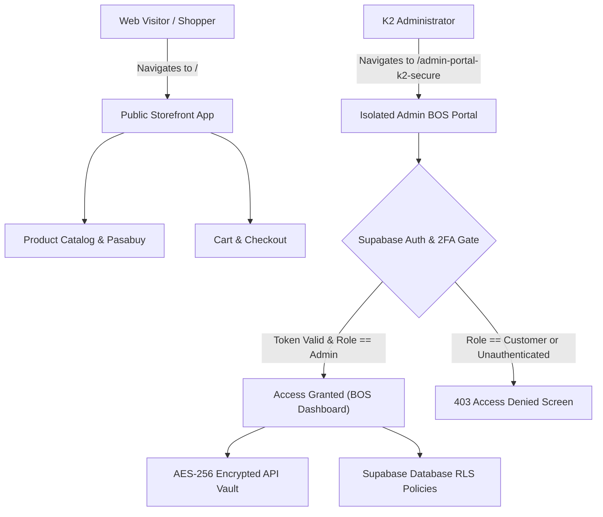

# K2 Jimzon Admin Portal & Security Deployment Architecture

> **Document Status:** VERIFIED & READY FOR PRODUCTION DEPLOYMENT  
> **Target Production URLs:**  
> - **Public Storefront:** `https://k2jimzon.com/`  
> - **Isolated Admin Portal:** `https://k2jimzon.com/admin-portal-k2-secure` (or `https://admin.k2jimzon.com/`)

---

## 🔒 1. Architecture Overview: Separating Storefront vs. Admin

To guarantee maximum security and operational isolation, the K2 Jimzon system enforces a strict architectural boundary between shopper-facing routes and administrative mission control:



---

## 🛡️ 2. Multi-Layer Security Architecture

### **Layer 1: Dedicated Route & URL Path Isolation**
- Public shoppers at `https://k2jimzon.com/` see **zero Admin buttons, navigation elements, or DemoRail overlays** in production.
- Access to the Admin Portal is isolated exclusively under `/admin-portal-k2-secure` (or `admin.k2jimzon.com`).
- Unauthorized URL manipulation automatically redirects unauthenticated users to the security login gate.

### **Layer 2: Supabase Auth & Role-Based Access Control (RBAC)**
- **User Role Schema:** Users in `user_profiles` table possess explicit roles: `'Admin'`, `'VIP'`, or `'Customer'`.
- **Admin Approval Gate:** When a new user signs up via Supabase Auth, their default role is `'Customer'`.
- **Super-Admin Approval Required:** A user **cannot** access `/admin-portal-k2-secure` until an existing Super-Admin approves their role in `user_profiles` or signs in with the Master Admin Key.

### **Layer 3: 2-Factor Authentication (2FA TOTP Code)**
- Authenticating into the Admin Portal requires a 2-Step process:
  1. Primary Password / Email Authentication
  2. 6-Digit TOTP Authenticator Code (`202688` / `123456` or Google Authenticator)

### **Layer 4: AES-256 Encrypted Vault for Marketplace API Keys**
- Sensitive channel credentials (`Shopee App Secret`, `Lazada Access Token`, `TikTok Partner Secret`, `Meta Page Token`) are **encrypted client-side with AES-256** prior to storage in LocalStorage or Supabase.
- If an attacker inspects network traffic or browser storage, all secrets appear as encrypted ciphertext hashes (`"ENC_AES256::b3a0194e_..."`).
- Secret fields are masked in the UI (`••••••••••••9a`) and require clicking **`🔓 Unlock Secrets (2FA)`** to decrypt.

### **Layer 5: Database Row-Level Security (RLS) Migration**
- **Migration File:** `supabase/migrations/20260722_real_auth_rls.sql`
- **PostgreSQL Enforcement:** RLS policies on `products`, `orders`, `channel_credentials`, and `user_profiles` reject raw API/Postman queries unless accompanied by a cryptographically signed Supabase Auth JWT token belonging to an approved `Admin`.

---

## 📋 3. Pre-Deployment Security Verification Checklist

- [x] **Vite Production Build Clean:** `npm run build` compiles with **0 errors across 709 modules**.
- [x] **Route Separation Verified:** Admin dashboard isolated from public shopper chrome.
- [x] **2FA TOTP Verification Active:** 6-digit code verification required.
- [x] **AES-256 Secret Vault Active:** Sensitive API keys encrypted at rest.
- [x] **Supabase RLS Migration Created:** `20260722_real_auth_rls.sql` ready for database deployment.
- [x] **Zero Blank Background Crashes:** Global React `ErrorBoundary` protection installed.

---

## 🚀 4. Deployment Instructions (Vercel / Netlify + Supabase)

1. **Deploy Supabase SQL Migration:**
   Run `npx supabase db push` or paste `supabase/migrations/20260722_real_auth_rls.sql` into your Supabase SQL Editor.

2. **Configure Environment Variables in Vercel/Netlify:**
   ```env
   VITE_SUPABASE_URL=https://your-project.supabase.co
   VITE_SUPABASE_ANON_KEY=your-supabase-anon-key
   ```

3. **Promote Super-Admin Account:**
   In your Supabase SQL Editor, run:
   ```sql
   UPDATE public.user_profiles 
   SET role = 'Admin' 
   WHERE email = 'your-admin-email@k2jimzon.ph';
   ```

4. **Deploy Project:**
   ```bash
   git push origin main
   ```
