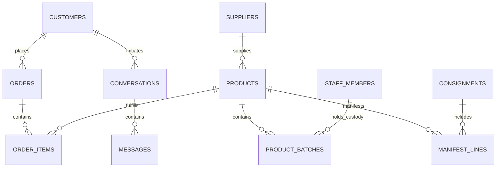

# K2 Jimzon — Data Model & Schema Truth

## 1. Domain Entity Relationship Diagram

---

## 2. Core Public Schema Tables

### `public.products` (Product Master)
The authoritative master record for every sellable product variant.
- `sku` (TEXT, PK): Unique server-generated product identifier.
- `title` (TEXT): Display name.
- `brand` (TEXT): Brand/manufacturer name.
- `category` (TEXT): Primary category (e.g. `Beauty`, `Gourmet`, `Fragrance`).
- `srp` (NUMERIC): Suggested retail price (PHP).
- `wholesale_price` (NUMERIC): B2B bulk pricing (PHP).
- `status` (TEXT): Publication status (`Draft`, `Under Review`, `Live`, `Unlisted`, `Discontinued`).
- `primary_image_url` (TEXT): Public storefront display image.
- `variant_attributes` (JSONB): Form, concentration, volume, shade metadata.

### `public.product_batches` (FEFO Inventory Batches)
The physical batch inventory records tracking shelf-life and custody.
- `id` (UUID, PK): Unique batch identifier.
- `sku` (TEXT, FK -> products.sku): Parent product.
- `batch_number` (TEXT): Manufacturer lot/batch identifier.
- `expiry_date` (DATE): Expiration or best-before date (NULL if non-perishable).
- `quantity_on_hand` (INTEGER): Physical count held in custody.
- `quantity_reserved` (INTEGER): Units allocated to pending orders.
- `custodian_id` (UUID, FK -> staff_members.id): Assigned staff custodian.
- `hub_id` (TEXT): Regional warehouse hub (e.g. `manila-central`, `cebu-hub`).
- `shelf_life_status` (TEXT): Computed status (`normal`, `clearance`, `quarantined`).

### `public.consignments` (Flight Manifests)
International air freight shipments from Milan to the Philippines.
- `id` (UUID, PK): Unique consignment record.
- `flight_code` (TEXT): Flight or airway bill reference (e.g. `IT-MNL-2026-08A`).
- `departure_hub` (TEXT): Origin hub (e.g. `Milan-Malpensa`).
- `arrival_hub` (TEXT): Destination hub (e.g. `Manila-NAIA`).
- `status` (TEXT): `Draft`, `In Transit`, `Landed`, `Received`, `Reconciled`.

### `public.orders` (Customer Orders & Inquiries)
- `id` (UUID, PK): Order identifier.
- `order_number` (TEXT, UNIQUE): Human-readable reference (e.g. `K2-2026-8821`).
- `customer_id` (UUID, FK -> customers.id, NULLABLE): Linked customer account.
- `guest_email` (TEXT): Encrypted/hashed contact email for guest checkout.
- `guest_phone` (TEXT): Contact mobile number for guest delivery.
- `total_amount` (NUMERIC): Final order total.
- `status` (TEXT): `Pending`, `Confirmed`, `Packed`, `Shipped`, `Delivered`, `Cancelled`.

### `public.conversations` & `public.messages` (Universal Communications)
- Scoped multi-channel customer communications (Storefront order chat, Pasabuy questions, Wholesale triage).

---

## 3. The Derived Stock Formula

Stock available for sale is **never stored as a raw mutable number**. It is derived in real-time via `v_product_stock_from_batches`:

$$\text{Available Stock} = \sum (\text{Quantity On Hand}) - \sum (\text{Quantity Reserved}) - \sum (\text{Quarantined / Damaged})$$

Where eligible batches must satisfy:
$$\text{Expiry Date} - \text{Current Date} \ge 90 \text{ Days} \quad \text{OR} \quad (\text{Clearance Approved} = \text{TRUE} \land \text{Expiry Date} - \text{Current Date} \ge 31 \text{ Days})$$

---

## 4. Private Platform Schema (`k2_private`)

Protected tables inaccessible to public client roles:

| Table | Purpose |
| :--- | :--- |
| `k2_private.admin_sessions` | Active staff session tokens, user IDs, and expiration timestamps. |
| `k2_private.admin_session_events` | Immutable security audit log for login, logout, MFA step-up, and revocation. |
| `k2_private.rate_limit_buckets` | HMAC domain-separated rate limiting buckets. |
| `k2_private.security_events` | Redacted intrusion, brute-force, and WAF anomaly logs. |
| `k2_private.evidence_cleanup_ledger` | Unregistered private upload reconciliation queue. |
