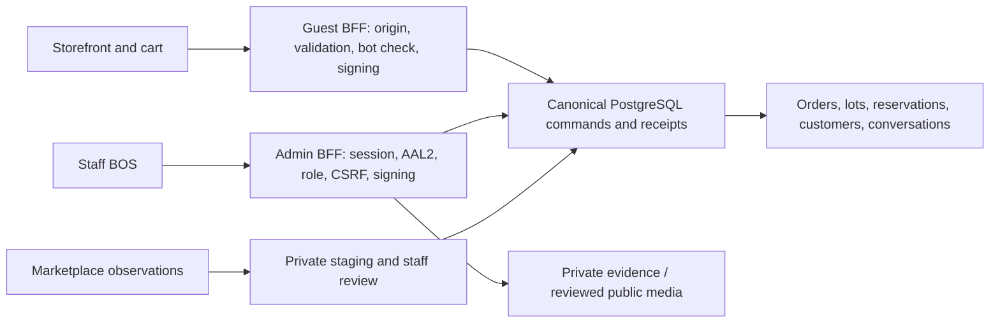

# Master Project Audit — K2 Jimzon

Follow-up: IDEA-20260914-02 locally corrects guest retry/token handling, cookie
decoding, capped customer metric inputs, demo-fact leakage, gallery refresh,
product buying hierarchy, touch targets/labels, unsupported Latest sorting and
shared recovery copy. See `../evidence/20260914-map-remediation/README.md` for
executed evidence and limits. The findings below remain the dated audit baseline;
the root MAP owns the current remainder. No deployed correction is implied.

Date: 14 September 2026. Request/decision: **IDEA-20260914-01**. Owner: **MAP-028 J**, with remediation assigned to the existing MAP owners below.

This is the consolidated current audit report, **not a second backlog**. `MASTER_ACTION_PLAN.md` remains the only active execution queue. Older audits retain historical evidence; later implementation/production receipts supersede their old defect status. No application code, migrations, credentials, dependencies or production data were changed by this audit.

Baseline: dirty working tree over `41d96df012997cc98751ca405ab632f95ae8806f`, not that commit alone. The [source manifest](../evidence/20260914-master-audit/source-manifest.json) records hashes for 762 source/test/SQL/script files. Inventory is not a claim that every one of their 113,648 lines received exhaustive manual review.

Evidence: [fresh local receipts and limitations](../evidence/20260914-master-audit/README.md), [reproducible probes](../evidence/20260914-master-audit/probes.mjs), [probe results](../evidence/20260914-master-audit/probe-results.json), [route matrix](../evidence/20260914-master-audit/route-matrix.json). Production permission observations below are explicitly dated **13 September**. The attempted fresh metadata export was rejected by automatic approval review before execution. No fresh live permission claim is made.

# 1. Executive Summary

**Verdict: NOT YET for the requested user-ready Storefront plus canonical staff BOS.** This is a substantial working application with valuable security, inventory and recovery foundations. Rebuilding it would discard useful work. Its main weakness is the gap between prepared features and accepted operational behavior, plus several customer and staff flows that still give misleading results under failure or incomplete data.

Fresh checks: **771 base tests and 32 dedicated Admin tests passed**, both separate production builds passed, route security classification passed, secret scanner fixtures/tree/history passed, and npm reported **zero known vulnerabilities** across 278 dependencies. Product probes nevertheless reproduced a gallery-refresh crash, an editable checkout retry with a conflicting payload, malformed-cookie failures, and customer metrics calculated from capped data. Tests include many source contracts; green does not mean end-to-end commerce is ready.

Scores are engineering judgments, not compliance percentages. They assess the current reviewed implementation and evidenced launch state. A 10 requires complete operational acceptance; missing evidence reduces confidence, not automatically the score. UI scores use synthetic Chromium evidence and existing design records, not physical-device or screen-reader certification.

| Dimension | Score / 10 | Reason |
| --- | ---: | --- |
| Architecture | 8 | Clear Storefront/Admin/BFF/database boundaries and one canonical operations model |
| Functionality | 6 | Broad feature set; retry, product and commercial-policy gaps remain |
| Security | 6 | Strong prepared controls; applied permission/cutover remainder and fresh verification gate |
| UI/UX | 6 | Good staff states; mobile buying hierarchy and customer recovery need correction |
| Visual consistency | 8 | Established wood/editorial Storefront and dense operational Admin identities |
| Mobile responsiveness | 6 | Broad overflow checks pass; product reading order and small controls remain |
| Accessibility | 6 | Labels/focus/reduced motion exist; measured target gaps and incomplete assistive acceptance |
| Performance | 7 | Separate lazy bundles and budgets; real hardware/field metrics unmeasured |
| Database/data integrity | 6 | Transactional stock work and historical SQL evidence; consumer completeness and lifecycle acceptance open |
| Maintainability | 6 | Useful shared boundaries; large coupled modules and historical documentation burden |
| Testing | 8 | Extensive contracts, UI fixtures and SQL rehearsals; new failure probes expose blind spots |
| SEO | 6 | Canonicals, share fields, static 404 and generators; product indexing intentionally gated |
| Production readiness | 4 | Current release, guest activation, payment evidence and full staff/customer journeys not accepted |
| **Overall** | **6.4** | Rounded mean; not a security certification |

**Finding count: 0 P0, 6 P1, 8 P2, 0 P3 (14 total).** Two P1 entries are release/security acceptance gates, explicitly distinguished from demonstrated exploits. P4 opportunities are separated later. There is no evidence here of a fresh authentication bypass, exposed critical secret or actual payment corruption.

# 2. Architecture Overview

- **Frontend:** React 19, JavaScript/JSX, Vite 6.4.3 as installed, Tailwind 4 and Motion. This is not Next.js: Server Components, server actions and Next caching rules are not applicable. `src/main.jsx` selects target-specific entrypoints through Vite configuration. `StorefrontApp.jsx` lazily mounts public views; `AdminApp.jsx` owns the staff workspace. Combined mode exists for local work/tests.
- **Routing/state:** `src/lib/storefrontRoutes.js` maps public URLs; StoreContext coordinates history, selected product, catalog, cart and checkout. Admin uses a section registry and shared authenticated runtime. Product knowledge has a separate approved-content cache; it must not be confused with canonical inventory.
- **Backend:** two production entrypoints, `api/storefront/index.js` and `api/admin/index.js`, dispatch to prepared handlers through bounded registries. Both refuse the wrong deployment target or inactive server flag. Fresh inventory counts **15 Storefront and 92 Admin routes**, plus two Edge Functions: staff invitation and Shopee webhook.
- **Data:** Supabase PostgreSQL holds products, lots/balances, reservations, orders, payment events, customer identities, conversations and channel staging. Public RLS/RPC projections are separated from private session, budget, nonce and receipt records. Storage separates private intake evidence and public product media.
- **Authentication:** prepared Admin uses encrypted HttpOnly session cookies, CSRF, current staff lookup, Auth AAL2 and a durable session registry. `authorizeAdminRequest` validates these before business handlers; payment verdicts add an Admin-role check. Client visibility is not the permission boundary. Flag-off compatibility paths still matter and must be retired through coordinated cutover.
- **Integrations:** Turnstile, Supabase Auth/Storage, optional paid intake jobs, manual contact/email paths, and staged marketplace adapters. A channel record or imported marketplace CSV is not a live synchronized adapter. Online payment automation is deliberately deferred; first launch targets verified manual payment.
- **Deployment:** two Vercel projects, explicit project-ID/target selection in `vercel.ts`, target-specific build contracts, boundary scans and asset budgets. No global Storefront catch-all is assumed. Product static generation/indexing is controlled separately from the browser bundle.

### Traced boundary examples

| Flow | Inputs, ordering and effects | Invariants and assumptions checked |
| --- | --- | --- |
| Purchase | Checkout → `runPlaceOrderRequest` → `postGuestCommerce` → prepared order handler → signed `submit_guest_order_v1` → `submit_order_request_v2` → lot hold → receipt/cookie → confirmation | UI prices are not trusted by SQL; cart is not a reservation; server receipt is required to confirm. Assumes receipt shape, bot-token freshness, stable payload identity, published eligibility and current stock are valid; the retry/provenance findings identify where that chain is incomplete. |
| Staff payment | Reviewed state/version and evidence note → fulfillment BFF → authenticated actor/AAL2/role → signed command → SQL state/stock checks → retained receipt | Actor is server-derived; stale payment state must fail; replay must not duplicate financial/stock effects. Depends on applied wrapper composition, current membership, valid allocations, durable receipt and the manual evidence contract. Local source cannot prove deployment. |
| Customer totals | Authorized Admin read → 500 customers → three limited related reads → grouping → `metricsAvailable` → cards/rows | Customer identity remains canonical; related rows group by customer; query failure hides metrics. Completeness is incorrectly assumed from query success, allowing capped results to masquerade as totals. |

# 3. Feature Status

“Complete” here means the named bounded local behavior, not an entire production workflow.

| Feature | Status | Evidence / remaining boundary |
| --- | --- | --- |
| Separate Storefront/Admin artifacts | ✅ Complete locally | Both current target builds and boundary scans pass; deployed current revision still requires proof |
| Public routes, catalog search/category/price sort | 🟡 Partial | Routes render; Latest does not sort; live catalog completeness not established |
| Product page, stock guard and cart | 🟡 Partial | Canonical price/stock paths and atomic cart checks; gallery refresh and content provenance defects |
| Customer order request | 🟡 Partial | Prepared signed path and legacy compatibility; uncertain retry and bot-token lifecycle defects |
| Order status and guest messaging | 🟡 Partial | Scoped BFF/SQL prepared; activation, full signed seed/replay and recovery remain MAP-019 |
| Optional customer accounts/claim/recovery | ❓ Needs verification | Prepared identity boundary and fixtures; real contact-provider/claim/phone acceptance remains |
| Pasabuy | 🟡 Partial | Capture, quotes and transitions exist; response-loss recovery and operational modes need acceptance |
| Wholesale/contact | 🟡 Partial | Honest email-draft fallback and prepared canonical inquiry; no implied wholesale authority |
| Admin login/MFA/permissions | 🟡 Partial | Prepared server guards and browser tests; deployed role/session journeys still gated |
| Product intake, reviewed media and publication | 🟡 Partial | Protected commands, approval and cleanup work; remaining callers and real phone use not accepted |
| Inventory/FEFO/packing/confirmation/handover | 🟡 Partial | Significant SQL and prior rehearsal evidence; all-writer/owned-vs-physical consumers remain open |
| Payment and settlement | 🟡 Partial | State/version and separation controls exist; full evidence record and settlement contract incomplete |
| Customer register/operational metrics | 🔴 Broken at truncation | Capped successful reads produce apparently complete totals |
| Admin dashboard/reporting | 🟡 Partial | Better missing/zero and stale-period handling; exhaustive history/export completeness still open |
| Supplier/consignment/custody tools | 🟡 Partial | Existing operational records and controls; full discrepancy/receiving workflows require rehearsal |
| Coupons/delivery rules | 🟡 Partial | Server validation and retained Admin command patterns; customer delivery remains quoted after review |
| Owner Count & Close / marketplace staging | 🟡 Partial | Observation/review pipeline; not automatic inventory or settled financial truth |
| Marketplace synchronization | ⚪ Not active as a verified adapter | Provider access, initial sync, external races and reconciliation remain MAP-026 |
| Interactive Shop/WebGL | 🟡 Partial | Lazy scene, DPR bound, disposal/context-loss code and fallback; actual phone zoom/GPU acceptance remains |
| Product knowledge/paid AI | 🟡 Partial | Approved knowledge filtering and budgeted job preparation; parallel fallback content and activation gates |
| SEO/static discovery | 🟡 Partial | Local metadata/404/generator controls pass; approved content and indexing release remain gated |
| Monitoring/backup recovery | ❓ Needs verification | Redacted Admin reporting and historical backup rehearsals; exact-host alerts/restore acceptance not refreshed |
| Legacy files | ❓ Candidates only | Import and asset evidence below; no files deleted |

# 4. Critical Findings

| ID | Priority / confidence | Release implication | Existing owner |
| --- | --- | --- | --- |
| AUD-SEC-001 | P1 / Needs Verification | Applied legacy guest/default privileges need coordinated closure and fresh proof | MAP-017/019/020 |
| AUD-REL-001 | P1 / Confirmed evidence gate | Current dirty source is not an accepted release of both production artifacts | MAP-024/025, MAP-028 I-014 |
| AUD-OPS-001 | P1 / Confirmed | Manual payment route lacks the structured evidence contract required for first launch | MAP-023 |
| AUD-COM-001 | P1 / Confirmed | Lost-response checkout edits cannot be safely reconciled through the current UI | MAP-019, MAP-028 I-010 |
| AUD-COM-002 | P1 / Highly Likely | Consumed Turnstile token is reused after a failed submission | MAP-019/020 |
| AUD-DATA-001 | P1 / Confirmed | Unapproved fallback content/verification claims bypass product knowledge truth | MAP-018/027, MAP-028 I-007 |

No P0 was established. The schema scanner's historical “10 critical” classification is a **policy-check result**, not ten demonstrated P0 exploits.

# 5. Full Findings

## [AUD-SEC-001] Applied guest cutover and default privilege closure remain unverified

**Severity:** P1  
**Confidence:** Needs Verification  
**Area:** Security / Database  
**Location:** `api/storefront/index.js:4`; `src/context/StoreContext.jsx:671`; `docs/evidence/20260913-audit-remediation/schema-after-audit.log`; MAP-017

### Problem
Prepared BFF controls do not establish that all production writes cross them. The latest accepted metadata audit still records four legacy anonymous guest/coupon RPC grants and six provider-owned default privilege groups.
### Evidence
The 13 September postflight reduced policy findings from 26 to 10 and verified 14 anonymous read boundaries. Current compatibility code still calls legacy RPCs. Today's live exporter was rejected before execution; that older receipt remains the latest evidence reviewed here.
### Impact
Revoking legacy access without the BFF cutover can break checkout; leaving it indefinitely can bypass intended BFF abuse controls. Future broad defaults need explicit provider resolution. Current exploitability is not demonstrated.
### Root Cause
Source hardening, applied privileges and feature activation are separate steps and are not yet fully reconciled.
### Recommended Fix
Complete the existing coordinated guest cutover and supported provider-default resolution. Do not repeat either already-applied security migration.
### Risk of Fix
High if permissions are revoked before compatible submission/recovery is active.
### Verification
Fresh target-specific metadata, exact ACL checks, public catalog reads, denied direct business writes and authorized guest journey/replay receipts.

## [AUD-REL-001] The reviewed source is not a verified production release

**Severity:** P1  
**Confidence:** Confirmed  
**Area:** Deployment / QA; evidence gate  
**Location:** dirty working tree; `vercel.ts`; `vercel.admin.json`; `vercel.storefront.json`; `.github/workflows/ci.yml`; MAP-024/025

### Problem
Local passing work is mixed with substantial uncommitted changes. A historical deployed commit cannot prove these current fixes are served or that the newly prepared CI job passes on its real runner.
### Evidence
The audited HEAD is `41d96df`, but current source differs in frontend, BFF, SQL, configuration and tests. Both current local builds pass. No exact-current-revision remote CI/promotion/host receipt was obtained.
### Impact
A launch decision could rely on code customers and staff do not actually receive.
### Root Cause
Prepared, committed, deployed and operationally accepted states have not converged.
### Recommended Fix
Preserve the combined work; produce one reviewable release revision and execute the existing two-project preview/promotion/rollback gates.
### Risk of Fix
Broad release regression if unrelated unfinished work is included without review. No automatic deployment is recommended.
### Verification
Exact revision in remote CI and both deployments, target markers, API denial boundaries, correct Admin metadata, deep-link/404 behavior and representative customer/staff journeys.

## [AUD-OPS-001] Payment status does not provide the required payment evidence record

**Severity:** P1  
**Confidence:** Confirmed  
**Area:** Business logic / Financial operations  
**Location:** `server/admin-bff/fulfillment.js:38`; payment dialog/command chain; operations rulebook §16

### Problem
The prepared payment action accepts status, a free-text note and reviewed version. The first-launch manual-payment contract requires method, amount, currency, payer/reference, proof, submitter and verifier evidence, separate from status.
### Evidence
The exact accepted payment payload contains `orderRequestId`, `toStatus`, `evidenceNote`, `expectedPaymentStatus` and `expectedUpdatedAt`. Current rulebook and readiness records explicitly retain this gap. Existing role, stale-state and independent-verifier controls are useful but do not supply the missing record.
### Impact
Staff cannot consistently reconcile why an amount was accepted or tie it to the approved receiving account and proof using this route alone.
### Root Cause
A status-transition workflow preceded the complete payment-evidence workflow.
### Recommended Fix
Finish the existing minimal structured manual-evidence contract and receiving instructions under MAP-023; preserve state/version and independent review safeguards.
### Risk of Fix
Requires coordinated schema, API, UI and audit-history handling. Do not infer fields for historical payments.
### Verification
Representative accepted/rejected/corrected/refunded evidence, independent verifier, receipt replay and exact amount/reference linkage; no invented settlement or automatic payment claims.

## [AUD-COM-001] Uncertain checkout retry retains a key but allows its payload to change

**Severity:** P1  
**Confidence:** Confirmed  
**Area:** State / Commerce / Recovery  
**Location:** `src/views/Checkout.jsx:28`; `src/context/StoreContext.jsx:615`, `:650`; `supabase/migrations/20260912_guest_order_conversation_seed.sql:90`

### Problem
After an uncertain response, checkout fields remain editable while the original key is retained. The SQL wrapper rejects a changed payload for an existing key. The UI has neither a frozen original-payload retry nor a useful conflict recovery path.
### Evidence
The loopback probe aborts the first order response, changes the customer name and submits again: the **same key carries different customer details**. A simulated SQL-shaped `IDEMPOTENCY_CONFLICT` produces only “The request could not be completed. Please try again.” SQL's fingerprint mismatch branch confirms this response contract. The compatibility inner writer instead returns an existing order by key, making payload reconciliation equally important there.
### Impact
A customer can become stuck retrying, or believe changed details were accepted when reconciling an older request. Pasabuy/conversation fingerprint-to-new-key patterns also require review before activation because edits after uncertainty can create a second logical request.
### Root Cause
Request identity is retained separately from the immutable reviewed payload and authoritative outcome.
### Recommended Fix
Retain the exact submitted payload and key through uncertainty, freeze edits, expose same-request receipt recovery, and permit correction only after definitive rejection. Validate success receipt shape before clearing the cart.
### Risk of Fix
Must preserve cart drafts and distinguish transport uncertainty from validation refusal; a blanket new key on retry is unsafe.
### Verification
Lost response after commit, edited form, same-key replay, malformed receipt, definitive validation rejection, refresh and duplicate-click scenarios against the real signed SQL chain.

## [AUD-COM-002] Failed submissions do not refresh a consumed bot challenge

**Severity:** P1  
**Confidence:** Highly Likely  
**Area:** Integration / Commerce recovery  
**Location:** `src/views/Checkout.jsx:47`; `src/views/Pasabuy.jsx:52`; `src/views/GuestMessages.jsx:74`; `src/components/security/TurnstileChallenge.jsx:42`; `server/bot-challenge.js`

### Problem
Submission failure returns without replacing the widget or clearing its token. The widget has no submission-result reset API. A request may successfully redeem its token and then fail at the database or lose its response.
### Evidence
The browser probe sends the same bot token twice. Checkout's failure path leaves it unchanged; Pasabuy/message challenge keys advance on success only. The server verifies the challenge before the order RPC. Cloudflare specifies single-use tokens and resetting the widget for a retry: [official validation documentation](https://developers.cloudflare.com/turnstile/get-started/server-side-validation/).
### Impact
An otherwise recoverable order can receive repeated bot-check refusal until the token/widget is renewed. A live Cloudflare failure/retry was not exercised here.
### Root Cause
Bot-token lifetime is treated like durable request identity; the two have different replay rules.
### Recommended Fix
Renew the challenge after an attempt may have consumed it while preserving the business payload/key. Recover a failed script-load promise through an explicit retry as well.
### Risk of Fix
Do not reset business identity or dispatch a second order merely to get a new token.
### Verification
Consume a token, fail after verification, obtain a new token, retry the identical request and recover exactly one receipt. Also test script load failure and expiry.

## [AUD-DATA-001] Product fallback content bypasses approval and inventory meaning

**Severity:** P1  
**Confidence:** Confirmed  
**Area:** Content / Product truth  
**Location:** `src/context/StoreContext.jsx:333`, `:360`; `src/views/MasterProduct.jsx:239`, `:393`; `src/components/ProductPassport.jsx:26`, `:40`, `:44`

### Problem
Production database products can inherit SKU-matched local ingredients, allergens, imagery and claims outside the approved knowledge projection. Missing facts also display “Ingredients verified on label” and “Specifications verified upon batch arrival.” Country of origin drives a consignment claim; unknown stock falls into “Available on Pasabuy request.”
### Evidence
The local-data merge occurs after the development-only empty-catalog branch, so it also applies to production DB rows. The synthetic product has no approved knowledge, ingredients or consignment evidence; screenshots show unavailable knowledge beside verification/import claims. Source proves the null-stock branch conflates unknown with a sourcing option.
### Impact
Buyers cannot distinguish reviewed package facts, suggestions, unavailable stock and sourcing assumptions. This report does not claim any specific ingredient is false.
### Root Cause
Parallel merchandising/specification/passport paths bypass the approved knowledge and canonical stock semantics.
### Recommended Fix
Make all factual product surfaces consume approved field/provenance state; neutralize absent facts and keep unknown/zero/positive stock distinct. Preserve reviewed descriptions and deliberate art direction.
### Risk of Fix
Pages may temporarily contain less copy or imagery. Approved content should be migrated explicitly, not discarded indiscriminately.
### Verification
Known SKU with missing/rejected knowledge, absent imagery, null/zero/positive stock and origin without a consignment record produce honest, consistent page/card/scene/metadata states.

## [AUD-FUN-001] Gallery refresh can crash the product section

**Severity:** P2  
**Confidence:** Confirmed  
**Area:** React / State  
**Location:** `src/views/MasterProduct.jsx:17`, `:124`

### Problem
`currentSlide` is reset for product-ID changes, but not constrained when the same product's gallery shrinks during refresh. Rendering dereferences `gallery[currentSlide].type` without a valid entry.
### Evidence
The probe selects slide two, removes secondary images from the intercepted catalog, and dispatches the existing visibility refresh. The product section displays `UI_SECTION_UNAVAILABLE`. React catches the failure, so the lack of an uncaught `pageerror` is not evidence of success.
### Impact
A normal staff media update can interrupt a shopper viewing that product.
### Root Cause
State indexes a mutable collection without a render-time validity guard.
### Recommended Fix
Derive a valid selected gallery entry on every render, preserving selection when possible and falling back to the first image when removed.
### Risk of Fix
Small; preserve gallery transitions and current product reset behavior.
### Verification
Select the last slide, refresh to a smaller/empty gallery and keep a usable product page; also test direct product switching.

## [AUD-DATA-002] Customer metrics silently treat capped reads as complete

**Severity:** P2  
**Confidence:** Confirmed  
**Area:** Database reads / Admin reporting  
**Location:** `server/admin-bff/customers.js:39`, `:62`, `:66`, `:99`; `src/views/admin/Customers.jsx:126`, `:182`

### Problem
The customer register takes at most 500 customers and 2,000 related rows per query, without pagination or completeness signaling. Any successful response sets `metricsAvailable=true` and renders totals.
### Evidence
The actual exported reader, supplied a successful capped 2,000-order result, reports 2,000 orders and an available metric without a truncation state. The UI states totals appear when every query succeeds; success does not prove every row was retrieved. Lower provider row caps can truncate earlier.
### Impact
Customer counts, activity and unread totals can be understated as history grows; older customers become unreachable in the register.
### Root Cause
Query transport success is used as dataset completeness.
### Recommended Fix
Use bounded cursor pagination for the register and database aggregates or explicitly complete related reads for totals. Until then, label incomplete data and suppress purported totals.
### Risk of Fix
Unbounded client fetching would increase latency and private-data transfer; do not fix this by removing all limits.
### Verification
501 customers and more than the configured row cap of related records, including one customer's records crossing the boundary, with correct totals or explicit unavailable state.

## [AUD-API-001] One malformed cookie breaks unrelated guest requests

**Severity:** P2  
**Confidence:** Confirmed  
**Area:** Input validation / Error handling  
**Location:** `server/storefront-bff/security.js:16`, `:103`

### Problem
The guest signer decodes every cookie without catching malformed percent encoding, including cookies unrelated to guest access.
### Evidence
The actual helper accepts no cookie but throws `URIError` for `unrelated=%` and malformed guest encoding. `publicFailure` maps both to 503 `SERVICE_UNAVAILABLE`. The Admin parser already handles this safely.
### Impact
Affected browsers cannot use guest endpoints until the malformed cookie disappears. This is not cross-user denial of service or an authentication bypass.
### Root Cause
Unrelated untrusted cookie values participate in a shared signing prerequisite.
### Recommended Fix
Parse only relevant values or catch per-cookie decoding; invalid access material must fail closed without aborting unrelated requests.
### Risk of Fix
Low; preserve exact guest-token validation and HttpOnly cookie handling.
### Verification
Malformed irrelevant cookie with valid/absent grant; malformed grant; valid grant; none may produce an unhandled parse failure or unauthorized access.

## [AUD-UX-001] Mobile product buying context follows the secondary content

**Severity:** P2  
**Confidence:** Confirmed  
**Area:** Responsive / Information hierarchy  
**Location:** `src/views/MasterProduct.jsx:104`, `:161`, `:181`

### Problem
The desktop left column contains gallery, tabs, knowledge and questions. On phones it precedes the entire right column, so customers read those sections before the name, price and buying controls.
### Evidence
Fresh synthetic product measurement puts the H1 about 1,747 CSS pixels below the top at 320px width. The 390px screenshot independently shows the same order. Desktop also places the buy controls well below the price. Page overflow passes, but usable buying hierarchy does not follow from that.
### Impact
Customers must scroll through supporting content before knowing what the product costs or how to request it.
### Root Cause
Desktop column grouping defines mobile DOM/read order.
### Recommended Fix
Place identity, price, availability and primary action immediately after/beside the gallery, then supporting knowledge. Retain K2's typography, wood canvas and imagery.
### Risk of Fix
Moderate CSS/focus-order regression; avoid duplicating interactive controls just to reposition them.
### Verification
Phone portrait/landscape, tablet, desktop, keyboard order and 200–400% zoom show product identity and next action before secondary sections.

## [AUD-UX-002] Product controls miss the target standard and coupon input lacks a programmatic label

**Severity:** P2  
**Confidence:** Confirmed  
**Area:** Accessibility / Forms  
**Location:** `src/views/MasterProduct.jsx:95`, `:330`; `src/views/Checkout.jsx:100`

### Problem
Product breadcrumb buttons and tabs have undersized hit areas. Checkout renders a sibling coupon label without `htmlFor`/input ID or another accessible naming association.
### Evidence
Measurements across the product matrix show breadcrumb height 20px and tab height 30px, below K2's 44px standard. Coupon label/input association is absent in source. This does not convert every sub-44px element into an automatic WCAG failure; spacing and exceptions were not fully evaluated.
### Impact
Touch selection is less reliable; assistive technology cannot use the visible coupon label as its programmatic name.
### Root Cause
Text styling was used as interactive geometry, and the coupon field bypassed the labeled-field pattern.
### Recommended Fix
Increase hit areas without oversized visual text; associate the coupon label and input.
### Risk of Fix
Low; check wrapping and neighboring target overlap at 320px.
### Verification
Measured 44px areas, keyboard focus visibility and `getByLabel('Coupon code')` targeting the input, plus screen-reader review.

## [AUD-UX-003] Shared error recovery gives shoppers Admin instructions

**Severity:** P2  
**Confidence:** Confirmed  
**Area:** Error recovery / Product coherence  
**Location:** `src/components/ui/ErrorBoundary.jsx:36`, `:53`; `src/StorefrontApp.jsx:47`

### Problem
The shared fallback says “reload the Admin workspace” and labels its reload button “Reload Admin” on public Storefront pages. It also asserts “No change was confirmed” without knowing whether a prior request committed.
### Evidence
The gallery-refresh probe renders this exact fallback in the public product page. The component has no operation receipt knowledge from which to make that transaction claim.
### Impact
Shoppers receive confusing recovery directions, and an unrelated render failure can give false reassurance about a pending write.
### Root Cause
An Admin-specific fallback and transaction wording are reused as a generic render boundary.
### Recommended Fix
Use surface-neutral or explicit target-specific copy. State that the section failed; defer transaction status to the receipt/reconciliation workflow.
### Risk of Fix
Low if only copy/context changes; preserve explicit reload rather than automatic reload of drafts.
### Verification
Trigger public and staff render/lazy-load failures, including during uncertain writes; check correct labels and no invented write outcome.

## [AUD-FUN-002] Latest catalog sort has no comparator

**Severity:** P2  
**Confidence:** Confirmed  
**Area:** Functional / Discovery  
**Location:** `src/components/CatalogGrid.jsx:21`, `:69`; StoreContext product normalization

### Problem
Selecting Latest returns comparator zero for every pair. Normalized products also do not retain an authoritative latest-sort timestamp.
### Evidence
Only price ascending, price descending and featured-tag branches exist. The Latest option therefore preserves incoming order. This remains the existing MAP-028 I-005 finding, not a new duplicate task.
### Impact
Customers cannot discover recent items through the advertised control.
### Root Cause
The option was added without its data/order contract.
### Recommended Fix
Define and preserve the approved date, implement descending order with stable ties/null handling, or remove the option until supported.
### Risk of Fix
Low; do not equate arbitrary query order with new arrivals.
### Verification
Reversed dated fixtures, equal/missing dates, filter interaction and back/navigation behavior.

## [AUD-COM-003] Unlisted direct-link products disagree with order eligibility

**Severity:** P2  
**Confidence:** Confirmed  
**Area:** Business policy / Commerce  
**Location:** `src/context/StoreContext.jsx:268`, `:388`; `supabase/migrations/20260902_purchase_time_reservation.sql:241`

### Problem
Published Unlisted products load through direct links and may expose buying controls, while the canonical writer permits only Live and Active statuses.
### Evidence
The frontend query includes Unlisted and only excludes it from browse. The SQL product-status allowlist excludes it. This is existing AUD3-002 / MAP-023 queue item 12; no production purchase was attempted.
### Impact
A buyer can complete details for a product the server will refuse.
### Root Cause
The unresolved direct-link sales policy has different frontend and backend interpretations.
### Recommended Fix
Resolve the existing owner policy, then align both boundaries. Do not silently broaden sale authority.
### Risk of Fix
Commercial impact if Unlisted unexpectedly becomes purchasable; preserve browse exclusion where required.
### Verification
Published Unlisted direct link, refresh, guest/account checkout and browse all follow the approved policy.

# 6. Missing Systems

These belong to existing requirements; they are not proposals to expand the product.

| Required capability | Current evidence | Existing owner |
| --- | --- | --- |
| Complete manual payment evidence and instruction delivery | Status/note workflow is incomplete; AUD-OPS-001 | MAP-023 |
| Reliable timed-hold release operations | `server/admin-bff/reservations.js:7` explicitly documents staff-initiated sweep; no scheduled-job source was found by inventory | MAP-023/022; approve scheduler or operational coverage and prove expired units are actually released |
| Full customer-record and report completeness | Customer caps confirmed; other history/export paths need representative-volume proof | MAP-019/023/025 |
| Approved collection/recovery disclosures | Route registry/footer lack dedicated privacy/terms/returns destinations; approved wording and customer recovery remain existing requirements | MAP-024/025, MAP-028 I-011; no legal-compliance opinion |
| Useful Storefront failure visibility | `reportError.js` logs redacted browser errors but remote submission is Admin-build-only | MAP-022; choose minimal privacy-safe error monitoring and verify alerts |
| Accepted live adapter recovery and initial sync | Staging is not live ingestion/stock synchronization | MAP-026 |
| Exact-host recovery and operational launch evidence | Backups/rehearsals exist historically; this audit did not perform a new restore, payment or business mutation | MAP-022/024/025 |

# 7. Technical Debt

Manageable: custom routing, React context, two runtime targets and explicit service functions have clear reasons. A wholesale framework replacement or TypeScript conversion is not justified by this audit.

Debt that matters: large intake, inventory, owner-close and scene modules make it easier to miss coupled lifecycle state; source-string tests can certify the presence of an identifier while missing actual behavior. Extract only bounded behavior when repairing its verified defect. The retained-command helpers, Manila-time helpers and availability policy are useful models.

Documentation has grown into a large historical record: the MAP alone is roughly 752 KB, while System Brain is about 259 KB. Current superseding notices prevent some ambiguity, but maintainers must still resolve dated statements. Keep current action/state concise in the owning item and completed receipts in evidence/System Brain; do not create another cleanup roadmap. `PRODUCT.md` still describes live synchronization and review proof as positioning; reconcile those claims with the operational evidence before using them as public factual copy.

There is no general lint or TypeScript check script. Import-integrity, builds and contracts provide meaningful checks, but not complete lint/runtime type assurance. Add a narrow check only for demonstrated classes of mistakes; a repository-wide formatting rewrite is unnecessary.

# 8. Dead / Duplicate / Legacy Code

- The asset hash inventory found **no byte-identical files among inventoried public assets**. That does not prove every asset is used or semantically distinct.
- `public/models/k2-clerk.glb` is a legacy candidate: active `AnimeClerk.jsx` loads `k2-clerk-anime.glb`; the old model lacks an active source reference in the reviewed search. Check external URLs, generator/recovery records and older deployment needs before removal.
- `prepared-api/` is **active imported code when the BFF is enabled**, not dead simply because of its name. Likewise, flag-off browser Supabase paths are active compatibility code, not safe deletion candidates.
- `src/data/products.js` is not dead mock code: production SKU matching consumes its fields. Correct its authority boundary (AUD-DATA-001) before considering removal.
- `react-helmet-async` is imported by `main.jsx` and Home; it is not an unused dependency. Manual route metadata and Helmet deserve ownership review only if a concrete conflicting field is reproduced.
- Multiple audit/action-plan documents are historical candidates for clearer archival labels. Root MAP stays authoritative; nothing was deleted or moved.
- Motion, Three/R3F and barcode libraries serve different concrete functions. Their coexistence is not sufficient evidence of redundant systems.

# 9. Performance Opportunities

| Rank | Observation | Action / assurance limit |
| --- | --- | --- |
| 1 | Public catalog uses unpaginated product/stock reads; customer register has explicit caps | Correct completeness with bounded queries/aggregates. Do not fetch unlimited history into browsers. Real query plans remain unmeasured. |
| 2 | Storefront landing JS is **150.16 / 150.50 kB gzip**, CSS **27.52 / 30 kB gzip** | Preserve the budget; about 0.34 kB JS headroom remains. Measure initial-network dependencies before adding landing features. |
| 3 | Largest public model is about 1.14 MB; two hero video formats and several ~0.7–0.83 MB mock JPGs exist | Measure actual route requests; optimize delivered product imagery rather than counting all files as first-load bytes. Different video formats are intentional fallback formats. |
| 4 | Scene is lazy; DPR is bounded to 1.75, with texture cleanup/context-loss handling | Profile phone GPU/frame timing and idle/hidden rendering before changing cinematic behavior. No GPU leak was demonstrated. |
| 5 | Admin budget reports **189.65 / 300 kB minified for its application chunk** | This is not total first-load network size; vendor Supabase and scanner chunks are separate. Measure full route waterfalls when pursuing performance work. |

No field LCP/INP/CLS/TTFB, production query plans or 10,000-user load test was performed. At tens of users, completing reliable operations matters most. At hundreds/thousands of accumulated records, truncation already becomes relevant regardless of concurrent-user count. At higher concurrency, verify measured database contention/provider limits before scaling architecture.

# 10. UX / Design Opportunities

The inspected Storefront has deliberate wood, warm layers and serif/sans hierarchy. Preserve that identity. Admin prioritizes readable operational density and state labels. Neither should be redesigned because a generic skill prefers different fonts, palettes or card shapes.

| Before | Recommended after | Why |
| --- | --- | --- |
| Phone gallery → tabs/knowledge/questions → product identity | Gallery → name/price/availability/action → supporting details | Make the buying decision understandable before secondary content |
| Unknown facts displayed with verification/import wording | Explicit unavailable/reviewed/source state | Protect trust without inventing content |
| 20px breadcrumb / 30px tabs | 44px hit areas with current typography | Improve touch use without visually oversized labels |
| Public failure says Reload Admin | Correct surface recovery and receipt-aware transaction guidance | Reduce confusion and unsafe assumptions |

Impeccable technical rubric, provisional: accessibility 2/4; performance 3/4; responsive 2/4; theming 3/4; anti-patterns 3/4: **13/20**. This is a sampled technical-quality judgment, not WCAG certification. No wholesale “AI-generated look” failure is established; the actionable problems concern truth, hierarchy, touch and recovery. Suggested focused follow-up: harden recovery, adapt product order/targets, then polish the verified result within the MAP dependency order.

Responsive evidence: 110 route/viewport measurements plus ten product measurements cover 320, 360, 390, 430, tablet portrait 768×1024, tablet landscape 1024×768, 1024, 1280, 1440 and 1920. No page-level horizontal overflow or error boundary appeared in the 110 route baseline checks. **These are rendered initial/recovery states with synthetic responses, not every modal, large-data state, phone keyboard or physical gesture.** Product-specific defects above remain despite no overflow.

# 11. Security Report

**Confirmed in this pass:** malformed guest-cookie availability failure; prepared trust-boundary and role checks; secret scanners and current dependency audit pass. No fresh exploitable authorization bypass or critical credential leak was demonstrated.

**Existing applied-state concern:** AUD-SEC-001, based on the dated 13 September receipt. Never substitute the source inventory's zero unexpected grants for production ACL proof.

**Hardening/acceptance requirements:** exact role/AAL2/object ownership matrix, real storage MIME/size/ownership denial, signed webhook replay/rate behavior, provider default privileges, CSP telemetry, safe recovery and useful alerts. Source tests cover portions; full live abuse tests were not run.

**Theoretical/unverified:** production query exhaustion, every concurrent writer interleaving, physical-device browser issues and future default-created objects. These are acceptance questions, not additional confirmed vulnerabilities. Browser publishable Supabase keys are not classified as secrets. Ignored local `.env` files legitimately hold backend configuration; the tracked/history scanner does not establish that every ignored local file or provider log has been reviewed.

No real-user identifiers, order rows, raw credentials or message bodies were collected. Probe names/addresses/tokens are synthetic. External media/Auth/commerce traffic was blocked in the custom browser probes. No legal or regulatory compliance conclusion is offered.

# 12. Production Readiness Checklist

| Status | Gate |
| --- | --- |
| ✅ Ready locally | Independent Storefront and Admin builds, target boundaries and bundle scans |
| ✅ Ready locally | Base tests, source route classification, scanner fixtures/tree/history and current npm audit |
| ⚠️ Needs improvement | Gallery refresh, Latest, targets/labels, surface-correct error recovery |
| ❌ Blocking | Reliable uncertain guest submission and renewed bot token before BFF activation |
| ❌ Blocking | Approved product facts and coherent availability/provenance |
| ❌ Blocking | Structured manual-payment evidence and operational launch rehearsal |
| ❌ Blocking | Remaining applied permission/cutover proof and fresh authorized metadata |
| ❌ Blocking | Exact-current-revision remote CI, two-project deployment, rollback and host journeys |
| ⚠️ Needs improvement | Customer pagination/complete metrics, broader history/export acceptance |
| ⚠️ Needs improvement | Physical device, screen reader, full zoom/contrast/keyboard-overlay matrix |
| ⚠️ Needs improvement | Expired-hold release coverage, storefront monitoring and actionable alerts |
| ⚠️ Needs improvement | Product indexing/content release; deliberately gated now |

# 13. Prioritized Master Action Plan

This is a **mapping into the existing root MAP**, not independently tracked work. Detailed acceptance and remaining status must be maintained there.

| Phase | Existing owner and audit IDs | Dependencies / acceptance |
| --- | --- | --- |
| A — Emergency | None established | No verified P0; do not rotate keys or alter production on speculation |
| B — Release blockers | MAP-017/019/020: AUD-SEC-001, AUD-COM-001/002 | Prepare/test immutable guest retry and token renewal before coordinated cutover/revocations; then exact-target denial and successful journey evidence |
| B — Release blockers | MAP-018/027 and MAP-028 I-007: AUD-DATA-001 | Approved source/package facts and correct unknown-state behavior before product publication/indexing decisions |
| B — Release blockers | MAP-023: AUD-OPS-001 | Approved receiving-account/payment contract, stock lifecycle and independent verification; preserve provider activation gates |
| B — Release blockers | MAP-024/025 and I-014: AUD-REL-001 | Reviewed release revision after dependency completion, current CI and separate host acceptance |
| C — Stability | MAP-019/020/023: AUD-API-001, AUD-DATA-002, AUD-FUN-001 | Fix bounded parsing, dataset completeness and mutable gallery selection; focused behavioral fixtures |
| C — Stability | MAP-023 / existing queue item 12: AUD-COM-003 | Existing owner Unlisted policy before changing frontend or SQL sale authority |
| D — Product quality | MAP-028 I-005/006/008/010: AUD-FUN-002, AUD-UX-001/002/003 | Correct date contract, mobile reading order, targets/labels and recovery; preserve design identity |
| E — Cleanup | MAP-021/028 | Confirm actual asset/import consumers and current documentation ownership; no deletion by filename |
| F — Optional | Existing MAP gate / future-ideas intake only | P4: measured conversion events, scene idle optimization or module extraction only after evidence and acceptance; no new active feature scope accepted here |

# 14. Quick Wins

- AUD-API-001: safe per-cookie decoding; mirror the established Admin behavior without expanding authority.
- AUD-UX-002: associate coupon label/input and enlarge product hit areas.
- AUD-UX-003: neutral, truthful error recovery copy.
- AUD-FUN-001: valid gallery entry on same-product refresh.
- AUD-FUN-002: remove unsupported Latest until its date contract is available, or complete its small comparator/data change under the existing owner.

These are recommendations, not fixes made by this audit. Guest receipt recovery and payment evidence require fuller behavioral work and are not labeled quick wins.

# 15. Do Not Touch

**These systems should not be refactored merely for the sake of refactoring.**

- Separate production artifacts/projects and explicit target refusal.
- Server-derived actor, AAL2, CSRF, signed commands and durable receipt boundaries.
- Exact-lot packing and canonical inventory/reservation ownership; finish acceptance rather than fork stock truth.
- Shared Manila reporting windows and explicit unavailable/stale states.
- Approved product-knowledge filter, private evidence boundaries and human publication review.
- Atomic cart limits and unknown-stock purchase denial.
- Lazy scene/scanner/workflow chunks, reduced-motion video posters and explicit load recovery.
- Honest manual payment/delivery wording and non-activated marketplace staging.
- K2's wood/editorial Storefront and task-oriented Admin identity.

# 16. Final Verdict

**NOT YET.** The project has a credible architecture and strong local foundations. It needs targeted completion, not a rewrite. The five most important constraints are:

1. Prepared security/commerce work has not converged with verified applied permissions and the current deployed release.
2. Customer submission recovery does not yet preserve the full transaction and bot-token lifecycle.
3. Canonical payment/inventory operations still need complete evidence, consumer coverage and representative staff acceptance.
4. Product facts, availability and mobile buying order still disagree across surfaces.
5. Test volume and documentation volume exceed the current end-to-end assurance: capped histories, real providers, exact hosts and physical devices remain explicit gates.

### Coverage of the owner's 44 phases

| Phases | Work performed | Remaining assurance boundary |
| --- | --- | --- |
| 1–2 Reconnaissance/inventory | Target entries, routes, dependencies, source hashes, features and record boundaries | Inventory is not exhaustive per-line review |
| 3–4 Function/business logic | Checkout → BFF → SQL trace; payment and customer metrics; targeted failures | Every Admin action, real stock/payment/delivery data and all lifecycle races |
| 5–8 UX/visual/responsive/accessibility | Four design skills, product screenshots, 120 viewport checks, code-level labels/focus/motion review | Physical devices, screen reader, exhaustive contrast and 200–400% zoom/state matrix |
| 9–10 Performance/React | Fresh builds/budgets, lazy boundaries, same-product gallery crash | Field vitals, profiler/load data; Next.js-specific systems not applicable |
| 11–13 Database/Supabase/auth | Prepared SQL/security inventory, current BFF traces, dated applied receipt | Fresh live metadata blocked; full fresh-install/overload/role/row journey proof |
| 14–17 Security/secrets/API/validation | Secret gates/history, dependency advisories, origin/role/signing/parser checks | No exhaustive penetration test, live business mutation or provider exploit attempt |
| 18–19 Errors/edge cases | Lost response/edit, malformed cookie, gallery removal, capped records, empty/recovery routes | Interrupted upload/live auth expiry/all Unicode/large-data UI combinations |
| 20–22 SEO/routing/state | Route registry, metadata/noindex/build 404, refresh and retry traces | Exact-host status/body/redirect behavior and every back/forward state |
| 23–25 Motion/WebGL/media | Reduced-motion routes, scene cleanup/DPR/context loss, asset hash/size inventory | GPU disposal profiling, low-end phones, actual touch/zoom and bandwidth metrics |
| 26–28 Dependencies/code/types | Current npm audit, lockfile/dependency policy, large-module and runtime-boundary review | No blind upgrades or wholesale JS-to-TS proposal; every unused export not proven |
| 29–30 Testing/Admin | Fresh 771 base tests and 32 dedicated Admin tests; new behavioral probes; historical SQL evidence reviewed | No new production data or fresh SQL lifecycle rehearsal in this pass |
| 31–33 Observability/analytics/privacy | Safe reporting path, collection surfaces, manual fallbacks and disclosure inventory | Real alert delivery, useful measurement/consent decision and retention execution |
| 34–37 Deployment/CI/Git/docs | Fresh separate builds, prepared CI inspection, dirty baseline, history scan, authority reconciliation | Remote current-revision CI/deployment and new restore not verified |
| 38–40 AI drift/duplication/dead code | SKU fallback authority, shared error copy, actual imports, public-asset hashes | Legacy candidates require consumer confirmation before deletion |
| 41–44 Scale/failures/coherence/missing systems | Cap thresholds, uncertain operations, product meaning and required system gaps | No unsupported 10k-user guarantee or speculative new platform architecture |

Audit recovery: revert only IDEA-20260914-01's documentation/probe changes. Preserve pre-existing dirty work. No database rollback is required. The exact next action remains in MAP-028 J and its linked owners: address the identified bounded local defects, preserve operational dependencies, and obtain authorization for the fresh metadata read before claiming applied-state verification.
