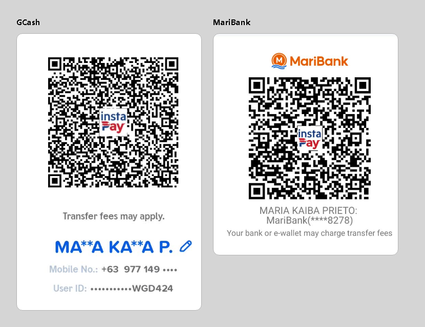

# Receiving QR crop and pending Storefront review

**Owner request:** Correct the poorly cut GCash and MariBank payment images, review the current updates, then commit and push.
**Owning items:** MAP-023 (receiving QR and payment acceptance), MAP-028 (pending Storefront presentation review).
**Decision:** IDEA-20260927-01 is merged into those active items.

**27 September release request:** After the feature-branch commit, the owner asked to review other branches and promote ready work to live GitHub and Vercel. Draft PRs [#14](https://github.com/k2jimzonwebsite/K2-Jimzon/pull/14) and [#13](https://github.com/k2jimzonwebsite/K2-Jimzon/pull/13) conflict with current `main` and have separate MAP dependencies; neither is required for this QR presentation release. Four Dependabot PRs have failing build checks. They remain separate rather than being bundled into the payment release.

## Change and reason

- `Confirmation.jsx` gives the two receiving methods their own frame while keeping the existing staff-confirmation warning and full-size source link.
- `index.css` frames the original screenshots with CSS background position and size. GCash is 2:3; MariBank is 5:6. Both show the entire QR, white quiet zone, and masked recipient details without phone status, navigation, referral or app action controls. `public/payment/gcash-receive.png` and `public/payment/maribank-receive.png` are unchanged. A generated crop trial was rejected because generative alteration cannot guarantee payment QR data integrity.
- Review of the pending Storefront route crossfade found that focus was attempted before a lazy route rendered and the default selector selected `<main>` ahead of its heading. `StoreContext.jsx` now focuses after the state update and waits for the actual destination when Suspense is still loading. The existing phone-first grid changes were retained.
- Review of the pending Count & Close audit corrected its relative links, restored the Inbox idea heading displaced by its new entry, and corrected a typo in MAP-023. The Count & Close audit still describes prior rehearsal and an unactivated production boundary; this slice did not run provider changes.

The image above is an isolated CSS render for visual inspection, not a scan or a production receipt.

## Local evidence

| Check | Result | Limit |
| --- | --- | --- |
| Pixel-preserving browser crop render, GCash and MariBank at 360px frame width | Inspected; QR and recipient details fit without app controls | Visual source render, not a real phone scan |
| `npx playwright test --config=playwright.map027.config.js tests/storefront-motion.spec.js -g "route transitions focus"` | Red on inactive catalog heading before focus fix; green 1/1 after fix | Local browser fixture |
| `npx playwright test --config=playwright.selling.config.js tests/storefront-selling-surfaces.spec.js -g "order confirmation explains"` | Green 1/1, including MariBank selection, receipt and original link | Synthetic buyer and order fixture; no funds moved |
| `npm run test:storefront-ui` | Green 32/32, including mobile, deep link, focus and reduced-motion journeys | Local browser fixtures |
| `npm run verify:development` after the final code edit | Passed security, boundary and import checks | Source/static checks only |
| `npm run build:storefront` | Passed; landing JS 149.16/150.50 kB and CSS 29.99/30.00 kB gzip; secret scan passed | Local production build, not deployment |
| `npm run build:admin` | Passed; Admin chunk 224.80/300.00 kB; secret scan passed | Separate local Admin artifact, not deployment |
| `git diff --check` and corrected Count & Close evidence links | No whitespace errors; four relative targets exist | Does not revalidate prior production/provider claims |
| `npm run verify:release` on the reviewed feature candidate | Exited 0 with 1,202 tests; separate Storefront/Admin builds, boundaries, budgets and secret scans passed | Local release evidence; browser fixtures do not prove real funds or recipient ownership |

The first aggregate gate stalled during Windows Playwright-managed Vite teardown. With a separately started combined Vite server, the gate exited but six Inbox browser cases could not launch Chromium inside the sandbox (`spawn EPERM`). The focused Inbox run passed 9/9 with process permission. The complete gate then exited 0 with the same permission. A stale source assertion was updated to match the heading-first lazy-route focus already exercised by the browser test. Experimental Vite configuration changes were removed; `playwright.config.js` and `vite.config.js` remain as before. The successful gate log is local under `.tools/release-gate-20260927-escalated.log` and is not a production receipt.

## Remaining acceptance and recovery

The feature branch is locally verified and awaiting production promotion evidence. The owner or staff must scan both QR codes on representative devices and confirm the recipient in each receiving account before treating either as accepted. An independent reviewer must still confirm any real transfer in the merchant account; local UI checks do not satisfy MAP-023/025 payment acceptance. To revert the crop, restore the prior `Confirmation.jsx` frame and `index.css` payment selectors; to revert route focus, restore the prior `StoreContext.jsx` navigation helper. The two source screenshots are unchanged.
