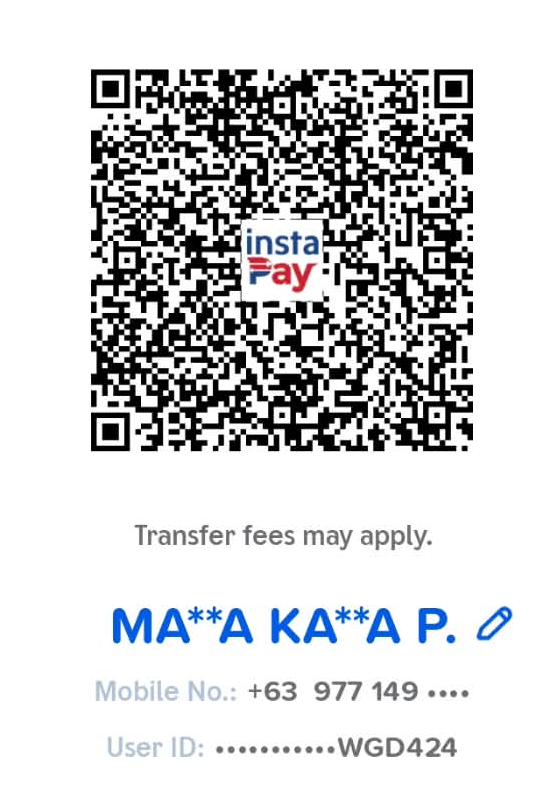
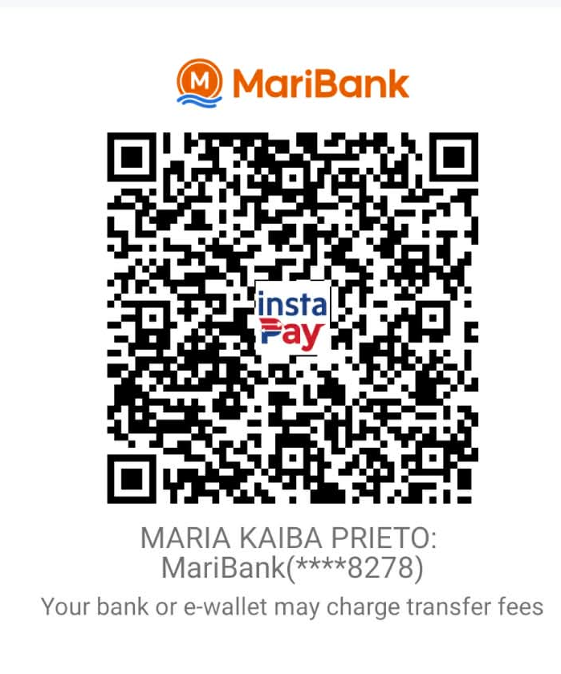

# Exact receiving QR crops

**Request:** The owner still saw the original poorly framed GCash and MariBank screenshots after the 27 September live release. **Owning work:** IDEA-20260928-01, MAP-023/028.

## Root cause and decision

On 28 September the canonical Storefront returned HTTP 200, `/k2-build-target.json` reported `storefront`, and its CSS contained both 27 September framing selectors. GitHub CI run `36330983202` completed successfully, and both Vercel statuses for `24f99ed` were successful. The release had reached production. The customer receipt used the original full phone screenshots as CSS backgrounds and linked directly to those same uncropped PNGs. The prior isolated visual preview checked only the framed background, so it missed the link the owner used.

| Before | After | Why |
| --- | --- | --- |
| The receipt hid phone chrome with CSS, while “Open original QR image” opened the full screenshot. | The receipt displays a dedicated cropped PNG, and “Open larger QR image” opens that same file at native resolution. | Both customer paths show the intended QR and recipient details. |
| Original screenshots supplied the browser background and larger view. | Exact source rectangles supply lossless GCash and MariBank PNG crops; originals remain available for recovery. | QR modules and masked account text stay pixel identical. |

The image-generation crop trial was rejected: it included an app action control and did not establish unchanged QR pixels. It was not used in the product. No QR code or account detail was redrawn.

## Crop geometry and asset integrity

| Method | Source | Rectangle `(left, top, width, height)` | Cropped asset |
| --- | --- | --- | --- |
| GCash | `public/payment/gcash-receive.png` (946×2049) | `(191, 371, 541, 811)` | `public/payment/gcash-receive-crop.png` (541×811) |
| MariBank | `public/payment/maribank-receive.png` (908×2048) | `(90, 319, 699, 840)` | `public/payment/maribank-receive-crop.png` (699×840) |

`sharp.extract` performed the rectangular crops with lossless PNG output. The committed pixel contract decodes both source rectangles and both new files to RGBA and compares SHA-256 hashes of every decoded pixel. The original PNG files are unchanged. Visual inspection confirmed full QR quiet zones, the supplied masked recipient details, and no phone status, navigation, referral or app action controls.

## Local verification

| Check | Result | Limit |
| --- | --- | --- |
| `npx playwright test --config=playwright.api.config.js tests/storefront-copy-contract.spec.js -g "receiving crop"` | Red before asset creation: both files missing. Green after: 2/2 exact-pixel checks passed. | Source pixel identity; not a real QR scan. |
| `npx playwright test --config=playwright.selling.reuse.config.mjs tests/storefront-selling-surfaces.spec.js -g "order confirmation explains"` | Red before receipt change: old `
` had no cropped `src`. Green after: 2/2 synthetic phone buyer journeys passed for GCash and MariBank, including image loads, link targets, restored receipts and no horizontal overflow. | Local browser fixture; no real order or funds. The temporary reused-server config is removed before commit. |
| `npm run verify:development` | Exited 0 after final code edits: secret, dependency, surface, source boundary and import checks passed. | Static/development checks. |

The complete `npm run verify:release`, GitHub commit, separate Vercel production receipts, canonical-host asset byte checks and exact-host visual inspection remain pending at this point. Source/deployment evidence will be added after promotion. No database, payment state, receiving account or provider flag was changed.

## Recovery and remaining acceptance

If the presentation regresses, revert the scoped receipt image/link/CSS change and restore the prior successful Storefront and Admin Vercel deployments. The supplied original PNGs remain in `public/payment` for source recovery; no database rollback applies. The owner and staff still need to scan both exact codes on representative devices, verify each recipient against the actual receiving account, then complete the independent real-funds review in MAP-023/025. The software may not treat a QR display or screenshot as proof of payment.
