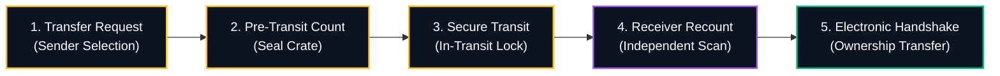
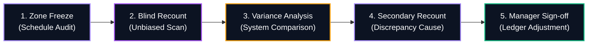

# K2 Jimzon — Master Operations Workflow Graph Specification

**Status:** ACTIVE & PRODUCTION INTEGRATED  
**Surface:** Admin Business Operating System (BOS)  
**Primary Module:** `src/components/admin/master-workflow-graph/`  
**Route / Section:** `workflow_graph` (Admin Navigation)  
**Rulebook Governance:** Operations Rulebook §1–§24 & SYSTEM_BRAIN_CURRENT.md  

---

## 1. Executive Summary & Purpose

The **Master Operations Workflow Graph** is K2 Jimzon's visual and interactive operations manual. Built directly into the Admin BOS, it replaces static documentation with an interactive node-based SVG interface that guides warehouse staff, logistics coordinators, catalog managers, and shift supervisors through every operational event.

Every step in the graph is traceable to the authoritative **Operations Rulebook**, enforces physical 2-factor scan requirements, defines exact actor responsibilities, and provides embedded tooling such as the **AI Image Prompt Studio** for product photography generation.

```
┌────────────────────────────────────────────────────────────────────────┐
│                        Admin BOS Command Center                        │
│                                                                        │
│  [ 🗺️ Workflow Graph ]  [ 📥 New Inventory ]  [ 📦 Orders ]  [ ... ]    │
└───────────────────────────────────┬────────────────────────────────────┘
                                    │
    ┌───────────────────────────────┴───────────────────────────────┐
    │                 MasterWorkflowGraph Component                 │
    │  - Top Workflow Switcher (6 Operational Workflows)            │
    │  - Summary Header & Required Scan Metrics                     │
    ├───────────────────────────────────────────────────────────────┤
    │                  WorkflowSvgCanvas (SVG Engine)               │
    │  - Dynamic Cubic Bezier Paths (M C x1 y1, x2 y2...)          │
    │  - Animated Active Pulse Lines & Status Badges                │
    │  - Node Anchor Points with Click Event Routing                │
    ├───────────────────────────────────────────────────────────────┤
    │                  WorkflowDetailDrawer (SOP Panel)             │
    │  - Step-by-Step Shift Checklist                              │
    │  - Operations Rulebook Invariants & Safeguards                │
    │  - "🚀 Open Tool in Admin" Direct Workspace Jump              │
    │  - Embedded AiPromptStudioCard (for Product Creation)         │
    └───────────────────────────────────────────────────────────────┘
```

---

## 2. Component Architecture & File Layout

All code and data definitions reside in `src/components/admin/master-workflow-graph/`:

| File | Purpose & Responsibilities |
| :--- | :--- |
| **`MasterWorkflowGraph.jsx`** | Central orchestrator. Manages active workflow state, node selection, progress navigation (Prev/Next), and renders both standalone and modal presentations. |
| **`WorkflowSvgCanvas.jsx`** | High-fidelity SVG rendering engine. Dynamically measures DOM node coordinates with `ResizeObserver` and draws smooth Bezier curves, animated dashed pulse strokes, and directional arrow markers. |
| **`WorkflowDetailDrawer.jsx`** | Granular step drill-down panel. Renders shift checklists, rulebook safety invariants, actor tags, location badges, and direct navigation jump triggers. |
| **`AiPromptStudioCard.jsx`** | Dedicated prompt engineering studio. Generates luxury editorial prompts for ChatGPT (DALL-E 3), Midjourney v6, and FLUX.1 with category presets, negative prompts, and camera settings. |
| **`workflowData.js`** | Single source of truth data dictionary containing complete node definitions, checklists, rules, and AI prompt templates. |

---

## 3. The 6 Authoritative Operational Workflows

### 📥 1. New Inventory & Intake Ingestion (`new_inventory`)
Governed by Operations Rulebook §5, §7, §9 (Milan to Manila Reconciliation & FEFO).

```mermaid
flowchart LR
    A["1. Shipment Arrival\n(Seal Verification)"] --> B["2. Physical Unboxing\n(QC Inspection)"]
    B --> C["3. Barcode Scan\n(EAN-13 Match)"]
    C --> D["4. FEFO Lot Creation\n(Expiry & Cost)"]
    D --> E["5. Custody Tagging\n(Shelf Placement)"]
    E --> F["6. Commit Batch\n(Multi-Channel Sync)"]

    style A fill:#0c1322,stroke:#38bdf8,stroke-width:2px,color:#fff
    style B fill:#0c1322,stroke:#38bdf8,stroke-width:2px,color:#fff
    style C fill:#0c1322,stroke:#a855f7,stroke-width:2px,color:#fff
    style D fill:#0c1322,stroke:#f59e0b,stroke-width:2px,color:#fff
    style E fill:#0c1322,stroke:#38bdf8,stroke-width:2px,color:#fff
    style F fill:#0c1322,stroke:#10b981,stroke-width:2px,color:#fff
```



- **Step 1:** Verify cargo box ID against the Milan flight manifest. Check tamper-evident security tape.
- **Step 2:** Unpack on clean stainless steel surface; inspect glass seals, chocolate melting, and printed expiry.
- **Step 3 (Scan):** 2-Factor laser barcode scan against master SKU. Zero manual typing.
- **Step 4:** Register batch lot with precise `Best Before Date` (YYYY-MM-DD), unit purchase cost (€), and freight share.
- **Step 5:** Affix internal lot label with QR code. Place newer stock behind older stock (physical FEFO).
- **Step 6 (Commit):** Manager approves batch. System recalculates sellable inventory and triggers real-time stock sync across Storefront, Shopee, and Lazada.

---

### 📦 2. Order Fulfillment & Packing (`new_order`)
Governed by Operations Rulebook §12–§14 (Order-First Packing & Waybills).

```mermaid
flowchart LR
    A["1. Order Intake\n(FEFO Stock Lock)"] --> B["2. Customer Contact\n(Courier & Total)"]
    B --> C["3. Payment Verify\n(Release to Queue)"]
    C --> D["4. Shelf Picking\n(2-Factor Scan)"]
    D --> E["5. Secure Packing\n(Waybill Print)"]
    E --> F["6. Courier Handover\n(Dispatch Tracking)"]

    style A fill:#0c1322,stroke:#34d399,stroke-width:2px,color:#fff
    style B fill:#0c1322,stroke:#34d399,stroke-width:2px,color:#fff
    style C fill:#0c1322,stroke:#f59e0b,stroke-width:2px,color:#fff
    style D fill:#0c1322,stroke:#a855f7,stroke-width:2px,color:#fff
    style E fill:#0c1322,stroke:#34d399,stroke-width:2px,color:#fff
    style F fill:#0c1322,stroke:#10b981,stroke-width:2px,color:#fff
```



- **Step 1:** Order received in Admin BOS; system automatically reserves units from the earliest-expiring batch lot.
- **Step 2:** Staff contacts customer (WhatsApp/Viber/SMS) to confirm courier rate and send official payment accounts.
- **Step 3:** Staff confirms payment transaction reference in merchant bank ledger before releasing to packing queue.
- **Step 4 (Scan):** Fulfillment staff retrieves allocated batch and performs mandatory 2-factor barcode scan at packing station.
- **Step 5:** Cushion glass items with honeycomb wrap; add cold packs for chocolates; seal box with tamper tape and attach shipping waybill.
- **Step 6 (Commit):** Courier rider signs dispatch sheet; staff marks order as Dispatched, sending tracking SMS/email to customer.

---

### 🤝 3. Two-Party Inventory Custody Handshake (`inventory_handover`)
Governed by Operations Rulebook §10 (Two-Party Handshake & Immutable Physical Custody).



- **Core Rule:** Sender action ALONE never transfers ownership.
- **Step 1:** Sender selects batch lot, quantity, target location, and designated receiver.
- **Step 2:** Sender counts units and seals transfer crate with numbered security seal.
- **Step 3:** Stock is locked from picking during transit.
- **Step 4 (Scan):** Receiver breaks seal and independently scans every unit with a barcode scanner.
- **Step 5 (Commit):** Receiver enters staff PIN to sign the electronic handshake. Custody transfers atomically in `inventory_custody_events`.

---

### 📊 4. Monthly Cycle Count & Audit (`monthly_count`)
Governed by Operations Rulebook §15 (Discrepancy Resolution & Audit Trails).



- **Step 1:** Freeze picking in designated warehouse zone during morning count window.
- **Step 2 (Scan):** Staff scans all items shelf-by-shelf blindly (expected quantities hidden to prevent bias).
- **Step 3:** System automatically calculates variances (Overages, Shortages, Mismatches).
- **Step 4:** Second independent staff recounts any SKU with variance > 0 and classifies root cause (Damaged, Expired, Missing).
- **Step 5 (Commit):** Authorized manager reviews financial impact and approves audited ledger adjustments.

---

### ✨ 5. Product Creation & AI Image Prompt Studio (`product_creation_ai`)
Governed by K2 Luxury Editorial Aesthetics & Product Data Model.

```mermaid
flowchart LR
    A["1. Master Data\n(EAN-13 & Origin)"] --> B["2. Pricing Matrix\n(Landed Cost Floor)"]
    B --> C["3. AI Image Studio\n(Photoreal Prompts)"]
    C --> D["4. Before/After Media\n(Unboxing Slider)"]
    D --> E["5. Specs & Allergens\n(Pairing Notes)"]
    E --> F["6. Storefront Publish\n(Live Activation)"]

    style A fill:#0c1322,stroke:#fb7185,stroke-width:2px,color:#fff
    style B fill:#0c1322,stroke:#fb7185,stroke-width:2px,color:#fff
    style C fill:#0c1322,stroke:#f43f5e,stroke-width:2px,color:#fff
    style D fill:#0c1322,stroke:#fb7185,stroke-width:2px,color:#fff
    style E fill:#0c1322,stroke:#f59e0b,stroke-width:2px,color:#fff
    style F fill:#0c1322,stroke:#10b981,stroke-width:2px,color:#fff
```



- **Step 1:** Enter authentic Italian brand, Italian title, English subtitle, EAN-13, and region of origin.
- **Step 2:** Input EUR cost (€), review computed PHP floor (₱), set consumer SRP (₱) and wholesale B2B case price (₱).
- **Step 3 (AI Studio):** Use K2 prompt engineering templates in ChatGPT / DALL-E 3 / Midjourney v6 to generate photorealistic imagery matching the Tuscan wood and linen canvas.
- **Step 4:** Upload packaging photo (Before) and served culinary presentation (After) for the interactive comparison slider.
- **Step 5:** Enter verified ingredients, bold allergen declarations, and conversational pairing advice.
- **Step 6 (Commit):** Preview mobile layout and toggle product status to `Active`.

---

### 🇮🇹 6. Pasabuy Custom Sourcing Lifecycle (`pasabuy_lifecycle`)
Governed by Operations Rulebook §8, §17 (Intake to Milan Sourcing & Flight Cargo).

```mermaid
flowchart LR
    A["1. Request Triage\n(Budget & Photos)"] --> B["2. Milan Sourcing\n(EUR Cost & Flight)"]
    B --> C["3. Itemized Quote\n(Customer Send)"]
    C --> D["4. Deposit Payment\n(Purchase Approval)"]
    D --> E["5. Milan Purchase\n(Flight Box Tag)"]
    E --> F["6. Manila Receiving\n(Courier Dispatch)"]

    style A fill:#0c1322,stroke:#38bdf8,stroke-width:2px,color:#fff
    style B fill:#0c1322,stroke:#38bdf8,stroke-width:2px,color:#fff
    style C fill:#0c1322,stroke:#f59e0b,stroke-width:2px,color:#fff
    style D fill:#0c1322,stroke:#38bdf8,stroke-width:2px,color:#fff
    style E fill:#0c1322,stroke:#38bdf8,stroke-width:2px,color:#fff
    style F fill:#0c1322,stroke:#10b981,stroke-width:2px,color:#fff
```



- **Step 1:** Review customer request, reference link, target budget, and shipping preference (Air Cargo vs Sea Freight).
- **Step 2:** Milan buyer checks physical store availability (Esselunga, Coop, Eataly) and calculates landed cost.
- **Step 3:** Issue formal itemized quote in PHP (Product + Freight + Handling fee).
- **Step 4:** Customer accepts quote and pays deposit (50% or full).
- **Step 5:** Milan buyer purchases item, attaches Pasabuy QR label, and packs into scheduled flight cargo box.
- **Step 6 (Commit):** Manila Hub unboxes flight cargo, scans Pasabuy reference barcode, and dispatches directly to customer.

---

## 4. AI Image Studio: Prompt Engineering Formulas

To maintain visual consistency across all AI-generated product images, staff must use these verified prompt templates:

### 📐 Master Formula Structure:
```text
Commercial luxury editorial product photograph of [PRODUCT NAME] in its authentic Italian matte paper packaging, placed elegantly on a rustic reclaimed Tuscan wood surface. A few loose [PRODUCT INGREDIENTS/GARNISH] sit artfully beside the open package on a vintage handmade ceramic saucer. Soft natural morning window sunlight streaming from the left, warm amber and olive undertones, shallow depth of field (f/2.8, 85mm lens), ultra-sharp packaging typography, photorealistic textures, 8k resolution, quiet luxury gourmet atmosphere.
```

### 🚫 Mandatory Negative Prompts:
```text
plastic glare, neon lighting, oversaturated colors, distorted letters, blurry text, cartoon, 3D render, CGI, watermark, stock photo watermark, artificial studio flash, sterile white background.
```

### 📷 Recommended Aspect Ratios:
- **1:1 Square:** Catalog grid tiles, Product Passport, and Before/After slider.
- **4:3 Landscape:** Editorial New Arrivals spotlight and Hero banners.

---

## 5. How to Add or Extend Workflows

To add a new operational workflow (e.g. `damaged_stock_quarantine`, `shopee_returns`, or `wholesale_pallet_packing`):

1. **Add Workflow Definition in `workflowData.js`**:
   - Define a unique `id`, `title`, `icon`, `color`, and `stats`.
   - Add ordered `nodes` with `step`, `title`, `actor`, `location`, `type` (`intake` | `scan` | `action` | `decision` | `complete`), `summary`, `checklist`, `rules`, and `adminJump`.
2. **SVG Connector Automatic Adaptation**:
   - `WorkflowSvgCanvas.jsx` automatically calculates new node coordinates and draws Bezier curves dynamically with zero manual SVG path adjustments.
3. **Verify Security Gate**:
   - Run `npm run security:gate` and `npm run build` to confirm zero regression.
