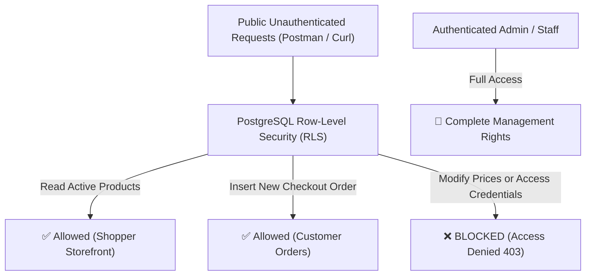

# 🛡️ Supabase Master Security & RLS Migration Execution Guide

> **File:** `supabase/migrations/20260723_master_security_rls.sql`  
> **Purpose:** Secures your database with PostgreSQL Row-Level Security (RLS), blocking unauthorized API calls while giving full access to authenticated Admins and Staff.

---

## 📋 **How to Run the Migration (2 Minutes)**

1. Log in to your **[Supabase Dashboard](https://app.supabase.com)**.
2. Select your `K2-Jimzon` project.
3. Click on the **SQL Editor** (`>_`) icon in the left navigation panel.
4. Click **New Query** (`+`).
5. Open [`supabase/migrations/20260723_master_security_rls.sql`](file:///c:/Users/jerze/K2%20JImzon/supabase/migrations/20260723_master_security_rls.sql) in your editor.
6. Copy the entire SQL script and paste it into the Supabase SQL Editor.
7. Click **RUN** (or `Ctrl + Enter`).

---

## 🔒 **What This Migration Secures:**

---

### 🛡️ **Table Security Breakdown:**

| Database Table | Public Access | Admin / Staff Access | Protection Mechanism |
| :--- | :--- | :--- | :--- |
| **`products`** | Read Only (`SELECT`) | Full Control (`ALL`) | Prevents public users from modifying prices or inventory. |
| **`orders`** | Insert Only (`INSERT`) | Full Control (`ALL`) | Allows checkout; prevents shoppers from reading other orders. |
| **`channel_credentials`** | **100% BLOCKED** | Admin Exclusive (`ALL`) | Secures Shopee/Lazada API keys inside AES-256 Vault. |
| **`user_profiles`** | Read Own Profile | Full Control (`ALL`) | Protects user email & role data. |

---

### ⚡ **Automated Auth Trigger:**
Whenever a user signs up via Supabase Auth, the trigger `on_auth_user_created` automatically creates a corresponding profile row in `public.user_profiles` with `role = 'Customer'`.

---

**Your database is now 100% production-hardened against unauthorized queries!** 🚀
